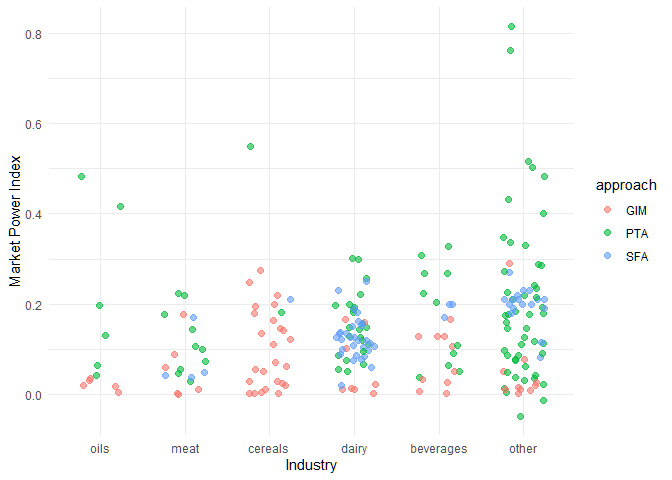
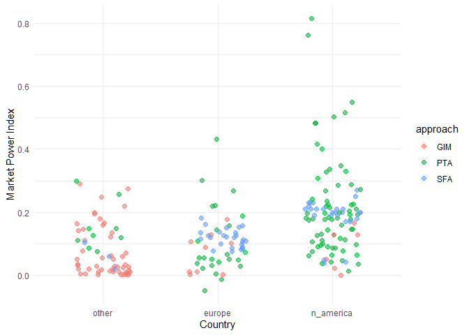
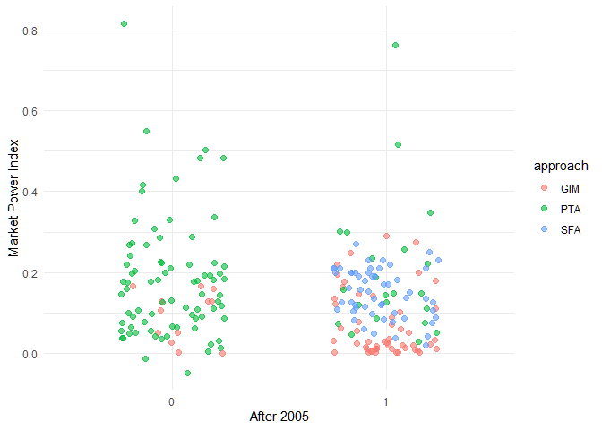
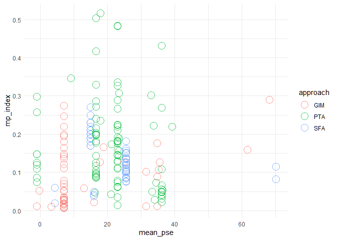
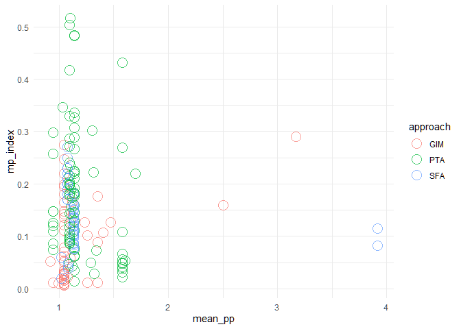

Data Preparation
================
Mykola Dereva
24/06/2020

## Importing data

``` r
path <- here("data", "raw data", "Market Power Articles - Sheet2.csv")
data <- read_csv(path)
```

    ## Warning: Missing column names filled in: 'X11' [11], 'X12' [12]

    ## Parsed with column specification:
    ## cols(
    ##   Year = col_double(),
    ##   Authors = col_character(),
    ##   Title = col_character(),
    ##   Country = col_character(),
    ##   `Industry/Market` = col_character(),
    ##   Approach = col_character(),
    ##   Period = col_character(),
    ##   `Data Frequency` = col_character(),
    ##   `Type of MP` = col_character(),
    ##   `Market Power Index` = col_double(),
    ##   X11 = col_character(),
    ##   X12 = col_character()
    ## )

``` r
glimpse(data)
```

    ## Rows: 244
    ## Columns: 12
    ## $ Year                 <dbl> 2008, NA, NA, NA, 1982, NA, 1997, 1990, NA, 20...
    ## $ Authors              <chr> "Anders, S. M", NA, NA, NA, "Appelbaum, E.", N...
    ## $ Title                <chr> "Imperfect Competition in German Food Retailin...
    ## $ Country              <chr> "Germany", "Germany", "Germany", "Germany", "U...
    ## $ `Industry/Market`    <chr> "Beef", "Beef", "Pork", "Pork", "Textile", "To...
    ## $ Approach             <chr> "GIM", "GIM", "GIM", "GIM", "PTA", "PTA", "PTA...
    ## $ Period               <chr> "1995-2000", "1995-2000", "1995-2000", "1995-2...
    ## $ `Data Frequency`     <chr> "Monthly", "Monthly", "Monthly", "Monthly", "Y...
    ## $ `Type of MP`         <chr> "Oligopsony", "Oligopoly", "Oligopsony", "Olig...
    ## $ `Market Power Index` <dbl> 0.17600, 0.08900, 0.01100, 0.00300, 0.03684, 0...
    ## $ X11                  <chr> NA, NA, NA, NA, NA, NA, NA, NA, NA, NA, NA, "?...
    ## $ X12                  <chr> NA, NA, NA, NA, NA, NA, NA, NA, NA, NA, NA, "T...

Lets clean the table a bit

``` r
clean <- data %>%
  select(-starts_with("X1")) %>% # Drop technical columns (X11, X12)
  fill(Year, Authors, Title, Country, .direction = "down") %>% # Fill empty cells
  clean_names() %>% 
  rename(mp_type = type_of_mp,            # Shorten colnames
         mp_index = market_power_index,
         industry = industry_market,
         data_freq = data_frequency)

glimpse(clean)
```

    ## Rows: 244
    ## Columns: 10
    ## $ year      <dbl> 2008, 2008, 2008, 2008, 1982, 1982, 1997, 1990, 1990, 200...
    ## $ authors   <chr> "Anders, S. M", "Anders, S. M", "Anders, S. M", "Anders, ...
    ## $ title     <chr> "Imperfect Competition in German Food Retailing: Evidence...
    ## $ country   <chr> "Germany", "Germany", "Germany", "Germany", "USA", "USA",...
    ## $ industry  <chr> "Beef", "Beef", "Pork", "Pork", "Textile", "Tobacco", "Be...
    ## $ approach  <chr> "GIM", "GIM", "GIM", "GIM", "PTA", "PTA", "PTA", "PTA", "...
    ## $ period    <chr> "1995-2000", "1995-2000", "1995-2000", "1995-2000", "1947...
    ## $ data_freq <chr> "Monthly", "Monthly", "Monthly", "Monthly", "Yearly", "Ye...
    ## $ mp_type   <chr> "Oligopsony", "Oligopoly", "Oligopsony", "Oligopoly", "Ol...
    ## $ mp_index  <dbl> 0.17600, 0.08900, 0.01100, 0.00300, 0.03684, 0.40190, -0....

#### Converting mp\_type to categorical dtype

``` r
clean %>%
  group_by(mp_type) %>%
  summarise(n = n()) %>%
  mutate(prop = round(n / sum(n) * 100, 2)) %>%
  arrange(-n)
```

    ## `summarise()` ungrouping output (override with `.groups` argument)

    ## # A tibble: 5 x 3
    ##   mp_type                    n  prop
    ##   <chr>                  <int> <dbl>
    ## 1 Oligopoly                153 62.7 
    ## 2 Oligopsony                72 29.5 
    ## 3 Conjectural elasticity    11  4.51
    ## 4 Conjectural variation      7  2.87
    ## 5 Ologopoly                  1  0.41

Clean mispelled rows and filter only for Oligopoly and Oligopsony

``` r
clean <- clean %>%
  mutate(mp_type = if_else(mp_type == "Ologopoly", "Oligopoly", mp_type) ) %>%
  filter(mp_type %in% c("Oligopoly", "Oligopsony")) %>%
  mutate(mp_type = as_factor(mp_type))
```

``` r
clean %>%
  group_by(mp_type) %>%
  summarise(n = n()) %>%
  mutate(prop = round(n / sum(n) * 100, 2)) %>%
  arrange(-n)
```

    ## `summarise()` ungrouping output (override with `.groups` argument)

    ## # A tibble: 2 x 3
    ##   mp_type        n  prop
    ##   <fct>      <int> <dbl>
    ## 1 Oligopoly    154  68.1
    ## 2 Oligopsony    72  31.9

#### Clean and convert data\_freq colum

``` r
clean %>%
  group_by(data_freq) %>%
  summarise(n = n()) %>%
  mutate(prop = round(n / sum(n) * 100, 2)) %>%
  arrange(-n)
```

    ## `summarise()` ungrouping output (override with `.groups` argument)

    ## # A tibble: 4 x 3
    ##   data_freq     n  prop
    ##   <chr>     <int> <dbl>
    ## 1 Yearly      191 84.5 
    ## 2 Monthly      28 12.4 
    ## 3 Quaterly      6  2.65
    ## 4 Weekly        1  0.44

Seems fine

Also I’ll create new column with number of observations per year

``` r
clean <- clean %>%
  mutate(data_freq = as_factor(data_freq)) %>%
  mutate(n_obs_per_year = case_when(data_freq == "Yearly" ~ 1,
                                    data_freq == "Monthly" ~ 12,
                                    data_freq == "Quaterly" ~ 4,
                                    data_freq == "Daily" ~ 365,
                                    data_freq == "Weekly" ~ 52 ) )
```

``` r
clean %>%
  group_by(n_obs_per_year) %>%
  summarise(n = n()) %>%
  mutate(prop = round(n / sum(n) * 100, 2)) %>%
  arrange(-n)
```

    ## `summarise()` ungrouping output (override with `.groups` argument)

    ## # A tibble: 4 x 3
    ##   n_obs_per_year     n  prop
    ##            <dbl> <int> <dbl>
    ## 1              1   191 84.5 
    ## 2             12    28 12.4 
    ## 3              4     6  2.65
    ## 4             52     1  0.44

seems correct

#### Clean and convert approach column

``` r
clean %>%
  group_by(approach) %>%
  summarise(n = n()) %>%
  mutate(prop = round(n / sum(n) * 100, 2)) %>%
  arrange(-n)
```

    ## `summarise()` ungrouping output (override with `.groups` argument)

    ## # A tibble: 5 x 3
    ##   approach     n  prop
    ##   <chr>    <int> <dbl>
    ## 1 PTA        101 44.7 
    ## 2 GIM         64 28.3 
    ## 3 SFA         55 24.3 
    ## 4 Other ?      4  1.77
    ## 5 ?            2  0.88

I will filter out articles in which I am not sure

``` r
clean <- clean %>%
  filter(approach %in% c("PTA", "GIM", "SFA")) %>%
  mutate(approach = as_factor(approach))
```

``` r
clean %>%
  group_by(approach) %>%
  summarise(n = n()) %>%
  mutate(prop = round(n / sum(n) * 100, 2)) %>%
  arrange(-n)
```

    ## `summarise()` ungrouping output (override with `.groups` argument)

    ## # A tibble: 3 x 3
    ##   approach     n  prop
    ##   <fct>    <int> <dbl>
    ## 1 PTA        101  45.9
    ## 2 GIM         64  29.1
    ## 3 SFA         55  25

Seems correct

#### Clean and transform industry column

``` r
clean %>%
  group_by(industry) %>%
  summarise(n = n()) %>%
  mutate(prop = round(n / sum(n) * 100, 2)) %>%
  arrange(-n)
```

    ## `summarise()` ungrouping output (override with `.groups` argument)

    ## # A tibble: 122 x 3
    ##    industry         n  prop
    ##    <chr>        <int> <dbl>
    ##  1 Dairy           38 17.3 
    ##  2 Milk            10  4.55
    ##  3 Tea              6  2.73
    ##  4 Barley           5  2.27
    ##  5 Canola           5  2.27
    ##  6 Wheat            5  2.27
    ##  7 Oats             4  1.82
    ##  8 Triticale        4  1.82
    ##  9 Cereal foods     3  1.36
    ## 10 Cheese           3  1.36
    ## # ... with 112 more rows

With this one it will be a bit more complicated since there are plenty
of categories

clean the column a bit

``` r
clean <- clean %>%
  filter(!is.na(industry)) %>%                        # drop N/A
  mutate(industry_fct = str_to_lower(industry) %>%    # to lowercase
                          str_trim(side="both") ) 
```

``` r
clean %>%
  select(industry, industry_fct)
```

    ## # A tibble: 220 x 2
    ##    industry  industry_fct
    ##    <chr>     <chr>       
    ##  1 Beef      beef        
    ##  2 Beef      beef        
    ##  3 Pork      pork        
    ##  4 Pork      pork        
    ##  5 Textile   textile     
    ##  6 Tobacco   tobacco     
    ##  7 Meat      meat        
    ##  8 Livestock livestock   
    ##  9 Hogs      hogs        
    ## 10 Hogs      hogs        
    ## # ... with 210 more rows

create vectors which contain key words for further grouping

``` r
dairy <- c("milk", "dairy", "cheese", "butter")
meat <- c("meat", "pork", "beef", "hog", "poultry", "livestock", "cattle")
cereals <- c("wheat", "oat", "triticale", "grain", "cereal", "barley")
oils <- c("canola", "oil", "fat")
beverages <- c("tea", "beer", "water", "brew", "coffee", "liquor", "drink",
               "spirit", "wine", "brandy", "cocoa", "beverage")
tobaco <- c("tobacco", "cigar")
fruits <- c("fruit", "banana")
paper <- c("pulp", "paper", "wood", "sawlog")
bread_flour <- c("bread", "flour")
sugar <- c("sugar")
```

I coudln’t quickly figure out how tho check the presence of every value
in vectors in the industry\_fct column for categorisation.

So I will write custom function which returns TRUE if column contains
any value in the vector and FALSE in not.

``` r
# helper function. Returns TRUE if any value in vector match string
contains_value <- function(string, vector) {
  
  matched <- FALSE
  
  for (word in vector) {
    
    if ( any(str_detect(string, word)) ) {
      matched <- TRUE
      break }
  }
  
  return(matched)
}
```

Test the function

``` r
# Function returns TRUE for each row which have any macthes with vector

col_contain_val <- function(column, vector){
  x <- c()
  
  for (i in 1:length(column) ) {
    x[i] <- contains_value(column[i], vector)
  }
  
  return(x)
}

#test if any value in meat column is present in industr_fct column
print(clean$industry_fct[1:7])
```

    ## [1] "beef"    "beef"    "pork"    "pork"    "textile" "tobacco" "meat"

``` r
col_contain_val(clean$industry_fct[1:7], meat)
```

    ## [1]  TRUE  TRUE  TRUE  TRUE FALSE FALSE  TRUE

Seems like it works fine

``` r
clean <- clean %>%
  mutate(industry_fct = case_when(
                          col_contain_val(industry_fct, dairy) ~ "dairy",
                          col_contain_val(industry_fct, meat) ~ "meat",
                          col_contain_val(industry_fct, cereals) ~ "cereals",
                          col_contain_val(industry_fct, oils) ~ "oils",
                          col_contain_val(industry_fct, beverages) ~ "beverages",
                          col_contain_val(industry_fct, tobaco) ~ "tobacco",
                          col_contain_val(industry_fct, fruits) ~ "fruits",
                          col_contain_val(industry_fct, paper) ~ "paper",
                          col_contain_val(industry_fct, bread_flour) ~ "bread or flour",
                          col_contain_val(industry_fct, sugar) ~ "sugar",
                          TRUE ~ industry_fct
                                )
         )

clean %>%
  select(industry, industry_fct)
```

    ## # A tibble: 220 x 2
    ##    industry  industry_fct
    ##    <chr>     <chr>       
    ##  1 Beef      meat        
    ##  2 Beef      meat        
    ##  3 Pork      meat        
    ##  4 Pork      meat        
    ##  5 Textile   textile     
    ##  6 Tobacco   tobacco     
    ##  7 Meat      meat        
    ##  8 Livestock meat        
    ##  9 Hogs      meat        
    ## 10 Hogs      meat        
    ## # ... with 210 more rows

Seems that the values were changed correctly

Lets aggregate the data in column

``` r
clean %>%
  group_by(industry_fct) %>%
  summarise(n = n()) %>%
  mutate(prop = round(n / sum(n) * 100, 2)) %>%
  arrange(-n)
```

    ## `summarise()` ungrouping output (override with `.groups` argument)

    ## # A tibble: 49 x 3
    ##    industry_fct       n  prop
    ##    <chr>          <int> <dbl>
    ##  1 dairy             61 27.7 
    ##  2 cereals           28 12.7 
    ##  3 beverages         24 10.9 
    ##  4 meat              20  9.09
    ##  5 oils              11  5   
    ##  6 paper              9  4.09
    ##  7 bread or flour     7  3.18
    ##  8 fruits             7  3.18
    ##  9 tobacco            6  2.73
    ## 10 sugar              5  2.27
    ## # ... with 39 more rows

Probably I shouldn’t use groups with less then 10 observations. The
results might be unreliable.

now lets convert industry\_fct to factor

``` r
clean <- clean %>%
  mutate(industry_fct = as_factor(industry_fct)) %>%
  mutate(industry_fct = fct_lump_min(industry_fct, min = 10, other_level = "other"))
```

``` r
clean %>%
  group_by(industry_fct) %>%
  summarise(n = n()) %>%
  mutate(prop = round(n / sum(n) * 100, 2)) %>%
  arrange(-n)
```

    ## `summarise()` ungrouping output (override with `.groups` argument)

    ## # A tibble: 6 x 3
    ##   industry_fct     n  prop
    ##   <fct>        <int> <dbl>
    ## 1 other           76 34.6 
    ## 2 dairy           61 27.7 
    ## 3 cereals         28 12.7 
    ## 4 beverages       24 10.9 
    ## 5 meat            20  9.09
    ## 6 oils            11  5

``` r
clean %>%
  ggplot(aes(x = fct_reorder(industry_fct, mp_index, median),
             y = mp_index,
             color = approach)) + 
  geom_jitter(width = 0.25, height = 0, alpha = 0.6, size = 2) +
  labs(x = "Industry", y="Market Power Index") +
  theme_minimal()
```

<!-- -->
Seems that there is an outlier in cereals

#### Clean country column

``` r
clean %>%
  group_by(country) %>%
  summarise(n = n()) %>%
  mutate(prop = round(n / sum(n) * 100, 2)) %>%
  ungroup() %>%
  arrange(-n) %>% 
  head(10)
```

    ## `summarise()` ungrouping output (override with `.groups` argument)

    ## # A tibble: 10 x 3
    ##    country       n  prop
    ##    <chr>     <int> <dbl>
    ##  1 USA          96 43.6 
    ##  2 Australia    40 18.2 
    ##  3 Spain        15  6.82
    ##  4 Ukraine      10  4.55
    ##  5 Germany       6  2.73
    ##  6 Hungary       5  2.27
    ##  7 Austria       3  1.36
    ##  8 Brazil        3  1.36
    ##  9 Canada        2  0.91
    ## 10 Estonia       2  0.91

Seems that countries can be categorized into 3 main groups USA, EU and
Australia I am not sure about Australia since most of the observations
are from single article.

``` r
# Vector with all of the Europe countries 

europe <- c(
        "Austria",  "Italy",
        "Belgium",  "Latvia",
        "Bulgaria", "Lithuania",
        "Croatia",  "Luxembourg",
        "Cyprus",     "Malta",
        "Czech Republic",   "Netherlands",
        "Denmark",  "Poland",
        "Estonia",  "Portugal",
        "Finland",  "Romania",
        "France",     "Slovakia",
        "Germany",  "Slovenia",
        "Greece",     "Spain",
        "Hungary",  "Sweden",
        "Ireland",  "EU",
        "Norway", "UK", "United Kingdom"
        )

developing <- c("Ukraine", "Brazil", "China", "Haiti", "India",
                "Kenya", "Sri Lanka")
```

Lets also standardize country names

``` r
clean$country_st <-  countrycode(sourcevar = clean$country,
                        origin = "country.name",
                        destination = "country.name",
                        warn = TRUE,
                        nomatch = NULL)
```

Check the result

``` r
clean %>% 
  distinct(country, country_st)
```

    ## # A tibble: 41 x 2
    ##    country     country_st   
    ##    <chr>       <chr>        
    ##  1 Germany     Germany      
    ##  2 USA         United States
    ##  3 Hungary     Hungary      
    ##  4 Sweden      Sweden       
    ##  5 Netherlands Netherlands  
    ##  6 Canada      Canada       
    ##  7 Haiti       Haiti        
    ##  8 France      France       
    ##  9 Spain       Spain        
    ## 10 Australia   Australia    
    ## # ... with 31 more rows

Beautiful

create country\_fct column

``` r
clean <- clean %>%
  mutate(country_fct = case_when(
                        country_st %in% europe ~ "europe",
                        col_contain_val(country_st, c("United States",
                                                      "Canada")) ~ "n_america",
                        #col_contain_val(country_st, developing) ~ "developing",
                        #col_contain_val(country, "Australia") ~ "Australia",
                        TRUE ~ "other")
         ) %>%
  mutate(country_fct = as_factor(country_fct))
  
clean %>%
  group_by(country_fct) %>%
  summarise(n = n()) %>%
  mutate(prop = round(n / sum(n) * 100, 2)) %>%
  arrange(-n)
```

    ## `summarise()` ungrouping output (override with `.groups` argument)

    ## # A tibble: 3 x 3
    ##   country_fct     n  prop
    ##   <fct>       <int> <dbl>
    ## 1 n_america     100  45.4
    ## 2 other          61  27.7
    ## 3 europe         59  26.8

Seems fine.

``` r
clean %>%
  ggplot(aes(x = fct_reorder(country_fct, mp_index, median),
             y = mp_index,
             color = approach)) + 
  geom_jitter(width = 0.25, height = 0, alpha = 0.6, size = 2) +
  labs(x = "Country", y="Market Power Index") +
  theme_minimal()
```

<!-- -->

### add column with number of observations in article

``` r
clean <- clean %>%
  separate(period, into = c("obs_start", "obs_stop"), 
           convert =TRUE, remove = FALSE) %>%
  mutate(obs_years = obs_stop - obs_start) %>%
  mutate(n_of_obs = n_obs_per_year * obs_years)
```

``` r
clean %>%
  select(obs_start, obs_stop, obs_years, n_obs_per_year, n_of_obs) %>%
  head(10)
```

    ## # A tibble: 10 x 5
    ##    obs_start obs_stop obs_years n_obs_per_year n_of_obs
    ##        <int>    <int>     <int>          <dbl>    <dbl>
    ##  1      1995     2000         5             12       60
    ##  2      1995     2000         5             12       60
    ##  3      1995     2000         5             12       60
    ##  4      1995     2000         5             12       60
    ##  5      1947     1971        24              1       24
    ##  6      1947     1971        24              1       24
    ##  7      1959     1982        23              1       23
    ##  8      1959     1982        23              1       23
    ##  9      1993     2003        10             12      120
    ## 10      1995     2004         9             12      108

Seems correct

check for na

``` r
sum(is.na(clean$n_of_obs))
```

    ## [1] 0

``` r
clean %>%
  filter(!is.na(n_of_obs)) %>%
  ggplot(aes(x=n_of_obs, y=mp_index, color = approach)) +
  geom_point(size = 3, alpha = 0.4) +
  scale_x_continuous(trans = "log10") +
  theme_minimal() +
  easy_move_legend(to = "bottom") +
    labs(x = "Number of observations (log10)",
         y = "Market Power Index") +
  easy_add_legend_title("Approach used:")
```

<!-- -->

### Create dummy variable after 2005

Hypothesis is that there might me a difference between in mp index
between older articles and newer ones. The decision to choose 2005 is a
bit arbitrary, but it divide data in 2 sets with approximately the same
number of observations.

``` r
clean <- clean %>%
  mutate(
          after_2005 = ifelse(
            year > 2005,
            yes = 1,
            no = 0) 
        ) 

clean %>%
  select(year, after_2005) %>%
  head(10)
```

    ## # A tibble: 10 x 2
    ##     year after_2005
    ##    <dbl>      <dbl>
    ##  1  2008          1
    ##  2  2008          1
    ##  3  2008          1
    ##  4  2008          1
    ##  5  1982          0
    ##  6  1982          0
    ##  7  1990          0
    ##  8  1990          0
    ##  9  2009          1
    ## 10  2009          1

Seems correct

``` r
clean %>%
  ggplot(aes(x = as_factor(after_2005),
             y = mp_index,
             color = approach)) + 
  geom_jitter(width = 0.25, height = 0, alpha = 0.6, size = 2) +
  labs(x = "After 2005", y="Market Power Index") +
  theme_minimal()
```

<!-- -->

### Dummy for perishable goods

``` r
perishables <- c("beef", "pork", "meat", "milk", "paultry", 
                 "poultry", "egg", "fish", "salmon")

clean <- clean %>%
  mutate(
          perish = case_when(
                        col_contain_val(stringr::str_to_lower(industry),
                                        perishables) ~ 1,
                                        TRUE ~ 0) 
        )
```

manually change improper values

check results

``` r
clean %>% 
  select(industry, perish) %>% 
  filter(perish == 1)
```

    ## # A tibble: 35 x 2
    ##    industry       perish
    ##    <chr>           <dbl>
    ##  1 Beef                1
    ##  2 Beef                1
    ##  3 Pork                1
    ##  4 Pork                1
    ##  5 Meat                1
    ##  6 Meat Packing        1
    ##  7 Paultry & Eggs      1
    ##  8 Cond. Milk          1
    ##  9 Fluid Milk          1
    ## 10 Fish                1
    ## # ... with 25 more rows

## Outliers

Finally, lets look on the possible outliers

``` r
clean %>%
  select(year, mp_index, industry) %>%
  arrange(-mp_index) %>%
  head(10)
```

    ## # A tibble: 10 x 3
    ##     year mp_index industry             
    ##    <dbl>    <dbl> <chr>                
    ##  1  2002    0.815 Pickles, sauces, etc.
    ##  2  2019    0.763 Pulp Wood            
    ##  3  1998    0.55  Cereal breakfast     
    ##  4  2008    0.516 Paper                
    ##  5  2002    0.503 Macaroni & spaghetti 
    ##  6  1998    0.484 Soyabean Oil         
    ##  7  1998    0.482 Flour                
    ##  8  1999    0.431 Tobacco              
    ##  9  2002    0.417 An./mar. fats & oils 
    ## 10  1982    0.402 Tobacco

There are few MP values which are considerable higher or lower then
other. This might influence the reliability of research. Thus, I will
drop them

``` r
clean <- clean %>%
  filter(between(mp_index, 0.005, 0.52))
```

Looks like I am done with preliminary data preparation

## Load data related to Agricultural support (PSE) and Producer protection

### Adding Agr. support (PSE) to our data

data is taken from OECD website
[sorce](https://data.oecd.org/agrpolicy/agricultural-support.htm)

``` r
support <- read_csv( here("data", "raw data",
                          "Agricultural support (PSE) OESD .csv") )
```

    ## Parsed with column specification:
    ## cols(
    ##   LOCATION = col_character(),
    ##   INDICATOR = col_character(),
    ##   SUBJECT = col_character(),
    ##   MEASURE = col_character(),
    ##   FREQUENCY = col_character(),
    ##   TIME = col_double(),
    ##   Value = col_double(),
    ##   `Flag Codes` = col_logical()
    ## )

``` r
glimpse(support)
```

    ## Rows: 8,848
    ## Columns: 8
    ## $ LOCATION     <chr> "AUS", "AUS", "AUS", "AUS", "AUS", "AUS", "AUS", "AUS"...
    ## $ INDICATOR    <chr> "AGRSUPP", "AGRSUPP", "AGRSUPP", "AGRSUPP", "AGRSUPP",...
    ## $ SUBJECT      <chr> "TSE", "TSE", "TSE", "TSE", "TSE", "TSE", "TSE", "TSE"...
    ## $ MEASURE      <chr> "PC_GDP", "PC_GDP", "PC_GDP", "PC_GDP", "PC_GDP", "PC_...
    ## $ FREQUENCY    <chr> "A", "A", "A", "A", "A", "A", "A", "A", "A", "A", "A",...
    ## $ TIME         <dbl> 1986, 1987, 1988, 1989, 1990, 1991, 1992, 1993, 1994, ...
    ## $ Value        <dbl> 0.8393220, 0.6187854, 0.6293805, 0.5628670, 0.5373301,...
    ## $ `Flag Codes` <lgl> NA, NA, NA, NA, NA, NA, NA, NA, NA, NA, NA, NA, NA, NA...

We decided to use PSE index in our analysis But first, rename colnames
to make them easier to use.

``` r
support <- support %>% 
  clean_names()

glimpse(support)
```

    ## Rows: 8,848
    ## Columns: 8
    ## $ location   <chr> "AUS", "AUS", "AUS", "AUS", "AUS", "AUS", "AUS", "AUS", ...
    ## $ indicator  <chr> "AGRSUPP", "AGRSUPP", "AGRSUPP", "AGRSUPP", "AGRSUPP", "...
    ## $ subject    <chr> "TSE", "TSE", "TSE", "TSE", "TSE", "TSE", "TSE", "TSE", ...
    ## $ measure    <chr> "PC_GDP", "PC_GDP", "PC_GDP", "PC_GDP", "PC_GDP", "PC_GD...
    ## $ frequency  <chr> "A", "A", "A", "A", "A", "A", "A", "A", "A", "A", "A", "...
    ## $ time       <dbl> 1986, 1987, 1988, 1989, 1990, 1991, 1992, 1993, 1994, 19...
    ## $ value      <dbl> 0.8393220, 0.6187854, 0.6293805, 0.5628670, 0.5373301, 0...
    ## $ flag_codes <lgl> NA, NA, NA, NA, NA, NA, NA, NA, NA, NA, NA, NA, NA, NA, ...

Filter for PSE values in % of gross farm receipts

``` r
support <- support %>% 
  filter(subject == "PSE", measure == "PC_GFARM") 

nrow(support)
```

    ## [1] 743

Data shrieked significantly

From the data we need only 3 columns: Location, year and value Lets drop
other columns

``` r
support <-  support %>% 
  select(location, year = time, pse = value)

head(support)
```

    ## # A tibble: 6 x 3
    ##   location  year   pse
    ##   <chr>    <dbl> <dbl>
    ## 1 AUS       1986 12.9 
    ## 2 AUS       1987  9.11
    ## 3 AUS       1988  9.33
    ## 4 AUS       1989  8.64
    ## 5 AUS       1990  9.36
    ## 6 AUS       1991  8.76

Seems correct Now we need to join pse indicator to out main data set. To
do so, we need to unify country names across data sets. Seems that
contrycode package might really help.

``` r
guess_field(support$location)
```

    ##              code percent_of_unique_matched
    ## genc3c     genc3c                  92.59259
    ## iso3c       iso3c                  92.59259
    ## wb             wb                  92.59259
    ## wb_api3c wb_api3c                  92.59259

Seems that OECD uses one of beforewritten country codes lets convert it
to the regular English country names

``` r
support$country <- countrycode(sourcevar = support$location,
                    origin = "genc3c",
                    destination = "country.name",
                    warn = TRUE,
                    nomatch = NULL)
```

lets check the results

``` r
support %>% 
  distinct(location, country)
```

    ## # A tibble: 27 x 2
    ##    location country    
    ##    <chr>    <chr>      
    ##  1 AUS      Australia  
    ##  2 CAN      Canada     
    ##  3 ISL      Iceland    
    ##  4 JPN      Japan      
    ##  5 KOR      South Korea
    ##  6 MEX      Mexico     
    ##  7 NZL      New Zealand
    ##  8 NOR      Norway     
    ##  9 CHE      Switzerland
    ## 10 TUR      Turkey     
    ## # ... with 17 more rows

Beautiful

Drop columns we don’t need

``` r
support <- support %>% 
  select(country, year, pse)
```

Since OECD data not provide PSE data related to the individual EU
countries we will have to use EU28 aggregate PSE information

``` r
EU28 <- countrycode(
        sourcevar = c(
        "Austria",  "Italy",
        "Belgium",  "Latvia",
        "Bulgaria", "Lithuania",
        "Croatia",  "Luxembourg",
        "Cyprus",     "Malta",
        "Czech Republic",   "Netherlands",
        "Denmark",  "Poland",
        "Estonia",  "Portugal",
        "Finland",  "Romania",
        "France",     "Slovakia",
        "Germany",  "Slovenia",
        "Greece",     "Spain",
        "Hungary",  "Sweden",
        "Ireland", "United Kingdom"
                      ),
            origin = "country.name",
            destination = "country.name",
            warn = TRUE,
            nomatch = NULL)
```

Lets estimate average PSE related to each MPI observation

Fist of all let’s make a column which contain all the years during which
each MPI was estimated

``` r
country_year <- clean %>%
  select(country_st, obs_start, obs_stop) %>%
  # change names of EU countries to "EU28" to be able to join with

  # create unique identification of each MPI
  tibble::rowid_to_column("id") %>%   
  # transform start and end date to one column 
  gather(key = "start_stop", value = "year", obs_start:obs_stop) %>% 
  arrange(id) %>% 
  # convert this new column as date
  mutate(year = as.Date(as.character(year), format = "%Y")) %>% 
  group_by(id) %>% 
  # fill sequence of of years
  complete(year = seq(min(year), max(year), by ="year")) %>% 
  ungroup() %>% 
  #drop start_stop columns since we don't need it
  select(id, country = country_st, year) %>% 
  # fill empty values
  fill(country, .direction = "down") %>%
  # convert datetype to keep just year information
  # and drop moth and day
  mutate(year = year(year))

country_year
```

    ## # A tibble: 3,447 x 3
    ##       id country  year
    ##    <int> <chr>   <dbl>
    ##  1     1 Germany  1995
    ##  2     1 Germany  1996
    ##  3     1 Germany  1997
    ##  4     1 Germany  1998
    ##  5     1 Germany  1999
    ##  6     1 Germany  2000
    ##  7     2 Germany  1995
    ##  8     2 Germany  1996
    ##  9     2 Germany  1997
    ## 10     2 Germany  1998
    ## # ... with 3,437 more rows

Now we can easily join country\_year with PSE data to calculate the
average PSE per MPI estimate

``` r
mean_pse <- country_year %>% 
  # change EU country names to match OECD aggregation 
  # OECD data
  mutate(country = case_when(
                        country %in% EU28 ~ "EU28",
                        TRUE ~ country)) %>% 
  # join information related to PSE index
  left_join(support, 
            by = c("country", "year"),
            copy = TRUE) %>% 
  # calculate an average PSE index attributed to each MPI observation
  group_by(id) %>% 
  summarise(mean_pse = mean(pse, na.rm=TRUE)) %>% 
  ungroup()
```

    ## `summarise()` ungrouping output (override with `.groups` argument)

``` r
head(mean_pse)
```

    ## # A tibble: 6 x 2
    ##      id mean_pse
    ##   <int>    <dbl>
    ## 1     1     34.7
    ## 2     2     34.7
    ## 3     3     34.7
    ## 4     4    NaN  
    ## 5     5    NaN  
    ## 6     6    NaN

``` r
mean(is.na(mean_pse$mean_pse))
```

    ## [1] 0.04411765

Unfortunately we 45% of observations is missing Probably this is because
many articles use too old data for the MPI estimation While PSE index
data is available starting from 1986,

``` r
clean <- clean %>% 
  # create an id for each of MPI observation to join it to PSE data
  tibble::rowid_to_column("id") %>% 
  inner_join(mean_pse, by = "id", copy = TRUE)
```

Now we have PSE information in out data set

Plot the resulting variable

``` r
ggplot(clean, aes(mean_pse, mp_index, color=approach)) +
  geom_point(alpha = 0.7, size = 5, shape = 1) +
  theme_minimal()
```

    ## Warning: Removed 9 rows containing missing values (geom_point).

<!-- -->

### Adding Producer Protection (PP) index to our data

The algorithm will be the similar as in case of PSE so I will not
comment it

Data source is the same
[sorce](https://data.oecd.org/agrpolicy/producer-protection.htm#indicator-chart)

``` r
PP <- read_csv( here("data", "raw data",
                     "Producer Protection (PP) OECD.csv") )
```

    ## Parsed with column specification:
    ## cols(
    ##   LOCATION = col_character(),
    ##   INDICATOR = col_character(),
    ##   SUBJECT = col_character(),
    ##   MEASURE = col_character(),
    ##   FREQUENCY = col_character(),
    ##   TIME = col_double(),
    ##   Value = col_double(),
    ##   `Flag Codes` = col_logical()
    ## )

``` r
glimpse(PP)
```

    ## Rows: 743
    ## Columns: 8
    ## $ LOCATION     <chr> "AUS", "AUS", "AUS", "AUS", "AUS", "AUS", "AUS", "AUS"...
    ## $ INDICATOR    <chr> "AGRPNPC", "AGRPNPC", "AGRPNPC", "AGRPNPC", "AGRPNPC",...
    ## $ SUBJECT      <chr> "TOT", "TOT", "TOT", "TOT", "TOT", "TOT", "TOT", "TOT"...
    ## $ MEASURE      <chr> "RT", "RT", "RT", "RT", "RT", "RT", "RT", "RT", "RT", ...
    ## $ FREQUENCY    <chr> "A", "A", "A", "A", "A", "A", "A", "A", "A", "A", "A",...
    ## $ TIME         <dbl> 1986, 1987, 1988, 1989, 1990, 1991, 1992, 1993, 1994, ...
    ## $ Value        <dbl> 1.111986, 1.067421, 1.077049, 1.071517, 1.084206, 1.07...
    ## $ `Flag Codes` <lgl> NA, NA, NA, NA, NA, NA, NA, NA, NA, NA, NA, NA, NA, NA...

``` r
PP <- PP %>% 
  clean_names()

glimpse(PP)
```

    ## Rows: 743
    ## Columns: 8
    ## $ location   <chr> "AUS", "AUS", "AUS", "AUS", "AUS", "AUS", "AUS", "AUS", ...
    ## $ indicator  <chr> "AGRPNPC", "AGRPNPC", "AGRPNPC", "AGRPNPC", "AGRPNPC", "...
    ## $ subject    <chr> "TOT", "TOT", "TOT", "TOT", "TOT", "TOT", "TOT", "TOT", ...
    ## $ measure    <chr> "RT", "RT", "RT", "RT", "RT", "RT", "RT", "RT", "RT", "R...
    ## $ frequency  <chr> "A", "A", "A", "A", "A", "A", "A", "A", "A", "A", "A", "...
    ## $ time       <dbl> 1986, 1987, 1988, 1989, 1990, 1991, 1992, 1993, 1994, 19...
    ## $ value      <dbl> 1.111986, 1.067421, 1.077049, 1.071517, 1.084206, 1.0710...
    ## $ flag_codes <lgl> NA, NA, NA, NA, NA, NA, NA, NA, NA, NA, NA, NA, NA, NA, ...

``` r
PP <-  PP %>% 
  select(location, year = time, PP = value)

head(PP)
```

    ## # A tibble: 6 x 3
    ##   location  year    PP
    ##   <chr>    <dbl> <dbl>
    ## 1 AUS       1986  1.11
    ## 2 AUS       1987  1.07
    ## 3 AUS       1988  1.08
    ## 4 AUS       1989  1.07
    ## 5 AUS       1990  1.08
    ## 6 AUS       1991  1.07

``` r
PP$country <- countrycode(sourcevar = PP$location,
                    origin = "genc3c",
                    destination = "country.name",
                    warn = TRUE,
                    nomatch = NULL)

PP %>% 
  distinct(location, country)
```

    ## # A tibble: 27 x 2
    ##    location country    
    ##    <chr>    <chr>      
    ##  1 AUS      Australia  
    ##  2 CAN      Canada     
    ##  3 ISL      Iceland    
    ##  4 JPN      Japan      
    ##  5 KOR      South Korea
    ##  6 MEX      Mexico     
    ##  7 NZL      New Zealand
    ##  8 NOR      Norway     
    ##  9 CHE      Switzerland
    ## 10 TUR      Turkey     
    ## # ... with 17 more rows

``` r
PP <- PP %>% 
  select(country, year, PP)
```

``` r
mean_pp <- country_year %>%
  mutate(country = case_when(
                      country %in% EU28 ~ "EU28",
                      TRUE ~ country)) %>% 
  left_join(PP, 
            by = c("country", "year"),
            copy = TRUE) %>% 
  # calculate an average PSE index attributed to each MPI observation
  group_by(id) %>% 
  summarise(mean_pp = mean(PP, na.rm=TRUE)) %>% 
  ungroup()
```

    ## `summarise()` ungrouping output (override with `.groups` argument)

``` r
head(mean_pp)
```

    ## # A tibble: 6 x 2
    ##      id mean_pp
    ##   <int>   <dbl>
    ## 1     1    1.35
    ## 2     2    1.35
    ## 3     3    1.35
    ## 4     4  NaN   
    ## 5     5  NaN   
    ## 6     6  NaN

``` r
mean(is.na(mean_pp))
```

    ## [1] 0.02205882

Luckily there is only 22% of missing values in mean PP indicator

``` r
clean <- clean %>% 
  inner_join(mean_pp, by = "id", copy = TRUE)
```

Check observations with negative PSE

``` r
clean %>% 
  filter(!is.na(mean_pse), mean_pse < 0) %>% 
  select(country_st, id, mean_pse) %>% 
  mutate(log_mean_pse = log(mean_pse))
```

    ## Warning in log(mean_pse): NaNs produced

    ## # A tibble: 11 x 4
    ##    country_st    id mean_pse log_mean_pse
    ##    <chr>      <int>    <dbl>        <dbl>
    ##  1 Ukraine       98   -1.02           NaN
    ##  2 India        100   -0.208          NaN
    ##  3 Ukraine      104   -1.02           NaN
    ##  4 Ukraine      105   -1.02           NaN
    ##  5 Ukraine      106   -1.02           NaN
    ##  6 Ukraine      107   -1.02           NaN
    ##  7 Ukraine      108   -1.02           NaN
    ##  8 Ukraine      109   -1.02           NaN
    ##  9 Ukraine      110   -1.02           NaN
    ## 10 Ukraine      111   -1.02           NaN
    ## 11 Ukraine      112   -1.02           NaN

``` r
clean %>% 
  filter(id == 104)
```

    ## # A tibble: 1 x 23
    ##      id  year authors title country industry approach period obs_start obs_stop
    ##   <int> <dbl> <chr>   <chr> <chr>   <chr>    <fct>    <chr>      <int>    <int>
    ## 1   104  2016 Perekh~ APPR~ Ukraine Dairy    PTA      1996-~      1996     2003
    ## # ... with 13 more variables: data_freq <fct>, mp_type <fct>, mp_index <dbl>,
    ## #   n_obs_per_year <dbl>, industry_fct <fct>, country_st <chr>,
    ## #   country_fct <fct>, obs_years <int>, n_of_obs <dbl>, after_2005 <dbl>,
    ## #   perish <dbl>, mean_pse <dbl>, mean_pp <dbl>

``` r
ggplot(clean, aes(mean_pp, mp_index, color=approach)) +
  geom_point(alpha = 0.7, size = 5, shape = 1) +
  theme_minimal()
```

    ## Warning: Removed 9 rows containing missing values (geom_point).

<!-- -->

## Small Farms Share

Lets add variable witch contains information related to the market share
of small farmers

The EU data is taken from the Eurostat website The code of the data set
is “ef\_kvftaa” In the our analysis we define small farmers as ones who
have less than 20 ha of land. Small farmers variable will contain the
share of small farmers output (in EUR) in total agricultural output.

MAYBE IT IS BETTER TO USE INDUSTRY DATA, NOT COUNTRY AGGREGATE

``` r
farms <- read_csv(here("data", "raw data", "Farm structure EU",
                       "ef_kvftaa_1_Data.csv"),
                  na = c("", "NA", ":") # NA is coded as ":"
                  )
```

    ## Parsed with column specification:
    ## cols(
    ##   INDIC_EF = col_character(),
    ##   AGRAREA = col_character(),
    ##   GEO = col_character(),
    ##   FARMTYPE = col_character(),
    ##   TIME = col_double(),
    ##   Value = col_number()
    ## )

``` r
glimpse(farms)
```

    ## Rows: 1,280
    ## Columns: 6
    ## $ INDIC_EF <chr> "Euro: Standard output (SO)", "Euro: Standard output (SO)"...
    ## $ AGRAREA  <chr> "Total", "Total", "Total", "Total", "Total", "Total", "Tot...
    ## $ GEO      <chr> "Belgium", "Belgium", "Belgium", "Belgium", "Bulgaria", "B...
    ## $ FARMTYPE <chr> "Total", "Total", "Total", "Total", "Total", "Total", "Tot...
    ## $ TIME     <dbl> 2005, 2007, 2010, 2013, 2005, 2007, 2010, 2013, 2005, 2007...
    ## $ Value    <dbl> 6785150200, 6638349610, 7247768310, 8406674190, 2321280990...

drop columns we dont need and rename ones we need

``` r
farms <- farms %>% 
  clean_names() %>% 
  select(country = geo, agrarea, year = time, output_eur = value)

glimpse(farms)
```

    ## Rows: 1,280
    ## Columns: 4
    ## $ country    <chr> "Belgium", "Belgium", "Belgium", "Belgium", "Bulgaria", ...
    ## $ agrarea    <chr> "Total", "Total", "Total", "Total", "Total", "Total", "T...
    ## $ year       <dbl> 2005, 2007, 2010, 2013, 2005, 2007, 2010, 2013, 2005, 20...
    ## $ output_eur <dbl> 6785150200, 6638349610, 7247768310, 8406674190, 23212809...

Standardize country names

``` r
guess_field(farms$country)
```

    ##                                    code percent_of_unique_matched
    ## country.name.en         country.name.en                    96.875
    ## cldr.name.en               cldr.name.en                    96.875
    ## cldr.name.en_001       cldr.name.en_001                    96.875
    ## cldr.name.en_au         cldr.name.en_au                    96.875
    ## cldr.name.fil             cldr.name.fil                    96.875
    ## cow.name                       cow.name                    93.750
    ## iso.name.en                 iso.name.en                    93.750
    ## cldr.short.en             cldr.short.en                    93.750
    ## cldr.short.en_001     cldr.short.en_001                    93.750
    ## cldr.short.en_au       cldr.short.en_au                    93.750
    ## cldr.short.fil           cldr.short.fil                    93.750
    ## cldr.variant.en         cldr.variant.en                    93.750
    ## cldr.variant.en_001 cldr.variant.en_001                    93.750
    ## cldr.variant.en_au   cldr.variant.en_au                    93.750
    ## cldr.variant.fil       cldr.variant.fil                    93.750
    ## un.name.en                   un.name.en                    90.625
    ## vdem.name                     vdem.name                    90.625
    ## cldr.name.luo             cldr.name.luo                    90.625
    ## cldr.variant.luo       cldr.variant.luo                    90.625
    ## cldr.name.ceb             cldr.name.ceb                    87.500
    ## cldr.short.ceb           cldr.short.ceb                    87.500
    ## cldr.short.luo           cldr.short.luo                    87.500
    ## p4.name                         p4.name                    84.375
    ## cldr.name.ig               cldr.name.ig                    84.375
    ## cldr.name.ms               cldr.name.ms                    84.375
    ## cldr.name.sn               cldr.name.sn                    84.375
    ## cldr.short.ig             cldr.short.ig                    84.375
    ## cldr.variant.ceb       cldr.variant.ceb                    84.375
    ## cldr.variant.sn         cldr.variant.sn                    84.375
    ## cldr.short.ms             cldr.short.ms                    81.250
    ## cldr.short.sn             cldr.short.sn                    81.250
    ## cldr.variant.ig         cldr.variant.ig                    81.250
    ## cldr.variant.ms         cldr.variant.ms                    81.250

``` r
farms$country <- countrycode(sourcevar = farms$country,
                    origin = "country.name.en",
                    destination = "country.name",
                    warn = TRUE,
                    nomatch = NULL)
```

check the levels of farm size aggregation

``` r
farms %>% 
  pivot_wider(names_from = agrarea, 
              values_from = output_eur) %>% 
  clean_names() %>% 
  colnames()
```

    ##  [1] "country"            "year"               "total"             
    ##  [4] "zero_ha"            "less_than_2_ha"     "from_2_to_4_9_ha"  
    ##  [7] "from_5_to_9_9_ha"   "from_10_to_19_9_ha" "from_20_to_29_9_ha"
    ## [10] "from_30_to_49_9_ha" "from_50_to_99_9_ha" "x100_ha_or_over"

create column with share of small farms Also we will assume that in the
2000 year small farm market share == 2005 and 2018 == 2013 to alleviate
issue of sample size reduction.

``` r
sfarm_share <- farms %>%
  pivot_wider(names_from = agrarea, 
              values_from = output_eur) %>% 
  group_by(country, year) %>%
  clean_names() %>% 
  mutate(sfarms_total = zero_ha + less_than_2_ha + from_2_to_4_9_ha +
                        from_5_to_9_9_ha + from_10_to_19_9_ha,
         sfarms_share = sfarms_total / total * 100) %>% 
  ungroup() %>% 
  # add data for 2000 and 2018
  select(country, year, sfarms_share) %>% 
  pivot_wider(names_from = year, values_from = sfarms_share) %>%
  mutate(`2000` = `2005`, `2018` = `2013`, `1995` = `2005`) %>% 
  pivot_longer(cols = -country,
               names_to = "year",
               values_to = "sfarm_share") %>% 
  mutate(year = as.numeric(year))

head(sfarm_share)
```

    ## # A tibble: 6 x 3
    ##   country  year sfarm_share
    ##   <chr>   <dbl>       <dbl>
    ## 1 Belgium  2005        37.0
    ## 2 Belgium  2007        35.2
    ## 3 Belgium  2010        32.2
    ## 4 Belgium  2013        27.5
    ## 5 Belgium  2000        37.0
    ## 6 Belgium  2018        27.5

join sfarm\_share with main data set

``` r
sfarm <-country_year %>%
  left_join(sfarm_share, 
            by = c("country", "year"),
            copy = TRUE) %>% 
  # calculate an average PSE index attributed to each MPI observation
  group_by(id) %>% 
  summarise(sfarm_share = mean(sfarm_share, na.rm=TRUE)) %>% 
  ungroup()
```

    ## `summarise()` ungrouping output (override with `.groups` argument)

``` r
head(sfarm_share)
```

    ## # A tibble: 6 x 3
    ##   country  year sfarm_share
    ##   <chr>   <dbl>       <dbl>
    ## 1 Belgium  2005        37.0
    ## 2 Belgium  2007        35.2
    ## 3 Belgium  2010        32.2
    ## 4 Belgium  2013        27.5
    ## 5 Belgium  2000        37.0
    ## 6 Belgium  2018        27.5

``` r
mean(is.na(sfarm))
```

    ## [1] 0.4044118

``` r
clean <- clean %>% 
  inner_join(sfarm, by = "id", copy = TRUE)
```

## Add data from Doing Buisiness

``` r
db <- readxl::read_excel(path = here("data", "raw data", "Doing Business.xlsx"),
                         sheet = 1, skip = 3)
```

    ## New names:
    ## * `Procedures (number)` -> `Procedures (number)...29`
    ## * `Score-Procedures (number)` -> `Score-Procedures (number)...30`
    ## * `Time (days)` -> `Time (days)...31`
    ## * `Score-Time (days)` -> `Score-Time (days)...32`
    ## * `Procedures (number)` -> `Procedures (number)...46`
    ## * ...

``` r
dim(db)
```

    ## [1] 3606  199

select only columns we need

``` r
db <- db %>%
  clean_names() %>% 
  select(country_code, year = db_year, score_starting_a_business)
```

``` r
head(db, 10)
```

    ## # A tibble: 10 x 3
    ##    country_code  year score_starting_a_business
    ##    <chr>        <dbl>                     <dbl>
    ##  1 AFG           2020                      92.0
    ##  2 AFG           2019                      92.0
    ##  3 AFG           2018                      82.6
    ##  4 AFG           2017                      90.4
    ##  5 AFG           2016                      90.5
    ##  6 AFG           2015                      91.0
    ##  7 AFG           2014                      91.6
    ##  8 AFG           2013                      88.3
    ##  9 AFG           2012                      87.9
    ## 10 AFG           2011                      87.8

To decrease the number of dropped observations we assume that there is
significant difference between 2004 and 2000 in Start Business index

``` r
db <- db %>% 
  pivot_wider(names_from = year, 
              values_from = score_starting_a_business) %>% 
  mutate(`2000` = `2004`) %>% 
  pivot_longer(cols = -country_code,
               names_to = "year",
               values_to = "score_starting_a_business") %>% 
  mutate(year = as.numeric(year))
```

Adjust country names

``` r
guess_field(db$country_code)
```

    ##              code percent_of_unique_matched
    ## genc3c     genc3c                  87.32394
    ## iso3c       iso3c                  87.32394
    ## wb             wb                  87.32394
    ## wb_api3c wb_api3c                  87.32394

``` r
db$country <- countrycode(sourcevar = db$country_code,
                    origin = "genc3c",
                    destination = "country.name",
                    warn = TRUE,
                    nomatch = NULL)
```

``` r
db %>% 
  select(country_code, country) %>% 
  distinct() %>% 
  head(10)
```

    ## # A tibble: 10 x 2
    ##    country_code country          
    ##    <chr>        <chr>            
    ##  1 AFG          Afghanistan      
    ##  2 ALB          Albania          
    ##  3 DZA          Algeria          
    ##  4 AGO          Angola           
    ##  5 ATG          Antigua & Barbuda
    ##  6 ARG          Argentina        
    ##  7 ARM          Armenia          
    ##  8 AUS          Australia        
    ##  9 AUT          Austria          
    ## 10 AZE          Azerbaijan

``` r
db_join <- country_year %>%
  left_join(db, 
            by = c("country", "year"),
            copy = TRUE) %>% 
  # calculate an average DB index attributed to each MPI observation
  group_by(id) %>% 
  summarise(start_business = mean(score_starting_a_business, na.rm=TRUE)) %>% 
  ungroup()
```

    ## `summarise()` ungrouping output (override with `.groups` argument)

``` r
head(db_join, 10)
```

    ## # A tibble: 10 x 2
    ##       id start_business
    ##    <int>          <dbl>
    ##  1     1           73.2
    ##  2     2           73.2
    ##  3     3           73.2
    ##  4     4          NaN  
    ##  5     5          NaN  
    ##  6     6          NaN  
    ##  7     7          NaN  
    ##  8     8           73.2
    ##  9     9           66.7
    ## 10    10          NaN

``` r
mean(is.na(db_join$start_business))
```

    ## [1] 0.4019608

``` r
clean <- clean %>% 
  inner_join(db_join, by = "id", copy = TRUE)
```

``` r
saveRDS(clean, file = "data/clean data/Clean_data.Rds")
```
