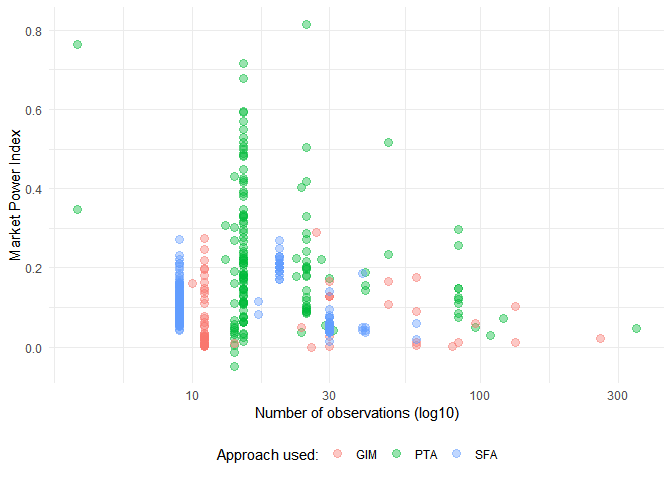
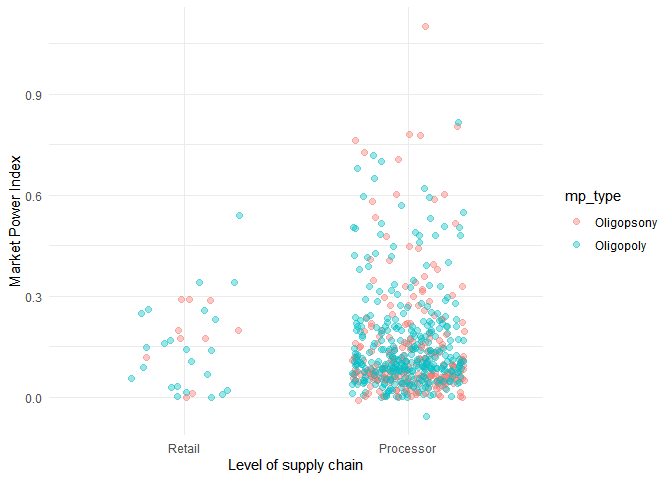
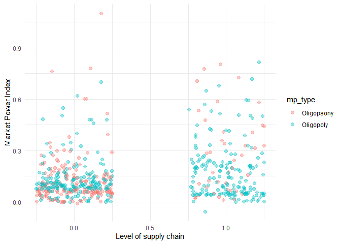
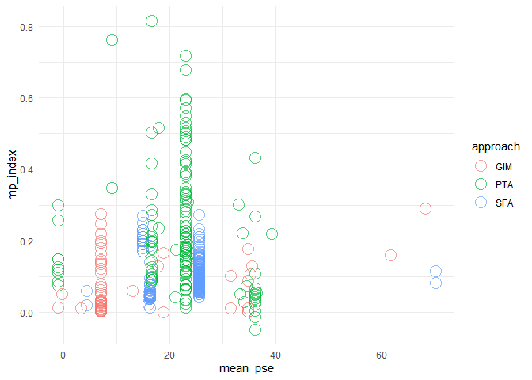
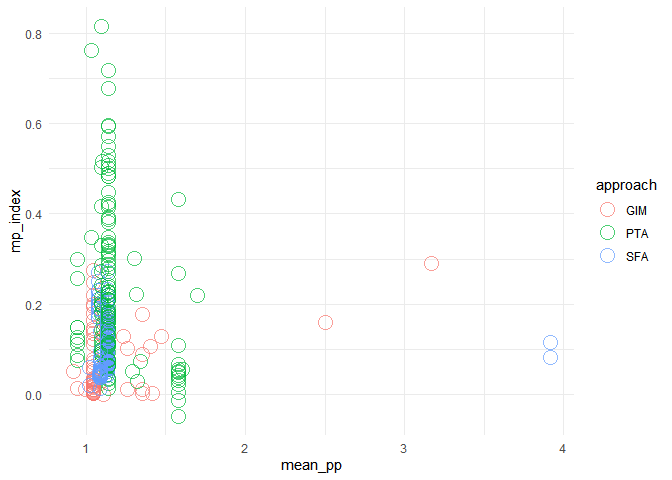
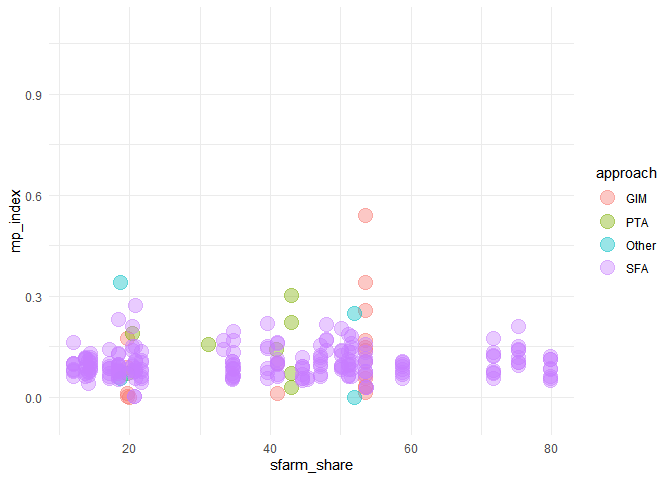

Data Preparation
================
Mykola Dereva
24/06/2020

## Importing data

``` r
data <- read_csv(here("data", "raw data", "Market Power Articles - Sheet2 V2.csv"))
```

    ## Warning: Missing column names filled in: 'X11' [11], 'X12' [12]

    ## Parsed with column specification:
    ## cols(
    ##   Year = col_double(),
    ##   Authors = col_character(),
    ##   Title = col_character(),
    ##   Country = col_character(),
    ##   `Industry/Market` = col_character(),
    ##   Approach = col_character(),
    ##   Period = col_character(),
    ##   `Data Frequency` = col_character(),
    ##   `Type of MP` = col_character(),
    ##   `Market Power Index` = col_double(),
    ##   X11 = col_character(),
    ##   X12 = col_character()
    ## )

Lets clean the table a bit

``` r
clean <- data %>%
  select(-starts_with("X1")) %>% # Drop technical columns (X11, X12)
  fill(Year, Authors, Title, Country, .direction = "down") %>% # Fill empty cells
  clean_names() %>% 
  rename(mp_type = type_of_mp,            # Shorten colnames
         mp_index = market_power_index,
         industry = industry_market,
         data_freq = data_frequency) %>% 
  mutate(mp_index = as.numeric(mp_index))
  

glimpse(clean)
```

    ## Rows: 496
    ## Columns: 10
    ## $ year      <dbl> 2008, 2008, 2008, 2008, 1982, 1982, 1997, 1990, 1990, 200...
    ## $ authors   <chr> "Anders, S. M", "Anders, S. M", "Anders, S. M", "Anders, ...
    ## $ title     <chr> "Imperfect Competition in German Food Retailing: Evidence...
    ## $ country   <chr> "Germany", "Germany", "Germany", "Germany", "USA", "USA",...
    ## $ industry  <chr> "Beef", "Beef", "Pork", "Pork", "Textile", "Tobacco", "Be...
    ## $ approach  <chr> "GIM", "GIM", "GIM", "GIM", "PTA", "PTA", "PTA", "PTA", "...
    ## $ period    <chr> "1995-2000", "1995-2000", "1995-2000", "1995-2000", "1947...
    ## $ data_freq <chr> "Monthly", "Monthly", "Monthly", "Monthly", "Yearly", "Ye...
    ## $ mp_type   <chr> "Oligopsony", "Oligopoly", "Oligopsony", "Oligopoly", "Ol...
    ## $ mp_index  <dbl> 0.17600, 0.08900, 0.01100, 0.00300, 0.03684, 0.40190, -0....

``` r
clean %>% 
  summarise_all(~ sum(is.na(.x))) %>% 
  gather("column", "n.na")
```

    ## Warning: `...` is not empty.
    ## 
    ## We detected these problematic arguments:
    ## * `needs_dots`
    ## 
    ## These dots only exist to allow future extensions and should be empty.
    ## Did you misspecify an argument?

    ## # A tibble: 10 x 2
    ##    column     n.na
    ##    <chr>     <int>
    ##  1 year          0
    ##  2 authors       0
    ##  3 title         0
    ##  4 country       0
    ##  5 industry      0
    ##  6 approach      0
    ##  7 period        0
    ##  8 data_freq     0
    ##  9 mp_type       0
    ## 10 mp_index      0

#### Clean and convert approach column

``` r
clean %>%
  group_by(approach) %>%
  summarise(n = n()) %>%
  mutate(prop = round(n / sum(n) * 100, 2)) %>%
  arrange(-n)
```

    ## `summarise()` ungrouping output (override with `.groups` argument)

    ## Warning: `...` is not empty.
    ## 
    ## We detected these problematic arguments:
    ## * `needs_dots`
    ## 
    ## These dots only exist to allow future extensions and should be empty.
    ## Did you misspecify an argument?

    ## # A tibble: 5 x 3
    ##   approach     n  prop
    ##   <chr>    <int> <dbl>
    ## 1 SFA        258 52.0 
    ## 2 PTA        157 31.6 
    ## 3 GIM         73 14.7 
    ## 4 Other ?      6  1.21
    ## 5 ?            2  0.4

I will filter out articles in which I am not sure

``` r
clean <- clean %>%
  filter(approach %in% c("PTA", "GIM", "SFA")) %>%
  mutate(approach = as_factor(approach))
```

``` r
clean %>%
  group_by(approach) %>%
  summarise(n = n()) %>%
  mutate(prop = round(n / sum(n) * 100, 2)) %>%
  arrange(-n)
```

    ## `summarise()` ungrouping output (override with `.groups` argument)

    ## Warning: `...` is not empty.
    ## 
    ## We detected these problematic arguments:
    ## * `needs_dots`
    ## 
    ## These dots only exist to allow future extensions and should be empty.
    ## Did you misspecify an argument?

    ## # A tibble: 3 x 3
    ##   approach     n  prop
    ##   <fct>    <int> <dbl>
    ## 1 SFA        258  52.9
    ## 2 PTA        157  32.2
    ## 3 GIM         73  15.0

Seems correct

#### Converting mp\_type to categorical dtype

``` r
clean %>%
  group_by(mp_type) %>%
  summarise(n = n()) %>%
  mutate(prop = round(n / sum(n) * 100, 2)) %>%
  arrange(-n)
```

    ## `summarise()` ungrouping output (override with `.groups` argument)

    ## Warning: `...` is not empty.
    ## 
    ## We detected these problematic arguments:
    ## * `needs_dots`
    ## 
    ## These dots only exist to allow future extensions and should be empty.
    ## Did you misspecify an argument?

    ## # A tibble: 4 x 3
    ##   mp_type                    n  prop
    ##   <chr>                  <int> <dbl>
    ## 1 Oligopoly                307 62.9 
    ## 2 Oligopsony               165 33.8 
    ## 3 Conjectural elasticity     9  1.84
    ## 4 Conjectural variation      7  1.43

Clean misspelled rows and filter only for Oligopoly and Oligopsony

``` r
clean <- clean %>%
  mutate(mp_type = if_else(mp_type == "Ologopoly", "Oligopoly", mp_type) ) %>%
  filter(mp_type %in% c("Oligopoly", "Oligopsony")) %>%
  mutate(mp_type = as_factor(mp_type))
```

``` r
clean %>%
  group_by(mp_type) %>%
  summarise(n = n()) %>%
  mutate(prop = round(n / sum(n) * 100, 2)) %>%
  arrange(-n)
```

    ## `summarise()` ungrouping output (override with `.groups` argument)

    ## Warning: `...` is not empty.
    ## 
    ## We detected these problematic arguments:
    ## * `needs_dots`
    ## 
    ## These dots only exist to allow future extensions and should be empty.
    ## Did you misspecify an argument?

    ## # A tibble: 2 x 3
    ##   mp_type        n  prop
    ##   <fct>      <int> <dbl>
    ## 1 Oligopoly    307  65.0
    ## 2 Oligopsony   165  35.0

#### Clean and convert data\_freq colum

``` r
clean %>%
  group_by(data_freq) %>%
  summarise(n = n()) %>%
  mutate(prop = round(n / sum(n) * 100, 2)) %>%
  arrange(-n)
```

    ## `summarise()` ungrouping output (override with `.groups` argument)

    ## Warning: `...` is not empty.
    ## 
    ## We detected these problematic arguments:
    ## * `needs_dots`
    ## 
    ## These dots only exist to allow future extensions and should be empty.
    ## Did you misspecify an argument?

    ## # A tibble: 4 x 3
    ##   data_freq     n  prop
    ##   <chr>     <int> <dbl>
    ## 1 Yearly      440 93.2 
    ## 2 Monthly      25  5.3 
    ## 3 Quaterly      6  1.27
    ## 4 Weekly        1  0.21

Seems fine

``` r
clean %>%
  ggplot(aes(x = fct_reorder(data_freq, mp_index, length),
             y = mp_index,
             color = approach)) + 
  geom_jitter(width = 0.3, height = 0, alpha = 0.6, size = 2) +
  labs(x = "Industry", y="Market Power Index") +
  theme_minimal()
```

<!-- -->

Also I’ll create new column with number of observations per year

``` r
clean <- clean %>%
  mutate(data_freq = as_factor(data_freq)) %>%
  mutate(n_obs_per_year = case_when(data_freq == "Yearly" ~ 1,
                                    data_freq == "Monthly" ~ 12,
                                    data_freq == "Quaterly" ~ 4,
                                    data_freq == "Daily" ~ 365,
                                    data_freq == "Weekly" ~ 52 ) )
```

``` r
clean %>%
  group_by(n_obs_per_year) %>%
  summarise(n = n()) %>%
  mutate(prop = round(n / sum(n) * 100, 2)) %>%
  arrange(-n)
```

    ## `summarise()` ungrouping output (override with `.groups` argument)

    ## Warning: `...` is not empty.
    ## 
    ## We detected these problematic arguments:
    ## * `needs_dots`
    ## 
    ## These dots only exist to allow future extensions and should be empty.
    ## Did you misspecify an argument?

    ## # A tibble: 4 x 3
    ##   n_obs_per_year     n  prop
    ##            <dbl> <int> <dbl>
    ## 1              1   440 93.2 
    ## 2             12    25  5.3 
    ## 3              4     6  1.27
    ## 4             52     1  0.21

seems correct Most MP observations have Yearly frequency

#### Clean and transform industry column

``` r
clean %>%
  group_by(industry) %>%
  summarise(n = n()) %>%
  mutate(prop = round(n / sum(n) * 100, 2)) %>%
  arrange(-n)
```

    ## `summarise()` ungrouping output (override with `.groups` argument)

    ## Warning: `...` is not empty.
    ## 
    ## We detected these problematic arguments:
    ## * `needs_dots`
    ## 
    ## These dots only exist to allow future extensions and should be empty.
    ## Did you misspecify an argument?

    ## # A tibble: 193 x 3
    ##    industry                  n  prop
    ##    <chr>                 <int> <dbl>
    ##  1 Dairy                    62 13.1 
    ##  2 Slaughtering             48 10.2 
    ##  3 Fruits and vegetables    47  9.96
    ##  4 Milling                  47  9.96
    ##  5 Milk                     10  2.12
    ##  6 Tea                       6  1.27
    ##  7 Barley                    5  1.06
    ##  8 Canola                    5  1.06
    ##  9 Wheat                     5  1.06
    ## 10 Oats                      4  0.85
    ## # ... with 183 more rows

With this one it will be a bit more complicated since there are plenty
of categories

I couldn’t quickly figure out how tho check the presence of every value
in vectors in the industry\_fct column for categorization.

So I will write custom function which returns TRUE if column contains
any value in the vector and FALSE in not.

``` r
# helper function. Returns TRUE if any value in vector match string
contains_value <- function(string, vector) {
  
  string <- str_to_lower(string) %>% str_trim(side="both")
  
  matched <- FALSE
  
  for (word in vector) {
    
    if ( any(str_detect(string, word)) ) {
      matched <- TRUE
      break }
  }
  
  return(matched)
}
```

And another function which will classify industry into the given groups
Function that takes a industry string and classify it into given set of
groups function will check if any key-words is contained in the input
string

``` r
classify_industry <- function(non_classified_str) {
  
  # define classification vectors
  
  dairy <- c("milk", "dairy", "cheese", "butter")
  meat <- c("meat", "pork", "beef", "hog", "poultry", "livestock", "cattle",
            "paultry", "pig", "slaughtering")
  cereals <- c("wheat", "oat", "triticale", "grain", "cereal", "barley", "rice",
               "milling")
  oils <- c("canola", "oil", "fat")
  beverages <- c("tea", "beer", "water", "brew", "coffee", "liquor", "drink",
                 "spirit", "wine", "brandy", "cocoa", "beverage")
  tobaco <- c("tobacco", "cigar")
  fruits <- c("fruit", "banana", "horticulture")
  paper <- c("pulp", "paper", "wood", "sawlog")
  bread_flour <- c("bread", "flour")
  sugar <- c("sugar")
  
  
  classified <- case_when(
        contains_value(non_classified_str, dairy) ~ "dairy",
        contains_value(non_classified_str, meat) ~ "meat",
        contains_value(non_classified_str, cereals) ~ "cereals",
        contains_value(non_classified_str, oils) ~ "oils",
        contains_value(non_classified_str, beverages) ~ "beverages",
        contains_value(non_classified_str, tobaco) ~ "tobacco",
        contains_value(non_classified_str, fruits) ~ "fruits",
        contains_value(non_classified_str, paper) ~ "paper",
        contains_value(non_classified_str, bread_flour) ~ "bread or flour",
        contains_value(non_classified_str, sugar) ~ "sugar",
        TRUE ~ "other"
                          )
  return(classified)
}
```

Check the function results

``` r
clean %>% 
  mutate(classified = map_chr(industry, classify_industry)) %>% 
  select(industry, classified)
```

    ## Warning: `...` is not empty.
    ## 
    ## We detected these problematic arguments:
    ## * `needs_dots`
    ## 
    ## These dots only exist to allow future extensions and should be empty.
    ## Did you misspecify an argument?

    ## # A tibble: 472 x 2
    ##    industry  classified
    ##    <chr>     <chr>     
    ##  1 Beef      meat      
    ##  2 Beef      meat      
    ##  3 Pork      meat      
    ##  4 Pork      meat      
    ##  5 Textile   other     
    ##  6 Tobacco   tobacco   
    ##  7 Meat      meat      
    ##  8 Livestock meat      
    ##  9 Hogs      meat      
    ## 10 Hogs      meat      
    ## # ... with 462 more rows

``` r
clean <- clean %>% 
  mutate(industry_fct = map_chr(industry, classify_industry))
```

Seems that the values were changed correctly

Lets aggregate the data in column

``` r
clean %>%
  group_by(industry_fct) %>%
  summarise(n = n()) %>%
  mutate(prop = round(n / sum(n) * 100, 2)) %>%
  arrange(-n)
```

    ## `summarise()` ungrouping output (override with `.groups` argument)

    ## Warning: `...` is not empty.
    ## 
    ## We detected these problematic arguments:
    ## * `needs_dots`
    ## 
    ## These dots only exist to allow future extensions and should be empty.
    ## Did you misspecify an argument?

    ## # A tibble: 11 x 3
    ##    industry_fct       n  prop
    ##    <chr>          <int> <dbl>
    ##  1 dairy             92 19.5 
    ##  2 cereals           86 18.2 
    ##  3 meat              78 16.5 
    ##  4 other             64 13.6 
    ##  5 fruits            56 11.9 
    ##  6 beverages         38  8.05
    ##  7 oils              23  4.87
    ##  8 tobacco           11  2.33
    ##  9 paper              9  1.91
    ## 10 bread or flour     8  1.69
    ## 11 sugar              7  1.48

Probably I shouldn’t use groups with less then 10 observations. The
results might be unreliable.

#### now lets convert industry\_fct to factor

and keep only groups with more then 10 observations

``` r
clean <- clean %>%
  mutate(industry_fct = as_factor(industry_fct)) %>%
  mutate(industry_fct = fct_lump_min(industry_fct, min = 10,
                                     other_level = "other"))
```

``` r
clean %>%
  group_by(industry_fct) %>%
  summarise(n = n()) %>%
  mutate(prop = round(n / sum(n) * 100, 2)) %>%
  arrange(-n)
```

    ## `summarise()` ungrouping output (override with `.groups` argument)

    ## Warning: `...` is not empty.
    ## 
    ## We detected these problematic arguments:
    ## * `needs_dots`
    ## 
    ## These dots only exist to allow future extensions and should be empty.
    ## Did you misspecify an argument?

    ## # A tibble: 8 x 3
    ##   industry_fct     n  prop
    ##   <fct>        <int> <dbl>
    ## 1 dairy           92 19.5 
    ## 2 other           88 18.6 
    ## 3 cereals         86 18.2 
    ## 4 meat            78 16.5 
    ## 5 fruits          56 11.9 
    ## 6 beverages       38  8.05
    ## 7 oils            23  4.87
    ## 8 tobacco         11  2.33

``` r
clean %>%
  ggplot(aes(x = fct_reorder(industry_fct, mp_index, length),
             y = mp_index,
             color = approach)) + 
  geom_jitter(width = 0.25, height = 0, alpha = 0.6, size = 2) +
  labs(x = "Industry", y="Market Power Index") +
  theme_minimal()
```

<!-- -->

Seems that there is an outlier in cereals

### Clean country column

``` r
clean %>%
  group_by(country) %>%
  summarise(n = n()) %>%
  mutate(prop = round(n / sum(n) * 100, 2)) %>%
  ungroup() %>%
  arrange(-n) %>% 
  head(10)
```

    ## `summarise()` ungrouping output (override with `.groups` argument)

    ## Warning: `...` is not empty.
    ## 
    ## We detected these problematic arguments:
    ## * `needs_dots`
    ## 
    ## These dots only exist to allow future extensions and should be empty.
    ## Did you misspecify an argument?

    ## # A tibble: 10 x 3
    ##    country       n  prop
    ##    <chr>     <int> <dbl>
    ##  1 USA         184 39.0 
    ##  2 Australia    40  8.47
    ##  3 Spain        22  4.66
    ##  4 Germany      13  2.75
    ##  5 Hungary      12  2.54
    ##  6 Ukraine      10  2.12
    ##  7 Estonia       9  1.91
    ##  8 France        9  1.91
    ##  9 Latvia        9  1.91
    ## 10 Lithuania     9  1.91

Seems that countries can be categorized into 3 main groups USA, EU and
Australia I am not sure about Australia since most of the observations
are from single article.

I will use country names a lot with different data sets, so it is
important to make sure that I countries written in the same way
everywhere.

I will create small function which will standardize country names with
the help of countrycode package

``` r
standatise_country_name <- function(old_country_name, 
                                    initial_code_scheme = "country.name") {
  
  new_country_name <- countrycode(sourcevar = old_country_name,
                        origin = initial_code_scheme,
                        destination = "country.name",
                        warn = TRUE,
                        nomatch = NULL)
  }
```

check function

``` r
clean %>% 
  mutate(country_st = standatise_country_name(country)) %>% 
  distinct(country, country_st)
```

    ## Warning: `...` is not empty.
    ## 
    ## We detected these problematic arguments:
    ## * `needs_dots`
    ## 
    ## These dots only exist to allow future extensions and should be empty.
    ## Did you misspecify an argument?

    ## # A tibble: 41 x 2
    ##    country     country_st   
    ##    <chr>       <chr>        
    ##  1 Germany     Germany      
    ##  2 USA         United States
    ##  3 Hungary     Hungary      
    ##  4 Sweden      Sweden       
    ##  5 Netherlands Netherlands  
    ##  6 Canada      Canada       
    ##  7 Haiti       Haiti        
    ##  8 France      France       
    ##  9 Spain       Spain        
    ## 10 Australia   Australia    
    ## # ... with 31 more rows

seems that it works well

``` r
clean <- clean %>% 
  mutate(country = standatise_country_name(country))
```

create country\_fct column

``` r
clean <- clean %>%
  mutate(country_fct = case_when(
              country %in% standardise_aes_names(
                #vector with European countries
                              c("Austria",  "Italy",
                                "Belgium",  "Latvia",
                                "Bulgaria", "Lithuania",
                                "Croatia",  "Luxembourg",
                                "Cyprus",     "Malta",
                                "Czech Republic",   "Netherlands",
                                "Denmark",  "Poland",
                                "Estonia",  "Portugal",
                                "Finland",  "Romania",
                                "France",     "Slovakia",
                                "Germany",  "Slovenia",
                                "Greece",     "Spain",
                                "Hungary",  "Sweden",
                                "Ireland",  "EU",
                                "Norway", "UK", "United Kingdom")
                  # all those countries will be set to europe
                                                    ) ~ "europe",
              country %in% c("United States", "Canada") ~ "n_america",
              TRUE ~ "other")
         ) %>%
  mutate(country_fct = as_factor(country_fct))
  
clean %>%
  group_by(country_fct) %>%
  summarise(n = n()) %>%
  mutate(prop = round(n / sum(n) * 100, 2)) %>%
  arrange(-n)
```

    ## `summarise()` ungrouping output (override with `.groups` argument)

    ## Warning: `...` is not empty.
    ## 
    ## We detected these problematic arguments:
    ## * `needs_dots`
    ## 
    ## These dots only exist to allow future extensions and should be empty.
    ## Did you misspecify an argument?

    ## # A tibble: 3 x 3
    ##   country_fct     n  prop
    ##   <fct>       <int> <dbl>
    ## 1 europe        216  45.8
    ## 2 n_america     188  39.8
    ## 3 other          68  14.4

Seems fine.

``` r
clean %>%
  ggplot(aes(x = fct_reorder(country_fct, mp_index, median),
             y = mp_index,
             color = approach)) + 
  geom_jitter(width = 0.25, height = 0, alpha = 0.6, size = 2) +
  labs(x = "Geographical Position", y="Market Power Index") +
  theme_minimal()
```

<!-- -->

### add column with number of observations in article

``` r
clean <- clean %>%
  separate(period, into = c("obs_start", "obs_stop"), 
           convert =TRUE, remove = FALSE) %>%
  mutate(obs_years = obs_stop - obs_start) %>%
  mutate(n_of_obs = n_obs_per_year * obs_years)
```

``` r
clean %>%
  select(obs_start, obs_stop, obs_years, n_obs_per_year, n_of_obs) %>%
  head(10)
```

    ## Warning: `...` is not empty.
    ## 
    ## We detected these problematic arguments:
    ## * `needs_dots`
    ## 
    ## These dots only exist to allow future extensions and should be empty.
    ## Did you misspecify an argument?

    ## # A tibble: 10 x 5
    ##    obs_start obs_stop obs_years n_obs_per_year n_of_obs
    ##        <int>    <int>     <int>          <dbl>    <dbl>
    ##  1      1995     2000         5             12       60
    ##  2      1995     2000         5             12       60
    ##  3      1995     2000         5             12       60
    ##  4      1995     2000         5             12       60
    ##  5      1947     1971        24              1       24
    ##  6      1947     1971        24              1       24
    ##  7      1959     1982        23              1       23
    ##  8      1959     1982        23              1       23
    ##  9      1993     2003        10             12      120
    ## 10      1995     2004         9             12      108

Seems correct

``` r
clean %>%
  ggplot(aes(x=n_of_obs, y=mp_index, color = approach)) +
  geom_point(size = 3, alpha = 0.4) +
  scale_x_continuous(trans = "log10") +
  theme_minimal() +
  easy_move_legend(to = "bottom") +
    labs(x = "Number of observations (log10)",
         y = "Market Power Index") +
  easy_add_legend_title("Approach used:")
```

<!-- -->

### Create dummy variable after 2005

Hypothesis is that there might me a difference between in mp index
between older articles and newer ones. The decision to choose 2005 is a
bit arbitrary, but it divide data in 2 sets with approximately the same
number of observations.

``` r
clean <- clean %>%
  mutate(
          after_2005 = ifelse(
            year > 2005,
            yes = 1,
            no = 0) 
        ) 

clean %>%
  select(year, after_2005) %>%
  head(10)
```

    ## Warning: `...` is not empty.
    ## 
    ## We detected these problematic arguments:
    ## * `needs_dots`
    ## 
    ## These dots only exist to allow future extensions and should be empty.
    ## Did you misspecify an argument?

    ## # A tibble: 10 x 2
    ##     year after_2005
    ##    <dbl>      <dbl>
    ##  1  2008          1
    ##  2  2008          1
    ##  3  2008          1
    ##  4  2008          1
    ##  5  1982          0
    ##  6  1982          0
    ##  7  1990          0
    ##  8  1990          0
    ##  9  2009          1
    ## 10  2009          1

Seems correct

``` r
clean %>%
  ggplot(aes(x = as_factor(after_2005),
             y = mp_index,
             color = approach)) + 
  geom_jitter(width = 0.25, height = 0, alpha = 0.6, size = 2) +
  labs(x = "After 2005", y="Market Power Index") +
  theme_minimal()
```

<!-- -->

### Dummy for perishable goods

``` r
clean <- clean %>%
  mutate(
          perish = case_when(
                        map_lgl(industry, ~ contains_value(.x,
                        # if industry contains any of values below it is considered
                        # to be perishable and it will be set to 1 and 0 otherwise
                                      c("beef", "pork", "meat", "milk",
                                        "paultry", "cheese", "bakery",
                                        "poultry", "egg", "fish",
                                        "salmon", "hog", "dairy",
                                        "cake", "cattle", "livestock",
                                        "fruit", "slaughter"))) ~ 1,
                        
                                        TRUE ~ 0) )  %>%
  # set 0 to non perishable goods which mistakenly was misclassified
  mutate(perish = case_when(
                        map_lgl(industry, ~ contains_value(.x,
                        # this chunk fix the bug that cond. milk and rise were
                        # classified as perishables
                                        c("cond", "rice", "frozen"))) ~ 0,
                                        TRUE ~ perish) )
```

check results

``` r
clean %>% 
  select(industry, perish) %>% 
  filter(perish != 1)
```

    ## Warning: `...` is not empty.
    ## 
    ## We detected these problematic arguments:
    ## * `needs_dots`
    ## 
    ## These dots only exist to allow future extensions and should be empty.
    ## Did you misspecify an argument?

    ## # A tibble: 247 x 2
    ##    industry       perish
    ##    <chr>           <dbl>
    ##  1 Textile             0
    ##  2 Tobacco             0
    ##  3 Pulp and Paper      0
    ##  4 Coffee              0
    ##  5 Food                0
    ##  6 Tobacco             0
    ##  7 Food & Tobacco      0
    ##  8 Malt Beverages      0
    ##  9 Textile             0
    ## 10 Sugar               0
    ## # ... with 237 more rows

Seems correct

``` r
clean %>%
  ggplot(aes(x = as_factor(perish),
             y = mp_index,
             color = approach)) + 
  geom_jitter(width = 0.25, height = 0, alpha = 0.6, size = 2) +
  labs(x = "Perishable", y="Market Power Index") +
  theme_minimal()
```

<!-- -->

## Load data related to Agricultural support (PSE) and Producer protection

### Adding Agr. support (PSE) to our data

data is taken from OECD website
[sorce](https://data.oecd.org/agrpolicy/agricultural-support.htm)

``` r
support <- read_csv( here("data", "raw data",
                          "Agricultural support (PSE) OESD .csv") )
```

    ## Parsed with column specification:
    ## cols(
    ##   LOCATION = col_character(),
    ##   INDICATOR = col_character(),
    ##   SUBJECT = col_character(),
    ##   MEASURE = col_character(),
    ##   FREQUENCY = col_character(),
    ##   TIME = col_double(),
    ##   Value = col_double(),
    ##   `Flag Codes` = col_logical()
    ## )

We decided to use PSE index in our analysis But first, rename colnames
to make them easier to use.

``` r
support <- support %>% 
  clean_names()

glimpse(support)
```

    ## Rows: 8,848
    ## Columns: 8
    ## $ location   <chr> "AUS", "AUS", "AUS", "AUS", "AUS", "AUS", "AUS", "AUS", ...
    ## $ indicator  <chr> "AGRSUPP", "AGRSUPP", "AGRSUPP", "AGRSUPP", "AGRSUPP", "...
    ## $ subject    <chr> "TSE", "TSE", "TSE", "TSE", "TSE", "TSE", "TSE", "TSE", ...
    ## $ measure    <chr> "PC_GDP", "PC_GDP", "PC_GDP", "PC_GDP", "PC_GDP", "PC_GD...
    ## $ frequency  <chr> "A", "A", "A", "A", "A", "A", "A", "A", "A", "A", "A", "...
    ## $ time       <dbl> 1986, 1987, 1988, 1989, 1990, 1991, 1992, 1993, 1994, 19...
    ## $ value      <dbl> 0.8393220, 0.6187854, 0.6293805, 0.5628670, 0.5373301, 0...
    ## $ flag_codes <lgl> NA, NA, NA, NA, NA, NA, NA, NA, NA, NA, NA, NA, NA, NA, ...

Filter for PSE values in % of gross farm receipts

``` r
support <- support %>% 
  filter(subject == "PSE", measure == "PC_GFARM") 
```

From the data we need only 3 columns: Location, year and value Lets drop
other columns

``` r
support <-  support %>% 
  select(location, year = time, pse = value)

head(support)
```

    ## Warning: `...` is not empty.
    ## 
    ## We detected these problematic arguments:
    ## * `needs_dots`
    ## 
    ## These dots only exist to allow future extensions and should be empty.
    ## Did you misspecify an argument?

    ## # A tibble: 6 x 3
    ##   location  year   pse
    ##   <chr>    <dbl> <dbl>
    ## 1 AUS       1986 12.9 
    ## 2 AUS       1987  9.11
    ## 3 AUS       1988  9.33
    ## 4 AUS       1989  8.64
    ## 5 AUS       1990  9.36
    ## 6 AUS       1991  8.76

Seems correct Now we need to join PSE indicator to out main data set. To
do so, we need to unify country names across data sets. Seems that
contrycode package might really help.

``` r
guess_field(support$location)
```

    ##              code percent_of_unique_matched
    ## genc3c     genc3c                  92.59259
    ## iso3c       iso3c                  92.59259
    ## wb             wb                  92.59259
    ## wb_api3c wb_api3c                  92.59259

Seems that OECD uses one of beforewritten country codes lets convert it
to the regular English country names

``` r
support$country <- map_chr(support$location,
                           ~ standatise_country_name(.x, "genc3c"))
```

lets check the results

``` r
support %>% 
  distinct(location, country) %>% 
  head()
```

    ## Warning: `...` is not empty.
    ## 
    ## We detected these problematic arguments:
    ## * `needs_dots`
    ## 
    ## These dots only exist to allow future extensions and should be empty.
    ## Did you misspecify an argument?

    ## # A tibble: 6 x 2
    ##   location country    
    ##   <chr>    <chr>      
    ## 1 AUS      Australia  
    ## 2 CAN      Canada     
    ## 3 ISL      Iceland    
    ## 4 JPN      Japan      
    ## 5 KOR      South Korea
    ## 6 MEX      Mexico

Beautiful

Drop columns we don’t need

``` r
support <- support %>% 
  select(country, year, pse)
```

Since OECD data not provide PSE data related to the individual EU
countries we will have to use EU28 aggregate PSE information

``` r
EU28 <- standatise_country_name( c(
                      "Austria",    "Italy",
                      "Belgium",    "Latvia",
                      "Bulgaria",   "Lithuania",
                      "Croatia",    "Luxembourg",
                      "Cyprus",   "Malta",
                      "Czech Republic", "Netherlands",
                      "Denmark",    "Poland",
                      "Estonia",    "Portugal",
                      "Finland",    "Romania",
                      "France",   "Slovakia",
                      "Germany",    "Slovenia",
                      "Greece",   "Spain",
                      "Hungary",    "Sweden",
                      "Ireland", "United Kingdom"
                                    )
                                )
```

Lets estimate average PSE related to each MPI observation

Fist of all let’s make a column which contain all the years during which
each MPI was estimated

``` r
country_year <- clean %>%
  select(country, obs_start, obs_stop) %>%
  # create unique identification of each MPI
  tibble::rowid_to_column("id") %>%   
  # transform start and end date to one column 
  gather(key = "start_stop", value = "year", obs_start:obs_stop) %>% 
  arrange(id) %>% 
  # convert this new column as date
  mutate(year = as.Date(as.character(year), format = "%Y")) %>% 
  group_by(id) %>% 
  # fill sequence of of years
  complete(year = seq(min(year), max(year), by ="year")) %>% 
  ungroup() %>% 
  #drop start_stop columns since we don't need it
  select(id, country, year) %>% 
  # fill empty values
  fill(country, .direction = "down") %>%
  # convert datetype to keep just year information
  # and drop moth and day
  mutate(year = year(year))

country_year %>% head()
```

    ## Warning: `...` is not empty.
    ## 
    ## We detected these problematic arguments:
    ## * `needs_dots`
    ## 
    ## These dots only exist to allow future extensions and should be empty.
    ## Did you misspecify an argument?

    ## # A tibble: 6 x 3
    ##      id country  year
    ##   <int> <chr>   <dbl>
    ## 1     1 Germany  1995
    ## 2     1 Germany  1996
    ## 3     1 Germany  1997
    ## 4     1 Germany  1998
    ## 5     1 Germany  1999
    ## 6     1 Germany  2000

Now we can easily join country\_year with PSE data to calculate the
average PSE per MPI estimate

``` r
mean_pse <- country_year %>% 
  # change EU country names to match OECD aggregation 
  # OECD data
  mutate(country = case_when(
                        country %in% EU28 ~ "EU28",
                        TRUE ~ country)) %>% 
  # join information related to PSE index
  left_join(support, 
            by = c("country", "year"),
            copy = TRUE) %>% 
  # calculate an average PSE index attributed to each MPI observation
  group_by(id) %>% 
  summarise(mean_pse = mean(pse, na.rm=TRUE)) %>% 
  ungroup()
```

    ## `summarise()` ungrouping output (override with `.groups` argument)

``` r
head(mean_pse)
```

    ## Warning: `...` is not empty.
    ## 
    ## We detected these problematic arguments:
    ## * `needs_dots`
    ## 
    ## These dots only exist to allow future extensions and should be empty.
    ## Did you misspecify an argument?

    ## # A tibble: 6 x 2
    ##      id mean_pse
    ##   <int>    <dbl>
    ## 1     1     34.7
    ## 2     2     34.7
    ## 3     3     34.7
    ## 4     4     34.7
    ## 5     5    NaN  
    ## 6     6    NaN

``` r
mean(is.na(mean_pse$mean_pse))
```

    ## [1] 0.02118644

Unfortunately around 2.% of observations is missing Probably this is
because many articles use too old data for the MPI estimation While PSE
index data is available starting from 1986,

``` r
clean <- clean %>% 
  # create an id for each of MPI observation to join it to PSE data
  tibble::rowid_to_column("id") %>% 
  inner_join(mean_pse, by = "id", copy = TRUE)
```

Now we have PSE information in out data set

Plot the resulting variable

``` r
ggplot(clean, aes(mean_pse, mp_index, color=approach)) +
  geom_point(alpha = 0.7, size = 5, shape = 1) +
  theme_minimal()
```

    ## Warning: Removed 10 rows containing missing values (geom_point).

<!-- -->

Check observations with negative PSE

``` r
clean %>% 
  filter( mean_pse < 0) %>% 
  select(country, id, mean_pse) %>% 
  mutate(log_mean_pse = log(mean_pse))
```

    ## Warning in log(mean_pse): NaNs produced

    ## Warning: `...` is not empty.
    ## 
    ## We detected these problematic arguments:
    ## * `needs_dots`
    ## 
    ## These dots only exist to allow future extensions and should be empty.
    ## Did you misspecify an argument?

    ## # A tibble: 11 x 4
    ##    country    id mean_pse log_mean_pse
    ##    <chr>   <int>    <dbl>        <dbl>
    ##  1 Ukraine    85   -1.02           NaN
    ##  2 India      87   -0.208          NaN
    ##  3 Ukraine    92   -1.02           NaN
    ##  4 Ukraine    93   -1.02           NaN
    ##  5 Ukraine    94   -1.02           NaN
    ##  6 Ukraine    95   -1.02           NaN
    ##  7 Ukraine    96   -1.02           NaN
    ##  8 Ukraine    97   -1.02           NaN
    ##  9 Ukraine    98   -1.02           NaN
    ## 10 Ukraine    99   -1.02           NaN
    ## 11 Ukraine   100   -1.02           NaN

Ukraine ¯\_(ツ)\_/¯

Countries with high PSE

``` r
clean %>% 
  filter(mean_pse > 60) %>% 
  select(id, country, mean_pse)
```

    ## Warning: `...` is not empty.
    ## 
    ## We detected these problematic arguments:
    ## * `needs_dots`
    ## 
    ## These dots only exist to allow future extensions and should be empty.
    ## Did you misspecify an argument?

    ## # A tibble: 4 x 3
    ##      id country     mean_pse
    ##   <int> <chr>          <dbl>
    ## 1   104 South Korea     68.2
    ## 2   107 Japan           61.6
    ## 3   115 Norway          70.1
    ## 4   116 Norway          70.1

### Adding Producer Protection (PP) index to our data

The algorithm will be the similar as in case of PSE so I will not
comment it

Data source is the same
[sorce](https://data.oecd.org/agrpolicy/producer-protection.htm#indicator-chart)

``` r
PP <- read_csv( here("data", "raw data",
                     "Producer Protection (PP) OECD.csv") )
```

    ## Parsed with column specification:
    ## cols(
    ##   LOCATION = col_character(),
    ##   INDICATOR = col_character(),
    ##   SUBJECT = col_character(),
    ##   MEASURE = col_character(),
    ##   FREQUENCY = col_character(),
    ##   TIME = col_double(),
    ##   Value = col_double(),
    ##   `Flag Codes` = col_logical()
    ## )

``` r
PP <- PP %>% 
  clean_names()

glimpse(PP)
```

    ## Rows: 743
    ## Columns: 8
    ## $ location   <chr> "AUS", "AUS", "AUS", "AUS", "AUS", "AUS", "AUS", "AUS", ...
    ## $ indicator  <chr> "AGRPNPC", "AGRPNPC", "AGRPNPC", "AGRPNPC", "AGRPNPC", "...
    ## $ subject    <chr> "TOT", "TOT", "TOT", "TOT", "TOT", "TOT", "TOT", "TOT", ...
    ## $ measure    <chr> "RT", "RT", "RT", "RT", "RT", "RT", "RT", "RT", "RT", "R...
    ## $ frequency  <chr> "A", "A", "A", "A", "A", "A", "A", "A", "A", "A", "A", "...
    ## $ time       <dbl> 1986, 1987, 1988, 1989, 1990, 1991, 1992, 1993, 1994, 19...
    ## $ value      <dbl> 1.111986, 1.067421, 1.077049, 1.071517, 1.084206, 1.0710...
    ## $ flag_codes <lgl> NA, NA, NA, NA, NA, NA, NA, NA, NA, NA, NA, NA, NA, NA, ...

``` r
PP <-  PP %>% 
  select(location, year = time, PP = value)

head(PP)
```

    ## Warning: `...` is not empty.
    ## 
    ## We detected these problematic arguments:
    ## * `needs_dots`
    ## 
    ## These dots only exist to allow future extensions and should be empty.
    ## Did you misspecify an argument?

    ## # A tibble: 6 x 3
    ##   location  year    PP
    ##   <chr>    <dbl> <dbl>
    ## 1 AUS       1986  1.11
    ## 2 AUS       1987  1.07
    ## 3 AUS       1988  1.08
    ## 4 AUS       1989  1.07
    ## 5 AUS       1990  1.08
    ## 6 AUS       1991  1.07

``` r
PP$country <- map_chr(PP$location, ~ standatise_country_name(.x, "genc3c"))

PP %>% 
  distinct(location, country) %>% 
  head()
```

    ## Warning: `...` is not empty.
    ## 
    ## We detected these problematic arguments:
    ## * `needs_dots`
    ## 
    ## These dots only exist to allow future extensions and should be empty.
    ## Did you misspecify an argument?

    ## # A tibble: 6 x 2
    ##   location country    
    ##   <chr>    <chr>      
    ## 1 AUS      Australia  
    ## 2 CAN      Canada     
    ## 3 ISL      Iceland    
    ## 4 JPN      Japan      
    ## 5 KOR      South Korea
    ## 6 MEX      Mexico

``` r
PP <- PP %>% 
  select(country, year, PP)
```

``` r
mean_pp <- country_year %>%
  mutate(country = case_when(
                      country %in% EU28 ~ "EU28",
                      TRUE ~ country)) %>% 
  left_join(PP, 
            by = c("country", "year"),
            copy = TRUE) %>% 
  # calculate an average PP index attributed to each MPI observation
  group_by(id) %>% 
  summarise(mean_pp = mean(PP, na.rm=TRUE)) %>% 
  ungroup()
```

    ## `summarise()` ungrouping output (override with `.groups` argument)

``` r
head(mean_pp)
```

    ## Warning: `...` is not empty.
    ## 
    ## We detected these problematic arguments:
    ## * `needs_dots`
    ## 
    ## These dots only exist to allow future extensions and should be empty.
    ## Did you misspecify an argument?

    ## # A tibble: 6 x 2
    ##      id mean_pp
    ##   <int>   <dbl>
    ## 1     1    1.35
    ## 2     2    1.35
    ## 3     3    1.35
    ## 4     4    1.35
    ## 5     5  NaN   
    ## 6     6  NaN

``` r
clean <- clean %>% 
  inner_join(mean_pp, by = "id", copy = TRUE)
```

``` r
ggplot(clean, aes(mean_pp, mp_index, color=approach)) +
  geom_point(alpha = 0.7, size = 5, shape = 1) +
  theme_minimal()
```

    ## Warning: Removed 10 rows containing missing values (geom_point).

<!-- -->

Maybe I should not use those 4 outliers in the analysis

## Small Farms Share

Lets add variable witch contains information related to the market share
of small farmers

The EU data is taken from the Eurostat website The code of the data set
is “ef\_kvftaa” In the our analysis we define small farmers as ones who
have less than 20 ha of land. Small farmers variable will contain the
share of small farmers output (in EUR) in total agricultural output.

MAYBE IT IS BETTER TO USE INDUSTRY DATA, NOT COUNTRY AGGREGATE

``` r
farms <- read_csv(here("data", "raw data", "Farm structure EU",
                       "ef_kvftaa_1_Data.csv"),
                  na = c("", "NA", ":") # NA is coded as ":"
                  )
```

    ## Parsed with column specification:
    ## cols(
    ##   INDIC_EF = col_character(),
    ##   AGRAREA = col_character(),
    ##   GEO = col_character(),
    ##   FARMTYPE = col_character(),
    ##   TIME = col_double(),
    ##   Value = col_number()
    ## )

drop columns we don’t need and rename ones we need

``` r
farms <- farms %>% 
  clean_names() %>% 
  select(country = geo, agrarea, year = time, output_eur = value)

glimpse(farms)
```

    ## Rows: 1,280
    ## Columns: 4
    ## $ country    <chr> "Belgium", "Belgium", "Belgium", "Belgium", "Bulgaria", ...
    ## $ agrarea    <chr> "Total", "Total", "Total", "Total", "Total", "Total", "T...
    ## $ year       <dbl> 2005, 2007, 2010, 2013, 2005, 2007, 2010, 2013, 2005, 20...
    ## $ output_eur <dbl> 6785150200, 6638349610, 7247768310, 8406674190, 23212809...

Standardize country names

``` r
guess_field(farms$country) %>% head(3)
```

    ##                              code percent_of_unique_matched
    ## country.name.en   country.name.en                    96.875
    ## cldr.name.en         cldr.name.en                    96.875
    ## cldr.name.en_001 cldr.name.en_001                    96.875

``` r
farms$country <- standatise_country_name(farms$country)
```

check the levels of farm size aggregation

``` r
farms %>% 
  pivot_wider(names_from = agrarea, 
              values_from = output_eur) %>% 
  clean_names() %>% 
  colnames()
```

    ##  [1] "country"            "year"               "total"             
    ##  [4] "zero_ha"            "less_than_2_ha"     "from_2_to_4_9_ha"  
    ##  [7] "from_5_to_9_9_ha"   "from_10_to_19_9_ha" "from_20_to_29_9_ha"
    ## [10] "from_30_to_49_9_ha" "from_50_to_99_9_ha" "x100_ha_or_over"

create column with share of small farms Also we will assume that in the
2000 year small farm market share == 2005 and 2018 == 2013 to alleviate
issue of sample size reduction.

``` r
sfarm_share <- farms %>%
  pivot_wider(names_from = agrarea, 
              values_from = output_eur) %>% 
  group_by(country, year) %>%
  clean_names() %>% 
  mutate(sfarms = sum(zero_ha, less_than_2_ha, from_2_to_4_9_ha,
                        from_5_to_9_9_ha, from_10_to_19_9_ha, na.rm = TRUE),
         sfarms_share = sfarms / total * 100) %>% 
  ungroup() %>% 
  # add data for 2000 and 2018
  select(country, year, sfarms_share) %>% 
  pivot_wider(names_from = year, values_from = sfarms_share) %>%
  mutate(`2000` = `2005`, `2018` = `2013`, `1995` = `2005`) %>% 
  pivot_longer(cols = -country,
               names_to = "year",
               values_to = "sfarm_share") %>% 
  mutate(year = as.numeric(year))

head(sfarm_share)
```

    ## Warning: `...` is not empty.
    ## 
    ## We detected these problematic arguments:
    ## * `needs_dots`
    ## 
    ## These dots only exist to allow future extensions and should be empty.
    ## Did you misspecify an argument?

    ## # A tibble: 6 x 3
    ##   country  year sfarm_share
    ##   <chr>   <dbl>       <dbl>
    ## 1 Belgium  2005        37.0
    ## 2 Belgium  2007        35.2
    ## 3 Belgium  2010        32.2
    ## 4 Belgium  2013        27.5
    ## 5 Belgium  2000        37.0
    ## 6 Belgium  2018        27.5

join sfarm\_share with main data set

``` r
sfarm <-country_year %>%
  left_join(sfarm_share, 
            by = c("country", "year"),
            copy = TRUE) %>% 
  # calculate an average PSE index attributed to each MPI observation
  group_by(id) %>% 
  summarise(sfarm_share = mean(sfarm_share, na.rm=TRUE)) %>% 
  ungroup()
```

    ## `summarise()` ungrouping output (override with `.groups` argument)

``` r
head(sfarm)
```

    ## Warning: `...` is not empty.
    ## 
    ## We detected these problematic arguments:
    ## * `needs_dots`
    ## 
    ## These dots only exist to allow future extensions and should be empty.
    ## Did you misspecify an argument?

    ## # A tibble: 6 x 2
    ##      id sfarm_share
    ##   <int>       <dbl>
    ## 1     1        19.7
    ## 2     2        19.7
    ## 3     3        19.7
    ## 4     4        19.7
    ## 5     5       NaN  
    ## 6     6       NaN

``` r
sum(is.na(sfarm))
```

    ## [1] 267

A lot of missing observations :(

``` r
clean <- clean %>% 
  inner_join(sfarm, by = "id", copy = TRUE)
```

``` r
ggplot(clean, aes(sfarm_share, mp_index, color=approach)) +
  geom_point(alpha = 0.4, size = 5) +
  theme_minimal()
```

    ## Warning: Removed 267 rows containing missing values (geom_point).

<!-- -->

## The same data but aggregated by industry

``` r
farms_full <- read_csv(here("data", "raw data", "Farm structure EU",
                       "ef_kvftaa_1_Data_full.csv"),
                  na = c("", "NA", ":") # NA is coded as ":"
                  )
```

    ## Parsed with column specification:
    ## cols(
    ##   INDIC_EF = col_character(),
    ##   AGRAREA = col_character(),
    ##   GEO = col_character(),
    ##   FARMTYPE = col_character(),
    ##   TIME = col_double(),
    ##   Value = col_number(),
    ##   `Flag and Footnotes` = col_logical()
    ## )

drop columns we don’t need and rename ones we need

``` r
farms_full <- farms_full %>% 
  clean_names() 

farms_full %>% glimpse()
```

    ## Rows: 147,200
    ## Columns: 7
    ## $ indic_ef           <chr> "hold: Total number of holdings", "hold: Total n...
    ## $ agrarea            <chr> "Total", "Total", "Total", "Total", "Total", "To...
    ## $ geo                <chr> "Belgium", "Belgium", "Belgium", "Belgium", "Bel...
    ## $ farmtype           <chr> "Total", "Total", "Total", "Total", "Specialist ...
    ## $ time               <dbl> 2005, 2007, 2010, 2013, 2005, 2007, 2010, 2013, ...
    ## $ value              <dbl> 51540, 48010, 42850, 37760, 1510, 1500, 2030, 22...
    ## $ flag_and_footnotes <lgl> NA, NA, NA, NA, NA, NA, NA, NA, NA, NA, NA, NA, ...

The data set is a bit redundant filter only information we need

``` r
farms_full <- farms_full %>% 
  filter(indic_ef == "Euro: Standard output (SO)",
         farmtype != "Total") %>% 
  select(-flag_and_footnotes, -indic_ef) %>% 
  select(country = geo, agrarea, industry = farmtype,
         year = time, output_eur = value)

farms_full %>% glimpse()
```

    ## Rows: 28,160
    ## Columns: 5
    ## $ country    <chr> "Belgium", "Belgium", "Belgium", "Belgium", "Belgium", "...
    ## $ agrarea    <chr> "Total", "Total", "Total", "Total", "Total", "Total", "T...
    ## $ industry   <chr> "Specialist cereals, oilseed and protein crops (calculat...
    ## $ year       <dbl> 2005, 2007, 2010, 2013, 2005, 2007, 2010, 2013, 2005, 20...
    ## $ output_eur <dbl> 20898030, 21714800, 47082100, 64768630, 426695350, 43216...

We need to categorise industry to match the main dataset

``` r
farms_full %>% 
  distinct(industry) 
```

    ## Warning: `...` is not empty.
    ## 
    ## We detected these problematic arguments:
    ## * `needs_dots`
    ## 
    ## These dots only exist to allow future extensions and should be empty.
    ## Did you misspecify an argument?

    ## # A tibble: 22 x 1
    ##    industry                                                                     
    ##    <chr>                                                                        
    ##  1 Specialist cereals, oilseed and protein crops (calculated with Standard Outp~
    ##  2 General field cropping (calculated with Standard Output)                     
    ##  3 Specialist horticulture indoor (calculated with Standard Output)             
    ##  4 Specialist horticulture outdoor (calculated with Standard Output)            
    ##  5 Other horticulture (calculated with Standard Output)                         
    ##  6 Specialist vineyards (calculated with Standard Output)                       
    ##  7 Specialist fruit and citrus fruit (calculated with Standard Output)          
    ##  8 Specialist olives (calculated with Standard Output)                          
    ##  9 Various permanent crops combined (calculated with Standard Output)           
    ## 10 Specialist dairying (calculated with Standard Output)                        
    ## # ... with 12 more rows

remove “(calculated with Standard Output)”

``` r
farms_full <- farms_full %>% 
  mutate(industry = str_remove(industry, pattern = " \\(.+\\)")) 
```

#### classify industry

Try to classify with the function we already created

``` r
farms_ind_rename <- farms_full %>% 
  select(industry) %>% 
  distinct() %>%
  mutate(new_value = map_chr(industry, ~ classify_industry(.x))) %>% 
  select(old_value = industry, new_value)

farms_ind_rename
```

    ## Warning: `...` is not empty.
    ## 
    ## We detected these problematic arguments:
    ## * `needs_dots`
    ## 
    ## These dots only exist to allow future extensions and should be empty.
    ## Did you misspecify an argument?

    ## # A tibble: 22 x 2
    ##    old_value                                     new_value
    ##    <chr>                                         <chr>    
    ##  1 Specialist cereals, oilseed and protein crops cereals  
    ##  2 General field cropping                        other    
    ##  3 Specialist horticulture indoor                fruits   
    ##  4 Specialist horticulture outdoor               fruits   
    ##  5 Other horticulture                            fruits   
    ##  6 Specialist vineyards                          other    
    ##  7 Specialist fruit and citrus fruit             fruits   
    ##  8 Specialist olives                             other    
    ##  9 Various permanent crops combined              other    
    ## 10 Specialist dairying                           dairy    
    ## # ... with 12 more rows

Classified satisfactory

It will not be very efficient to categorize each of 28k values. Lets
write function which will map predefined value pairs

``` r
change_string_value <- function(target_value, old_values, new_values) {
  
  
  result <- NULL
  
  for (i in 1:length(old_values) ) {
    
    if (target_value == old_values[i]) {
      
      result <- new_values[i]
      
      break }
    
  }
  
  # if result is still NULL throw an error
  if ( is.null(result) ) stop("No matches, check old_values")
  
  return(result)
}
```

check function

``` r
farms_full %>% 
  select(industry) %>% 
  mutate(industry_cat = map_chr(farms_full$industry,
                                ~ change_string_value(target_value = .x,
                    old_values = farms_ind_rename$old_value,
                    new_values = farms_ind_rename$new_value))) %>%
  distinct() %>% 
  head(10)
```

    ## Warning: `...` is not empty.
    ## 
    ## We detected these problematic arguments:
    ## * `needs_dots`
    ## 
    ## These dots only exist to allow future extensions and should be empty.
    ## Did you misspecify an argument?

    ## # A tibble: 10 x 2
    ##    industry                                      industry_cat
    ##    <chr>                                         <chr>       
    ##  1 Specialist cereals, oilseed and protein crops cereals     
    ##  2 General field cropping                        other       
    ##  3 Specialist horticulture indoor                fruits      
    ##  4 Specialist horticulture outdoor               fruits      
    ##  5 Other horticulture                            fruits      
    ##  6 Specialist vineyards                          other       
    ##  7 Specialist fruit and citrus fruit             fruits      
    ##  8 Specialist olives                             other       
    ##  9 Various permanent crops combined              other       
    ## 10 Specialist dairying                           dairy

Work well

classification function we created before works satisfactory

``` r
farms_full <- farms_full %>% 
  mutate(industry_cat = map_chr(farms_full$industry,
                                ~ change_string_value(target_value = .x,
                    old_values = farms_ind_rename$old_value,
                    new_values = farms_ind_rename$new_value))) %>% 
  select(-industry)
```

#### standardize country name

``` r
farm_country_rename <- farms_full %>% 
  select(old_country = country) %>% 
  distinct() %>% 
  mutate(new_country = map_chr(old_country, ~ standatise_country_name(.x)))

head(farm_country_rename)
```

    ## Warning: `...` is not empty.
    ## 
    ## We detected these problematic arguments:
    ## * `needs_dots`
    ## 
    ## These dots only exist to allow future extensions and should be empty.
    ## Did you misspecify an argument?

    ## # A tibble: 6 x 2
    ##   old_country                                      new_country
    ##   <chr>                                            <chr>      
    ## 1 Belgium                                          Belgium    
    ## 2 Bulgaria                                         Bulgaria   
    ## 3 Czechia                                          Czechia    
    ## 4 Denmark                                          Denmark    
    ## 5 Germany (until 1990 former territory of the FRG) Germany    
    ## 6 Estonia                                          Estonia

``` r
farms_full <- farms_full %>% 
  mutate(country = map_chr(country,
                                ~ change_string_value(target_value = .x,
                                old_values = farm_country_rename$old_country,
                                new_values = farm_country_rename$new_country)))
```

#### change column position

``` r
farms_full <- farms_full %>% 
  select(country, industry_cat, year, everything())
```

### prepare for joining

``` r
farms_full_to_join <- farms_full %>%
  pivot_wider(names_from = agrarea, 
              values_from = output_eur,
              values_fn = sum) %>%      # to have a number in cell, it's list otherwise
  clean_names() %>% 
  group_by(country, year, industry_cat) %>%
  mutate(sfarms = sum(zero_ha, less_than_2_ha, from_2_to_4_9_ha,
                        from_5_to_9_9_ha, from_10_to_19_9_ha, na.rm = TRUE),
         sfarms_share = sfarms / total * 100) %>% 
  # add data for 2000 and 2018
  select(country,industry_cat, year, sfarms_share) %>% 
  pivot_wider(names_from = year, values_from = sfarms_share) %>%
  mutate(`2000` = `2005`, `2018` = `2013`, `1995` = `2005`) %>% 
  pivot_longer(cols = `2005`:`1995`,
               names_to = "year",
               values_to = "sfarm_share") %>% 
  mutate(year = as.numeric(year)) %>% 
  filter(!is.na(sfarm_share))

head(farms_full_to_join)
```

    ## Warning: `...` is not empty.
    ## 
    ## We detected these problematic arguments:
    ## * `needs_dots`
    ## 
    ## These dots only exist to allow future extensions and should be empty.
    ## Did you misspecify an argument?

    ## # A tibble: 6 x 4
    ## # Groups:   country, industry_cat [1]
    ##   country industry_cat  year sfarm_share
    ##   <chr>   <chr>        <dbl>       <dbl>
    ## 1 Belgium cereals       2005        40.4
    ## 2 Belgium cereals       2007        39.7
    ## 3 Belgium cereals       2010        30.2
    ## 4 Belgium cereals       2013        30.9
    ## 5 Belgium cereals       2000        40.4
    ## 6 Belgium cereals       2018        30.9

``` r
ggplot(farms_full_to_join, aes(sfarm_share) ) +
  geom_density() +
  facet_grid(rows = vars(industry_cat))
```

<!-- -->

I didn\`t keep full list of industry categories so I will create it once
again

``` r
clean$industry_cat <- map_chr(clean$industry, ~ classify_industry(.x))
```

``` r
country_ind_year <-  country_year %>% 
  left_join(clean[c("id", "industry_cat")], by = "id" ) %>% 
  select(id, country, industry_cat, year)

head(country_ind_year)
```

    ## Warning: `...` is not empty.
    ## 
    ## We detected these problematic arguments:
    ## * `needs_dots`
    ## 
    ## These dots only exist to allow future extensions and should be empty.
    ## Did you misspecify an argument?

    ## # A tibble: 6 x 4
    ##      id country industry_cat  year
    ##   <int> <chr>   <chr>        <dbl>
    ## 1     1 Germany meat          1995
    ## 2     1 Germany meat          1996
    ## 3     1 Germany meat          1997
    ## 4     1 Germany meat          1998
    ## 5     1 Germany meat          1999
    ## 6     1 Germany meat          2000

### 

``` r
sfarm_by_cat <-country_ind_year %>%
  left_join(farms_full_to_join, 
            by = c("country", "industry_cat", "year"),
            copy = TRUE) %>% 
  # calculate an average SfarmShare index attributed to each MPI observation
  group_by(id) %>% 
  summarise(sfarm_share_by_cat = mean(sfarm_share, na.rm=TRUE)) %>% 
  ungroup()
```

    ## `summarise()` ungrouping output (override with `.groups` argument)

``` r
head(sfarm_by_cat)
```

    ## Warning: `...` is not empty.
    ## 
    ## We detected these problematic arguments:
    ## * `needs_dots`
    ## 
    ## These dots only exist to allow future extensions and should be empty.
    ## Did you misspecify an argument?

    ## # A tibble: 6 x 2
    ##      id sfarm_share_by_cat
    ##   <int>              <dbl>
    ## 1     1               8.92
    ## 2     2               8.92
    ## 3     3               8.92
    ## 4     4               8.92
    ## 5     5             NaN   
    ## 6     6             NaN

### Finally join to main data set

``` r
clean <- clean %>% 
  inner_join(sfarm_by_cat, by = "id", copy = TRUE)
```

``` r
sum(is.na(clean$sfarm_share_by_cat))
```

    ## [1] 269

``` r
ggplot(clean, aes(sfarm_share_by_cat, mp_index, color=approach)) +
  geom_point(alpha = 0.4, size = 5) +
  theme_minimal()
```

    ## Warning: Removed 269 rows containing missing values (geom_point).

<!-- -->

## Add data from Doing Buisiness “easines to start business”

``` r
db <- readxl::read_excel(path = here("data", "raw data", "Doing Business.xlsx"),
                         sheet = 1, skip = 3)
```

    ## New names:
    ## * `Procedures (number)` -> `Procedures (number)...29`
    ## * `Score-Procedures (number)` -> `Score-Procedures (number)...30`
    ## * `Time (days)` -> `Time (days)...31`
    ## * `Score-Time (days)` -> `Score-Time (days)...32`
    ## * `Procedures (number)` -> `Procedures (number)...46`
    ## * ...

``` r
dim(db)
```

    ## [1] 3606  199

select only columns we need

``` r
db <- db %>%
  clean_names() %>% 
  select(country_code, year = db_year, score_starting_a_business)
```

``` r
head(db, 10)
```

    ## Warning: `...` is not empty.
    ## 
    ## We detected these problematic arguments:
    ## * `needs_dots`
    ## 
    ## These dots only exist to allow future extensions and should be empty.
    ## Did you misspecify an argument?

    ## # A tibble: 10 x 3
    ##    country_code  year score_starting_a_business
    ##    <chr>        <dbl>                     <dbl>
    ##  1 AFG           2020                      92.0
    ##  2 AFG           2019                      92.0
    ##  3 AFG           2018                      82.6
    ##  4 AFG           2017                      90.4
    ##  5 AFG           2016                      90.5
    ##  6 AFG           2015                      91.0
    ##  7 AFG           2014                      91.6
    ##  8 AFG           2013                      88.3
    ##  9 AFG           2012                      87.9
    ## 10 AFG           2011                      87.8

To decrease the number of dropped observations we assume that there is
significant difference between 2004 and 2000 in Start Business index

``` r
db <- db %>% 
  pivot_wider(names_from = year, 
              values_from = score_starting_a_business) %>% 
  mutate(`2000` = `2004`) %>% 
  pivot_longer(cols = -country_code,
               names_to = "year",
               values_to = "score_starting_a_business") %>% 
  mutate(year = as.numeric(year))
```

Adjust country names

``` r
guess_field(db$country_code)
```

    ##              code percent_of_unique_matched
    ## genc3c     genc3c                  87.32394
    ## iso3c       iso3c                  87.32394
    ## wb             wb                  87.32394
    ## wb_api3c wb_api3c                  87.32394

``` r
db$country <- standatise_country_name(db$country_code,
                                      initial_code_scheme = "genc3c")
```

``` r
db %>% 
  select(country_code, country) %>% 
  distinct() %>% 
  head(10)
```

    ## Warning: `...` is not empty.
    ## 
    ## We detected these problematic arguments:
    ## * `needs_dots`
    ## 
    ## These dots only exist to allow future extensions and should be empty.
    ## Did you misspecify an argument?

    ## # A tibble: 10 x 2
    ##    country_code country          
    ##    <chr>        <chr>            
    ##  1 AFG          Afghanistan      
    ##  2 ALB          Albania          
    ##  3 DZA          Algeria          
    ##  4 AGO          Angola           
    ##  5 ATG          Antigua & Barbuda
    ##  6 ARG          Argentina        
    ##  7 ARM          Armenia          
    ##  8 AUS          Australia        
    ##  9 AUT          Austria          
    ## 10 AZE          Azerbaijan

``` r
db_join <- country_year %>%
  left_join(db, 
            by = c("country", "year"),
            copy = TRUE) %>% 
  # calculate an average DB index attributed to each MPI observation
  group_by(id) %>% 
  summarise(start_business = mean(score_starting_a_business, na.rm=TRUE)) %>% 
  ungroup()
```

    ## `summarise()` ungrouping output (override with `.groups` argument)

``` r
head(db_join, 10)
```

    ## Warning: `...` is not empty.
    ## 
    ## We detected these problematic arguments:
    ## * `needs_dots`
    ## 
    ## These dots only exist to allow future extensions and should be empty.
    ## Did you misspecify an argument?

    ## # A tibble: 10 x 2
    ##       id start_business
    ##    <int>          <dbl>
    ##  1     1           73.2
    ##  2     2           73.2
    ##  3     3           73.2
    ##  4     4           73.2
    ##  5     5          NaN  
    ##  6     6          NaN  
    ##  7     7          NaN  
    ##  8     8          NaN  
    ##  9     9           73.2
    ## 10    10           66.7

``` r
sum(is.na(db_join$start_business))
```

    ## [1] 144

``` r
clean <- clean %>% 
  inner_join(db_join, by = "id", copy = TRUE)
```

``` r
ggplot(clean, aes(start_business, mp_index, color=approach)) +
  geom_point(alpha = 0.4, size = 5) +
  theme_minimal()
```

    ## Warning: Removed 144 rows containing missing values (geom_point).

<!-- -->

## Ease of doing business index

The algorithm is the same as with previous variable

``` r
db <- readxl::read_excel(path = here("data", "raw data", "Doing Business.xlsx"),
                         sheet = 1, skip = 3)
```

    ## New names:
    ## * `Procedures (number)` -> `Procedures (number)...29`
    ## * `Score-Procedures (number)` -> `Score-Procedures (number)...30`
    ## * `Time (days)` -> `Time (days)...31`
    ## * `Score-Time (days)` -> `Score-Time (days)...32`
    ## * `Procedures (number)` -> `Procedures (number)...46`
    ## * ...

``` r
db <- db %>%
  clean_names() %>% 
  select(country_code, year = db_year,
         starts_with("ease_of_doing_business_score")) %>% 
  group_by(country_code, year) %>% 
  # make one column with ease of doing business index
  # assume that there is no difference in methodologies
  mutate(edb_index = sum(ease_of_doing_business_score_db17_20_methodology,
                          ease_of_doing_business_score_db15_methodology,
                          ease_of_doing_business_score_db10_14_methodology,
                          na.rm = TRUE),
         country = standatise_country_name(country_code,
                                           initial_code_scheme = "genc3c")) %>%
  ungroup() %>% 
  select(country, year, edb_index) %>%
  # because on NAs some values are == 0
  # filter them out
  filter(edb_index > 0) %>% 
  # assume that there is no big difference in doing business in 2010 and 2005
  pivot_wider(names_from = year, 
            values_from = edb_index) %>% 
  mutate(`2005` = `2010`) %>% 
  pivot_longer(cols = -country,
             names_to = "year",
             values_to = "edb_index") %>% 
  mutate(year = as.numeric(year))

head(db)
```

    ## Warning: `...` is not empty.
    ## 
    ## We detected these problematic arguments:
    ## * `needs_dots`
    ## 
    ## These dots only exist to allow future extensions and should be empty.
    ## Did you misspecify an argument?

    ## # A tibble: 6 x 3
    ##   country      year edb_index
    ##   <chr>       <dbl>     <dbl>
    ## 1 Afghanistan  2020      44.1
    ## 2 Afghanistan  2019      44.2
    ## 3 Afghanistan  2018      37.1
    ## 4 Afghanistan  2017      38.9
    ## 5 Afghanistan  2016      39.3
    ## 6 Afghanistan  2015      41.7

``` r
edb_join <- country_year %>%
  left_join(db, 
            by = c("country", "year"),
            copy = TRUE) %>% 
  # calculate an average DB index attributed to each MPI observation
  group_by(id) %>% 
  summarise(edb_index = mean(edb_index, na.rm = TRUE)) %>% 
  ungroup()
```

    ## `summarise()` ungrouping output (override with `.groups` argument)

``` r
clean <- clean %>% 
  inner_join(edb_join, by = "id", copy = TRUE)
```

``` r
ggplot(clean, aes(edb_index, mp_index, color = approach)) +
  geom_point(alpha = 0.4, size = 5) +
  theme_minimal()
```

    ## Warning: Removed 210 rows containing missing values (geom_point).

<!-- -->
\#\# Column with articles weights for WLS

Some articles have only one MPI while other multiple estimates to avoid
excessive influence of articles with many MPIs we will use Weighted
Least squares

``` r
weights <- clean %>% 
  group_by(title) %>% 
  summarise(weights = 1 / n()) %>% 
  ungroup()
```

    ## `summarise()` ungrouping output (override with `.groups` argument)

``` r
head(weights)
```

    ## Warning: `...` is not empty.
    ## 
    ## We detected these problematic arguments:
    ## * `needs_dots`
    ## 
    ## These dots only exist to allow future extensions and should be empty.
    ## Did you misspecify an argument?

    ## # A tibble: 6 x 2
    ##   title                                                                  weights
    ##   <chr>                                                                    <dbl>
    ## 1 A Conjectural Variations Model of Reduced Japanese Milk Price Support~     1  
    ## 2 A New Method for Estimating Market Power with an Application to Norwe~     0.5
    ## 3 A stochastic frontier estimator of the aggregate degree of market pow~     0.5
    ## 4 A stochastic frontier estimator of the aggregate degree of market pow~     1  
    ## 5 A stochastic production frontier estimator of the degree of oligopson~     1  
    ## 6 A Structural Model of the Analysis of Retail Market Power: The Case o~     1

``` r
clean <- clean %>% 
  inner_join(weights, by = "title")
```

## Make an object only with columns we need for the further analysis

``` r
drop_col <- c("id", "year", "authors", "title", "country", "industry", "period",
              "obs_start", "obs_stop", "n_obs_per_year",
              "obs_years", "industry_cat")

analysis <- clean %>%
  # select all except of drop_col
  select(-all_of(drop_col)) %>% 
  rename(app = approach,
         freq = data_freq,
         type = mp_type,
         index = mp_index,
         ind = industry_fct,
         count = country_fct,
         obs_n = n_of_obs) %>%
  # create dummies from category columns
  fastDummies::dummy_columns(select_columns = c("freq", "type", "ind",
                                                "count", "app"),
                remove_selected_columns = TRUE)
```

``` r
saveRDS(clean, file = here("data", "clean data", "Full_data.Rds"))
saveRDS(analysis, file = here("data", "clean data", "Analysis_data.Rds"))
```
