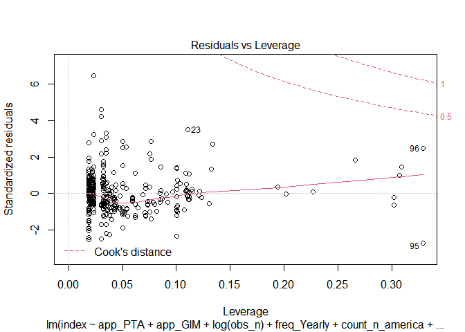

Analysis Code
================
Mykola Dereva
June 11, 2020

load our cleaned data

``` r
clean <- readRDS(here("data", "clean data", "Clean_data.Rds"))
```

## Analysis

Select only columns we need for the analysis. Rename columns once again.
And create columns with dummy variables

``` r
glimpse(clean)
```

    ## Rows: 204
    ## Columns: 25
    ## $ id             <int> 1, 2, 3, 4, 5, 6, 7, 8, 9, 10, 11, 12, 13, 14, 15, 1...
    ## $ year           <dbl> 2008, 2008, 2008, 1982, 1982, 1990, 1990, 2009, 2009...
    ## $ authors        <chr> "Anders, S. M", "Anders, S. M", "Anders, S. M", "App...
    ## $ title          <chr> "Imperfect Competition in German Food Retailing: Evi...
    ## $ country        <chr> "Germany", "Germany", "Germany", "USA", "USA", "USA"...
    ## $ industry       <chr> "Beef", "Beef", "Pork", "Textile", "Tobacco", "Meat"...
    ## $ approach       <fct> GIM, GIM, GIM, PTA, PTA, PTA, PTA, PTA, PTA, PTA, GI...
    ## $ period         <chr> "1995-2000", "1995-2000", "1995-2000", "1947–1971", ...
    ## $ obs_start      <int> 1995, 1995, 1995, 1947, 1947, 1959, 1959, 1993, 1995...
    ## $ obs_stop       <int> 2000, 2000, 2000, 1971, 1971, 1982, 1982, 2003, 2004...
    ## $ data_freq      <fct> Monthly, Monthly, Monthly, Yearly, Yearly, Yearly, Y...
    ## $ mp_type        <fct> Oligopsony, Oligopoly, Oligopsony, Oligopoly, Oligop...
    ## $ mp_index       <dbl> 0.17600, 0.08900, 0.01100, 0.03684, 0.40190, 0.22300...
    ## $ n_obs_per_year <dbl> 12, 12, 12, 1, 1, 1, 1, 12, 12, 1, 12, 1, 1, 1, 1, 1...
    ## $ industry_fct   <fct> meat, meat, meat, other, other, meat, meat, meat, me...
    ## $ country_st     <chr> "Germany", "Germany", "Germany", "United States", "U...
    ## $ country_fct    <fct> europe, europe, europe, n_america, n_america, n_amer...
    ## $ obs_years      <int> 5, 5, 5, 24, 24, 23, 23, 10, 9, 28, 4, 15, 15, 15, 1...
    ## $ n_of_obs       <dbl> 60, 60, 60, 24, 24, 23, 23, 120, 108, 28, 48, 15, 15...
    ## $ after_2005     <dbl> 1, 1, 1, 0, 0, 0, 0, 1, 1, 0, 0, 0, 0, 0, 0, 0, 0, 0...
    ## $ perish         <dbl> 1, 1, 1, 0, 0, 1, 0, 0, 0, 0, 0, 0, 0, 0, 0, 1, 1, 0...
    ## $ mean_pse       <dbl> 34.73444, 34.73444, 34.73444, NaN, NaN, NaN, NaN, 34...
    ## $ mean_pp        <dbl> 1.352539, 1.352539, 1.352539, NaN, NaN, NaN, NaN, 1....
    ## $ sfarm_share    <dbl> 19.69004, 19.69004, 19.69004, NaN, NaN, NaN, NaN, 19...
    ## $ start_business <dbl> 73.24874, 73.24874, 73.24874, NaN, NaN, NaN, NaN, 73...

``` r
library(fastDummies)

analysis <- clean %>%
  select(approach, data_freq, mp_type, mp_index, sfarm_share,
         industry_fct, country_fct, n_of_obs, after_2005, perish,
         mean_pse, mean_pp, start_business) %>%
  rename(app = approach,
         freq = data_freq,
         type = mp_type,
         index = mp_index,
         ind = industry_fct,
         count = country_fct,
         obs_n = n_of_obs) %>%
  dummy_columns(select_columns = c("freq", "type", "ind", "count", "app"),
                remove_selected_columns = TRUE)
```

final quick check of the data

``` r
summary(analysis)
```

    ##      index         sfarm_share        obs_n          after_2005    
    ##  Min.   :0.0070   Min.   :11.95   Min.   :  4.00   Min.   :0.0000  
    ##  1st Qu.:0.0630   1st Qu.:19.69   1st Qu.: 11.00   1st Qu.:0.0000  
    ##  Median :0.1273   Median :39.58   Median : 15.00   Median :1.0000  
    ##  Mean   :0.1440   Mean   :35.98   Mean   : 27.79   Mean   :0.5882  
    ##  3rd Qu.:0.2000   3rd Qu.:45.79   3rd Qu.: 25.00   3rd Qu.:1.0000  
    ##  Max.   :0.5160   Max.   :79.83   Max.   :348.00   Max.   :1.0000  
    ##                   NA's   :165                                      
    ##      perish          mean_pse         mean_pp       start_business 
    ##  Min.   :0.0000   Min.   :-1.024   Min.   :0.9198   Min.   :24.09  
    ##  1st Qu.:0.0000   1st Qu.:11.048   1st Qu.:1.0623   1st Qu.:75.30  
    ##  Median :0.0000   Median :16.629   Median :1.0947   Median :91.24  
    ##  Mean   :0.1618   Mean   :19.216   Mean   :1.1824   Mean   :84.18  
    ##  3rd Qu.:0.0000   3rd Qu.:25.496   3rd Qu.:1.1375   3rd Qu.:96.18  
    ##  Max.   :1.0000   Max.   :70.144   Max.   :3.9167   Max.   :96.24  
    ##                   NA's   :9        NA's   :9        NA's   :82     
    ##   freq_Monthly     freq_Yearly     freq_Quaterly      freq_Weekly      
    ##  Min.   :0.0000   Min.   :0.0000   Min.   :0.00000   Min.   :0.000000  
    ##  1st Qu.:0.0000   1st Qu.:1.0000   1st Qu.:0.00000   1st Qu.:0.000000  
    ##  Median :0.0000   Median :1.0000   Median :0.00000   Median :0.000000  
    ##  Mean   :0.1176   Mean   :0.8578   Mean   :0.01961   Mean   :0.004902  
    ##  3rd Qu.:0.0000   3rd Qu.:1.0000   3rd Qu.:0.00000   3rd Qu.:0.000000  
    ##  Max.   :1.0000   Max.   :1.0000   Max.   :1.00000   Max.   :1.000000  
    ##                                                                        
    ##  type_Oligopsony  type_Oligopoly      ind_meat       ind_beverages   
    ##  Min.   :0.0000   Min.   :0.0000   Min.   :0.00000   Min.   :0.0000  
    ##  1st Qu.:0.0000   1st Qu.:0.0000   1st Qu.:0.00000   1st Qu.:0.0000  
    ##  Median :0.0000   Median :1.0000   Median :0.00000   Median :0.0000  
    ##  Mean   :0.3039   Mean   :0.6961   Mean   :0.08824   Mean   :0.1127  
    ##  3rd Qu.:1.0000   3rd Qu.:1.0000   3rd Qu.:0.00000   3rd Qu.:0.0000  
    ##  Max.   :1.0000   Max.   :1.0000   Max.   :1.00000   Max.   :1.0000  
    ##                                                                      
    ##   ind_cereals       ind_dairy         ind_oils         ind_other     
    ##  Min.   :0.0000   Min.   :0.0000   Min.   :0.00000   Min.   :0.0000  
    ##  1st Qu.:0.0000   1st Qu.:0.0000   1st Qu.:0.00000   1st Qu.:0.0000  
    ##  Median :0.0000   Median :0.0000   Median :0.00000   Median :0.0000  
    ##  Mean   :0.1127   Mean   :0.2941   Mean   :0.04902   Mean   :0.3431  
    ##  3rd Qu.:0.0000   3rd Qu.:1.0000   3rd Qu.:0.00000   3rd Qu.:1.0000  
    ##  Max.   :1.0000   Max.   :1.0000   Max.   :1.00000   Max.   :1.0000  
    ##                                                                      
    ##   count_europe    count_n_america   count_other        app_GIM      
    ##  Min.   :0.0000   Min.   :0.0000   Min.   :0.0000   Min.   :0.0000  
    ##  1st Qu.:0.0000   1st Qu.:0.0000   1st Qu.:0.0000   1st Qu.:0.0000  
    ##  Median :0.0000   Median :0.0000   Median :0.0000   Median :0.0000  
    ##  Mean   :0.2647   Mean   :0.4706   Mean   :0.2647   Mean   :0.2647  
    ##  3rd Qu.:1.0000   3rd Qu.:1.0000   3rd Qu.:1.0000   3rd Qu.:1.0000  
    ##  Max.   :1.0000   Max.   :1.0000   Max.   :1.0000   Max.   :1.0000  
    ##                                                                     
    ##     app_PTA          app_SFA      
    ##  Min.   :0.0000   Min.   :0.0000  
    ##  1st Qu.:0.0000   1st Qu.:0.0000  
    ##  Median :0.0000   Median :0.0000  
    ##  Mean   :0.4657   Mean   :0.2696  
    ##  3rd Qu.:1.0000   3rd Qu.:1.0000  
    ##  Max.   :1.0000   Max.   :1.0000  
    ## 

``` r
analysis %>%
  summarise_all(funs(sum(is.na(.)))) %>%
  gather(column, n_na)
```

    ## Warning: `funs()` is deprecated as of dplyr 0.8.0.
    ## Please use a list of either functions or lambdas: 
    ## 
    ##   # Simple named list: 
    ##   list(mean = mean, median = median)
    ## 
    ##   # Auto named with `tibble::lst()`: 
    ##   tibble::lst(mean, median)
    ## 
    ##   # Using lambdas
    ##   list(~ mean(., trim = .2), ~ median(., na.rm = TRUE))
    ## This warning is displayed once every 8 hours.
    ## Call `lifecycle::last_warnings()` to see where this warning was generated.

    ## # A tibble: 26 x 2
    ##    column          n_na
    ##    <chr>          <int>
    ##  1 index              0
    ##  2 sfarm_share      165
    ##  3 obs_n              0
    ##  4 after_2005         0
    ##  5 perish             0
    ##  6 mean_pse           9
    ##  7 mean_pp            9
    ##  8 start_business    82
    ##  9 freq_Monthly       0
    ## 10 freq_Yearly        0
    ## # ... with 16 more rows

``` r
summary(lm(index ~ ., data=analysis))
```

    ## 
    ## Call:
    ## lm(formula = index ~ ., data = analysis)
    ## 
    ## Residuals:
    ##      Min       1Q   Median       3Q      Max 
    ## -0.09479 -0.01694  0.00000  0.02313  0.07021 
    ## 
    ## Coefficients: (12 not defined because of singularities)
    ##                   Estimate Std. Error t value Pr(>|t|)
    ## (Intercept)      2.160e+03  1.404e+03   1.538    0.138
    ## sfarm_share      6.945e-04  5.743e-04   1.209    0.239
    ## obs_n            4.293e+00  2.786e+00   1.541    0.137
    ## after_2005      -4.821e+02  3.133e+02  -1.539    0.138
    ## perish           4.023e+02  2.611e+02   1.541    0.137
    ## mean_pse         7.944e+01  5.161e+01   1.539    0.137
    ## mean_pp         -3.719e+03  2.417e+03  -1.539    0.137
    ## start_business   1.288e-03  1.352e-03   0.953    0.351
    ## freq_Monthly    -3.377e+02  2.191e+02  -1.541    0.137
    ## freq_Yearly      4.847e+02  3.146e+02   1.541    0.137
    ## freq_Quaterly           NA         NA      NA       NA
    ## freq_Weekly             NA         NA      NA       NA
    ## type_Oligopsony  4.136e-02  3.512e-02   1.177    0.251
    ## type_Oligopoly          NA         NA      NA       NA
    ## ind_meat         4.007e+02  2.602e+02   1.540    0.137
    ## ind_beverages           NA         NA      NA       NA
    ## ind_cereals             NA         NA      NA       NA
    ## ind_dairy               NA         NA      NA       NA
    ## ind_oils                NA         NA      NA       NA
    ## ind_other               NA         NA      NA       NA
    ## count_europe    -8.369e-03  4.429e-02  -0.189    0.852
    ## count_n_america         NA         NA      NA       NA
    ## count_other             NA         NA      NA       NA
    ## app_GIM         -1.292e+02  8.385e+01  -1.541    0.137
    ## app_PTA                 NA         NA      NA       NA
    ## app_SFA                 NA         NA      NA       NA
    ## 
    ## Residual standard error: 0.03794 on 23 degrees of freedom
    ##   (167 observations deleted due to missingness)
    ## Multiple R-squared:  0.7058, Adjusted R-squared:  0.5395 
    ## F-statistic: 4.244 on 13 and 23 DF,  p-value: 0.001248

lets try automatic variable selection

``` r
library(leaps)
```

``` r
auto.select <- regsubsets(log(index) ~ ., data=analysis,
                          method = "exhaustive", nvmax = 20)
```

    ## Warning in leaps.setup(x, y, wt = wt, nbest = nbest, nvmax = nvmax, force.in =
    ## force.in, : 12 linear dependencies found

    ## Reordering variables and trying again:

``` r
x <- summary(auto.select)

plot(x$bic, main="BIC")
```

<!-- -->

``` r
plot(x$adjr2, main="Adj R^2")
```

<!-- -->

So according BIC the oprimal number of variables is around 3 While
according to adj. R^2 - around 8-10

``` r
plot(auto.select)
```

<!-- -->

``` r
log_lm <- lm(log(index) ~ app_PTA + app_GIM +
                 obs_n + 
                 count_n_america +
                 after_2005 +
                 type_Oligopsony +
                 ind_dairy + ind_meat + ind_cereals + ind_beverages + ind_oils +
                 mean_pp + mean_pse, 
         data=analysis)
summary(log_lm)
```

    ## 
    ## Call:
    ## lm(formula = log(index) ~ app_PTA + app_GIM + obs_n + count_n_america + 
    ##     after_2005 + type_Oligopsony + ind_dairy + ind_meat + ind_cereals + 
    ##     ind_beverages + ind_oils + mean_pp + mean_pse, data = analysis)
    ## 
    ## Residuals:
    ##      Min       1Q   Median       3Q      Max 
    ## -2.43192 -0.43502  0.08891  0.41991  1.71447 
    ## 
    ## Coefficients:
    ##                  Estimate Std. Error t value Pr(>|t|)    
    ## (Intercept)     -3.343804   0.452072  -7.397 5.03e-12 ***
    ## app_PTA          0.158297   0.247380   0.640  0.52305    
    ## app_GIM         -0.741047   0.245504  -3.018  0.00291 ** 
    ## obs_n           -0.003625   0.001855  -1.954  0.05220 .  
    ## count_n_america  0.981554   0.181664   5.403 2.04e-07 ***
    ## after_2005       0.321961   0.255928   1.258  0.21001    
    ## type_Oligopsony  0.368840   0.167852   2.197  0.02926 *  
    ## ind_dairy        0.349470   0.178064   1.963  0.05122 .  
    ## ind_meat        -0.388936   0.234692  -1.657  0.09921 .  
    ## ind_cereals      0.926061   0.228487   4.053 7.50e-05 ***
    ## ind_beverages    0.268792   0.197203   1.363  0.17457    
    ## ind_oils        -0.010992   0.257146  -0.043  0.96595    
    ## mean_pp         -0.086127   0.281813  -0.306  0.76025    
    ## mean_pse         0.022626   0.009500   2.382  0.01827 *  
    ## ---
    ## Signif. codes:  0 '***' 0.001 '**' 0.01 '*' 0.05 '.' 0.1 ' ' 1
    ## 
    ## Residual standard error: 0.7365 on 181 degrees of freedom
    ##   (9 observations deleted due to missingness)
    ## Multiple R-squared:  0.3977, Adjusted R-squared:  0.3544 
    ## F-statistic: 9.194 on 13 and 181 DF,  p-value: 1.983e-14

``` r
bptest(log_lm)
```

    ## 
    ##  studentized Breusch-Pagan test
    ## 
    ## data:  log_lm
    ## BP = 28.564, df = 13, p-value = 0.007543

``` r
plot(log_lm)
```

<!-- --><!-- --><!-- --><!-- -->

seems that we have hetoroscadasticity issue. Lets try to use
heteroscadasticity robust se and to compare it with the regular

``` r
log_lm_se <- vcovHC(log_lm, type = "HC")
log_lm_se <- sqrt(diag(log_lm_se))
log_lm_se
```

    ##     (Intercept)         app_PTA         app_GIM           obs_n count_n_america 
    ##     0.478871507     0.247834315     0.293152832     0.001571775     0.183947605 
    ##      after_2005 type_Oligopsony       ind_dairy        ind_meat     ind_cereals 
    ##     0.270427471     0.205419975     0.162287267     0.254159509     0.256478777 
    ##   ind_beverages        ind_oils         mean_pp        mean_pse 
    ##     0.187841346     0.257240290     0.266428336     0.010173405

``` r
stargazer(log_lm, log_lm, se=list(NULL, log_lm_se),
          column.labels=c("default SE","robust SE"), type = "text",
          omit.stat=c("f", "ser", "n"), align = TRUE)
```

    ## 
    ## ============================================
    ##                     Dependent variable:     
    ##                 ----------------------------
    ##                          log(index)         
    ##                   default SE     robust SE  
    ##                      (1)            (2)     
    ## --------------------------------------------
    ## app_PTA             0.158          0.158    
    ##                    (0.247)        (0.248)   
    ##                                             
    ## app_GIM           -0.741***      -0.741**   
    ##                    (0.246)        (0.293)   
    ##                                             
    ## obs_n              -0.004*       -0.004**   
    ##                    (0.002)        (0.002)   
    ##                                             
    ## count_n_america    0.982***      0.982***   
    ##                    (0.182)        (0.184)   
    ##                                             
    ## after_2005          0.322          0.322    
    ##                    (0.256)        (0.270)   
    ##                                             
    ## type_Oligopsony    0.369**        0.369*    
    ##                    (0.168)        (0.205)   
    ##                                             
    ## ind_dairy           0.349*        0.349**   
    ##                    (0.178)        (0.162)   
    ##                                             
    ## ind_meat           -0.389*        -0.389    
    ##                    (0.235)        (0.254)   
    ##                                             
    ## ind_cereals        0.926***      0.926***   
    ##                    (0.228)        (0.256)   
    ##                                             
    ## ind_beverages       0.269          0.269    
    ##                    (0.197)        (0.188)   
    ##                                             
    ## ind_oils            -0.011        -0.011    
    ##                    (0.257)        (0.257)   
    ##                                             
    ## mean_pp             -0.086        -0.086    
    ##                    (0.282)        (0.266)   
    ##                                             
    ## mean_pse           0.023**        0.023**   
    ##                    (0.010)        (0.010)   
    ##                                             
    ## Constant          -3.344***      -3.344***  
    ##                    (0.452)        (0.479)   
    ##                                             
    ## --------------------------------------------
    ## R2                  0.398          0.398    
    ## Adjusted R2         0.354          0.354    
    ## ============================================
    ## Note:            *p<0.1; **p<0.05; ***p<0.01

#### Without Log transformation

``` r
lm <- lm(index ~ app_PTA + app_GIM +
                 obs_n + 
                 count_n_america +
                 after_2005 +
                 type_Oligopsony +
                 ind_dairy + ind_meat + ind_cereals + ind_beverages + ind_oils, 
         data=analysis)
summary(lm)
```

    ## 
    ## Call:
    ## lm(formula = index ~ app_PTA + app_GIM + obs_n + count_n_america + 
    ##     after_2005 + type_Oligopsony + ind_dairy + ind_meat + ind_cereals + 
    ##     ind_beverages + ind_oils, data = analysis)
    ## 
    ## Residuals:
    ##      Min       1Q   Median       3Q      Max 
    ## -0.18269 -0.05752 -0.00758  0.03516  0.31679 
    ## 
    ## Coefficients:
    ##                   Estimate Std. Error t value Pr(>|t|)    
    ## (Intercept)      6.604e-02  3.619e-02   1.825   0.0696 .  
    ## app_PTA          5.422e-02  2.794e-02   1.941   0.0538 .  
    ## app_GIM         -3.164e-02  2.805e-02  -1.128   0.2607    
    ## obs_n           -4.325e-04  2.185e-04  -1.979   0.0492 *  
    ## count_n_america  8.291e-02  1.883e-02   4.404 1.77e-05 ***
    ## after_2005       5.133e-02  2.727e-02   1.882   0.0613 .  
    ## type_Oligopsony  8.213e-03  1.929e-02   0.426   0.6707    
    ## ind_dairy        1.816e-03  1.995e-02   0.091   0.9276    
    ## ind_meat        -4.799e-02  2.564e-02  -1.872   0.0628 .  
    ## ind_cereals      2.870e-02  2.662e-02   1.078   0.2823    
    ## ind_beverages    1.650e-02  2.306e-02   0.715   0.4752    
    ## ind_oils        -5.243e-05  3.064e-02  -0.002   0.9986    
    ## ---
    ## Signif. codes:  0 '***' 0.001 '**' 0.01 '*' 0.05 '.' 0.1 ' ' 1
    ## 
    ## Residual standard error: 0.08877 on 192 degrees of freedom
    ## Multiple R-squared:  0.2679, Adjusted R-squared:  0.226 
    ## F-statistic: 6.389 on 11 and 192 DF,  p-value: 5.445e-09

``` r
bptest(lm)
```

    ## 
    ##  studentized Breusch-Pagan test
    ## 
    ## data:  lm
    ## BP = 28.147, df = 11, p-value = 0.003074

``` r
plot(lm)
```

<!-- --><!-- --><!-- --><!-- -->

``` r
get_robust_se <- function(lm_model)  {
  matrix <- vcovHC(lm_model, type = "HC0")
  robust_se <- sqrt(diag(matrix))
  return(robust_se)
}

get_robust_se(lm)
```

    ##     (Intercept)         app_PTA         app_GIM           obs_n count_n_america 
    ##    0.0379878308    0.0248820718    0.0254900217    0.0001330374    0.0200080747 
    ##      after_2005 type_Oligopsony       ind_dairy        ind_meat     ind_cereals 
    ##    0.0281382505    0.0174454679    0.0180455312    0.0218128775    0.0244333717 
    ##   ind_beverages        ind_oils 
    ##    0.0232977573    0.0461455826

``` r
model_1 <- lm(log(index) ~ app_PTA + app_GIM + type_Oligopoly, 
                        data=analysis)
se_1 <- get_robust_se(model_1)

model_2 <- lm(log(index) ~ app_PTA + app_GIM +
                type_Oligopoly +
                obs_n + after_2005 + 
                freq_Yearly + freq_Quaterly +
                count_n_america + count_europe, 
         data=analysis)
se_2 <- get_robust_se(model_2)

model_3 <- lm(log(index) ~ app_PTA + app_GIM +
                type_Oligopoly +
                obs_n + after_2005 + 
                freq_Yearly + freq_Quaterly +
                count_n_america + count_europe +
                ind_dairy + ind_meat + ind_beverages + ind_cereals + ind_oils, 
         data=analysis)
se_3 <- get_robust_se(model_3)


model_4 <- lm(log(index) ~ app_PTA + app_GIM +
                type_Oligopoly +
                obs_n + 
                count_n_america +
                ind_dairy + ind_meat + ind_beverages + ind_cereals + ind_oils +
                log(mean_pp) + log(mean_pse), 
         data=analysis)
```

    ## Warning in log(mean_pse): NaNs produced

``` r
se_4 <- get_robust_se(model_4)
```

#### Test for heteroscadasticity

``` r
bptest(model_1)
```

    ## 
    ##  studentized Breusch-Pagan test
    ## 
    ## data:  model_1
    ## BP = 32.333, df = 3, p-value = 4.453e-07

``` r
bptest(model_2)
```

    ## 
    ##  studentized Breusch-Pagan test
    ## 
    ## data:  model_2
    ## BP = 35.594, df = 9, p-value = 4.679e-05

``` r
bptest(model_3)
```

    ## 
    ##  studentized Breusch-Pagan test
    ## 
    ## data:  model_3
    ## BP = 33.149, df = 14, p-value = 0.002742

``` r
bptest(model_4)
```

    ## 
    ##  studentized Breusch-Pagan test
    ## 
    ## data:  model_4
    ## BP = 26.882, df = 12, p-value = 0.008036

We can see that all 3 models expesed to the heteroscadasticity issue.

## Summary tables

``` r
stargazer(model_1, model_2, model_3, model_4,
          type = "text",
          keep.stat=c("n", "rsq", "adj.rsq"), 
          title = "Analysis Results",
          #column.labels =  c("Model 1", "Model 2", "Model 3"),
          dep.var.labels = "Market Power Index (log transformed)",
          se = list(se_1, se_2, se_3, se_4),
          align = TRUE,
          intercept.bottom = FALSE
          )
```

    ## 
    ## Analysis Results
    ## =======================================================
    ##                           Dependent variable:          
    ##                 ---------------------------------------
    ##                  Market Power Index (log transformed)  
    ##                    (1)       (2)       (3)       (4)   
    ## -------------------------------------------------------
    ## Constant        -2.023*** -1.985*** -2.009*** -4.402***
    ##                  (0.173)   (0.577)   (0.656)   (0.489) 
    ##                                                        
    ## app_PTA           0.018    -0.007    -0.064   -0.298***
    ##                  (0.113)   (0.293)   (0.315)   (0.114) 
    ##                                                        
    ## app_GIM         -0.926*** -0.667**  -0.822**  -0.604***
    ##                  (0.197)   (0.310)   (0.347)   (0.209) 
    ##                                                        
    ## type_Oligopoly    0.006    -0.214    -0.241   -0.441** 
    ##                  (0.158)   (0.226)   (0.214)   (0.182) 
    ##                                                        
    ## obs_n                     -0.006*** -0.006*** -0.004***
    ##                            (0.002)   (0.002)   (0.001) 
    ##                                                        
    ## after_2005                  0.098    -0.002            
    ##                            (0.283)   (0.319)           
    ##                                                        
    ## freq_Yearly                -0.244    -0.470            
    ##                            (0.304)   (0.321)           
    ##                                                        
    ## freq_Quaterly               0.161    -0.059            
    ##                            (0.353)   (0.368)           
    ##                                                        
    ## count_n_america            0.717**  1.019***  1.013*** 
    ##                            (0.285)   (0.307)   (0.158) 
    ##                                                        
    ## count_europe                0.151     0.376            
    ##                            (0.267)   (0.284)           
    ##                                                        
    ## ind_dairy                             0.189     0.181  
    ##                                      (0.154)   (0.140) 
    ##                                                        
    ## ind_meat                             -0.332    -0.435* 
    ##                                      (0.213)   (0.249) 
    ##                                                        
    ## ind_beverages                         0.237     0.058  
    ##                                      (0.193)   (0.168) 
    ##                                                        
    ## ind_cereals                         0.890***  1.091*** 
    ##                                      (0.292)   (0.250) 
    ##                                                        
    ## ind_oils                             -0.049     0.037  
    ##                                      (0.259)   (0.258) 
    ##                                                        
    ## log(mean_pp)                                   -0.261  
    ##                                                (0.408) 
    ##                                                        
    ## log(mean_pse)                                 0.789*** 
    ##                                                (0.173) 
    ##                                                        
    ## -------------------------------------------------------
    ## Observations       204       204       204       184   
    ## R2                0.207     0.295     0.366     0.446  
    ## Adjusted R2       0.195     0.262     0.319     0.407  
    ## =======================================================
    ## Note:                       *p<0.1; **p<0.05; ***p<0.01

### F-test

In the regressions results neither of dummmies regarding frequency of
observation was significant. To be completely sure that they are do not
have any influence on the MPI lets make an F test.

``` r
F.test.freq <-  linearHypothesis(model_3, c("freq_Yearly", "freq_Quaterly"), 
                                 white.adjust = "hc1") # Heteroscad. robust F test
F.test.freq
```

    ## Linear hypothesis test
    ## 
    ## Hypothesis:
    ## freq_Yearly = 0
    ## freq_Quaterly = 0
    ## 
    ## Model 1: restricted model
    ## Model 2: log(index) ~ app_PTA + app_GIM + type_Oligopoly + obs_n + after_2005 + 
    ##     freq_Yearly + freq_Quaterly + count_n_america + count_europe + 
    ##     ind_dairy + ind_meat + ind_beverages + ind_cereals + ind_oils
    ## 
    ## Note: Coefficient covariance matrix supplied.
    ## 
    ##   Res.Df Df      F Pr(>F)
    ## 1    191                 
    ## 2    189  2 1.3971 0.2498

According to F test we cannot reject H:0

Lets check if type there influence of industry on the MPI

``` r
industry <- matchCoefs(model_3, "ind") # extract all industry dummies
F.test.ind <-  linearHypothesis(model_3, industry, white.adjust = "hc1")
F.test.ind
```

    ## Linear hypothesis test
    ## 
    ## Hypothesis:
    ## ind_dairy = 0
    ## ind_meat = 0
    ## ind_beverages = 0
    ## ind_cereals = 0
    ## ind_oils = 0
    ## 
    ## Model 1: restricted model
    ## Model 2: log(index) ~ app_PTA + app_GIM + type_Oligopoly + obs_n + after_2005 + 
    ##     freq_Yearly + freq_Quaterly + count_n_america + count_europe + 
    ##     ind_dairy + ind_meat + ind_beverages + ind_cereals + ind_oils
    ## 
    ## Note: Coefficient covariance matrix supplied.
    ## 
    ##   Res.Df Df      F   Pr(>F)   
    ## 1    194                      
    ## 2    189  5 3.3134 0.006828 **
    ## ---
    ## Signif. codes:  0 '***' 0.001 '**' 0.01 '*' 0.05 '.' 0.1 ' ' 1

Therefore we reject 0 hypothesis that all types of industry have zero
coeficient.

### Determinants of each approach

Finally lets make a linear model for each approahc and check if there is
any significant differences in coefitients between them

``` r
GIM <- lm(log(index) ~ type_Oligopoly +
                obs_n + after_2005 + 
                freq_Yearly + freq_Quaterly +
                count_n_america + count_europe +
                ind_dairy + ind_meat + ind_beverages + ind_cereals + ind_oils, 
         data= subset(analysis, app_GIM == 1)) 

PTA <- lm(log(index) ~ type_Oligopoly +
                obs_n + after_2005 + 
                freq_Yearly + freq_Quaterly +
                count_n_america + count_europe +
                ind_dairy + ind_meat + ind_beverages + ind_cereals + ind_oils, 
         data= subset(analysis, app_PTA == 1))

SFA <- lm(log(index) ~ type_Oligopoly +
                obs_n + after_2005 + 
                freq_Yearly + freq_Quaterly +
                count_n_america + count_europe +
                ind_dairy + ind_meat + ind_beverages + ind_cereals + ind_oils, 
         data= subset(analysis, app_SFA == 1)) 
```

``` r
bptest(SFA)
```

    ## 
    ##  studentized Breusch-Pagan test
    ## 
    ## data:  SFA
    ## BP = 10.271, df = 9, p-value = 0.329

``` r
bptest(PTA)
```

    ## 
    ##  studentized Breusch-Pagan test
    ## 
    ## data:  PTA
    ## BP = 14.016, df = 12, p-value = 0.2997

``` r
bptest(GIM)
```

    ## 
    ##  studentized Breusch-Pagan test
    ## 
    ## data:  GIM
    ## BP = 6.8178, df = 11, p-value = 0.8136

According to bptest there is no evidence of heteroscadasticity, so we
can use default SE

``` r
stargazer(GIM, PTA, SFA,
          type = "text",
          omit.stat=c("f", "ser"), 
          title = "Analysis Results",
          column.labels =  c("GIM", "PTA", "SFA"),
          dep.var.labels = "Market Power Index (log transformed)",
          align = TRUE,
          intercept.bottom = FALSE
          )
```

    ## 
    ## Analysis Results
    ## ======================================================
    ##                          Dependent variable:          
    ##                 --------------------------------------
    ##                  Market Power Index (log transformed) 
    ##                     GIM          PTA          SFA     
    ##                     (1)          (2)          (3)     
    ## ------------------------------------------------------
    ## Constant           -1.797     -2.800***      2.241*   
    ##                   (1.189)      (0.572)      (1.120)   
    ##                                                       
    ## type_Oligopoly     -0.350       -0.228      -0.629**  
    ##                   (0.298)      (0.336)      (0.272)   
    ##                                                       
    ## obs_n              0.002        -0.003     -0.085***  
    ##                   (0.006)      (0.003)      (0.016)   
    ##                                                       
    ## after_2005       -1.805***     0.960**                
    ##                   (0.643)      (0.439)                
    ##                                                       
    ## freq_Yearly        -0.052       1.312*     -2.940***  
    ##                   (0.883)      (0.700)      (0.768)   
    ##                                                       
    ## freq_Quaterly                   1.002                 
    ##                                (0.692)                
    ##                                                       
    ## count_n_america    0.037        -0.182      1.509***  
    ##                   (0.685)      (0.601)      (0.272)   
    ##                                                       
    ## count_europe       0.330       -0.977*       0.151    
    ##                   (0.623)      (0.540)      (0.222)   
    ##                                                       
    ## ind_dairy          -0.325       0.102        -0.178   
    ##                   (0.722)      (0.243)      (0.117)   
    ##                                                       
    ## ind_meat           0.429        0.025       -0.484**  
    ##                   (0.902)      (0.277)      (0.208)   
    ##                                                       
    ## ind_beverages      -0.531       0.265        -0.141   
    ##                   (0.625)      (0.244)      (0.137)   
    ##                                                       
    ## ind_cereals       1.247***      0.268        -0.038   
    ##                   (0.403)      (0.708)      (0.224)   
    ##                                                       
    ## ind_oils           0.008        0.220                 
    ##                   (0.595)      (0.306)                
    ##                                                       
    ## ------------------------------------------------------
    ## Observations         54           95           55     
    ## R2                 0.384        0.271        0.858    
    ## Adjusted R2        0.223        0.164        0.829    
    ## ======================================================
    ## Note:                      *p<0.1; **p<0.05; ***p<0.01

I think I am done with the analysis

# Summary Tables

I will work with dataset “clean” again

First of all lets create column with fitst author and year to uniquely
identify an article

``` r
clean <- clean %>%
  mutate(article_ref = str_c(
           str_match(authors, pattern = "^\\w[’]*\\w+" ),
           " (", year, ")")
         ) 

head(clean$article_ref, 20)
```

    ##  [1] "Anders (2008)"     "Anders (2008)"     "Anders (2008)"    
    ##  [4] "Appelbaum (1982)"  "Appelbaum (1982)"  "Azzam (1990)"     
    ##  [7] "Azzam (1990)"      "Bakucs (2009)"     "Bakucs (2009)"    
    ## [10] "Bergman (1995)"    "Bettendorf (2000)" "Bhuyan (1997)"    
    ## [13] "Bhuyan (1997)"     "Bhuyan (1997)"     "Bhuyan (1998)"    
    ## [16] "Bhuyan (1998)"     "Bhuyan (1998)"     "Bhuyan (1998)"    
    ## [19] "Bhuyan (1998)"     "Bhuyan (1998)"

summary table of all articles used in analysis

``` r
#replace misspeled value
clean <- clean %>%
  mutate(data_freq = str_replace(data_freq, "Quaterly", "Quarterly")) 
```

### Table 1. List of studies

``` r
table_1 <- clean %>%
  group_by(article_ref, approach, mp_type, data_freq, period) %>%
  summarise(N = n()) %>%
  adorn_totals("row")
```

    ## `summarise()` regrouping output by 'article_ref', 'approach', 'mp_type', 'data_freq' (override with `.groups` argument)

``` r
head(table_1)
```

    ##       article_ref approach    mp_type data_freq    period N
    ##        Ahn (2010)      GIM  Oligopoly    Yearly 1975-2002 1
    ##     Anders (2008)      GIM Oligopsony   Monthly 1995-2000 2
    ##     Anders (2008)      GIM  Oligopoly   Monthly 1995-2000 1
    ##  Appelbaum (1982)      PTA  Oligopoly    Yearly 1947–1971 2
    ##      Azzam (1990)      PTA Oligopsony    Yearly 1959-1982 1
    ##      Azzam (1990)      PTA  Oligopoly    Yearly 1959-1982 1

### Table 2. Number of observations by country

``` r
table_2 <-  clean %>%
  mutate(country = as_factor(country) %>%
           fct_infreq() %>%
           fct_lump_min(min = 3) 
         ) %>%
  group_by(country) %>%
  summarise(n = n(), 
            mean_mp = round(mean(mp_index), 4)
            ) %>%
  ungroup() %>%
  mutate(prop = round(n / sum(n) * 100, 2) ) %>%
  select(country, n, prop, mean_mp) %>%
  adorn_totals("row")
```

    ## `summarise()` ungrouping output (override with `.groups` argument)

``` r
table_2
```

    ##    country   n   prop mean_mp
    ##        USA  93  45.59  0.1859
    ##  Australia  34  16.67  0.0822
    ##      Spain  12   5.88  0.1073
    ##    Ukraine  10   4.90  0.1378
    ##    Germany   5   2.45  0.0951
    ##    Hungary   5   2.45  0.1528
    ##    Austria   3   1.47  0.0882
    ##     Brazil   3   1.47  0.0300
    ##      Other  39  19.12  0.1290
    ##      Total 204 100.00  1.0083

Visualize the distribution

``` r
clean %>%
    mutate(country = as_factor(country) %>%
           fct_infreq() %>%
           fct_lump_min(min = 4) 
         ) %>%
  ggplot(aes(x = country,
             y = mp_index,
             color = approach)) + 
  geom_jitter(width = 0.25, height = 0, alpha = 0.6, size = 2) +
  theme_minimal() +
  easy_legend_at("bottom") +
  easy_remove_x_axis("title") +
  labs(y = "Market Power Index",
       title = "The distribution of MP indices by country",
       caption = "Source: own representation",
       color = "Approach:") 
```

<!-- -->

``` r
ggsave(filename = "Plots/2. Country distribution plot.png",
       dpi = "print",
       height = 10, width = 15, units = "cm")
```

### Table 3 Number of observations by sector

``` r
table_3 <- clean %>%
  mutate(industry_fct = fct_infreq(industry_fct) %>%
           fct_relevel("other", after = Inf)
         ) %>%
  group_by(industry_fct) %>%
  summarise(n = n(), 
            mean_mp = round(mean(mp_index), 4)
            ) %>%
  ungroup() %>%
  mutate(prop = round(n / sum(n) * 100, 2),
         industry_fct = str_to_title(industry_fct)) %>%
  select(industry_fct, n, prop, mean_mp) %>%
  adorn_totals("row")
```

    ## `summarise()` ungrouping output (override with `.groups` argument)

``` r
table_3
```

    ##  industry_fct   n  prop mean_mp
    ##         Dairy  60 29.41  0.1293
    ##     Beverages  23 11.27  0.1431
    ##       Cereals  23 11.27  0.1250
    ##          Meat  18  8.82  0.1003
    ##          Oils  10  4.90  0.1437
    ##         Other  70 34.31  0.1744
    ##         Total 204 99.98  0.8158

Save table

Visualise the distribution

``` r
clean %>%
  ggplot(aes(x = fct_reorder(industry_fct, mp_index, median) %>%
               str_to_sentence(),
             y = mp_index,
             color = approach)) + 
  geom_jitter(width = 0.25, height = 0, alpha = 0.6, size = 2) +
  theme_minimal() +
  easy_legend_at("bottom") +
  easy_remove_x_axis("title") +
  labs(y = "Market Power Index",
       title = "The distribution of MP indices by sector",
       caption = "Source: own representation",
       color = "Approach:") 
```

<!-- --> Save
plot

``` r
ggsave(filename = "Plots/3. Sector distribution plot.png",
       dpi = "print",
       height = 10, width = 15, units = "cm")
```

### Table 4: Number of observations by methodology

``` r
table_4 <- clean %>%
  group_by(approach) %>%
  summarise(n = n(), 
            mean_mp = round(mean(mp_index), 4)
            ) %>%
  ungroup() %>%
  mutate(prop = round(n / sum(n) * 100, 2)) %>%
  select(approach, n, prop, mean_mp) %>%
  adorn_totals("row")
```

    ## `summarise()` ungrouping output (override with `.groups` argument)

``` r
table_4
```

    ##  approach   n   prop mean_mp
    ##       GIM  54  26.47  0.0868
    ##       PTA  95  46.57  0.1739
    ##       SFA  55  26.96  0.1485
    ##     Total 204 100.00  0.4092

### Table 5: List of observarion frequency

``` r
table_5 <- clean %>%
  group_by(data_freq) %>%
  summarise(n = n(), 
            mean_mp = round(mean(mp_index), 4)
            ) %>%
  ungroup() %>%
  mutate(prop = round(n / sum(n) * 100, 2)) %>%
  select(data_freq, n, prop, mean_mp) %>%
  arrange(-n) %>%
  adorn_totals("row")
```

    ## `summarise()` ungrouping output (override with `.groups` argument)

``` r
table_5
```

    ##  data_freq   n  prop mean_mp
    ##     Yearly 175 85.78  0.1494
    ##    Monthly  24 11.76  0.0990
    ##  Quarterly   4  1.96  0.2091
    ##     Weekly   1  0.49  0.0220
    ##      Total 204 99.99  0.4795

### Table 6: Discriptive statistics of variables

### Table 7: Regresiion table

``` r
ind.var.names <- c("Intercept", "PTA", "GIM", "Oligopoly",
                   "Observations Num.", "After 2005", "Yearly",
                   "Quarterly", "USA", "Europe", "Dairy", "Meat",
                   "Beverages", "Cereals", "Oils")
```

### Table 8: Methods comparison

### Table 9: F tests industry

``` r
clean %>%
  ggplot(aes(x=n_of_obs, y=mp_index, color = approach)) +
  geom_point(size = 4, alpha = 0.8, shape = 1) +
  scale_x_continuous(trans = "log10") +
  theme_minimal() +
  easy_move_legend(to = "bottom") +
    labs(x = "Number of observations (log10)",
         y = "Market Power Index",
         title = "Relationship between MP index and number of observations \nused in a study",
         caption = "Source: own representation") +
  easy_add_legend_title("Approach used:")
```

<!-- -->

``` r
ggsave(filename = "Plots/4. Observarion number plot.png",
       dpi = "print",
       height = 10, width = 15, units = "cm")
```

### Tables PP and PSE

``` r
model_1 <- lm(log(index) ~ app_PTA + app_GIM +
                type_Oligopoly +
                obs_n + 
                count_n_america +
                ind_dairy + ind_meat + ind_beverages + ind_cereals + ind_oils +
                log(mean_pse), 
         data=analysis)
```

    ## Warning in log(mean_pse): NaNs produced

``` r
se_1 <- get_robust_se(model_1)

model_2 <- lm(log(index) ~ app_PTA + app_GIM +
                type_Oligopoly +
                obs_n + 
                count_n_america +
                ind_dairy + ind_meat + ind_beverages + ind_cereals + ind_oils +
                log(mean_pp), 
         data=analysis)
se_2 <- get_robust_se(model_2)

model_3 <- lm(log(index) ~ app_PTA + app_GIM +
                type_Oligopoly +
                obs_n + 
                count_n_america +
                ind_dairy + ind_meat + ind_beverages + ind_cereals + ind_oils +
                log(mean_pp) + log(mean_pse), 
         data=analysis)
```

    ## Warning in log(mean_pse): NaNs produced

``` r
se_3 <- get_robust_se(model_3)


model_4 <- lm(log(index) ~ app_PTA + app_GIM +
                type_Oligopoly +
                obs_n + 
                count_n_america +
                ind_dairy + ind_meat + ind_beverages + ind_cereals + ind_oils +
                mean_pse, 
         data=analysis)
se_4 <- get_robust_se(model_4)

model_5 <- lm(log(index) ~ app_PTA + app_GIM +
                type_Oligopoly +
                obs_n + 
                count_n_america +
                ind_dairy + ind_meat + ind_beverages + ind_cereals + ind_oils +
                mean_pp, 
         data=analysis)
se_5 <- get_robust_se(model_5)

model_6 <- lm(log(index) ~ app_PTA + app_GIM +
                type_Oligopoly +
                obs_n + 
                count_n_america +
                ind_dairy + ind_meat + ind_beverages + ind_cereals + ind_oils +
                mean_pp + mean_pse, 
         data=analysis)
se_6 <- get_robust_se(model_6)
```

### tables small farm and perish

``` r
model_1 <- lm(log(index) ~ app_PTA + app_GIM +
                type_Oligopoly +
                obs_n + 
                count_n_america +
                ind_dairy + ind_meat + ind_beverages + ind_cereals + ind_oils +
                log(mean_pse), 
         data=analysis)
```

    ## Warning in log(mean_pse): NaNs produced

``` r
se_1 <- get_robust_se(model_1)

model_2 <- lm(log(index) ~ app_PTA + app_GIM +
                type_Oligopoly +
                obs_n + 
                count_n_america +
                #ind_dairy + ind_meat + ind_beverages + ind_cereals + ind_oils +
                log(mean_pse) + perish, 
         data=analysis)
```

    ## Warning in log(mean_pse): NaNs produced

``` r
se_2 <- get_robust_se(model_2)

model_3 <- lm(log(index) ~ app_PTA + app_GIM +
                type_Oligopoly +
                obs_n + 
                count_n_america +
                ind_dairy + ind_meat + ind_beverages + ind_cereals + ind_oils +
                log(sfarm_share) + log(mean_pse), 
         data=analysis)
```

    ## Warning in log(mean_pse): NaNs produced

``` r
se_3 <- get_robust_se(model_3)
```

### tables doing business

``` r
model_1 <- lm(log(index) ~ app_PTA + app_GIM +
                type_Oligopoly +
                obs_n + 
                count_n_america +
                ind_dairy + ind_meat + ind_beverages + ind_cereals + ind_oils +
                log(mean_pse), 
         data=analysis)
```

    ## Warning in log(mean_pse): NaNs produced

``` r
se_1 <- get_robust_se(model_1)

model_2 <- lm(log(index) ~ app_PTA + app_GIM +
                type_Oligopoly +
                obs_n + 
                count_n_america +
                ind_dairy + ind_meat + ind_beverages + ind_cereals + ind_oils +
                log(mean_pse) + start_business, 
         data=analysis)
```

    ## Warning in log(mean_pse): NaNs produced

``` r
se_2 <- get_robust_se(model_2)

model_3 <- lm(log(index) ~ app_PTA + app_GIM +
                type_Oligopoly +
                obs_n + 
                count_n_america +
                ind_dairy + ind_meat + ind_beverages + ind_cereals + ind_oils +
                #log(mean_pse) +
                log(start_business), 
         data=analysis)
se_3 <- get_robust_se(model_3)
```
