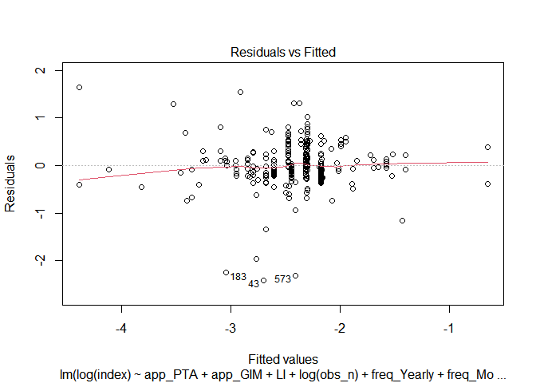
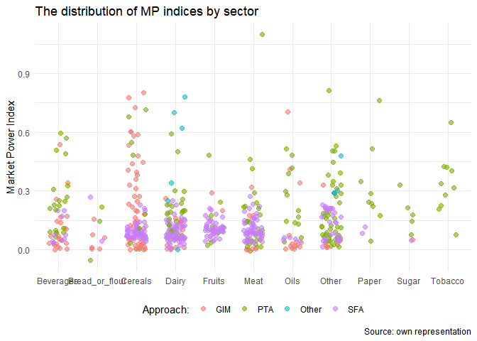
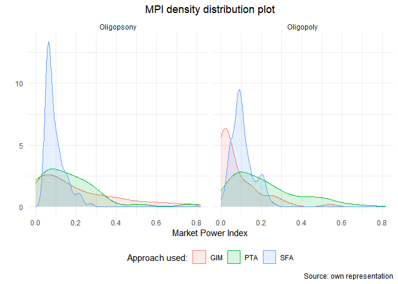

Modeling, Plotting and Regression Tables
================
Mykola Dereva
June 11, 2020

load our cleaned data

``` r
analysis_full <- readRDS(here("data", "clean data", "Analysis_data.Rds"))
```

## Prepare dependent variable

MPI should be in the range between 0 and 1. in out data it is not the
case. there are few values below zero. Let us assume that negative MPI
value indicate no market power. Thus change it to 0. And since we cannot
take a log of 0. we will add small constant. Also there is one
observation higher than 1, I will drop it.

``` r
analysis <- analysis_full %>%
  filter(index < 1,
         # drop observations with conjectural variation
         CV == 0) %>% 
  mutate(index = if_else(index < 0, true = 0, false = index)) %>% 
  mutate(index = index + 0.005)
```

``` r
summary(analysis$index)
```

    ##    Min. 1st Qu.  Median    Mean 3rd Qu.    Max. 
    ##  0.0050  0.0632  0.1067  0.1558  0.1970  0.8200

Number of articles with MP &lt; 0.05

``` r
analysis %>% 
  mutate(low_mp = index < 0.5) %>% 
  group_by(low_mp) %>% 
  count()
```

    ## # A tibble: 2 x 2
    ## # Groups:   low_mp [2]
    ##   low_mp     n
    ##   <lgl>  <int>
    ## 1 FALSE     28
    ## 2 TRUE     550

## Analysis

Select only columns we need for the analysis. Rename columns once again.
And create columns with dummy variables

``` r
glimpse(analysis)
```

    ## Rows: 578
    ## Columns: 44
    ## $ LI                 <int> 0, 0, 0, 0, 0, 0, 0, 1, 1, 1, 0, 0, 0, 0, 0, 0, ...
    ## $ CV                 <int> 0, 0, 0, 0, 0, 0, 0, 0, 0, 0, 0, 0, 0, 0, 0, 0, ...
    ## $ WOS                <int> 1, 1, 1, 1, 1, 1, 1, 1, 1, 1, 1, 0, 0, 1, 1, 1, ...
    ## $ index              <dbl> 0.18100, 0.09400, 0.01600, 0.00800, 0.04184, 0.4...
    ## $ obs_n              <dbl> 60, 60, 60, 60, 24, 24, 24, 24, 24, 24, 22, 23, ...
    ## $ after_2005         <dbl> 1, 1, 1, 1, 0, 0, 0, 0, 0, 0, 0, 0, 0, 0, 0, 0, ...
    ## $ perish             <int> 1, 1, 1, 1, 0, 0, 0, 0, 0, 0, 1, 1, 1, 0, 0, 0, ...
    ## $ mean_pse           <dbl> 37.73444, 37.73444, 37.73444, 37.73444, NaN, NaN...
    ## $ mean_pp            <dbl> 1.352539, 1.352539, 1.352539, 1.352539, NaN, NaN...
    ## $ sfarm_share        <dbl> 19.69004, 19.69004, 19.69004, 19.69004, NaN, NaN...
    ## $ sfarm_share_by_cat <dbl> 8.917172, 8.917172, 8.917172, 8.917172, NaN, NaN...
    ## $ start_business     <dbl> 73.24874, 73.24874, 73.24874, 73.24874, NaN, NaN...
    ## $ edb_index          <dbl> NaN, NaN, NaN, NaN, NaN, NaN, NaN, NaN, NaN, NaN...
    ## $ freq_Daily         <int> 0, 0, 0, 0, 0, 0, 0, 0, 0, 0, 0, 0, 0, 0, 0, 0, ...
    ## $ freq_Monthly       <int> 1, 1, 1, 1, 0, 0, 0, 0, 0, 0, 0, 0, 0, 0, 1, 1, ...
    ## $ freq_Quarterly     <int> 0, 0, 0, 0, 0, 0, 0, 0, 0, 0, 0, 0, 0, 0, 0, 0, ...
    ## $ freq_Weekly        <int> 0, 0, 0, 0, 0, 0, 0, 0, 0, 0, 0, 0, 0, 0, 0, 0, ...
    ## $ freq_Yearly        <int> 0, 0, 0, 0, 1, 1, 1, 1, 1, 1, 1, 1, 1, 1, 0, 0, ...
    ## $ type_Oligopsony    <int> 1, 0, 1, 0, 0, 0, 0, 0, 0, 0, 1, 0, 1, 1, 0, 0, ...
    ## $ type_Oligopoly     <int> 0, 1, 0, 1, 1, 1, 1, 1, 1, 1, 0, 1, 0, 0, 1, 1, ...
    ## $ ind_meat           <int> 1, 1, 1, 1, 0, 0, 0, 0, 0, 0, 1, 1, 1, 0, 0, 0, ...
    ## $ ind_other          <int> 0, 0, 0, 0, 1, 0, 1, 1, 0, 1, 0, 0, 0, 0, 0, 0, ...
    ## $ ind_tobacco        <int> 0, 0, 0, 0, 0, 1, 0, 0, 1, 0, 0, 0, 0, 0, 0, 0, ...
    ## $ ind_paper          <int> 0, 0, 0, 0, 0, 0, 0, 0, 0, 0, 0, 0, 0, 1, 0, 0, ...
    ## $ ind_beverages      <int> 0, 0, 0, 0, 0, 0, 0, 0, 0, 0, 0, 0, 0, 0, 1, 1, ...
    ## $ ind_dairy          <int> 0, 0, 0, 0, 0, 0, 0, 0, 0, 0, 0, 0, 0, 0, 0, 0, ...
    ## $ ind_fruits         <int> 0, 0, 0, 0, 0, 0, 0, 0, 0, 0, 0, 0, 0, 0, 0, 0, ...
    ## $ ind_sugar          <int> 0, 0, 0, 0, 0, 0, 0, 0, 0, 0, 0, 0, 0, 0, 0, 0, ...
    ## $ ind_oils           <int> 0, 0, 0, 0, 0, 0, 0, 0, 0, 0, 0, 0, 0, 0, 0, 0, ...
    ## $ ind_cereals        <int> 0, 0, 0, 0, 0, 0, 0, 0, 0, 0, 0, 0, 0, 0, 0, 0, ...
    ## $ ind_bread_or_flour <int> 0, 0, 0, 0, 0, 0, 0, 0, 0, 0, 0, 0, 0, 0, 0, 0, ...
    ## $ count_europe       <int> 1, 1, 1, 1, 0, 0, 0, 0, 0, 0, 0, 0, 0, 1, 1, 1, ...
    ## $ count_n_america    <int> 0, 0, 0, 0, 1, 1, 1, 1, 1, 1, 1, 1, 1, 0, 0, 0, ...
    ## $ count_other        <int> 0, 0, 0, 0, 0, 0, 0, 0, 0, 0, 0, 0, 0, 0, 0, 0, ...
    ## $ app_GIM            <int> 1, 1, 1, 1, 0, 0, 0, 0, 0, 0, 0, 0, 0, 0, 1, 1, ...
    ## $ app_PTA            <int> 0, 0, 0, 0, 1, 1, 1, 1, 1, 1, 1, 1, 1, 1, 0, 0, ...
    ## $ app_Other          <int> 0, 0, 0, 0, 0, 0, 0, 0, 0, 0, 0, 0, 0, 0, 0, 0, ...
    ## $ app_SFA            <int> 0, 0, 0, 0, 0, 0, 0, 0, 0, 0, 0, 0, 0, 0, 0, 0, ...
    ## $ agg_Country        <int> 1, 1, 1, 1, 1, 1, 1, 1, 1, 1, 1, 1, 1, 1, 1, 1, ...
    ## $ agg_Region         <int> 0, 0, 0, 0, 0, 0, 0, 0, 0, 0, 0, 0, 0, 0, 0, 0, ...
    ## $ agg_Firm           <int> 0, 0, 0, 0, 0, 0, 0, 0, 0, 0, 0, 0, 0, 0, 0, 0, ...
    ## $ agg_World          <int> 0, 0, 0, 0, 0, 0, 0, 0, 0, 0, 0, 0, 0, 0, 0, 0, ...
    ## $ SC_Retail          <int> 1, 1, 1, 1, 0, 0, 0, 0, 0, 0, 0, 0, 0, 0, 1, 1, ...
    ## $ SC_Processor       <int> 0, 0, 0, 0, 1, 1, 1, 1, 1, 1, 1, 1, 1, 1, 0, 0, ...

``` r
analysis %>%
  summarise_all(~ sum(!is.na(.x))) %>%
  gather(column, not_na)
```

    ## # A tibble: 44 x 2
    ##    column      not_na
    ##    <chr>        <int>
    ##  1 LI             578
    ##  2 CV             578
    ##  3 WOS            578
    ##  4 index          578
    ##  5 obs_n          578
    ##  6 after_2005     578
    ##  7 perish         578
    ##  8 mean_pse       548
    ##  9 mean_pp        548
    ## 10 sfarm_share    229
    ## # ... with 34 more rows

``` r
log_lm <- lm(log(index) ~ app_PTA + app_GIM 
             #+ obs_n + I(obs_n^2)
             + LI
             + log(obs_n) 
             + freq_Yearly + freq_Monthly
             #+ freq_Yearly*log(obs_n) 
             + count_n_america + count_europe
             + agg_Firm + agg_Region
             + SC_Processor
             + after_2005 
             + type_Oligopsony 
             + ind_meat + ind_tobacco + ind_beverages + ind_dairy + ind_oils 
             + ind_fruits + ind_cereals + ind_sugar + ind_paper + ind_bread_or_flour
             + perish
             + WOS
             + log(mean_pse)
             
             #+ log(mean_pse)*SC_Processor
             #+ log(mean_pse)*type_Oligopsony
             #+ log(mean_pse)*count_europe
             #+ log(mean_pse)*count_n_america
             #+ log(obs_n)*freq_Yearly
             #+ log(sfarm_share_by_cat)
             #+ log(mean_pp)
             #+ log(mean_pse)*count_n_america
             + log(edb_index)
             #+ sfarm_share
             #+ start_business
                 , 
         data = analysis)

summary(log_lm)
```

    ## 
    ## Call:
    ## lm(formula = log(index) ~ app_PTA + app_GIM + LI + log(obs_n) + 
    ##     freq_Yearly + freq_Monthly + count_n_america + count_europe + 
    ##     agg_Firm + agg_Region + SC_Processor + after_2005 + type_Oligopsony + 
    ##     ind_meat + ind_tobacco + ind_beverages + ind_dairy + ind_oils + 
    ##     ind_fruits + ind_cereals + ind_sugar + ind_paper + ind_bread_or_flour + 
    ##     perish + WOS + log(mean_pse) + log(edb_index), data = analysis)
    ## 
    ## Residuals:
    ##      Min       1Q   Median       3Q      Max 
    ## -2.41438 -0.21020 -0.03543  0.21666  1.64450 
    ## 
    ## Coefficients: (2 not defined because of singularities)
    ##                     Estimate Std. Error t value Pr(>|t|)    
    ## (Intercept)        -4.836542   1.959245  -2.469 0.014211 *  
    ## app_PTA             0.965783   0.296566   3.257 0.001278 ** 
    ## app_GIM            -1.419577   0.315137  -4.505 1.01e-05 ***
    ## LI                 -0.355946   0.166717  -2.135 0.033697 *  
    ## log(obs_n)          0.866066   0.215800   4.013 7.84e-05 ***
    ## freq_Yearly         2.023617   0.653593   3.096 0.002176 ** 
    ## freq_Monthly       -1.163282   0.280893  -4.141 4.68e-05 ***
    ## count_n_america    -1.868880   0.492824  -3.792 0.000186 ***
    ## count_europe       -0.287411   0.173964  -1.652 0.099721 .  
    ## agg_Firm            0.010772   0.283065   0.038 0.969674    
    ## agg_Region         -0.218973   0.352913  -0.620 0.535491    
    ## SC_Processor        0.427454   0.319825   1.337 0.182551    
    ## after_2005                NA         NA      NA       NA    
    ## type_Oligopsony    -0.128721   0.068996  -1.866 0.063224 .  
    ## ind_meat           -0.069696   0.210095  -0.332 0.740359    
    ## ind_tobacco               NA         NA      NA       NA    
    ## ind_beverages      -0.117510   0.191846  -0.613 0.540730    
    ## ind_dairy          -0.373975   0.198308  -1.886 0.060437 .  
    ## ind_oils           -0.165192   0.248718  -0.664 0.507169    
    ## ind_fruits         -0.074061   0.204372  -0.362 0.717362    
    ## ind_cereals        -0.414241   0.152540  -2.716 0.007060 ** 
    ## ind_sugar          -0.276460   0.507096  -0.545 0.586097    
    ## ind_paper           4.435229   1.118379   3.966 9.47e-05 ***
    ## ind_bread_or_flour  0.054023   0.377037   0.143 0.886178    
    ## perish             -0.199824   0.209695  -0.953 0.341515    
    ## WOS                 1.431479   0.150889   9.487  < 2e-16 ***
    ## log(mean_pse)      -0.333221   0.247323  -1.347 0.179057    
    ## log(edb_index)     -0.006543   0.399861  -0.016 0.986957    
    ## ---
    ## Signif. codes:  0 '***' 0.001 '**' 0.01 '*' 0.05 '.' 0.1 ' ' 1
    ## 
    ## Residual standard error: 0.4941 on 259 degrees of freedom
    ##   (293 observations deleted due to missingness)
    ## Multiple R-squared:  0.4802, Adjusted R-squared:   0.43 
    ## F-statistic: 9.571 on 25 and 259 DF,  p-value: < 2.2e-16

``` r
plot(log_lm)
```

    ## Warning: not plotting observations with leverage one:
    ##   256

<!-- --><!-- --><!-- --><!-- -->

seems that we have hetoroscadasticity issue. Lets try to use
heteroscadasticity robust se and to compare it with the regular

``` r
log_lm_se <- vcovHC(log_lm, type = "HC")
log_lm_se <- sqrt(diag(log_lm_se))


stargazer(log_lm, log_lm, se = list(NULL, log_lm_se),
          column.labels = c("default SE", "robust SE"), type = "text",
          omit.stat = c("f", "ser", "n"), align = TRUE)
```

    ## 
    ## ===============================================
    ##                        Dependent variable:     
    ##                    ----------------------------
    ##                             log(index)         
    ##                      default SE     robust SE  
    ##                         (1)            (2)     
    ## -----------------------------------------------
    ## app_PTA               0.966***       0.966**   
    ##                       (0.297)        (0.391)   
    ##                                                
    ## app_GIM              -1.420***      -1.420**   
    ##                       (0.315)        (0.599)   
    ##                                                
    ## LI                    -0.356**       -0.356    
    ##                       (0.167)        (0.241)   
    ##                                                
    ## log(obs_n)            0.866***       0.866**   
    ##                       (0.216)        (0.437)   
    ##                                                
    ## freq_Yearly           2.024***       2.024**   
    ##                       (0.654)        (1.006)   
    ##                                                
    ## freq_Monthly         -1.163***       -1.163*   
    ##                       (0.281)        (0.633)   
    ##                                                
    ## count_n_america      -1.869***      -1.869***  
    ##                       (0.493)        (0.677)   
    ##                                                
    ## count_europe          -0.287*       -0.287**   
    ##                       (0.174)        (0.123)   
    ##                                                
    ## agg_Firm               0.011          0.011    
    ##                       (0.283)        (0.395)   
    ##                                                
    ## agg_Region             -0.219        -0.219    
    ##                       (0.353)        (0.325)   
    ##                                                
    ## SC_Processor           0.427          0.427    
    ##                       (0.320)        (0.808)   
    ##                                                
    ## after_2005                                     
    ##                                                
    ##                                                
    ## type_Oligopsony       -0.129*       -0.129**   
    ##                       (0.069)        (0.065)   
    ##                                                
    ## ind_meat               -0.070        -0.070    
    ##                       (0.210)        (0.180)   
    ##                                                
    ## ind_tobacco                                    
    ##                                                
    ##                                                
    ## ind_beverages          -0.118        -0.118    
    ##                       (0.192)        (0.108)   
    ##                                                
    ## ind_dairy             -0.374*       -0.374**   
    ##                       (0.198)        (0.165)   
    ##                                                
    ## ind_oils               -0.165        -0.165    
    ##                       (0.249)        (0.126)   
    ##                                                
    ## ind_fruits             -0.074        -0.074    
    ##                       (0.204)        (0.164)   
    ##                                                
    ## ind_cereals          -0.414***      -0.414***  
    ##                       (0.153)        (0.134)   
    ##                                                
    ## ind_sugar              -0.276       -0.276**   
    ##                       (0.507)        (0.112)   
    ##                                                
    ## ind_paper             4.435***      4.435***   
    ##                       (1.118)        (1.720)   
    ##                                                
    ## ind_bread_or_flour     0.054          0.054    
    ##                       (0.377)        (0.199)   
    ##                                                
    ## perish                 -0.200        -0.200    
    ##                       (0.210)        (0.176)   
    ##                                                
    ## WOS                   1.431***      1.431***   
    ##                       (0.151)        (0.206)   
    ##                                                
    ## log(mean_pse)          -0.333        -0.333    
    ##                       (0.247)        (0.426)   
    ##                                                
    ## log(edb_index)         -0.007        -0.007    
    ##                       (0.400)        (0.463)   
    ##                                                
    ## Constant              -4.837**      -4.837**   
    ##                       (1.959)        (2.406)   
    ##                                                
    ## -----------------------------------------------
    ## R2                     0.480          0.480    
    ## Adjusted R2            0.430          0.430    
    ## ===============================================
    ## Note:               *p<0.1; **p<0.05; ***p<0.01

``` r
get_robust_se <- function(lm_model)  {
  matrix <- vcovHC(lm_model, type = "HC0")
  robust_se <- sqrt(diag(matrix))
  return(robust_se)
}
```

## Robust Linear Regression

``` r
rlm <- lmrob(formula(log_lm),
               data = analysis,
               setting = "KS2014"
               )
summary(rlm)
```

    ## 
    ## Call:
    ## lmrob(formula = formula(log_lm), data = analysis, setting = "KS2014")
    ##  \--> method = "SMDM"
    ## Residuals:
    ##      Min       1Q   Median       3Q      Max 
    ## -4.22768 -0.18047 -0.04609  0.17128  2.05349 
    ## 
    ## Coefficients: (2 not defined because of singularities)
    ##                     Estimate Std. Error t value Pr(>|t|)    
    ## (Intercept)        -8.150975   1.159441  -7.030 1.83e-11 ***
    ## app_PTA             0.358446   0.183591   1.952 0.051966 .  
    ## app_GIM            -2.407230   0.221532 -10.866  < 2e-16 ***
    ## LI                 -0.043174   0.100141  -0.431 0.666733    
    ## log(obs_n)          1.568219   0.132191  11.863  < 2e-16 ***
    ## freq_Yearly         2.414985   0.383780   6.293 1.32e-09 ***
    ## freq_Monthly       -1.668670   0.175763  -9.494  < 2e-16 ***
    ## count_n_america    -3.056555   0.289000 -10.576  < 2e-16 ***
    ## count_europe       -0.090423   0.096431  -0.938 0.349274    
    ## agg_Firm           -0.637408   0.167931  -3.796 0.000183 ***
    ## agg_Region          0.131924   0.201144   0.656 0.512491    
    ## SC_Processor        1.331861   0.217541   6.122 3.40e-09 ***
    ## after_2005                NA         NA      NA       NA    
    ## type_Oligopsony    -0.206663   0.039696  -5.206 3.93e-07 ***
    ## ind_meat            0.009300   0.117869   0.079 0.937171    
    ## ind_tobacco               NA         NA      NA       NA    
    ## ind_beverages      -0.027481   0.106787  -0.257 0.797118    
    ## ind_dairy          -0.078444   0.110770  -0.708 0.479477    
    ## ind_oils            0.009083   0.138252   0.066 0.947667    
    ## ind_fruits          0.112449   0.113853   0.988 0.324236    
    ## ind_cereals        -0.241303   0.087224  -2.766 0.006075 ** 
    ## ind_sugar          -0.102184   0.278502  -0.367 0.713988    
    ## ind_paper           8.475976   0.678830  12.486  < 2e-16 ***
    ## ind_bread_or_flour  0.104341   0.206894   0.504 0.614465    
    ## perish             -0.195023   0.116667  -1.672 0.095808 .  
    ## WOS                 2.021585   0.093952  21.517  < 2e-16 ***
    ## log(mean_pse)       0.570442   0.159850   3.569 0.000428 ***
    ## log(edb_index)     -0.532272   0.231845  -2.296 0.022486 *  
    ## ---
    ## Signif. codes:  0 '***' 0.001 '**' 0.01 '*' 0.05 '.' 0.1 ' ' 1
    ## 
    ## Robust residual standard error: 0.278 
    ##   (293 observations deleted due to missingness)
    ## Multiple R-squared:  0.771,  Adjusted R-squared:  0.7489 
    ## Convergence in 20 IRWLS iterations
    ## 
    ## Robustness weights: 
    ##  7 observations c(1,2,6,8,14,280,283)
    ##   are outliers with |weight| <= 1.4e-05 ( < 0.00035); 
    ##  207 weights are ~= 1. The remaining 71 ones are summarized as
    ##     Min.  1st Qu.   Median     Mean  3rd Qu.     Max. 
    ## 0.001391 0.678700 0.918700 0.775700 0.975200 0.998900 
    ## Algorithmic parameters: 
    ##       tuning.chi1       tuning.chi2       tuning.chi3       tuning.chi4 
    ##        -5.000e-01         1.500e+00                NA         5.000e-01 
    ##                bb       tuning.psi1       tuning.psi2       tuning.psi3 
    ##         5.000e-01        -5.000e-01         1.500e+00         9.500e-01 
    ##       tuning.psi4        refine.tol           rel.tol         scale.tol 
    ##                NA         1.000e-07         1.000e-07         1.000e-10 
    ##         solve.tol       eps.outlier             eps.x warn.limit.reject 
    ##         1.000e-07         3.509e-04         1.399e-11         5.000e-01 
    ## warn.limit.meanrw 
    ##         5.000e-01 
    ##      nResample         max.it       best.r.s       k.fast.s          k.max 
    ##           1000            500             20              2           2000 
    ##    maxit.scale      trace.lev            mts     compute.rd      numpoints 
    ##            200              0           1000              0             10 
    ## fast.s.large.n 
    ##           2000 
    ##               setting                   psi           subsampling 
    ##              "KS2014"                 "lqq"         "nonsingular" 
    ##                   cov compute.outlier.stats 
    ##             ".vcov.w"                "SMDM" 
    ## seed : int(0)

``` r
plot(rlm)
```

    ## recomputing robust Mahalanobis distances

    ## Warning in robMD(x = if (!is.null(x[["x"]])) x$x else if (!
    ## is.null(x[["model"]])) model.matrix(x, : Failed to compute robust Mahalanobis
    ## distances, reverting to robust leverages.

    ## saving the robust distances 'MD' as part of 'rlm'

<!-- --><!-- --><!-- --><!-- --><!-- -->

# Summary Tables

I will work with dataset “clean” again

``` r
clean <- readRDS(here("data", "clean data", "Full_data.Rds"))
```

First of all lets create column with first author and year to uniquely
identify an article

``` r
clean <- clean %>%
  mutate(article_ref = str_c(
           str_match(authors, pattern = "^\\w[’]*\\w+" ),
           " (", year, ")")
         ) 

head(clean$article_ref, 20)
```

    ##  [1] "Anders (2008)"     "Anders (2008)"     "Anders (2008)"    
    ##  [4] "Anders (2008)"     "Appelbaum (1982)"  "Appelbaum (1982)" 
    ##  [7] "Appelbaum (1982)"  "Appelbaum (1982)"  "Appelbaum (1982)" 
    ## [10] "Appelbaum (1982)"  "Azzam (1997)"      "Azzam (1990)"     
    ## [13] "Azzam (1990)"      "Azzam (1990)"      "Azzam (1990)"     
    ## [16] "Bakucs (2009)"     "Bakucs (2009)"     "Bergman (1995)"   
    ## [19] "Bettendorf (2000)" "Bettendorf (2000)"

summary table of all articles used in analysis

### Table 1. List of studies

``` r
table_1 <- clean %>%
  group_by(article_ref, approach, SC_level, mp_type, data_freq, period) %>%
  summarise(N = n()) %>%
  adorn_totals("row")
```

    ## `summarise()` has grouped output by 'article_ref', 'approach', 'SC_level', 'mp_type', 'data_freq'. You can override using the `.groups` argument.

``` r
head(table_1)
```

    ##       article_ref approach  SC_level    mp_type data_freq    period N
    ##        Ahn (2010)      GIM Processor  Oligopoly    Yearly 1975-2002 1
    ##     Anders (2008)      GIM    Retail Oligopsony   Monthly 1995-2000 2
    ##     Anders (2008)      GIM    Retail  Oligopoly   Monthly 1995-2000 2
    ##  Appelbaum (1982)      PTA Processor  Oligopoly    Yearly 1947–1971 6
    ##      Azzam (1990)      PTA Processor Oligopsony    Yearly 1959-1982 2
    ##      Azzam (1990)      PTA Processor  Oligopoly    Yearly 1959-1982 2

### Table 2. Number of observations by country

``` r
table_2 <-  clean %>%
  mutate(country = as_factor(country) %>%
           fct_infreq() %>%
           fct_lump_min(min = 10) 
         ) %>%
  group_by(country) %>%
  summarise(n = n(), 
            mean_mp = round(mean(mp_index), 4)
            ) %>%
  ungroup() %>%
  mutate(prop = round(n / sum(n) * 100, 2) ) %>%
  select(country, n, prop, mean_mp) %>%
  adorn_totals("row")
```

Visualize the distribution

``` r
clean %>%
    mutate(country = as_factor(country) %>%
           fct_infreq() %>%
           fct_lump_min(min = 10) 
         ) %>%
  ggplot(aes(x = country,
             y = mp_index,
             color = approach)) + 
  geom_jitter(width = 0.25, height = 0, alpha = 0.6, size = 2) +
  theme_minimal() +
  easy_legend_at("bottom") +
  easy_remove_x_axis("title") +
  labs(y = "Market Power Index",
       title = "The distribution of MP indices by country",
       caption = "Source: own representation",
       color = "Approach:") 
```

<!-- -->

### Table 3 Number of observations by sector

``` r
table_3 <- clean %>%
  mutate(industry_fct = fct_infreq(industry_fct) %>%
           fct_relevel("other", after = Inf)
         ) %>%
  group_by(industry_fct) %>%
  summarise(n = n(), 
            mean_mp = round(mean(mp_index), 4)
            ) %>%
  ungroup() %>%
  mutate(prop = round(n / sum(n) * 100, 2),
         industry_fct = str_to_title(industry_fct)) %>%
  select(industry_fct, n, prop, mean_mp) %>%
  adorn_totals("row")
```

Save table

Visualize the distribution

``` r
clean %>%
  ggplot(aes(x = fct_reorder(industry_fct, mp_index, median) %>%
               str_to_sentence(),
             y = mp_index,
             color = approach)) + 
  geom_jitter(width = 0.25, height = 0, alpha = 0.6, size = 2) +
  theme_minimal() +
  easy_legend_at("bottom") +
  easy_remove_x_axis("title") +
  labs(y = "Market Power Index",
       title = "The distribution of MP indices by sector",
       caption = "Source: own representation",
       color = "Approach:") 
```

<!-- --> Save
plot

### Table 4: Number of observations by methodology

``` r
table_4 <- clean %>%
  group_by(approach) %>%
  summarise(n = n(), 
            mean_mp = round(mean(mp_index), 4)
            ) %>%
  ungroup() %>%
  mutate(prop = round(n / sum(n) * 100, 2)) %>%
  select(approach, n, prop, mean_mp) %>%
  adorn_totals("row")
```

``` r
table_4 %>%
  stargazer(type = output,
            style = "aer",
            title = "Summary of MP observations by approach used",
            summary = FALSE, rownames = FALSE,
            out = "Tables/4. List of Methods.doc")
```

    ## 
    ## Summary of MP observations by approach used
    ## ==========================
    ## approach  n  prop  mean_mp
    ## --------------------------
    ## GIM      134 22.83 0.1532 
    ## PTA      173 29.47 0.2172 
    ## Other    11  1.87   0.373 
    ## SFA      269 45.83 0.1024 
    ## Total    587  100  0.8458 
    ## --------------------------

### Table 5: List of observarion frequency

``` r
table_5 <- clean %>%
  group_by(data_freq) %>%
  summarise(n = n(), 
            mean_mp = round(mean(mp_index), 4)
            ) %>%
  ungroup() %>%
  mutate(prop = round(n / sum(n) * 100, 2)) %>%
  select(data_freq, n, prop, mean_mp) %>%
  arrange(-n) %>%
  adorn_totals("row")
```

``` r
table_5 %>%
  stargazer(type = output,
            style = "aer",
            title = "Summary of MP observations by frequency",
            summary = FALSE, rownames = FALSE,
            out = "Tables/5. List of observarion frequency.doc")
```

    ## 
    ## Summary of MP observations by frequency
    ## ===========================
    ## data_freq  n  prop  mean_mp
    ## ---------------------------
    ## Yearly    524 89.27 0.1563 
    ## Monthly   50  8.52   0.113 
    ## Quarterly 10   1.7  0.1851 
    ## Weekly     2  0.34  0.0155 
    ## Daily      1  0.17  0.3198 
    ## Total     587  100  0.7897 
    ## ---------------------------

### Table 6: Discriptive statistics of variables

### Table 8: Methods comparison

``` r
clean %>%
  filter(approach != "Other",
         mp_index < 1, 
         mp_index > 0) %>% 
  ggplot(aes(x = n_of_obs, y = mp_index, color = approach)) +
  geom_point(size = 4, alpha = 0.8, shape = 1) +
  scale_x_continuous(trans = "log10") +
  theme_minimal() +
  easy_move_legend(to = "bottom") +
    labs(x = "Number of observations (log10)",
         y = "Market Power Index",
         title = "Relationship between MP index and number of observations \nused in a study",
         caption = "Source: own representation") +
  easy_add_legend_title("Approach used:")
```

<!-- -->

``` r
clean %>%
  filter(approach != "Other",
         mp_index < 1, 
         mp_index > 0) %>% 
  ggplot(aes(x = mp_index, colour = approach, fill = approach)) +
  geom_density(alpha = 0.15) +
  theme_minimal() +
  easy_move_legend(to = "bottom") +
    labs(x = "Market Power Index",
         y = "",
         title = "MPI density distribution plot",
         caption = "Source: own representation") +
  easy_add_legend_title("Approach used:") +
  facet_wrap( ~ mp_type) +
  theme(plot.title = element_text(hjust = 0.5))
```

<!-- -->

## Table conference Rajske Teplice

``` r
model_1 <- lm(log(index) ~ app_PTA + app_GIM +
               after_2005 + type_Oligopsony, 
         data = analysis)
se_1 <- get_robust_se(model_1)

model_2 <- lm(update(formula(model_1), ~ . +
                       log(obs_n) + freq_Yearly +
                       count_n_america + count_europe),

         data = analysis)
se_2 <- get_robust_se(model_2)


model_3 <- lm(update(formula(model_2), ~ . +
               ind_meat + ind_tobacco + ind_beverages + ind_dairy + ind_oils +
               ind_fruits + ind_cereals), 
         data = analysis)
se_3 <- get_robust_se(model_3)


model_4 <- lm(update(formula(model_3), ~ . +
                       perish),
                       data = analysis)
se_4 <- get_robust_se(model_4)

model_5 <- MASS::rlm(formula(model_4),
                     data = analysis,
                     maxit = 100,
                     psi = "psi.bisquare")
se_5 <- get_robust_se(model_5)

ind.var.names <- c("Intercept", "PTA", "GIM", "After 2005", "Oligopsony",
                   "Obs. Num. (log)", "Yearly", "USA", "Europe",
                   "Meat", "Tobacco", "Beverages", "Dairy", "Oils", "Fruits",
                   "Cereals", "Perishable")

stargazer(model_1, model_2, model_3, model_4, model_5,
          type = output,
          style = "io",
          title = "Regression Results",
          dep.var.labels = "Market Power Index (log)",
          covariate.labels = ind.var.names,
          dep.var.labels.include = FALSE,
          omit.stat = c("adj.rsq"),
          se = list(se_1, se_2, se_3, se_4, se_5),      #  Robust se
          align = TRUE,
          df = FALSE,
          intercept.bottom = FALSE,
          star.cutoffs = c(0.05, 0.01, 0.001),
          out = "Tables/Regression Table Teplice.doc"
          )
```

    ## 
    ## Regression Results
    ## -------------------------------------------------------------------------
    ##                            OLS       OLS       OLS       OLS     robust  
    ##                                                                  linear  
    ##                            (1)       (2)       (3)       (4)       (5)   
    ## -------------------------------------------------------------------------
    ## Intercept               -2.075***  -0.142    -0.305    -0.301     0.052  
    ##                          (0.165)   (0.585)   (0.575)   (0.577)   (0.425) 
    ## PTA                       0.223     0.118     0.107     0.107     0.291  
    ##                          (0.161)   (0.194)   (0.194)   (0.195)   (0.161) 
    ## GIM                     -0.415**   -0.454*   -0.492*   -0.492*   -0.220  
    ##                          (0.138)   (0.230)   (0.233)   (0.233)   (0.188) 
    ## After 2005               -0.308    -0.305    -0.298    -0.297    -0.228  
    ##                          (0.173)   (0.190)   (0.199)   (0.200)   (0.167) 
    ## Oligopsony               0.175*    0.220*    0.230*    0.230*    0.136*  
    ##                          (0.089)   (0.097)   (0.095)   (0.095)   (0.068) 
    ## Obs. Num. (log)                   -0.478*** -0.453*** -0.453*** -0.601***
    ##                                    (0.114)   (0.115)   (0.115)   (0.075) 
    ## Yearly                            -0.637**  -0.639**  -0.640**  -0.733***
    ##                                    (0.226)   (0.225)   (0.226)   (0.195) 
    ## USA                                 0.294     0.334     0.332    0.441** 
    ##                                    (0.220)   (0.219)   (0.221)   (0.155) 
    ## Europe                             -0.288    -0.275    -0.275    -0.170  
    ##                                    (0.186)   (0.184)   (0.184)   (0.131) 
    ## Meat                                         -0.046    -0.029     0.060  
    ##                                              (0.127)   (0.172)   (0.170) 
    ## Tobacco                                      0.629**   0.628**   0.526*  
    ##                                              (0.214)   (0.215)   (0.206) 
    ## Beverages                                     0.131     0.129     0.083  
    ##                                              (0.152)   (0.155)   (0.132) 
    ## Dairy                                         0.073     0.089     0.131  
    ##                                              (0.127)   (0.163)   (0.164) 
    ## Oils                                         -0.171    -0.174    -0.357  
    ##                                              (0.200)   (0.201)   (0.183) 
    ## Fruits                                        0.101     0.115     0.146  
    ##                                              (0.127)   (0.165)   (0.164) 
    ## Cereals                                       0.249     0.245     0.180  
    ##                                              (0.142)   (0.150)   (0.127) 
    ## Perishable                                             -0.021    -0.104  
    ##                                                        (0.164)   (0.161) 
    ## Observations               578       578       578       578       578   
    ## R-squared                 0.094     0.151     0.170     0.170            
    ## Residual standard error   0.910     0.884     0.879     0.880     0.721  
    ## F statistic             14.795*** 12.624*** 7.671***  7.180***           
    ## -------------------------------------------------------------------------
    ## Notes:                  ***p < .001; **p < .01; *p < .05

### Table for Journal

``` r
set.seed(42)

model_1 <- lmrob(log(index) ~ app_PTA + app_GIM 
                 + log(obs_n) + freq_Yearly + freq_Monthly
                 + count_n_america + count_europe
                 + agg_Firm + agg_Region
                 + SC_Processor
                 + type_Oligopoly
                 + WOS + LI
                 + after_2005 + perish,
                 data = analysis,
                 setting = "KS2014")

model_2 <- lmrob(update(formula(model_1), ~ . +
            + ind_meat + ind_tobacco + ind_beverages
            + ind_dairy + ind_oils + ind_fruits
            + ind_cereals + ind_sugar + ind_paper
            + ind_bread_or_flour),
             data = analysis,
                 setting = "KS2014")

model_3 <- lmrob(update(formula(model_2), ~ . +
            + log(mean_pse)),
             data = analysis,
                 setting = "KS2014")

model_4 <- lmrob(update(formula(model_2), ~ . +
            + log(mean_pse)*type_Oligopoly
            + log(mean_pse)*count_europe
            + log(mean_pse)*count_n_america
            + log(obs_n)*freq_Yearly
            ),
             data = analysis,
                 setting = "KS2014")

model_5 <- lmrob(update(formula(model_2), ~ .
            + log(sfarm_share_by_cat) + log(mean_pse)
            ),
             data = analysis,
                 setting = "KS2014")
```

    ## Warning in outlierStats(ret, x, control): Detected possible local breakdown of
    ## SMDM-estimate in 2 coefficients 'freq_Monthly', 'WOS'.

``` r
model_6 <- lmrob(update(formula(model_3), ~ .
            + log(edb_index)
            ),
             data = analysis,
                 setting = "KS2014")


stargazer(model_1, model_2, model_3, model_4, model_5, model_6,
          type = "text",
          style = "io",
          title = "Regression Results",
          dep.var.labels = "Market Power Index (log)",
          #covariate.labels = ind.var.names,
          dep.var.labels.include = FALSE,
          align = TRUE,
          df = FALSE,
          digits = 2,
          omit = "ind_",
          add.lines = list(c("Industry dummies", "No", "Yes", "Yes", "Yes",
                             "Yes", "Yes")),
          intercept.bottom = FALSE,
          star.cutoffs = c(0.05, 0.01, 0.001)
          #,out = "Tables/Regression Table Journal.doc"
          )
```

    ## 
    ## Regression Results
    ## -----------------------------------------------------------------------------------
    ##                                 (1)      (2)      (3)      (4)      (5)      (6)   
    ## -----------------------------------------------------------------------------------
    ## CONSTANT                       -0.04    -0.21    -0.001    0.18     1.66   -8.33***
    ##                                (0.58)   (0.58)   (0.73)   (0.69)   (7.58)   (1.18) 
    ## APP_PTA                        0.63**   0.55**  0.84***  0.95***    1.83     0.35  
    ##                                (0.20)   (0.20)   (0.21)   (0.20)   (0.94)   (0.19) 
    ## APP_GIM                        -0.22    -0.22    -0.37    -0.50*  -2.01*** -2.41***
    ##                                (0.27)   (0.27)   (0.27)   (0.25)   (0.39)   (0.22) 
    ## LOG(OBS_N)                    -0.63*** -0.68*** -0.80*** -0.93***  -4.47   1.57*** 
    ##                                (0.12)   (0.12)   (0.12)   (0.14)   (2.42)   (0.13) 
    ## FREQ_YEARLY                    -0.14    -0.04     0.11    -1.99*   -5.80*  2.41*** 
    ##                                (0.29)   (0.29)   (0.30)   (0.87)   (2.75)   (0.39) 
    ## FREQ_MONTHLY                   0.62*    0.75*   1.07***  1.02***   3.45**  -1.67***
    ##                                (0.30)   (0.30)   (0.31)   (0.30)   (1.16)   (0.18) 
    ## COUNT_N_AMERICA                 0.31     0.35    0.46*   -6.35***          -3.06***
    ##                                (0.19)   (0.19)   (0.21)   (1.74)            (0.29) 
    ## COUNT_EUROPE                   -0.27    -0.30    -0.31   5.82***   -0.12    -0.09  
    ##                                (0.16)   (0.16)   (0.22)   (1.40)   (0.11)   (0.10) 
    ## AGG_FIRM                        0.25     0.13     0.34    0.65**           -0.64***
    ##                                (0.21)   (0.21)   (0.20)   (0.23)            (0.17) 
    ## AGG_REGION                     -0.09    -0.18    -0.07     0.26              0.13  
    ##                                (0.22)   (0.23)   (0.22)   (0.22)            (0.20) 
    ## SC_PROCESSOR                   -0.68*  -0.68**  -1.21*** -1.70***   1.75   1.33*** 
    ##                                (0.26)   (0.26)   (0.30)   (0.29)   (1.74)   (0.22) 
    ## TYPE_OLIGOPOLY                 -0.21*   -0.19*   -0.21*  -4.65*** 0.18***  0.21*** 
    ##                                (0.08)   (0.08)   (0.08)   (0.48)   (0.04)   (0.04) 
    ## WOS                             0.04     0.08    0.21*   0.59***    2.18   2.02*** 
    ##                                (0.10)   (0.10)   (0.10)   (0.11)   (2.89)   (0.10) 
    ## LI                            0.39***  0.45***  0.59***  0.91***   -0.14    -0.04  
    ##                                (0.09)   (0.09)   (0.09)   (0.10)   (0.21)   (0.10) 
    ## AFTER_2005                      0.08     0.06     0.33   1.09***                   
    ##                                (0.19)   (0.19)   (0.21)   (0.21)                   
    ## PERISH                         -0.05     0.12     0.10     0.14   -2.66**   -0.20  
    ##                                (0.08)   (0.17)   (0.16)   (0.15)   (0.82)   (0.12) 
    ## LOG(SFARM_SHARE_BY_CAT)                                             0.03           
    ##                                                                    (0.02)          
    ## LOG(MEAN_PSE)                                     0.01    -0.02   3.75***  0.57*** 
    ##                                                  (0.11)   (0.12)   (0.89)   (0.16) 
    ## TYPE_OLIGOPOLY:LOG(MEAN_PSE)                             1.39***                   
    ##                                                           (0.15)                   
    ## COUNT_EUROPE:LOG(MEAN_PSE)                               -1.80***                  
    ##                                                           (0.41)                   
    ## COUNT_N_AMERICA:LOG(MEAN_PSE)                            2.26***                   
    ##                                                           (0.57)                   
    ## LOG(OBS_N):FREQ_YEARLY                                    0.70**                   
    ##                                                           (0.25)                   
    ## LOG(EDB_INDEX)                                                              -0.53* 
    ##                                                                             (0.23) 
    ## Industry dummies                 No      Yes      Yes      Yes      Yes      Yes   
    ## Observations                    578      578      548      548      215      285   
    ## R-squared                       0.24     0.28     0.34     0.46     0.57     0.77  
    ## Adjusted R-squared              0.22     0.25     0.31     0.42     0.53     0.75  
    ## Residual standard error         0.78     0.77     0.71     0.65     0.30     0.28  
    ## -----------------------------------------------------------------------------------
    ## Notes:                        ***p < .001; **p < .01; *p < .05
