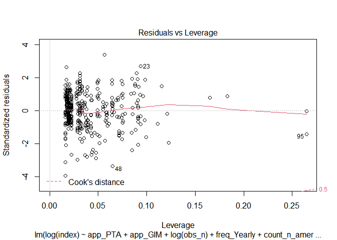

Modeling, Plotting and Regression Tables
================
Mykola Dereva
June 11, 2020

load our cleaned data

``` r
analysis_full <- readRDS(here("data", "clean data", "Analysis_data.Rds"))
```

## Remove Outliers

lets look on the possible outliers

There are few MP values which are considerable higher or lower then
other. This might influence the reliability of research. Thus, I will
drop them

``` r
analysis <- analysis_full %>%
  filter(between(index, 0.005, 0.52))
```

## Analysis

Select only columns we need for the analysis. Rename columns once again.
And create columns with dummy variables

``` r
glimpse(analysis)
```

    ## Rows: 204
    ## Columns: 26
    ## $ index           <dbl> 0.17600, 0.08900, 0.01100, 0.03684, 0.40190, 0.2230...
    ## $ obs_n           <dbl> 60, 60, 60, 24, 24, 23, 23, 120, 108, 28, 48, 15, 1...
    ## $ after_2005      <dbl> 1, 1, 1, 0, 0, 0, 0, 1, 1, 0, 0, 0, 0, 0, 0, 0, 0, ...
    ## $ perish          <dbl> 1, 1, 1, 0, 0, 1, 0, 1, 1, 0, 0, 0, 0, 0, 0, 1, 1, ...
    ## $ mean_pse        <dbl> 34.73444, 34.73444, 34.73444, NaN, NaN, NaN, NaN, 3...
    ## $ mean_pp         <dbl> 1.352539, 1.352539, 1.352539, NaN, NaN, NaN, NaN, 1...
    ## $ sfarm_share     <dbl> 19.69004, 19.69004, 19.69004, NaN, NaN, NaN, NaN, 1...
    ## $ start_business  <dbl> 73.24874, 73.24874, 73.24874, NaN, NaN, NaN, NaN, 7...
    ## $ freq_Monthly    <int> 1, 1, 1, 0, 0, 0, 0, 1, 1, 0, 1, 0, 0, 0, 0, 0, 0, ...
    ## $ freq_Yearly     <int> 0, 0, 0, 1, 1, 1, 1, 0, 0, 1, 0, 1, 1, 1, 1, 1, 1, ...
    ## $ freq_Quaterly   <int> 0, 0, 0, 0, 0, 0, 0, 0, 0, 0, 0, 0, 0, 0, 0, 0, 0, ...
    ## $ freq_Weekly     <int> 0, 0, 0, 0, 0, 0, 0, 0, 0, 0, 0, 0, 0, 0, 0, 0, 0, ...
    ## $ type_Oligopsony <int> 1, 0, 1, 0, 0, 0, 1, 1, 1, 1, 0, 0, 0, 0, 0, 0, 0, ...
    ## $ type_Oligopoly  <int> 0, 1, 0, 1, 1, 1, 0, 0, 0, 0, 1, 1, 1, 1, 1, 1, 1, ...
    ## $ ind_meat        <int> 1, 1, 1, 0, 0, 1, 1, 1, 1, 0, 0, 0, 0, 0, 0, 1, 0, ...
    ## $ ind_beverages   <int> 0, 0, 0, 0, 0, 0, 0, 0, 0, 0, 1, 0, 0, 0, 0, 0, 0, ...
    ## $ ind_cereals     <int> 0, 0, 0, 0, 0, 0, 0, 0, 0, 0, 0, 0, 0, 0, 0, 0, 0, ...
    ## $ ind_dairy       <int> 0, 0, 0, 0, 0, 0, 0, 0, 0, 0, 0, 0, 0, 0, 0, 0, 0, ...
    ## $ ind_oils        <int> 0, 0, 0, 0, 0, 0, 0, 0, 0, 0, 0, 0, 0, 0, 0, 0, 0, ...
    ## $ ind_other       <int> 0, 0, 0, 1, 1, 0, 0, 0, 0, 1, 0, 1, 1, 1, 1, 0, 1, ...
    ## $ count_europe    <int> 1, 1, 1, 0, 0, 0, 0, 1, 1, 1, 1, 0, 0, 0, 0, 0, 0, ...
    ## $ count_n_america <int> 0, 0, 0, 1, 1, 1, 1, 0, 0, 0, 0, 1, 1, 1, 1, 1, 1, ...
    ## $ count_other     <int> 0, 0, 0, 0, 0, 0, 0, 0, 0, 0, 0, 0, 0, 0, 0, 0, 0, ...
    ## $ app_GIM         <int> 1, 1, 1, 0, 0, 0, 0, 0, 0, 0, 1, 0, 0, 0, 0, 0, 0, ...
    ## $ app_PTA         <int> 0, 0, 0, 1, 1, 1, 1, 1, 1, 1, 0, 1, 1, 1, 1, 1, 1, ...
    ## $ app_SFA         <int> 0, 0, 0, 0, 0, 0, 0, 0, 0, 0, 0, 0, 0, 0, 0, 0, 0, ...

``` r
analysis %>%
  summarise_all(funs(sum(is.na(.)))) %>%
  gather(column, n_na)
```

    ## Warning: `funs()` is deprecated as of dplyr 0.8.0.
    ## Please use a list of either functions or lambdas: 
    ## 
    ##   # Simple named list: 
    ##   list(mean = mean, median = median)
    ## 
    ##   # Auto named with `tibble::lst()`: 
    ##   tibble::lst(mean, median)
    ## 
    ##   # Using lambdas
    ##   list(~ mean(., trim = .2), ~ median(., na.rm = TRUE))
    ## This warning is displayed once every 8 hours.
    ## Call `lifecycle::last_warnings()` to see where this warning was generated.

    ## # A tibble: 26 x 2
    ##    column          n_na
    ##    <chr>          <int>
    ##  1 index              0
    ##  2 obs_n              0
    ##  3 after_2005         0
    ##  4 perish             0
    ##  5 mean_pse           9
    ##  6 mean_pp            9
    ##  7 sfarm_share      165
    ##  8 start_business    82
    ##  9 freq_Monthly       0
    ## 10 freq_Yearly        0
    ## # ... with 16 more rows

``` r
log_lm <- lm(log(index) ~ app_PTA + app_GIM +
                 obs_n + 
                 freq_Yearly +
                 count_n_america +
                 after_2005 +
                 type_Oligopsony +
                 ind_dairy + ind_meat + ind_cereals + ind_beverages + ind_oils +
                 #perish +
                 #start_business +
                 log(mean_pp) + log(mean_pse), 
         data=analysis, subset = mean_pp < 2)
```

    ## Warning in log(mean_pse): NaNs produced

``` r
summary(log_lm)
```

    ## 
    ## Call:
    ## lm(formula = log(index) ~ app_PTA + app_GIM + obs_n + freq_Yearly + 
    ##     count_n_america + after_2005 + type_Oligopsony + ind_dairy + 
    ##     ind_meat + ind_cereals + ind_beverages + ind_oils + log(mean_pp) + 
    ##     log(mean_pse), data = analysis, subset = mean_pp < 2)
    ## 
    ## Residuals:
    ##      Min       1Q   Median       3Q      Max 
    ## -2.50418 -0.37255  0.09044  0.38960  1.80279 
    ## 
    ## Coefficients:
    ##                  Estimate Std. Error t value Pr(>|t|)    
    ## (Intercept)     -4.544812   0.778272  -5.840 2.71e-08 ***
    ## app_PTA         -0.142174   0.257927  -0.551 0.582230    
    ## app_GIM         -0.712540   0.272785  -2.612 0.009829 ** 
    ## obs_n           -0.006678   0.002169  -3.079 0.002436 ** 
    ## freq_Yearly     -0.439278   0.263275  -1.669 0.097111 .  
    ## count_n_america  1.010228   0.241265   4.187 4.59e-05 ***
    ## after_2005       0.214198   0.282662   0.758 0.449659    
    ## type_Oligopsony  0.372228   0.163218   2.281 0.023854 *  
    ## ind_dairy        0.084980   0.193487   0.439 0.661088    
    ## ind_meat        -0.477320   0.225696  -2.115 0.035942 *  
    ## ind_cereals      1.170714   0.227067   5.156 7.16e-07 ***
    ## ind_beverages    0.154909   0.191624   0.808 0.420026    
    ## ind_oils         0.095145   0.246642   0.386 0.700170    
    ## log(mean_pp)    -0.737798   1.088149  -0.678 0.498702    
    ## log(mean_pse)    0.812663   0.216572   3.752 0.000242 ***
    ## ---
    ## Signif. codes:  0 '***' 0.001 '**' 0.01 '*' 0.05 '.' 0.1 ' ' 1
    ## 
    ## Residual standard error: 0.7011 on 165 degrees of freedom
    ##   (20 observations deleted due to missingness)
    ## Multiple R-squared:  0.4739, Adjusted R-squared:  0.4292 
    ## F-statistic: 10.62 on 14 and 165 DF,  p-value: < 2.2e-16

``` r
bptest(log_lm)
```

    ## 
    ##  studentized Breusch-Pagan test
    ## 
    ## data:  log_lm
    ## BP = 26.7, df = 14, p-value = 0.02105

``` r
plot(log_lm)
```

<!-- --><!-- --><!-- --><!-- -->

seems that we have hetoroscadasticity issue. Lets try to use
heteroscadasticity robust se and to compare it with the regular

``` r
log_lm_se <- vcovHC(log_lm, type = "HC")
log_lm_se <- sqrt(diag(log_lm_se))
log_lm_se
```

    ##     (Intercept)         app_PTA         app_GIM           obs_n     freq_Yearly 
    ##     0.591643232     0.224851265     0.266966091     0.001888141     0.218862956 
    ## count_n_america      after_2005 type_Oligopsony       ind_dairy        ind_meat 
    ##     0.167634066     0.248067684     0.198130235     0.136126488     0.241240509 
    ##     ind_cereals   ind_beverages        ind_oils    log(mean_pp)   log(mean_pse) 
    ##     0.256717641     0.178501371     0.252938473     0.898036498     0.172528557

``` r
stargazer(log_lm, log_lm, se=list(NULL, log_lm_se),
          column.labels=c("default SE","robust SE"), type = "text",
          omit.stat=c("f", "ser", "n"), align = TRUE)
```

    ## 
    ## ============================================
    ##                     Dependent variable:     
    ##                 ----------------------------
    ##                          log(index)         
    ##                   default SE     robust SE  
    ##                      (1)            (2)     
    ## --------------------------------------------
    ## app_PTA             -0.142        -0.142    
    ##                    (0.258)        (0.225)   
    ##                                             
    ## app_GIM           -0.713***      -0.713***  
    ##                    (0.273)        (0.267)   
    ##                                             
    ## obs_n             -0.007***      -0.007***  
    ##                    (0.002)        (0.002)   
    ##                                             
    ## freq_Yearly        -0.439*       -0.439**   
    ##                    (0.263)        (0.219)   
    ##                                             
    ## count_n_america    1.010***      1.010***   
    ##                    (0.241)        (0.168)   
    ##                                             
    ## after_2005          0.214          0.214    
    ##                    (0.283)        (0.248)   
    ##                                             
    ## type_Oligopsony    0.372**        0.372*    
    ##                    (0.163)        (0.198)   
    ##                                             
    ## ind_dairy           0.085          0.085    
    ##                    (0.193)        (0.136)   
    ##                                             
    ## ind_meat           -0.477**      -0.477**   
    ##                    (0.226)        (0.241)   
    ##                                             
    ## ind_cereals        1.171***      1.171***   
    ##                    (0.227)        (0.257)   
    ##                                             
    ## ind_beverages       0.155          0.155    
    ##                    (0.192)        (0.179)   
    ##                                             
    ## ind_oils            0.095          0.095    
    ##                    (0.247)        (0.253)   
    ##                                             
    ## log(mean_pp)        -0.738        -0.738    
    ##                    (1.088)        (0.898)   
    ##                                             
    ## log(mean_pse)      0.813***      0.813***   
    ##                    (0.217)        (0.173)   
    ##                                             
    ## Constant          -4.545***      -4.545***  
    ##                    (0.778)        (0.592)   
    ##                                             
    ## --------------------------------------------
    ## R2                  0.474          0.474    
    ## Adjusted R2         0.429          0.429    
    ## ============================================
    ## Note:            *p<0.1; **p<0.05; ***p<0.01

#### Without Log transformation

``` r
lm <- lm(index ~ app_PTA + app_GIM +
                 obs_n + 
                 freq_Yearly +
                 count_n_america +
                 after_2005 +
                 type_Oligopsony +
                 ind_dairy + ind_meat + ind_cereals + ind_beverages + ind_oils +
                 #perish +
                 #start_business +
                 log(mean_pp) + log(mean_pse), 
         data=analysis)
```

    ## Warning in log(mean_pse): NaNs produced

``` r
summary(lm)
```

    ## 
    ## Call:
    ## lm(formula = index ~ app_PTA + app_GIM + obs_n + freq_Yearly + 
    ##     count_n_america + after_2005 + type_Oligopsony + ind_dairy + 
    ##     ind_meat + ind_cereals + ind_beverages + ind_oils + log(mean_pp) + 
    ##     log(mean_pse), data = analysis)
    ## 
    ## Residuals:
    ##      Min       1Q   Median       3Q      Max 
    ## -0.18865 -0.05271 -0.00612  0.03341  0.32853 
    ## 
    ## Coefficients:
    ##                   Estimate Std. Error t value Pr(>|t|)    
    ## (Intercept)     -0.1461201  0.0928900  -1.573  0.11758    
    ## app_PTA          0.0629493  0.0309933   2.031  0.04382 *  
    ## app_GIM          0.0081953  0.0309182   0.265  0.79128    
    ## obs_n           -0.0007485  0.0002620  -2.857  0.00481 ** 
    ## freq_Yearly     -0.0289888  0.0321475  -0.902  0.36848    
    ## count_n_america  0.1261249  0.0228186   5.527 1.21e-07 ***
    ## after_2005       0.0896936  0.0314748   2.850  0.00492 ** 
    ## type_Oligopsony  0.0167305  0.0198565   0.843  0.40066    
    ## ind_dairy       -0.0010960  0.0221453  -0.049  0.96059    
    ## ind_meat        -0.0706324  0.0276145  -2.558  0.01141 *  
    ## ind_cereals      0.0618997  0.0277642   2.229  0.02710 *  
    ## ind_beverages    0.0077618  0.0233101   0.333  0.73956    
    ## ind_oils         0.0167686  0.0302375   0.555  0.57993    
    ## log(mean_pp)     0.0047332  0.0568814   0.083  0.93378    
    ## log(mean_pse)    0.0636000  0.0235549   2.700  0.00764 ** 
    ## ---
    ## Signif. codes:  0 '***' 0.001 '**' 0.01 '*' 0.05 '.' 0.1 ' ' 1
    ## 
    ## Residual standard error: 0.08605 on 169 degrees of freedom
    ##   (20 observations deleted due to missingness)
    ## Multiple R-squared:  0.3352, Adjusted R-squared:  0.2802 
    ## F-statistic: 6.087 on 14 and 169 DF,  p-value: 1.097e-09

``` r
bptest(lm)
```

    ## 
    ##  studentized Breusch-Pagan test
    ## 
    ## data:  lm
    ## BP = 30.251, df = 14, p-value = 0.007047

``` r
plot(lm)
```

<!-- --><!-- --><!-- --><!-- -->

``` r
get_robust_se <- function(lm_model)  {
  matrix <- vcovHC(lm_model, type = "HC0")
  robust_se <- sqrt(diag(matrix))
  return(robust_se)
}

get_robust_se(lm)
```

    ##     (Intercept)         app_PTA         app_GIM           obs_n     freq_Yearly 
    ##    0.0832561958    0.0279698363    0.0256550882    0.0001692807    0.0225861138 
    ## count_n_america      after_2005 type_Oligopsony       ind_dairy        ind_meat 
    ##    0.0233778242    0.0329252774    0.0168725224    0.0182438509    0.0219074098 
    ##     ind_cereals   ind_beverages        ind_oils    log(mean_pp)   log(mean_pse) 
    ##    0.0218831636    0.0226658134    0.0459610160    0.0481863338    0.0162973882

### Tobit model

``` r
library(censReg)
```

``` r
tobit <- censReg(index ~ app_PTA + app_GIM +
                 obs_n + 
                 freq_Yearly +
                 type_Oligopoly +
                 count_n_america +
                 after_2005 +
                 ind_dairy + ind_meat + ind_cereals + ind_beverages + ind_oils +
                 #perish +
                 #start_business +
                 log(mean_pp) + log(mean_pse),
                 data = analysis_full)
```

    ## Warning in log(mean_pse): NaNs produced

    ## Warning in censReg(index ~ app_PTA + app_GIM + obs_n + freq_Yearly +
    ## type_Oligopoly + : at least one value of the endogenous variable is smaller than
    ## the left limit

``` r
summary(tobit)
```

    ## 
    ## Call:
    ## censReg(formula = index ~ app_PTA + app_GIM + obs_n + freq_Yearly + 
    ##     type_Oligopoly + count_n_america + after_2005 + ind_dairy + 
    ##     ind_meat + ind_cereals + ind_beverages + ind_oils + log(mean_pp) + 
    ##     log(mean_pse), data = analysis_full)
    ## 
    ## Observations:
    ##          Total  Left-censored     Uncensored Right-censored 
    ##            199              2            197              0 
    ## 
    ## Coefficients:
    ##                   Estimate Std. error t value  Pr(> t)    
    ## (Intercept)     -0.0670365  0.1087951  -0.616 0.537781    
    ## app_PTA          0.0810573  0.0353809   2.291 0.021964 *  
    ## app_GIM         -0.0080378  0.0345735  -0.232 0.816161    
    ## obs_n           -0.0010758  0.0002922  -3.682 0.000231 ***
    ## freq_Yearly     -0.0778732  0.0350073  -2.224 0.026116 *  
    ## type_Oligopoly  -0.0251159  0.0216122  -1.162 0.245187    
    ## count_n_america  0.1600113  0.0252493   6.337 2.34e-10 ***
    ## after_2005       0.1054831  0.0353324   2.985 0.002832 ** 
    ## ind_dairy        0.0030248  0.0252927   0.120 0.904807    
    ## ind_meat        -0.0836950  0.0310105  -2.699 0.006956 ** 
    ## ind_cereals      0.0710292  0.0296647   2.394 0.016647 *  
    ## ind_beverages    0.0107931  0.0269433   0.401 0.688724    
    ## ind_oils         0.0134213  0.0340631   0.394 0.693572    
    ## log(mean_pp)     0.0319535  0.0661708   0.483 0.629171    
    ## log(mean_pse)    0.0502870  0.0269438   1.866 0.061990 .  
    ## logSigma        -2.2918161  0.0504712 -45.408  < 2e-16 ***
    ## ---
    ## Signif. codes:  0 '***' 0.001 '**' 0.01 '*' 0.05 '.' 0.1 ' ' 1
    ## 
    ## Newton-Raphson maximisation, 9 iterations
    ## Return code 1: gradient close to zero
    ## Log-likelihood: 169.8731 on 16 Df

``` r
model_1 <- lm(log(index) ~ app_PTA + app_GIM + type_Oligopoly, 
                        data=analysis)
se_1 <- get_robust_se(model_1)

model_2 <- lm(log(index) ~ app_PTA + app_GIM +
                type_Oligopoly +
                after_2005 + 
                freq_Yearly +
                count_n_america + count_europe, 
         data=analysis)
se_2 <- get_robust_se(model_2)

model_3 <- lm(log(index) ~ app_PTA + app_GIM +
                type_Oligopoly +
                obs_n + after_2005 + 
                freq_Yearly + 
                count_n_america + count_europe +
                ind_dairy + ind_meat + ind_beverages + ind_cereals + ind_oils, 
         data=analysis)
se_3 <- get_robust_se(model_3)


model_4 <- lm(log(index) ~ app_PTA + app_GIM +
                type_Oligopoly +
                obs_n + 
                count_n_america +
                ind_dairy + ind_meat + ind_beverages + ind_cereals + ind_oils +
                log(mean_pp) + log(mean_pse), 
         data=analysis)
```

    ## Warning in log(mean_pse): NaNs produced

``` r
se_4 <- get_robust_se(model_4)
```

#### Test for heteroscadasticity

``` r
bptest(model_1)
```

    ## 
    ##  studentized Breusch-Pagan test
    ## 
    ## data:  model_1
    ## BP = 32.333, df = 3, p-value = 4.453e-07

``` r
bptest(model_2)
```

    ## 
    ##  studentized Breusch-Pagan test
    ## 
    ## data:  model_2
    ## BP = 33.41, df = 7, p-value = 2.22e-05

``` r
bptest(model_3)
```

    ## 
    ##  studentized Breusch-Pagan test
    ## 
    ## data:  model_3
    ## BP = 32.758, df = 13, p-value = 0.001853

``` r
bptest(model_4)
```

    ## 
    ##  studentized Breusch-Pagan test
    ## 
    ## data:  model_4
    ## BP = 26.882, df = 12, p-value = 0.008036

We can see that all 3 models exposed to the heteroscadasticity issue.

## Summary tables

``` r
stargazer(model_1, model_2, model_3, model_4, tobit,
          type = "text",
          keep.stat=c("n", "rsq", "adj.rsq"), 
          title = "Analysis Results",
          #column.labels =  c("Model 1", "Model 2", "Model 3"),
          dep.var.labels = "Market Power Index (log transformed)",
          se = list(se_1, se_2, se_3, se_4),
          align = TRUE,
          intercept.bottom = FALSE
          )
```

    ## 
    ## Analysis Results
    ## ==================================================================
    ##                                Dependent variable:                
    ##                 --------------------------------------------------
    ##                  Market Power Index (log transformed)     index  
    ##                                   OLS                   censored 
    ##                                                         regression
    ##                    (1)       (2)       (3)       (4)       (5)    
    ## ------------------------------------------------------------------
    ## Constant        -2.023*** -2.333*** -2.009*** -4.402***   -0.067  
    ##                  (0.173)   (0.583)   (0.658)   (0.489)   (0.109)  
    ##                                                                   
    ## app_PTA           0.018    -0.069    -0.073   -0.298***  0.081**  
    ##                  (0.113)   (0.281)   (0.296)   (0.114)   (0.035)  
    ##                                                                   
    ## app_GIM         -0.926*** -0.774**  -0.829**  -0.604***   -0.008  
    ##                  (0.197)   (0.302)   (0.337)   (0.209)   (0.035)  
    ##                                                                   
    ## type_Oligopoly    0.006    -0.217    -0.239   -0.441**    -0.025  
    ##                  (0.158)   (0.232)   (0.210)   (0.182)   (0.022)  
    ##                                                                   
    ## obs_n                               -0.005*** -0.004*** -0.001*** 
    ##                                      (0.002)   (0.001)   (0.0003) 
    ##                                                                   
    ## after_2005                  0.023    -0.011              0.105*** 
    ##                            (0.269)   (0.299)             (0.035)  
    ##                                                                   
    ## freq_Yearly                 0.195    -0.455*             -0.078** 
    ##                            (0.242)   (0.276)             (0.035)  
    ##                                                                   
    ## count_n_america            0.552**  1.008***  1.013***   0.160*** 
    ##                            (0.248)   (0.263)   (0.158)   (0.025)  
    ##                                                                   
    ## count_europe                0.097     0.367                       
    ##                            (0.234)   (0.246)                      
    ##                                                                   
    ## ind_dairy                             0.189     0.181     0.003   
    ##                                      (0.154)   (0.140)   (0.025)  
    ##                                                                   
    ## ind_meat                             -0.328    -0.435*  -0.084*** 
    ##                                      (0.212)   (0.249)   (0.031)  
    ##                                                                   
    ## ind_beverages                         0.236     0.058     0.011   
    ##                                      (0.193)   (0.168)   (0.027)  
    ##                                                                   
    ## ind_cereals                         0.890***  1.091***   0.071**  
    ##                                      (0.291)   (0.250)   (0.030)  
    ##                                                                   
    ## ind_oils                             -0.049     0.037     0.013   
    ##                                      (0.259)   (0.258)   (0.034)  
    ##                                                                   
    ## log(mean_pp)                                   -0.261     0.032   
    ##                                                (0.408)   (0.066)  
    ##                                                                   
    ## log(mean_pse)                                 0.789***    0.050*  
    ##                                                (0.173)   (0.027)  
    ##                                                                   
    ## logSigma                                                -2.292*** 
    ##                                                          (0.050)  
    ##                                                                   
    ## ------------------------------------------------------------------
    ## Observations       204       204       204       184       199    
    ## R2                0.207     0.265     0.366     0.446             
    ## Adjusted R2       0.195     0.239     0.323     0.407             
    ## ==================================================================
    ## Note:                                  *p<0.1; **p<0.05; ***p<0.01

### F-test

Lets check if type there influence of industry on the MPI

``` r
industry <- matchCoefs(model_3, "ind") # extract all industry dummies
F.test.ind <-  linearHypothesis(model_3, industry, white.adjust = "hc1")
F.test.ind
```

    ## Linear hypothesis test
    ## 
    ## Hypothesis:
    ## ind_dairy = 0
    ## ind_meat = 0
    ## ind_beverages = 0
    ## ind_cereals = 0
    ## ind_oils = 0
    ## 
    ## Model 1: restricted model
    ## Model 2: log(index) ~ app_PTA + app_GIM + type_Oligopoly + obs_n + after_2005 + 
    ##     freq_Yearly + count_n_america + count_europe + ind_dairy + 
    ##     ind_meat + ind_beverages + ind_cereals + ind_oils
    ## 
    ## Note: Coefficient covariance matrix supplied.
    ## 
    ##   Res.Df Df      F Pr(>F)   
    ## 1    195                    
    ## 2    190  5 3.3383 0.0065 **
    ## ---
    ## Signif. codes:  0 '***' 0.001 '**' 0.01 '*' 0.05 '.' 0.1 ' ' 1

Therefore we reject 0 hypothesis that all types of industry have zero
coefficient.

### Determinants of each approach

Finally lets make a linear model for each approach and check if there is
any significant differences in coefficients between them

``` r
GIM <- lm(log(index) ~ type_Oligopoly +
                obs_n + after_2005 + 
                freq_Yearly + freq_Quaterly +
                count_n_america + count_europe +
                ind_dairy + ind_meat + ind_beverages + ind_cereals + ind_oils, 
         data= subset(analysis, app_GIM == 1)) 

PTA <- lm(log(index) ~ type_Oligopoly +
                obs_n + after_2005 + 
                freq_Yearly + freq_Quaterly +
                count_n_america + count_europe +
                ind_dairy + ind_meat + ind_beverages + ind_cereals + ind_oils, 
         data= subset(analysis, app_PTA == 1))

SFA <- lm(log(index) ~ type_Oligopoly +
                obs_n + after_2005 + 
                freq_Yearly + freq_Quaterly +
                count_n_america + count_europe +
                ind_dairy + ind_meat + ind_beverages + ind_cereals + ind_oils, 
         data= subset(analysis, app_SFA == 1)) 
```

``` r
bptest(SFA)
```

    ## 
    ##  studentized Breusch-Pagan test
    ## 
    ## data:  SFA
    ## BP = 10.271, df = 9, p-value = 0.329

``` r
bptest(PTA)
```

    ## 
    ##  studentized Breusch-Pagan test
    ## 
    ## data:  PTA
    ## BP = 14.016, df = 12, p-value = 0.2997

``` r
bptest(GIM)
```

    ## 
    ##  studentized Breusch-Pagan test
    ## 
    ## data:  GIM
    ## BP = 6.8178, df = 11, p-value = 0.8136

According to bptest there is no evidence of heteroscadasticity, so we
can use default SE

``` r
stargazer(GIM, PTA, SFA,
          type = "text",
          omit.stat=c("f", "ser"), 
          title = "Analysis Results",
          column.labels =  c("GIM", "PTA", "SFA"),
          dep.var.labels = "Market Power Index (log transformed)",
          align = TRUE,
          intercept.bottom = FALSE
          )
```

    ## 
    ## Analysis Results
    ## ======================================================
    ##                          Dependent variable:          
    ##                 --------------------------------------
    ##                  Market Power Index (log transformed) 
    ##                     GIM          PTA          SFA     
    ##                     (1)          (2)          (3)     
    ## ------------------------------------------------------
    ## Constant           -1.797     -2.800***      2.241*   
    ##                   (1.189)      (0.572)      (1.120)   
    ##                                                       
    ## type_Oligopoly     -0.350       -0.228      -0.629**  
    ##                   (0.298)      (0.336)      (0.272)   
    ##                                                       
    ## obs_n              0.002        -0.003     -0.085***  
    ##                   (0.006)      (0.003)      (0.016)   
    ##                                                       
    ## after_2005       -1.805***     0.960**                
    ##                   (0.643)      (0.439)                
    ##                                                       
    ## freq_Yearly        -0.052       1.312*     -2.940***  
    ##                   (0.883)      (0.700)      (0.768)   
    ##                                                       
    ## freq_Quaterly                   1.002                 
    ##                                (0.692)                
    ##                                                       
    ## count_n_america    0.037        -0.182      1.509***  
    ##                   (0.685)      (0.601)      (0.272)   
    ##                                                       
    ## count_europe       0.330       -0.977*       0.151    
    ##                   (0.623)      (0.540)      (0.222)   
    ##                                                       
    ## ind_dairy          -0.325       0.102        -0.178   
    ##                   (0.722)      (0.243)      (0.117)   
    ##                                                       
    ## ind_meat           0.429        0.025       -0.484**  
    ##                   (0.902)      (0.277)      (0.208)   
    ##                                                       
    ## ind_beverages      -0.531       0.265        -0.141   
    ##                   (0.625)      (0.244)      (0.137)   
    ##                                                       
    ## ind_cereals       1.247***      0.268        -0.038   
    ##                   (0.403)      (0.708)      (0.224)   
    ##                                                       
    ## ind_oils           0.008        0.220                 
    ##                   (0.595)      (0.306)                
    ##                                                       
    ## ------------------------------------------------------
    ## Observations         54           95           55     
    ## R2                 0.384        0.271        0.858    
    ## Adjusted R2        0.223        0.164        0.829    
    ## ======================================================
    ## Note:                      *p<0.1; **p<0.05; ***p<0.01

I think I am done with the analysis

# Summary Tables

I will work with dataset “clean” again

``` r
clean <- readRDS(here("data", "clean data", "Full_data.Rds"))
```

First of all lets create column with first author and year to uniquely
identify an article

``` r
clean <- clean %>%
  mutate(article_ref = str_c(
           str_match(authors, pattern = "^\\w[’]*\\w+" ),
           " (", year, ")")
         ) 

head(clean$article_ref, 20)
```

    ##  [1] "Anders (2008)"     "Anders (2008)"     "Anders (2008)"    
    ##  [4] "Anders (2008)"     "Appelbaum (1982)"  "Appelbaum (1982)" 
    ##  [7] "Azzam (1990)"      "Azzam (1990)"      "Bakucs (2009)"    
    ## [10] "Bakucs (2009)"     "Bergman (1995)"    "Bettendorf (2000)"
    ## [13] "Bhuyan (1997)"     "Bhuyan (1997)"     "Bhuyan (1997)"    
    ## [16] "Bhuyan (1998)"     "Bhuyan (1998)"     "Bhuyan (1998)"    
    ## [19] "Bhuyan (1998)"     "Bhuyan (1998)"

summary table of all articles used in analysis

``` r
#replace misspeled value
clean <- clean %>%
  mutate(data_freq = str_replace(data_freq, "Quaterly", "Quarterly")) 
```

### Table 1. List of studies

``` r
table_1 <- clean %>%
  group_by(article_ref, approach, mp_type, data_freq, period) %>%
  summarise(N = n()) %>%
  adorn_totals("row")
```

    ## `summarise()` regrouping output by 'article_ref', 'approach', 'mp_type', 'data_freq' (override with `.groups` argument)

``` r
head(table_1)
```

    ##       article_ref approach    mp_type data_freq    period N
    ##        Ahn (2010)      GIM  Oligopoly    Yearly 1975-2002 1
    ##     Anders (2008)      GIM Oligopsony   Monthly 1995-2000 2
    ##     Anders (2008)      GIM  Oligopoly   Monthly 1995-2000 2
    ##  Appelbaum (1982)      PTA  Oligopoly    Yearly 1947–1971 2
    ##      Azzam (1990)      PTA Oligopsony    Yearly 1959-1982 1
    ##      Azzam (1990)      PTA  Oligopoly    Yearly 1959-1982 1

``` r
table_1 %>%
  stargazer(type="html",
            style = "aer",
            title = "List of studies used",
            summary = FALSE, rownames = FALSE,
            out = "Tables/1.List of studies.doc"
            )
```

    ## 
    ## <table style="text-align:center"><caption><strong>List of studies used</strong></caption>
    ## <tr><td colspan="6" style="border-bottom: 1px solid black"></td></tr><tr><td style="text-align:left">article_ref</td><td>approach</td><td>mp_type</td><td>data_freq</td><td>period</td><td>N</td></tr>
    ## <tr><td colspan="6" style="border-bottom: 1px solid black"></td></tr><tr><td style="text-align:left">Ahn (2010)</td><td>GIM</td><td>Oligopoly</td><td>Yearly</td><td>1975-2002</td><td>1</td></tr>
    ## <tr><td style="text-align:left">Anders (2008)</td><td>GIM</td><td>Oligopsony</td><td>Monthly</td><td>1995-2000</td><td>2</td></tr>
    ## <tr><td style="text-align:left">Anders (2008)</td><td>GIM</td><td>Oligopoly</td><td>Monthly</td><td>1995-2000</td><td>2</td></tr>
    ## <tr><td style="text-align:left">Appelbaum (1982)</td><td>PTA</td><td>Oligopoly</td><td>Yearly</td><td>1947–1971</td><td>2</td></tr>
    ## <tr><td style="text-align:left">Azzam (1990)</td><td>PTA</td><td>Oligopsony</td><td>Yearly</td><td>1959-1982</td><td>1</td></tr>
    ## <tr><td style="text-align:left">Azzam (1990)</td><td>PTA</td><td>Oligopoly</td><td>Yearly</td><td>1959-1982</td><td>1</td></tr>
    ## <tr><td style="text-align:left">Bakucs (2009)</td><td>PTA</td><td>Oligopsony</td><td>Monthly</td><td>1993-2003</td><td>1</td></tr>
    ## <tr><td style="text-align:left">Bakucs (2009)</td><td>PTA</td><td>Oligopsony</td><td>Monthly</td><td>1995-2004</td><td>1</td></tr>
    ## <tr><td style="text-align:left">Bergman (1995)</td><td>PTA</td><td>Oligopsony</td><td>Yearly</td><td>1960-1988</td><td>1</td></tr>
    ## <tr><td style="text-align:left">Bettendorf (2000)</td><td>GIM</td><td>Oligopoly</td><td>Monthly</td><td>1992-1996</td><td>1</td></tr>
    ## <tr><td style="text-align:left">Bhuyan (1997)</td><td>PTA</td><td>Oligopoly</td><td>Yearly</td><td>1972-1987</td><td>3</td></tr>
    ## <tr><td style="text-align:left">Bhuyan (1998)</td><td>PTA</td><td>Oligopoly</td><td>Yearly</td><td>1972-1987</td><td>26</td></tr>
    ## <tr><td style="text-align:left">Cechura (2015)</td><td>SFA</td><td>Oligopoly</td><td>Yearly</td><td>2003-2012</td><td>25</td></tr>
    ## <tr><td style="text-align:left">Chen (2018)</td><td>GIM</td><td>Oligopsony</td><td>Monthly</td><td>2008-2016</td><td>1</td></tr>
    ## <tr><td style="text-align:left">Chidmi (2005)</td><td>GIM</td><td>Oligopoly</td><td>Monthly</td><td>1996-2000</td><td>1</td></tr>
    ## <tr><td style="text-align:left">Chirinko (1994)</td><td>PTA</td><td>Oligopoly</td><td>Yearly</td><td>1973-1986</td><td>1</td></tr>
    ## <tr><td style="text-align:left">Chirinko (1994)</td><td>PTA</td><td>Oligopoly</td><td>Yearly</td><td>1973-1987</td><td>1</td></tr>
    ## <tr><td style="text-align:left">De (1999)</td><td>PTA</td><td>Oligopoly</td><td>Yearly</td><td>1962-1991</td><td>1</td></tr>
    ## <tr><td style="text-align:left">Genesove (1998)</td><td>GIM</td><td>Oligopoly</td><td>Yearly</td><td>1890-1914</td><td>1</td></tr>
    ## <tr><td style="text-align:left">Hockmann (2009)</td><td>PTA</td><td>Oligopsony</td><td>Monthly</td><td>1998-2006</td><td>1</td></tr>
    ## <tr><td style="text-align:left">Hovhannisyan (2012)</td><td>GIM</td><td>Oligopoly</td><td>Weekly</td><td>2001-2006</td><td>1</td></tr>
    ## <tr><td style="text-align:left">Ji (2016)</td><td>PTA</td><td>Oligopsony</td><td>Monthly</td><td>1980-2009</td><td>1</td></tr>
    ## <tr><td style="text-align:left">Kumbhakar (2012)</td><td>SFA</td><td>Oligopoly</td><td>Yearly</td><td>1974-1991</td><td>2</td></tr>
    ## <tr><td style="text-align:left">Lopez (1984)</td><td>PTA</td><td>Oligopoly</td><td>Yearly</td><td>1965-1979</td><td>1</td></tr>
    ## <tr><td style="text-align:left">Lopez (1993)</td><td>GIM</td><td>Oligopsony</td><td>Yearly</td><td>1954-1984</td><td>1</td></tr>
    ## <tr><td style="text-align:left">Lopez (2002)</td><td>PTA</td><td>Oligopoly</td><td>Yearly</td><td>1972-1997</td><td>25</td></tr>
    ## <tr><td style="text-align:left">Lopez (2017)</td><td>SFA</td><td>Oligopoly</td><td>Yearly</td><td>1990-2010</td><td>23</td></tr>
    ## <tr><td style="text-align:left">Mei (2008)</td><td>PTA</td><td>Oligopsony</td><td>Yearly</td><td>1955-2003</td><td>1</td></tr>
    ## <tr><td style="text-align:left">Mei (2008)</td><td>PTA</td><td>Oligopoly</td><td>Yearly</td><td>1955-2003</td><td>1</td></tr>
    ## <tr><td style="text-align:left">Merel (2009)</td><td>GIM</td><td>Oligopoly</td><td>Quarterly</td><td>1985-2005</td><td>1</td></tr>
    ## <tr><td style="text-align:left">Millan (1999)</td><td>PTA</td><td>Oligopoly</td><td>Yearly</td><td>1978-1992</td><td>14</td></tr>
    ## <tr><td style="text-align:left">Murray (1995)</td><td>PTA</td><td>Oligopsony</td><td>Yearly</td><td>1958-1988</td><td>1</td></tr>
    ## <tr><td style="text-align:left">Murray (1995)</td><td>PTA</td><td>Oligopsony</td><td>Yearly</td><td>1958-1989</td><td>1</td></tr>
    ## <tr><td style="text-align:left">Muth (1999)</td><td>GIM</td><td>Oligopsony</td><td>Yearly</td><td>1967-1993</td><td>1</td></tr>
    ## <tr><td style="text-align:left">O’Donnell (2007)</td><td>GIM</td><td>Oligopsony</td><td>Yearly</td><td>1989-2000</td><td>28</td></tr>
    ## <tr><td style="text-align:left">O’Donnell (2007)</td><td>GIM</td><td>Oligopoly</td><td>Yearly</td><td>1989-2000</td><td>12</td></tr>
    ## <tr><td style="text-align:left">Panagiotou (2018)</td><td>SFA</td><td>Oligopsony</td><td>Yearly</td><td>1970-2010</td><td>3</td></tr>
    ## <tr><td style="text-align:left">Perekhozhuk (2013)</td><td>PTA</td><td>Oligopsony</td><td>Yearly</td><td>1993-2006</td><td>1</td></tr>
    ## <tr><td style="text-align:left">Perekhozhuk (2013)</td><td>PTA</td><td>Oligopsony</td><td>Yearly</td><td>1993-2007</td><td>1</td></tr>
    ## <tr><td style="text-align:left">Perekhozhuk (2014)</td><td>PTA</td><td>Oligopsony</td><td>Monthly</td><td>1996-2003</td><td>1</td></tr>
    ## <tr><td style="text-align:left">Perekhozhuk (2016)</td><td>GIM</td><td>Oligopsony</td><td>Monthly</td><td>1996-2003</td><td>1</td></tr>
    ## <tr><td style="text-align:left">Perekhozhuk (2016)</td><td>PTA</td><td>Oligopsony</td><td>Monthly</td><td>1996-2003</td><td>8</td></tr>
    ## <tr><td style="text-align:left">Salhofer (2011)</td><td>GIM</td><td>Oligopsony</td><td>Monthly</td><td>1997-2008</td><td>1</td></tr>
    ## <tr><td style="text-align:left">Salhofer (2011)</td><td>GIM</td><td>Oligopoly</td><td>Monthly</td><td>1997-2008</td><td>1</td></tr>
    ## <tr><td style="text-align:left">Scalco (2014)</td><td>GIM</td><td>Oligopsony</td><td>Yearly</td><td>1997-2011</td><td>1</td></tr>
    ## <tr><td style="text-align:left">Scalco (2016)</td><td>SFA</td><td>Oligopsony</td><td>Monthly</td><td>2010-2015</td><td>1</td></tr>
    ## <tr><td style="text-align:left">Scalco (2016)</td><td>SFA</td><td>Oligopoly</td><td>Monthly</td><td>2010-2015</td><td>1</td></tr>
    ## <tr><td style="text-align:left">Silva (2019)</td><td>PTA</td><td>Oligopsony</td><td>Quarterly</td><td>2016-2017</td><td>2</td></tr>
    ## <tr><td style="text-align:left">Stalgiene (2017)</td><td>PTA</td><td>Oligopsony</td><td>Quarterly</td><td>2004-2014</td><td>3</td></tr>
    ## <tr><td style="text-align:left">Suzuki (1993)</td><td>GIM</td><td>Oligopoly</td><td>Yearly</td><td>1979-1989</td><td>1</td></tr>
    ## <tr><td style="text-align:left">Weerahewa (2003)</td><td>GIM</td><td>Oligopsony</td><td>Yearly</td><td>1970-2000</td><td>3</td></tr>
    ## <tr><td style="text-align:left">Weerahewa (2003)</td><td>GIM</td><td>Oligopoly</td><td>Yearly</td><td>1970-2000</td><td>3</td></tr>
    ## <tr><td style="text-align:left">Total</td><td>-</td><td>-</td><td>-</td><td>-</td><td>220</td></tr>
    ## <tr><td colspan="6" style="border-bottom: 1px solid black"></td></tr></table>

### Table 2. Number of observations by country

``` r
table_2 <-  clean %>%
  mutate(country = as_factor(country) %>%
           fct_infreq() %>%
           fct_lump_min(min = 3) 
         ) %>%
  group_by(country) %>%
  summarise(n = n(), 
            mean_mp = round(mean(mp_index), 4)
            ) %>%
  ungroup() %>%
  mutate(prop = round(n / sum(n) * 100, 2) ) %>%
  select(country, n, prop, mean_mp) %>%
  adorn_totals("row")
```

    ## `summarise()` ungrouping output (override with `.groups` argument)

``` r
table_2
```

    ##    country   n   prop mean_mp
    ##        USA  96  43.64  0.1943
    ##  Australia  40  18.18  0.0703
    ##      Spain  15   6.82  0.0821
    ##    Ukraine  10   4.55  0.1378
    ##    Germany   6   2.73  0.0797
    ##    Hungary   5   2.27  0.1528
    ##    Austria   3   1.36  0.0882
    ##     Brazil   3   1.36  0.0300
    ##      Other  42  19.09  0.1380
    ##      Total 220 100.00  0.9732

``` r
table_2 %>%
  stargazer(type="html",
            style = "aer",
            title = "Summary of MP observations by country",
            summary = FALSE, rownames = FALSE,
            out = "Tables/2.List of countries.doc")
```

    ## 
    ## <table style="text-align:center"><caption><strong>Summary of MP observations by country</strong></caption>
    ## <tr><td colspan="4" style="border-bottom: 1px solid black"></td></tr><tr><td style="text-align:left">country</td><td>n</td><td>prop</td><td>mean_mp</td></tr>
    ## <tr><td colspan="4" style="border-bottom: 1px solid black"></td></tr><tr><td style="text-align:left">USA</td><td>96</td><td>43.64</td><td>0.1943</td></tr>
    ## <tr><td style="text-align:left">Australia</td><td>40</td><td>18.18</td><td>0.0703</td></tr>
    ## <tr><td style="text-align:left">Spain</td><td>15</td><td>6.82</td><td>0.0821</td></tr>
    ## <tr><td style="text-align:left">Ukraine</td><td>10</td><td>4.55</td><td>0.1378</td></tr>
    ## <tr><td style="text-align:left">Germany</td><td>6</td><td>2.73</td><td>0.0797</td></tr>
    ## <tr><td style="text-align:left">Hungary</td><td>5</td><td>2.27</td><td>0.1528</td></tr>
    ## <tr><td style="text-align:left">Austria</td><td>3</td><td>1.36</td><td>0.0882</td></tr>
    ## <tr><td style="text-align:left">Brazil</td><td>3</td><td>1.36</td><td>0.03</td></tr>
    ## <tr><td style="text-align:left">Other</td><td>42</td><td>19.09</td><td>0.138</td></tr>
    ## <tr><td style="text-align:left">Total</td><td>220</td><td>100</td><td>0.9732</td></tr>
    ## <tr><td colspan="4" style="border-bottom: 1px solid black"></td></tr></table>

Visualize the distribution

``` r
clean %>%
    mutate(country = as_factor(country) %>%
           fct_infreq() %>%
           fct_lump_min(min = 4) 
         ) %>%
  ggplot(aes(x = country,
             y = mp_index,
             color = approach)) + 
  geom_jitter(width = 0.25, height = 0, alpha = 0.6, size = 2) +
  theme_minimal() +
  easy_legend_at("bottom") +
  easy_remove_x_axis("title") +
  labs(y = "Market Power Index",
       title = "The distribution of MP indices by country",
       caption = "Source: own representation",
       color = "Approach:") 
```

<!-- -->

``` r
ggsave(filename = "Plots/2. Country distribution plot.png",
       dpi = "print",
       height = 10, width = 15, units = "cm")
```

### Table 3 Number of observations by sector

``` r
table_3 <- clean %>%
  mutate(industry_fct = fct_infreq(industry_fct) %>%
           fct_relevel("other", after = Inf)
         ) %>%
  group_by(industry_fct) %>%
  summarise(n = n(), 
            mean_mp = round(mean(mp_index), 4)
            ) %>%
  ungroup() %>%
  mutate(prop = round(n / sum(n) * 100, 2),
         industry_fct = str_to_title(industry_fct)) %>%
  select(industry_fct, n, prop, mean_mp) %>%
  adorn_totals("row")
```

    ## `summarise()` ungrouping output (override with `.groups` argument)

``` r
table_3
```

    ##  industry_fct   n   prop mean_mp
    ##         Dairy  61  27.73  0.1272
    ##       Cereals  28  12.73  0.1227
    ##     Beverages  24  10.91  0.1372
    ##          Meat  20   9.09  0.0904
    ##          Oils  11   5.00  0.1310
    ##         Other  76  34.55  0.1807
    ##         Total 220 100.01  0.7892

Save table

``` r
table_3 %>%
  stargazer(type="html",
            style = "aer",
            title = "Summary of MP observations by sector",
            summary = FALSE, rownames = FALSE,
            out = "Tables/3. List of industries.doc")
```

    ## 
    ## <table style="text-align:center"><caption><strong>Summary of MP observations by sector</strong></caption>
    ## <tr><td colspan="4" style="border-bottom: 1px solid black"></td></tr><tr><td style="text-align:left">industry_fct</td><td>n</td><td>prop</td><td>mean_mp</td></tr>
    ## <tr><td colspan="4" style="border-bottom: 1px solid black"></td></tr><tr><td style="text-align:left">Dairy</td><td>61</td><td>27.73</td><td>0.1272</td></tr>
    ## <tr><td style="text-align:left">Cereals</td><td>28</td><td>12.73</td><td>0.1227</td></tr>
    ## <tr><td style="text-align:left">Beverages</td><td>24</td><td>10.91</td><td>0.1372</td></tr>
    ## <tr><td style="text-align:left">Meat</td><td>20</td><td>9.09</td><td>0.0904</td></tr>
    ## <tr><td style="text-align:left">Oils</td><td>11</td><td>5</td><td>0.131</td></tr>
    ## <tr><td style="text-align:left">Other</td><td>76</td><td>34.55</td><td>0.1807</td></tr>
    ## <tr><td style="text-align:left">Total</td><td>220</td><td>100.01</td><td>0.7892</td></tr>
    ## <tr><td colspan="4" style="border-bottom: 1px solid black"></td></tr></table>

Visualise the distribution

``` r
clean %>%
  ggplot(aes(x = fct_reorder(industry_fct, mp_index, median) %>%
               str_to_sentence(),
             y = mp_index,
             color = approach)) + 
  geom_jitter(width = 0.25, height = 0, alpha = 0.6, size = 2) +
  theme_minimal() +
  easy_legend_at("bottom") +
  easy_remove_x_axis("title") +
  labs(y = "Market Power Index",
       title = "The distribution of MP indices by sector",
       caption = "Source: own representation",
       color = "Approach:") 
```

<!-- --> Save
plot

``` r
ggsave(filename = "Plots/3. Sector distribution plot.png",
       dpi = "print",
       height = 10, width = 15, units = "cm")
```

### Table 4: Number of observations by methodology

``` r
table_4 <- clean %>%
  group_by(approach) %>%
  summarise(n = n(), 
            mean_mp = round(mean(mp_index), 4)
            ) %>%
  ungroup() %>%
  mutate(prop = round(n / sum(n) * 100, 2)) %>%
  select(approach, n, prop, mean_mp) %>%
  adorn_totals("row")
```

    ## `summarise()` ungrouping output (override with `.groups` argument)

``` r
table_4
```

    ##  approach   n   prop mean_mp
    ##       GIM  64  29.09  0.0736
    ##       PTA 101  45.91  0.1841
    ##       SFA  55  25.00  0.1485
    ##     Total 220 100.00  0.4062

``` r
table_4 %>%
  stargazer(type="html",
            style = "aer",
            title = "Summary of MP observations by approach used",
            summary = FALSE, rownames = FALSE,
            out = "Tables/4. List of Methods.doc")
```

    ## 
    ## <table style="text-align:center"><caption><strong>Summary of MP observations by approach used</strong></caption>
    ## <tr><td colspan="4" style="border-bottom: 1px solid black"></td></tr><tr><td style="text-align:left">approach</td><td>n</td><td>prop</td><td>mean_mp</td></tr>
    ## <tr><td colspan="4" style="border-bottom: 1px solid black"></td></tr><tr><td style="text-align:left">GIM</td><td>64</td><td>29.09</td><td>0.0736</td></tr>
    ## <tr><td style="text-align:left">PTA</td><td>101</td><td>45.91</td><td>0.1841</td></tr>
    ## <tr><td style="text-align:left">SFA</td><td>55</td><td>25</td><td>0.1485</td></tr>
    ## <tr><td style="text-align:left">Total</td><td>220</td><td>100</td><td>0.4062</td></tr>
    ## <tr><td colspan="4" style="border-bottom: 1px solid black"></td></tr></table>

### Table 5: List of observarion frequency

``` r
table_5 <- clean %>%
  group_by(data_freq) %>%
  summarise(n = n(), 
            mean_mp = round(mean(mp_index), 4)
            ) %>%
  ungroup() %>%
  mutate(prop = round(n / sum(n) * 100, 2)) %>%
  select(data_freq, n, prop, mean_mp) %>%
  arrange(-n) %>%
  adorn_totals("row")
```

    ## `summarise()` ungrouping output (override with `.groups` argument)

``` r
table_5
```

    ##  data_freq   n  prop mean_mp
    ##     Yearly 188 85.45  0.1461
    ##    Monthly  25 11.36  0.0952
    ##  Quarterly   6  2.73  0.2667
    ##     Weekly   1  0.45  0.0220
    ##      Total 220 99.99  0.5300

``` r
table_5 %>%
  stargazer(type="html",
            style = "aer",
            title = "Summary of MP observations by frequency",
            summary = FALSE, rownames = FALSE,
            out = "Tables/5. List of observarion frequency.doc")
```

    ## 
    ## <table style="text-align:center"><caption><strong>Summary of MP observations by frequency</strong></caption>
    ## <tr><td colspan="4" style="border-bottom: 1px solid black"></td></tr><tr><td style="text-align:left">data_freq</td><td>n</td><td>prop</td><td>mean_mp</td></tr>
    ## <tr><td colspan="4" style="border-bottom: 1px solid black"></td></tr><tr><td style="text-align:left">Yearly</td><td>188</td><td>85.45</td><td>0.1461</td></tr>
    ## <tr><td style="text-align:left">Monthly</td><td>25</td><td>11.36</td><td>0.0952</td></tr>
    ## <tr><td style="text-align:left">Quarterly</td><td>6</td><td>2.73</td><td>0.2667</td></tr>
    ## <tr><td style="text-align:left">Weekly</td><td>1</td><td>0.45</td><td>0.022</td></tr>
    ## <tr><td style="text-align:left">Total</td><td>220</td><td>99.99</td><td>0.53</td></tr>
    ## <tr><td colspan="4" style="border-bottom: 1px solid black"></td></tr></table>

### Table 6: Discriptive statistics of variables

``` r
analysis %>%
  as.data.frame() %>%
  stargazer(type="html",
            style = "aer",
            align = TRUE, nobs = FALSE,
            out = "Tables/6. Descriprive stat.doc")
```

    ## 
    ## <table style="text-align:center"><tr><td colspan="7" style="border-bottom: 1px solid black"></td></tr><tr><td style="text-align:left">Statistic</td><td>Mean</td><td>St. Dev.</td><td>Min</td><td>Pctl(25)</td><td>Pctl(75)</td><td>Max</td></tr>
    ## <tr><td colspan="7" style="border-bottom: 1px solid black"></td></tr><tr><td style="text-align:left">index</td><td>0.144</td><td>0.101</td><td>0.007</td><td>0.063</td><td>0.200</td><td>0.516</td></tr>
    ## <tr><td style="text-align:left">obs_n</td><td>27.794</td><td>36.527</td><td>4</td><td>11</td><td>25</td><td>348</td></tr>
    ## <tr><td style="text-align:left">after_2005</td><td>0.588</td><td>0.493</td><td>0</td><td>0</td><td>1</td><td>1</td></tr>
    ## <tr><td style="text-align:left">perish</td><td>0.417</td><td>0.494</td><td>0</td><td>0</td><td>1</td><td>1</td></tr>
    ## <tr><td style="text-align:left">mean_pse</td><td>19.216</td><td>12.072</td><td>-1.024</td><td>11.048</td><td>25.496</td><td>70.144</td></tr>
    ## <tr><td style="text-align:left">mean_pp</td><td>1.182</td><td>0.360</td><td>0.920</td><td>1.062</td><td>1.137</td><td>3.917</td></tr>
    ## <tr><td style="text-align:left">sfarm_share</td><td>35.983</td><td>17.966</td><td>11.955</td><td>19.690</td><td>45.792</td><td>79.828</td></tr>
    ## <tr><td style="text-align:left">start_business</td><td>84.180</td><td>14.297</td><td>24.091</td><td>75.296</td><td>96.182</td><td>96.235</td></tr>
    ## <tr><td style="text-align:left">freq_Monthly</td><td>0.118</td><td>0.323</td><td>0</td><td>0</td><td>0</td><td>1</td></tr>
    ## <tr><td style="text-align:left">freq_Yearly</td><td>0.858</td><td>0.350</td><td>0</td><td>1</td><td>1</td><td>1</td></tr>
    ## <tr><td style="text-align:left">freq_Quaterly</td><td>0.020</td><td>0.139</td><td>0</td><td>0</td><td>0</td><td>1</td></tr>
    ## <tr><td style="text-align:left">freq_Weekly</td><td>0.005</td><td>0.070</td><td>0</td><td>0</td><td>0</td><td>1</td></tr>
    ## <tr><td style="text-align:left">type_Oligopsony</td><td>0.304</td><td>0.461</td><td>0</td><td>0</td><td>1</td><td>1</td></tr>
    ## <tr><td style="text-align:left">type_Oligopoly</td><td>0.696</td><td>0.461</td><td>0</td><td>0</td><td>1</td><td>1</td></tr>
    ## <tr><td style="text-align:left">ind_meat</td><td>0.088</td><td>0.284</td><td>0</td><td>0</td><td>0</td><td>1</td></tr>
    ## <tr><td style="text-align:left">ind_beverages</td><td>0.113</td><td>0.317</td><td>0</td><td>0</td><td>0</td><td>1</td></tr>
    ## <tr><td style="text-align:left">ind_cereals</td><td>0.113</td><td>0.317</td><td>0</td><td>0</td><td>0</td><td>1</td></tr>
    ## <tr><td style="text-align:left">ind_dairy</td><td>0.294</td><td>0.457</td><td>0</td><td>0</td><td>1</td><td>1</td></tr>
    ## <tr><td style="text-align:left">ind_oils</td><td>0.049</td><td>0.216</td><td>0</td><td>0</td><td>0</td><td>1</td></tr>
    ## <tr><td style="text-align:left">ind_other</td><td>0.343</td><td>0.476</td><td>0</td><td>0</td><td>1</td><td>1</td></tr>
    ## <tr><td style="text-align:left">count_europe</td><td>0.265</td><td>0.442</td><td>0</td><td>0</td><td>1</td><td>1</td></tr>
    ## <tr><td style="text-align:left">count_n_america</td><td>0.471</td><td>0.500</td><td>0</td><td>0</td><td>1</td><td>1</td></tr>
    ## <tr><td style="text-align:left">count_other</td><td>0.265</td><td>0.442</td><td>0</td><td>0</td><td>1</td><td>1</td></tr>
    ## <tr><td style="text-align:left">app_GIM</td><td>0.265</td><td>0.442</td><td>0</td><td>0</td><td>1</td><td>1</td></tr>
    ## <tr><td style="text-align:left">app_PTA</td><td>0.466</td><td>0.500</td><td>0</td><td>0</td><td>1</td><td>1</td></tr>
    ## <tr><td style="text-align:left">app_SFA</td><td>0.270</td><td>0.445</td><td>0</td><td>0</td><td>1</td><td>1</td></tr>
    ## <tr><td colspan="7" style="border-bottom: 1px solid black"></td></tr></table>

### Table 7: Regresiion table

``` r
ind.var.names <- c("Intercept", "PTA", "GIM", "Oligopoly",
                   "Observations Num.", "After 2005", "Yearly",
                   "Quarterly", "USA", "Europe", "Dairy", "Meat",
                   "Beverages", "Cereals", "Oils")
```

``` r
stargazer(model_1, model_2, model_3,
          type = "html",
          style = "aer",
          #omit.stat=c("f", "ser", "n"), 
          title = "Regression Results",
          dep.var.labels = "Market Power Index (log transformed)",
          covariate.labels = ind.var.names,
          se = list(se_1, se_2, se_3),      #  Robust se
          align = TRUE,
          df = FALSE,
          intercept.bottom = FALSE,
          out = "Tables/7. Regression Table.doc"
          )
```

    ## 
    ## <table style="text-align:center"><caption><strong>Regression Results</strong></caption>
    ## <tr><td colspan="4" style="border-bottom: 1px solid black"></td></tr><tr><td style="text-align:left"></td><td colspan="3">Market Power Index (log transformed)</td></tr>
    ## <tr><td style="text-align:left"></td><td>(1)</td><td>(2)</td><td>(3)</td></tr>
    ## <tr><td colspan="4" style="border-bottom: 1px solid black"></td></tr><tr><td style="text-align:left">Intercept</td><td>-2.023<sup>***</sup></td><td>-2.333<sup>***</sup></td><td>-2.009<sup>***</sup></td></tr>
    ## <tr><td style="text-align:left"></td><td>(0.173)</td><td>(0.583)</td><td>(0.658)</td></tr>
    ## <tr><td style="text-align:left"></td><td></td><td></td><td></td></tr>
    ## <tr><td style="text-align:left">PTA</td><td>0.018</td><td>-0.069</td><td>-0.073</td></tr>
    ## <tr><td style="text-align:left"></td><td>(0.113)</td><td>(0.281)</td><td>(0.296)</td></tr>
    ## <tr><td style="text-align:left"></td><td></td><td></td><td></td></tr>
    ## <tr><td style="text-align:left">GIM</td><td>-0.926<sup>***</sup></td><td>-0.774<sup>**</sup></td><td>-0.829<sup>**</sup></td></tr>
    ## <tr><td style="text-align:left"></td><td>(0.197)</td><td>(0.302)</td><td>(0.337)</td></tr>
    ## <tr><td style="text-align:left"></td><td></td><td></td><td></td></tr>
    ## <tr><td style="text-align:left">Oligopoly</td><td>0.006</td><td>-0.217</td><td>-0.239</td></tr>
    ## <tr><td style="text-align:left"></td><td>(0.158)</td><td>(0.232)</td><td>(0.210)</td></tr>
    ## <tr><td style="text-align:left"></td><td></td><td></td><td></td></tr>
    ## <tr><td style="text-align:left">Observations Num.</td><td></td><td></td><td>-0.005<sup>***</sup></td></tr>
    ## <tr><td style="text-align:left"></td><td></td><td></td><td>(0.002)</td></tr>
    ## <tr><td style="text-align:left"></td><td></td><td></td><td></td></tr>
    ## <tr><td style="text-align:left">After 2005</td><td></td><td>0.023</td><td>-0.011</td></tr>
    ## <tr><td style="text-align:left"></td><td></td><td>(0.269)</td><td>(0.299)</td></tr>
    ## <tr><td style="text-align:left"></td><td></td><td></td><td></td></tr>
    ## <tr><td style="text-align:left">Yearly</td><td></td><td>0.195</td><td>-0.455<sup>*</sup></td></tr>
    ## <tr><td style="text-align:left"></td><td></td><td>(0.242)</td><td>(0.276)</td></tr>
    ## <tr><td style="text-align:left"></td><td></td><td></td><td></td></tr>
    ## <tr><td style="text-align:left">Quarterly</td><td></td><td>0.552<sup>**</sup></td><td>1.008<sup>***</sup></td></tr>
    ## <tr><td style="text-align:left"></td><td></td><td>(0.248)</td><td>(0.263)</td></tr>
    ## <tr><td style="text-align:left"></td><td></td><td></td><td></td></tr>
    ## <tr><td style="text-align:left">USA</td><td></td><td>0.097</td><td>0.367</td></tr>
    ## <tr><td style="text-align:left"></td><td></td><td>(0.234)</td><td>(0.246)</td></tr>
    ## <tr><td style="text-align:left"></td><td></td><td></td><td></td></tr>
    ## <tr><td style="text-align:left">Europe</td><td></td><td></td><td>0.189</td></tr>
    ## <tr><td style="text-align:left"></td><td></td><td></td><td>(0.154)</td></tr>
    ## <tr><td style="text-align:left"></td><td></td><td></td><td></td></tr>
    ## <tr><td style="text-align:left">Dairy</td><td></td><td></td><td>-0.328</td></tr>
    ## <tr><td style="text-align:left"></td><td></td><td></td><td>(0.212)</td></tr>
    ## <tr><td style="text-align:left"></td><td></td><td></td><td></td></tr>
    ## <tr><td style="text-align:left">Meat</td><td></td><td></td><td>0.236</td></tr>
    ## <tr><td style="text-align:left"></td><td></td><td></td><td>(0.193)</td></tr>
    ## <tr><td style="text-align:left"></td><td></td><td></td><td></td></tr>
    ## <tr><td style="text-align:left">Beverages</td><td></td><td></td><td>0.890<sup>***</sup></td></tr>
    ## <tr><td style="text-align:left"></td><td></td><td></td><td>(0.291)</td></tr>
    ## <tr><td style="text-align:left"></td><td></td><td></td><td></td></tr>
    ## <tr><td style="text-align:left">Cereals</td><td></td><td></td><td>-0.049</td></tr>
    ## <tr><td style="text-align:left"></td><td></td><td></td><td>(0.259)</td></tr>
    ## <tr><td style="text-align:left"></td><td></td><td></td><td></td></tr>
    ## <tr><td style="text-align:left">Observations</td><td>204</td><td>204</td><td>204</td></tr>
    ## <tr><td style="text-align:left">R<sup>2</sup></td><td>0.207</td><td>0.265</td><td>0.366</td></tr>
    ## <tr><td style="text-align:left">Adjusted R<sup>2</sup></td><td>0.195</td><td>0.239</td><td>0.323</td></tr>
    ## <tr><td style="text-align:left">Residual Std. Error</td><td>0.820</td><td>0.798</td><td>0.753</td></tr>
    ## <tr><td style="text-align:left">F Statistic</td><td>17.381<sup>***</sup></td><td>10.084<sup>***</sup></td><td>8.436<sup>***</sup></td></tr>
    ## <tr><td colspan="4" style="border-bottom: 1px solid black"></td></tr><tr><td style="text-align:left"><em>Notes:</em></td><td colspan="3" style="text-align:left"><sup>***</sup>Significant at the 1 percent level.</td></tr>
    ## <tr><td style="text-align:left"></td><td colspan="3" style="text-align:left"><sup>**</sup>Significant at the 5 percent level.</td></tr>
    ## <tr><td style="text-align:left"></td><td colspan="3" style="text-align:left"><sup>*</sup>Significant at the 10 percent level.</td></tr>
    ## </table>

### Table 8: Methods comparison

``` r
stargazer(PTA, GIM, SFA,
          type = "html",
          style = "aer",
          #omit.stat=c("f", "ser", "n"), 
          title = "Methods Comparison",
          dep.var.labels = "Market Power Index",
          column.labels =  c("PTA", "GIM", "SFA"),
          covariate.labels = ind.var.names,
          align = TRUE,
          df = FALSE,
          intercept.bottom = FALSE,
          out = "Tables/8. Method Comparison.doc"
          )
```

    ## 
    ## <table style="text-align:center"><caption><strong>Methods Comparison</strong></caption>
    ## <tr><td colspan="4" style="border-bottom: 1px solid black"></td></tr><tr><td style="text-align:left"></td><td colspan="3">Market Power Index</td></tr>
    ## <tr><td style="text-align:left"></td><td>PTA</td><td>GIM</td><td>SFA</td></tr>
    ## <tr><td style="text-align:left"></td><td>(1)</td><td>(2)</td><td>(3)</td></tr>
    ## <tr><td colspan="4" style="border-bottom: 1px solid black"></td></tr><tr><td style="text-align:left">Intercept</td><td>-2.800<sup>***</sup></td><td>-1.797</td><td>2.241<sup>*</sup></td></tr>
    ## <tr><td style="text-align:left"></td><td>(0.572)</td><td>(1.189)</td><td>(1.120)</td></tr>
    ## <tr><td style="text-align:left"></td><td></td><td></td><td></td></tr>
    ## <tr><td style="text-align:left">PTA</td><td>-0.228</td><td>-0.350</td><td>-0.629<sup>**</sup></td></tr>
    ## <tr><td style="text-align:left"></td><td>(0.336)</td><td>(0.298)</td><td>(0.272)</td></tr>
    ## <tr><td style="text-align:left"></td><td></td><td></td><td></td></tr>
    ## <tr><td style="text-align:left">GIM</td><td>-0.003</td><td>0.002</td><td>-0.085<sup>***</sup></td></tr>
    ## <tr><td style="text-align:left"></td><td>(0.003)</td><td>(0.006)</td><td>(0.016)</td></tr>
    ## <tr><td style="text-align:left"></td><td></td><td></td><td></td></tr>
    ## <tr><td style="text-align:left">Oligopoly</td><td>0.960<sup>**</sup></td><td>-1.805<sup>***</sup></td><td></td></tr>
    ## <tr><td style="text-align:left"></td><td>(0.439)</td><td>(0.643)</td><td></td></tr>
    ## <tr><td style="text-align:left"></td><td></td><td></td><td></td></tr>
    ## <tr><td style="text-align:left">Observations Num.</td><td>1.312<sup>*</sup></td><td>-0.052</td><td>-2.940<sup>***</sup></td></tr>
    ## <tr><td style="text-align:left"></td><td>(0.700)</td><td>(0.883)</td><td>(0.768)</td></tr>
    ## <tr><td style="text-align:left"></td><td></td><td></td><td></td></tr>
    ## <tr><td style="text-align:left">After 2005</td><td>1.002</td><td></td><td></td></tr>
    ## <tr><td style="text-align:left"></td><td>(0.692)</td><td></td><td></td></tr>
    ## <tr><td style="text-align:left"></td><td></td><td></td><td></td></tr>
    ## <tr><td style="text-align:left">Yearly</td><td>-0.182</td><td>0.037</td><td>1.509<sup>***</sup></td></tr>
    ## <tr><td style="text-align:left"></td><td>(0.601)</td><td>(0.685)</td><td>(0.272)</td></tr>
    ## <tr><td style="text-align:left"></td><td></td><td></td><td></td></tr>
    ## <tr><td style="text-align:left">Quarterly</td><td>-0.977<sup>*</sup></td><td>0.330</td><td>0.151</td></tr>
    ## <tr><td style="text-align:left"></td><td>(0.540)</td><td>(0.623)</td><td>(0.222)</td></tr>
    ## <tr><td style="text-align:left"></td><td></td><td></td><td></td></tr>
    ## <tr><td style="text-align:left">USA</td><td>0.102</td><td>-0.325</td><td>-0.178</td></tr>
    ## <tr><td style="text-align:left"></td><td>(0.243)</td><td>(0.722)</td><td>(0.117)</td></tr>
    ## <tr><td style="text-align:left"></td><td></td><td></td><td></td></tr>
    ## <tr><td style="text-align:left">Europe</td><td>0.025</td><td>0.429</td><td>-0.484<sup>**</sup></td></tr>
    ## <tr><td style="text-align:left"></td><td>(0.277)</td><td>(0.902)</td><td>(0.208)</td></tr>
    ## <tr><td style="text-align:left"></td><td></td><td></td><td></td></tr>
    ## <tr><td style="text-align:left">Dairy</td><td>0.265</td><td>-0.531</td><td>-0.141</td></tr>
    ## <tr><td style="text-align:left"></td><td>(0.244)</td><td>(0.625)</td><td>(0.137)</td></tr>
    ## <tr><td style="text-align:left"></td><td></td><td></td><td></td></tr>
    ## <tr><td style="text-align:left">Meat</td><td>0.268</td><td>1.247<sup>***</sup></td><td>-0.038</td></tr>
    ## <tr><td style="text-align:left"></td><td>(0.708)</td><td>(0.403)</td><td>(0.224)</td></tr>
    ## <tr><td style="text-align:left"></td><td></td><td></td><td></td></tr>
    ## <tr><td style="text-align:left">Beverages</td><td>0.220</td><td>0.008</td><td></td></tr>
    ## <tr><td style="text-align:left"></td><td>(0.306)</td><td>(0.595)</td><td></td></tr>
    ## <tr><td style="text-align:left"></td><td></td><td></td><td></td></tr>
    ## <tr><td style="text-align:left">Observations</td><td>95</td><td>54</td><td>55</td></tr>
    ## <tr><td style="text-align:left">R<sup>2</sup></td><td>0.271</td><td>0.384</td><td>0.858</td></tr>
    ## <tr><td style="text-align:left">Adjusted R<sup>2</sup></td><td>0.164</td><td>0.223</td><td>0.829</td></tr>
    ## <tr><td style="text-align:left">Residual Std. Error</td><td>0.699</td><td>0.974</td><td>0.217</td></tr>
    ## <tr><td style="text-align:left">F Statistic</td><td>2.539<sup>***</sup></td><td>2.384<sup>**</sup></td><td>30.176<sup>***</sup></td></tr>
    ## <tr><td colspan="4" style="border-bottom: 1px solid black"></td></tr><tr><td style="text-align:left"><em>Notes:</em></td><td colspan="3" style="text-align:left"><sup>***</sup>Significant at the 1 percent level.</td></tr>
    ## <tr><td style="text-align:left"></td><td colspan="3" style="text-align:left"><sup>**</sup>Significant at the 5 percent level.</td></tr>
    ## <tr><td style="text-align:left"></td><td colspan="3" style="text-align:left"><sup>*</sup>Significant at the 10 percent level.</td></tr>
    ## </table>

### Table 9: F tests industry

``` r
clean %>%
  ggplot(aes(x=n_of_obs, y=mp_index, color = approach)) +
  geom_point(size = 4, alpha = 0.8, shape = 1) +
  scale_x_continuous(trans = "log10") +
  theme_minimal() +
  easy_move_legend(to = "bottom") +
    labs(x = "Number of observations (log10)",
         y = "Market Power Index",
         title = "Relationship between MP index and number of observations \nused in a study",
         caption = "Source: own representation") +
  easy_add_legend_title("Approach used:")
```

<!-- -->

``` r
ggsave(filename = "Plots/4. Observarion number plot.png",
       dpi = "print",
       height = 10, width = 15, units = "cm")
```

### Tables PP and PSE

``` r
model_1 <- lm(log(index) ~ app_PTA + app_GIM +
                type_Oligopoly +
                obs_n + 
                count_n_america +
                ind_dairy + ind_meat + ind_beverages + ind_cereals + ind_oils +
                log(mean_pse), 
         data=analysis)
```

    ## Warning in log(mean_pse): NaNs produced

``` r
se_1 <- get_robust_se(model_1)

model_2 <- lm(log(index) ~ app_PTA + app_GIM +
                type_Oligopoly +
                obs_n + 
                count_n_america +
                ind_dairy + ind_meat + ind_beverages + ind_cereals + ind_oils +
                log(mean_pp), 
         data=analysis)
se_2 <- get_robust_se(model_2)

model_3 <- lm(log(index) ~ app_PTA + app_GIM +
                type_Oligopoly +
                obs_n + 
                count_n_america +
                ind_dairy + ind_meat + ind_beverages + ind_cereals + ind_oils +
                log(mean_pp) + log(mean_pse), 
         data=analysis)
```

    ## Warning in log(mean_pse): NaNs produced

``` r
se_3 <- get_robust_se(model_3)


model_4 <- lm(log(index) ~ app_PTA + app_GIM +
                type_Oligopoly +
                obs_n + 
                count_n_america +
                ind_dairy + ind_meat + ind_beverages + ind_cereals + ind_oils +
                mean_pse, 
         data=analysis)
se_4 <- get_robust_se(model_4)

model_5 <- lm(log(index) ~ app_PTA + app_GIM +
                type_Oligopoly +
                obs_n + 
                count_n_america +
                ind_dairy + ind_meat + ind_beverages + ind_cereals + ind_oils +
                mean_pp, 
         data=analysis)
se_5 <- get_robust_se(model_5)

model_6 <- lm(log(index) ~ app_PTA + app_GIM +
                type_Oligopoly +
                obs_n + 
                count_n_america +
                ind_dairy + ind_meat + ind_beverages + ind_cereals + ind_oils +
                mean_pp + mean_pse, 
         data=analysis)
se_6 <- get_robust_se(model_6)
```

``` r
stargazer(model_1, model_2, model_3, model_4, model_5, model_6,
          type = "html",
          style = "aer",
          #title = "Regressions Results",
          keep.stat=c("n", "rsq", "adj.rsq"), 
          title = "Analysis Results",
          #column.labels =  c("Model 1", "Model 2", "Model 3"),
          dep.var.labels = "Market Power Index (log transformed)",
          se = list(se_1, se_2, se_3, se_4, se_5, se_6),
          align = TRUE,
          intercept.bottom = FALSE,
          out = "Tables/9. PP vs PSE.doc"
          )
```

    ## 
    ## <table style="text-align:center"><caption><strong>Analysis Results</strong></caption>
    ## <tr><td colspan="7" style="border-bottom: 1px solid black"></td></tr><tr><td style="text-align:left"></td><td colspan="6">Market Power Index (log transformed)</td></tr>
    ## <tr><td style="text-align:left"></td><td>(1)</td><td>(2)</td><td>(3)</td><td>(4)</td><td>(5)</td><td>(6)</td></tr>
    ## <tr><td colspan="7" style="border-bottom: 1px solid black"></td></tr><tr><td style="text-align:left">Constant</td><td>-4.255<sup>***</sup></td><td>-2.392<sup>***</sup></td><td>-4.402<sup>***</sup></td><td>-2.542<sup>***</sup></td><td>-2.784<sup>***</sup></td><td>-2.506<sup>***</sup></td></tr>
    ## <tr><td style="text-align:left"></td><td>(0.420)</td><td>(0.218)</td><td>(0.489)</td><td>(0.239)</td><td>(0.339)</td><td>(0.327)</td></tr>
    ## <tr><td style="text-align:left"></td><td></td><td></td><td></td><td></td><td></td><td></td></tr>
    ## <tr><td style="text-align:left">app_PTA</td><td>-0.290<sup>**</sup></td><td>-0.079</td><td>-0.298<sup>***</sup></td><td>-0.094</td><td>-0.048</td><td>-0.097</td></tr>
    ## <tr><td style="text-align:left"></td><td>(0.118)</td><td>(0.116)</td><td>(0.114)</td><td>(0.113)</td><td>(0.115)</td><td>(0.111)</td></tr>
    ## <tr><td style="text-align:left"></td><td></td><td></td><td></td><td></td><td></td><td></td></tr>
    ## <tr><td style="text-align:left">app_GIM</td><td>-0.621<sup>***</sup></td><td>-0.941<sup>***</sup></td><td>-0.604<sup>***</sup></td><td>-0.914<sup>***</sup></td><td>-0.935<sup>***</sup></td><td>-0.914<sup>***</sup></td></tr>
    ## <tr><td style="text-align:left"></td><td>(0.201)</td><td>(0.223)</td><td>(0.209)</td><td>(0.218)</td><td>(0.228)</td><td>(0.218)</td></tr>
    ## <tr><td style="text-align:left"></td><td></td><td></td><td></td><td></td><td></td><td></td></tr>
    ## <tr><td style="text-align:left">type_Oligopoly</td><td>-0.444<sup>**</sup></td><td>-0.388<sup>**</sup></td><td>-0.441<sup>**</sup></td><td>-0.446<sup>**</sup></td><td>-0.355<sup>**</sup></td><td>-0.448<sup>**</sup></td></tr>
    ## <tr><td style="text-align:left"></td><td>(0.182)</td><td>(0.180)</td><td>(0.182)</td><td>(0.180)</td><td>(0.178)</td><td>(0.181)</td></tr>
    ## <tr><td style="text-align:left"></td><td></td><td></td><td></td><td></td><td></td><td></td></tr>
    ## <tr><td style="text-align:left">obs_n</td><td>-0.004<sup>***</sup></td><td>-0.003<sup>**</sup></td><td>-0.004<sup>***</sup></td><td>-0.003<sup>*</sup></td><td>-0.003<sup>**</sup></td><td>-0.003<sup>*</sup></td></tr>
    ## <tr><td style="text-align:left"></td><td>(0.001)</td><td>(0.001)</td><td>(0.001)</td><td>(0.001)</td><td>(0.001)</td><td>(0.001)</td></tr>
    ## <tr><td style="text-align:left"></td><td></td><td></td><td></td><td></td><td></td><td></td></tr>
    ## <tr><td style="text-align:left">count_n_america</td><td>1.049<sup>***</sup></td><td>0.903<sup>***</sup></td><td>1.013<sup>***</sup></td><td>0.886<sup>***</sup></td><td>0.860<sup>***</sup></td><td>0.881<sup>***</sup></td></tr>
    ## <tr><td style="text-align:left"></td><td>(0.151)</td><td>(0.166)</td><td>(0.158)</td><td>(0.161)</td><td>(0.165)</td><td>(0.163)</td></tr>
    ## <tr><td style="text-align:left"></td><td></td><td></td><td></td><td></td><td></td><td></td></tr>
    ## <tr><td style="text-align:left">ind_dairy</td><td>0.223<sup>*</sup></td><td>0.408<sup>***</sup></td><td>0.181</td><td>0.341<sup>**</sup></td><td>0.394<sup>**</sup></td><td>0.333<sup>**</sup></td></tr>
    ## <tr><td style="text-align:left"></td><td>(0.132)</td><td>(0.154)</td><td>(0.140)</td><td>(0.145)</td><td>(0.158)</td><td>(0.159)</td></tr>
    ## <tr><td style="text-align:left"></td><td></td><td></td><td></td><td></td><td></td><td></td></tr>
    ## <tr><td style="text-align:left">ind_meat</td><td>-0.412</td><td>-0.295</td><td>-0.435<sup>*</sup></td><td>-0.389</td><td>-0.259</td><td>-0.398</td></tr>
    ## <tr><td style="text-align:left"></td><td>(0.252)</td><td>(0.261)</td><td>(0.249)</td><td>(0.259)</td><td>(0.260)</td><td>(0.258)</td></tr>
    ## <tr><td style="text-align:left"></td><td></td><td></td><td></td><td></td><td></td><td></td></tr>
    ## <tr><td style="text-align:left">ind_beverages</td><td>0.071</td><td>0.231</td><td>0.058</td><td>0.205</td><td>0.249</td><td>0.201</td></tr>
    ## <tr><td style="text-align:left"></td><td>(0.166)</td><td>(0.176)</td><td>(0.168)</td><td>(0.173)</td><td>(0.177)</td><td>(0.175)</td></tr>
    ## <tr><td style="text-align:left"></td><td></td><td></td><td></td><td></td><td></td><td></td></tr>
    ## <tr><td style="text-align:left">ind_cereals</td><td>1.096<sup>***</sup></td><td>0.891<sup>***</sup></td><td>1.091<sup>***</sup></td><td>0.939<sup>***</sup></td><td>0.865<sup>***</sup></td><td>0.939<sup>***</sup></td></tr>
    ## <tr><td style="text-align:left"></td><td>(0.250)</td><td>(0.257)</td><td>(0.250)</td><td>(0.254)</td><td>(0.259)</td><td>(0.254)</td></tr>
    ## <tr><td style="text-align:left"></td><td></td><td></td><td></td><td></td><td></td><td></td></tr>
    ## <tr><td style="text-align:left">ind_oils</td><td>0.045</td><td>-0.029</td><td>0.037</td><td>-0.022</td><td>-0.037</td><td>-0.024</td></tr>
    ## <tr><td style="text-align:left"></td><td>(0.257)</td><td>(0.258)</td><td>(0.258)</td><td>(0.257)</td><td>(0.256)</td><td>(0.257)</td></tr>
    ## <tr><td style="text-align:left"></td><td></td><td></td><td></td><td></td><td></td><td></td></tr>
    ## <tr><td style="text-align:left">log(mean_pse)</td><td>0.714<sup>***</sup></td><td></td><td>0.789<sup>***</sup></td><td></td><td></td><td></td></tr>
    ## <tr><td style="text-align:left"></td><td>(0.134)</td><td></td><td>(0.173)</td><td></td><td></td><td></td></tr>
    ## <tr><td style="text-align:left"></td><td></td><td></td><td></td><td></td><td></td><td></td></tr>
    ## <tr><td style="text-align:left">log(mean_pp)</td><td></td><td>0.904<sup>**</sup></td><td>-0.261</td><td></td><td></td><td></td></tr>
    ## <tr><td style="text-align:left"></td><td></td><td>(0.385)</td><td>(0.408)</td><td></td><td></td><td></td></tr>
    ## <tr><td style="text-align:left"></td><td></td><td></td><td></td><td></td><td></td><td></td></tr>
    ## <tr><td style="text-align:left">mean_pse</td><td></td><td></td><td></td><td>0.018<sup>***</sup></td><td></td><td>0.019<sup>**</sup></td></tr>
    ## <tr><td style="text-align:left"></td><td></td><td></td><td></td><td>(0.006)</td><td></td><td>(0.009)</td></tr>
    ## <tr><td style="text-align:left"></td><td></td><td></td><td></td><td></td><td></td><td></td></tr>
    ## <tr><td style="text-align:left">mean_pp</td><td></td><td></td><td></td><td></td><td>0.430<sup>**</sup></td><td>-0.041</td></tr>
    ## <tr><td style="text-align:left"></td><td></td><td></td><td></td><td></td><td>(0.213)</td><td>(0.272)</td></tr>
    ## <tr><td style="text-align:left"></td><td></td><td></td><td></td><td></td><td></td><td></td></tr>
    ## <tr><td style="text-align:left">Observations</td><td>184</td><td>195</td><td>184</td><td>195</td><td>195</td><td>195</td></tr>
    ## <tr><td style="text-align:left">R<sup>2</sup></td><td>0.445</td><td>0.382</td><td>0.446</td><td>0.392</td><td>0.378</td><td>0.392</td></tr>
    ## <tr><td style="text-align:left">Adjusted R<sup>2</sup></td><td>0.410</td><td>0.345</td><td>0.407</td><td>0.356</td><td>0.340</td><td>0.352</td></tr>
    ## <tr><td colspan="7" style="border-bottom: 1px solid black"></td></tr><tr><td style="text-align:left"><em>Notes:</em></td><td colspan="6" style="text-align:left"><sup>***</sup>Significant at the 1 percent level.</td></tr>
    ## <tr><td style="text-align:left"></td><td colspan="6" style="text-align:left"><sup>**</sup>Significant at the 5 percent level.</td></tr>
    ## <tr><td style="text-align:left"></td><td colspan="6" style="text-align:left"><sup>*</sup>Significant at the 10 percent level.</td></tr>
    ## </table>

### tables small farm and perish

``` r
model_1 <- lm(log(index) ~ app_PTA + app_GIM +
                type_Oligopoly +
                obs_n + 
                count_n_america +
                ind_dairy + ind_meat + ind_beverages + ind_cereals + ind_oils +
                log(mean_pse), 
         data=analysis)
```

    ## Warning in log(mean_pse): NaNs produced

``` r
se_1 <- get_robust_se(model_1)

model_2 <- lm(log(index) ~ app_PTA + app_GIM +
                type_Oligopoly +
                obs_n + 
                count_n_america +
                #ind_dairy + ind_meat + ind_beverages + ind_cereals + ind_oils +
                log(mean_pse) + perish, 
         data=analysis)
```

    ## Warning in log(mean_pse): NaNs produced

``` r
se_2 <- get_robust_se(model_2)

model_3 <- lm(log(index) ~ app_PTA + app_GIM +
                type_Oligopoly +
                obs_n + 
                count_n_america +
                ind_dairy + ind_meat + ind_beverages + ind_cereals + ind_oils +
                log(sfarm_share) + log(mean_pse), 
         data=analysis)
```

    ## Warning in log(mean_pse): NaNs produced

``` r
se_3 <- get_robust_se(model_3)
```

``` r
stargazer(model_1, model_2, model_3,
          type = "html",
          style = "aer",
          #title = "Regressions Results",
          keep.stat=c("n", "rsq", "adj.rsq"), 
          title = "Analysis Results",
          #column.labels =  c("Model 1", "Model 2", "Model 3"),
          dep.var.labels = "Market Power Index (log transformed)",
          se = list(se_1, se_2, se_3),
          align = TRUE,
          intercept.bottom = FALSE,
          out = "Tables/10. Small farm and perish.doc"
          )
```

    ## 
    ## <table style="text-align:center"><caption><strong>Analysis Results</strong></caption>
    ## <tr><td colspan="4" style="border-bottom: 1px solid black"></td></tr><tr><td style="text-align:left"></td><td colspan="3">Market Power Index (log transformed)</td></tr>
    ## <tr><td style="text-align:left"></td><td>(1)</td><td>(2)</td><td>(3)</td></tr>
    ## <tr><td colspan="4" style="border-bottom: 1px solid black"></td></tr><tr><td style="text-align:left">Constant</td><td>-4.255<sup>***</sup></td><td>-3.186<sup>***</sup></td><td>-1.240</td></tr>
    ## <tr><td style="text-align:left"></td><td>(0.420)</td><td>(0.424)</td><td>(1.866)</td></tr>
    ## <tr><td style="text-align:left"></td><td></td><td></td><td></td></tr>
    ## <tr><td style="text-align:left">app_PTA</td><td>-0.290<sup>**</sup></td><td>-0.316<sup>***</sup></td><td>0.361</td></tr>
    ## <tr><td style="text-align:left"></td><td>(0.118)</td><td>(0.121)</td><td>(0.655)</td></tr>
    ## <tr><td style="text-align:left"></td><td></td><td></td><td></td></tr>
    ## <tr><td style="text-align:left">app_GIM</td><td>-0.621<sup>***</sup></td><td>-0.572<sup>***</sup></td><td>0.135</td></tr>
    ## <tr><td style="text-align:left"></td><td>(0.201)</td><td>(0.191)</td><td>(0.608)</td></tr>
    ## <tr><td style="text-align:left"></td><td></td><td></td><td></td></tr>
    ## <tr><td style="text-align:left">type_Oligopoly</td><td>-0.444<sup>**</sup></td><td>-0.402<sup>*</sup></td><td>-0.379</td></tr>
    ## <tr><td style="text-align:left"></td><td>(0.182)</td><td>(0.210)</td><td>(0.643)</td></tr>
    ## <tr><td style="text-align:left"></td><td></td><td></td><td></td></tr>
    ## <tr><td style="text-align:left">obs_n</td><td>-0.004<sup>***</sup></td><td>-0.005<sup>***</sup></td><td>-0.013<sup>**</sup></td></tr>
    ## <tr><td style="text-align:left"></td><td>(0.001)</td><td>(0.001)</td><td>(0.005)</td></tr>
    ## <tr><td style="text-align:left"></td><td></td><td></td><td></td></tr>
    ## <tr><td style="text-align:left">count_n_america</td><td>1.049<sup>***</sup></td><td>0.748<sup>***</sup></td><td></td></tr>
    ## <tr><td style="text-align:left"></td><td>(0.151)</td><td>(0.165)</td><td></td></tr>
    ## <tr><td style="text-align:left"></td><td></td><td></td><td></td></tr>
    ## <tr><td style="text-align:left">ind_dairy</td><td>0.223<sup>*</sup></td><td></td><td>-0.134</td></tr>
    ## <tr><td style="text-align:left"></td><td>(0.132)</td><td></td><td>(0.542)</td></tr>
    ## <tr><td style="text-align:left"></td><td></td><td></td><td></td></tr>
    ## <tr><td style="text-align:left">ind_meat</td><td>-0.412</td><td></td><td>-0.431</td></tr>
    ## <tr><td style="text-align:left"></td><td>(0.252)</td><td></td><td>(0.723)</td></tr>
    ## <tr><td style="text-align:left"></td><td></td><td></td><td></td></tr>
    ## <tr><td style="text-align:left">ind_beverages</td><td>0.071</td><td></td><td></td></tr>
    ## <tr><td style="text-align:left"></td><td>(0.166)</td><td></td><td></td></tr>
    ## <tr><td style="text-align:left"></td><td></td><td></td><td></td></tr>
    ## <tr><td style="text-align:left">ind_cereals</td><td>1.096<sup>***</sup></td><td></td><td></td></tr>
    ## <tr><td style="text-align:left"></td><td>(0.250)</td><td></td><td></td></tr>
    ## <tr><td style="text-align:left"></td><td></td><td></td><td></td></tr>
    ## <tr><td style="text-align:left">ind_oils</td><td>0.045</td><td></td><td></td></tr>
    ## <tr><td style="text-align:left"></td><td>(0.257)</td><td></td><td></td></tr>
    ## <tr><td style="text-align:left"></td><td></td><td></td><td></td></tr>
    ## <tr><td style="text-align:left">log(sfarm_share)</td><td></td><td></td><td>0.097</td></tr>
    ## <tr><td style="text-align:left"></td><td></td><td></td><td>(0.080)</td></tr>
    ## <tr><td style="text-align:left"></td><td></td><td></td><td></td></tr>
    ## <tr><td style="text-align:left">log(mean_pse)</td><td>0.714<sup>***</sup></td><td>0.479<sup>***</sup></td><td>-0.191</td></tr>
    ## <tr><td style="text-align:left"></td><td>(0.134)</td><td>(0.139)</td><td>(0.507)</td></tr>
    ## <tr><td style="text-align:left"></td><td></td><td></td><td></td></tr>
    ## <tr><td style="text-align:left">perish</td><td></td><td>-0.220<sup>*</sup></td><td></td></tr>
    ## <tr><td style="text-align:left"></td><td></td><td>(0.124)</td><td></td></tr>
    ## <tr><td style="text-align:left"></td><td></td><td></td><td></td></tr>
    ## <tr><td style="text-align:left">Observations</td><td>184</td><td>184</td><td>39</td></tr>
    ## <tr><td style="text-align:left">R<sup>2</sup></td><td>0.445</td><td>0.348</td><td>0.486</td></tr>
    ## <tr><td style="text-align:left">Adjusted R<sup>2</sup></td><td>0.410</td><td>0.322</td><td>0.349</td></tr>
    ## <tr><td colspan="4" style="border-bottom: 1px solid black"></td></tr><tr><td style="text-align:left"><em>Notes:</em></td><td colspan="3" style="text-align:left"><sup>***</sup>Significant at the 1 percent level.</td></tr>
    ## <tr><td style="text-align:left"></td><td colspan="3" style="text-align:left"><sup>**</sup>Significant at the 5 percent level.</td></tr>
    ## <tr><td style="text-align:left"></td><td colspan="3" style="text-align:left"><sup>*</sup>Significant at the 10 percent level.</td></tr>
    ## </table>

### tables doing business

``` r
model_1 <- lm(log(index) ~ app_PTA + app_GIM +
                type_Oligopoly +
                obs_n + 
                count_n_america +
                ind_dairy + ind_meat + ind_beverages + ind_cereals + ind_oils +
                log(mean_pse), 
         data=analysis)
```

    ## Warning in log(mean_pse): NaNs produced

``` r
se_1 <- get_robust_se(model_1)

model_2 <- lm(log(index) ~ app_PTA + app_GIM +
                type_Oligopoly +
                obs_n + 
                count_n_america +
                ind_dairy + ind_meat + ind_beverages + ind_cereals + ind_oils +
                log(mean_pse) + start_business, 
         data=analysis)
```

    ## Warning in log(mean_pse): NaNs produced

``` r
se_2 <- get_robust_se(model_2)

model_3 <- lm(log(index) ~ app_PTA + app_GIM +
                type_Oligopoly +
                obs_n + 
                count_n_america +
                ind_dairy + ind_meat + ind_beverages + ind_cereals + ind_oils +
                #log(mean_pse) +
                log(start_business), 
         data=analysis)
se_3 <- get_robust_se(model_3)
```

``` r
stargazer(model_1, model_2, model_3,
          type = "html",
          style = "aer",
          #title = "Regressions Results",
          keep.stat=c("n", "rsq", "adj.rsq"), 
          title = "Analysis Results",
          #column.labels =  c("Model 1", "Model 2", "Model 3"),
          dep.var.labels = "Market Power Index (log transformed)",
          se = list(se_1, se_2, se_3),
          align = TRUE,
          intercept.bottom = FALSE,
          out = "Tables/11. DB.doc"
          )
```

    ## 
    ## <table style="text-align:center"><caption><strong>Analysis Results</strong></caption>
    ## <tr><td colspan="4" style="border-bottom: 1px solid black"></td></tr><tr><td style="text-align:left"></td><td colspan="3">Market Power Index (log transformed)</td></tr>
    ## <tr><td style="text-align:left"></td><td>(1)</td><td>(2)</td><td>(3)</td></tr>
    ## <tr><td colspan="4" style="border-bottom: 1px solid black"></td></tr><tr><td style="text-align:left">Constant</td><td>-4.255<sup>***</sup></td><td>-3.875<sup>***</sup></td><td>-0.756</td></tr>
    ## <tr><td style="text-align:left"></td><td>(0.420)</td><td>(0.662)</td><td>(2.019)</td></tr>
    ## <tr><td style="text-align:left"></td><td></td><td></td><td></td></tr>
    ## <tr><td style="text-align:left">app_PTA</td><td>-0.290<sup>**</sup></td><td>0.020</td><td>0.519<sup>*</sup></td></tr>
    ## <tr><td style="text-align:left"></td><td>(0.118)</td><td>(0.252)</td><td>(0.303)</td></tr>
    ## <tr><td style="text-align:left"></td><td></td><td></td><td></td></tr>
    ## <tr><td style="text-align:left">app_GIM</td><td>-0.621<sup>***</sup></td><td>-0.622<sup>**</sup></td><td>-0.784<sup>**</sup></td></tr>
    ## <tr><td style="text-align:left"></td><td>(0.201)</td><td>(0.245)</td><td>(0.307)</td></tr>
    ## <tr><td style="text-align:left"></td><td></td><td></td><td></td></tr>
    ## <tr><td style="text-align:left">type_Oligopoly</td><td>-0.444<sup>**</sup></td><td>-0.458<sup>**</sup></td><td>-0.063</td></tr>
    ## <tr><td style="text-align:left"></td><td>(0.182)</td><td>(0.231)</td><td>(0.269)</td></tr>
    ## <tr><td style="text-align:left"></td><td></td><td></td><td></td></tr>
    ## <tr><td style="text-align:left">obs_n</td><td>-0.004<sup>***</sup></td><td>-0.005<sup>***</sup></td><td>-0.005<sup>***</sup></td></tr>
    ## <tr><td style="text-align:left"></td><td>(0.001)</td><td>(0.002)</td><td>(0.002)</td></tr>
    ## <tr><td style="text-align:left"></td><td></td><td></td><td></td></tr>
    ## <tr><td style="text-align:left">count_n_america</td><td>1.049<sup>***</sup></td><td>1.068<sup>***</sup></td><td>0.871<sup>***</sup></td></tr>
    ## <tr><td style="text-align:left"></td><td>(0.151)</td><td>(0.181)</td><td>(0.244)</td></tr>
    ## <tr><td style="text-align:left"></td><td></td><td></td><td></td></tr>
    ## <tr><td style="text-align:left">ind_dairy</td><td>0.223<sup>*</sup></td><td>-0.159</td><td>0.191</td></tr>
    ## <tr><td style="text-align:left"></td><td>(0.132)</td><td>(0.169)</td><td>(0.246)</td></tr>
    ## <tr><td style="text-align:left"></td><td></td><td></td><td></td></tr>
    ## <tr><td style="text-align:left">ind_meat</td><td>-0.412</td><td>-1.001<sup>**</sup></td><td>-0.290</td></tr>
    ## <tr><td style="text-align:left"></td><td>(0.252)</td><td>(0.390)</td><td>(0.422)</td></tr>
    ## <tr><td style="text-align:left"></td><td></td><td></td><td></td></tr>
    ## <tr><td style="text-align:left">ind_beverages</td><td>0.071</td><td>-0.256</td><td>0.221</td></tr>
    ## <tr><td style="text-align:left"></td><td>(0.166)</td><td>(0.189)</td><td>(0.342)</td></tr>
    ## <tr><td style="text-align:left"></td><td></td><td></td><td></td></tr>
    ## <tr><td style="text-align:left">ind_cereals</td><td>1.096<sup>***</sup></td><td>1.152<sup>***</sup></td><td>0.809<sup>**</sup></td></tr>
    ## <tr><td style="text-align:left"></td><td>(0.250)</td><td>(0.303)</td><td>(0.341)</td></tr>
    ## <tr><td style="text-align:left"></td><td></td><td></td><td></td></tr>
    ## <tr><td style="text-align:left">ind_oils</td><td>0.045</td><td>-0.033</td><td>-0.403</td></tr>
    ## <tr><td style="text-align:left"></td><td>(0.257)</td><td>(0.316)</td><td>(0.326)</td></tr>
    ## <tr><td style="text-align:left"></td><td></td><td></td><td></td></tr>
    ## <tr><td style="text-align:left">log(mean_pse)</td><td>0.714<sup>***</sup></td><td>0.955<sup>***</sup></td><td></td></tr>
    ## <tr><td style="text-align:left"></td><td>(0.134)</td><td>(0.139)</td><td></td></tr>
    ## <tr><td style="text-align:left"></td><td></td><td></td><td></td></tr>
    ## <tr><td style="text-align:left">start_business</td><td></td><td>-0.009</td><td></td></tr>
    ## <tr><td style="text-align:left"></td><td></td><td>(0.007)</td><td></td></tr>
    ## <tr><td style="text-align:left"></td><td></td><td></td><td></td></tr>
    ## <tr><td style="text-align:left">log(start_business)</td><td></td><td></td><td>-0.371</td></tr>
    ## <tr><td style="text-align:left"></td><td></td><td></td><td>(0.453)</td></tr>
    ## <tr><td style="text-align:left"></td><td></td><td></td><td></td></tr>
    ## <tr><td style="text-align:left">Observations</td><td>184</td><td>110</td><td>122</td></tr>
    ## <tr><td style="text-align:left">R<sup>2</sup></td><td>0.445</td><td>0.619</td><td>0.450</td></tr>
    ## <tr><td style="text-align:left">Adjusted R<sup>2</sup></td><td>0.410</td><td>0.572</td><td>0.395</td></tr>
    ## <tr><td colspan="4" style="border-bottom: 1px solid black"></td></tr><tr><td style="text-align:left"><em>Notes:</em></td><td colspan="3" style="text-align:left"><sup>***</sup>Significant at the 1 percent level.</td></tr>
    ## <tr><td style="text-align:left"></td><td colspan="3" style="text-align:left"><sup>**</sup>Significant at the 5 percent level.</td></tr>
    ## <tr><td style="text-align:left"></td><td colspan="3" style="text-align:left"><sup>*</sup>Significant at the 10 percent level.</td></tr>
    ## </table>
