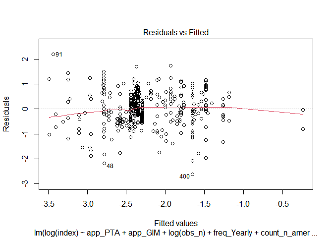
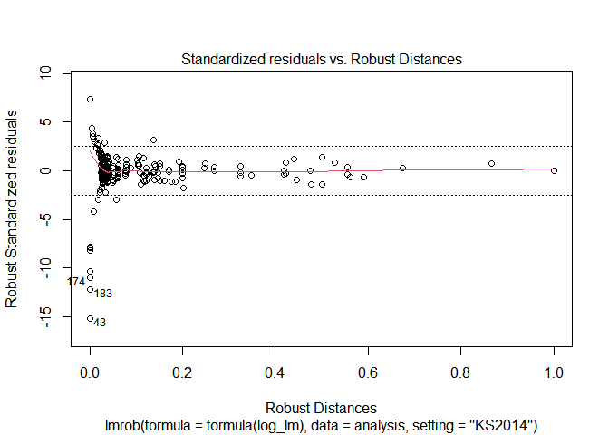
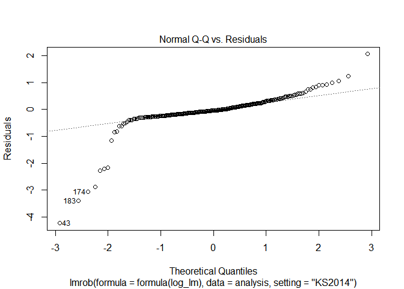
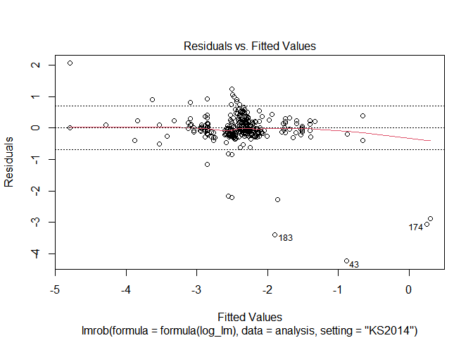

Modeling, Plotting and Regression Tables
================
Mykola Dereva
June 11, 2020

load our cleaned data

``` r
analysis_full <- readRDS(here("data", "clean data", "Analysis_data.Rds"))
```

## Remove Outliers

lets look on the possible outliers

There are few MP values which are considerable higher or lower then
other. This might influence the reliability of research. Thus, I will
drop them

``` r
analysis <- analysis_full %>%
  filter(between(index, 0.005, 0.52))
```

## Analysis

Select only columns we need for the analysis. Rename columns once again.
And create columns with dummy variables

``` r
glimpse(analysis)
```

    ## Rows: 204
    ## Columns: 27
    ## $ index              <dbl> 0.17600, 0.08900, 0.01100, 0.03684, 0.40190, 0.2...
    ## $ obs_n              <dbl> 60, 60, 60, 24, 24, 23, 23, 120, 108, 28, 48, 15...
    ## $ after_2005         <dbl> 1, 1, 1, 0, 0, 0, 0, 1, 1, 0, 0, 0, 0, 0, 0, 0, ...
    ## $ perish             <dbl> 1, 1, 1, 0, 0, 1, 0, 1, 1, 0, 0, 0, 0, 0, 0, 1, ...
    ## $ mean_pse           <dbl> 34.73444, 34.73444, 34.73444, NaN, NaN, NaN, NaN...
    ## $ mean_pp            <dbl> 1.352539, 1.352539, 1.352539, NaN, NaN, NaN, NaN...
    ## $ sfarm_share        <dbl> 19.69004, 19.69004, 19.69004, NaN, NaN, NaN, NaN...
    ## $ sfarm_share_by_cat <dbl> 8.917172, 8.917172, 8.917172, NaN, NaN, NaN, NaN...
    ## $ start_business     <dbl> 73.24874, 73.24874, 73.24874, NaN, NaN, NaN, NaN...
    ## $ freq_Monthly       <int> 1, 1, 1, 0, 0, 0, 0, 1, 1, 0, 1, 0, 0, 0, 0, 0, ...
    ## $ freq_Yearly        <int> 0, 0, 0, 1, 1, 1, 1, 0, 0, 1, 0, 1, 1, 1, 1, 1, ...
    ## $ freq_Quaterly      <int> 0, 0, 0, 0, 0, 0, 0, 0, 0, 0, 0, 0, 0, 0, 0, 0, ...
    ## $ freq_Weekly        <int> 0, 0, 0, 0, 0, 0, 0, 0, 0, 0, 0, 0, 0, 0, 0, 0, ...
    ## $ type_Oligopsony    <int> 1, 0, 1, 0, 0, 0, 1, 1, 1, 1, 0, 0, 0, 0, 0, 0, ...
    ## $ type_Oligopoly     <int> 0, 1, 0, 1, 1, 1, 0, 0, 0, 0, 1, 1, 1, 1, 1, 1, ...
    ## $ ind_meat           <int> 1, 1, 1, 0, 0, 1, 1, 1, 1, 0, 0, 0, 0, 0, 0, 1, ...
    ## $ ind_beverages      <int> 0, 0, 0, 0, 0, 0, 0, 0, 0, 0, 1, 0, 0, 0, 0, 0, ...
    ## $ ind_cereals        <int> 0, 0, 0, 0, 0, 0, 0, 0, 0, 0, 0, 0, 0, 0, 0, 0, ...
    ## $ ind_dairy          <int> 0, 0, 0, 0, 0, 0, 0, 0, 0, 0, 0, 0, 0, 0, 0, 0, ...
    ## $ ind_oils           <int> 0, 0, 0, 0, 0, 0, 0, 0, 0, 0, 0, 0, 0, 0, 0, 0, ...
    ## $ ind_other          <int> 0, 0, 0, 1, 1, 0, 0, 0, 0, 1, 0, 1, 1, 1, 1, 0, ...
    ## $ count_europe       <int> 1, 1, 1, 0, 0, 0, 0, 1, 1, 1, 1, 0, 0, 0, 0, 0, ...
    ## $ count_n_america    <int> 0, 0, 0, 1, 1, 1, 1, 0, 0, 0, 0, 1, 1, 1, 1, 1, ...
    ## $ count_other        <int> 0, 0, 0, 0, 0, 0, 0, 0, 0, 0, 0, 0, 0, 0, 0, 0, ...
    ## $ app_GIM            <int> 1, 1, 1, 0, 0, 0, 0, 0, 0, 0, 1, 0, 0, 0, 0, 0, ...
    ## $ app_PTA            <int> 0, 0, 0, 1, 1, 1, 1, 1, 1, 1, 0, 1, 1, 1, 1, 1, ...
    ## $ app_SFA            <int> 0, 0, 0, 0, 0, 0, 0, 0, 0, 0, 0, 0, 0, 0, 0, 0, ...

``` r
analysis %>%
  summarise_all(funs(sum(is.na(.)))) %>%
  gather(column, n_na)
```

    ## Warning: `funs()` is deprecated as of dplyr 0.8.0.
    ## Please use a list of either functions or lambdas: 
    ## 
    ##   # Simple named list: 
    ##   list(mean = mean, median = median)
    ## 
    ##   # Auto named with `tibble::lst()`: 
    ##   tibble::lst(mean, median)
    ## 
    ##   # Using lambdas
    ##   list(~ mean(., trim = .2), ~ median(., na.rm = TRUE))
    ## This warning is displayed once every 8 hours.
    ## Call `lifecycle::last_warnings()` to see where this warning was generated.

    ## # A tibble: 27 x 2
    ##    column              n_na
    ##    <chr>              <int>
    ##  1 index                  0
    ##  2 obs_n                  0
    ##  3 after_2005             0
    ##  4 perish                 0
    ##  5 mean_pse               9
    ##  6 mean_pp                9
    ##  7 sfarm_share          165
    ##  8 sfarm_share_by_cat   167
    ##  9 start_business        82
    ## 10 freq_Monthly           0
    ## # ... with 17 more rows

``` r
log_lm <- lm(log(index) ~ app_PTA + app_GIM +
                 obs_n + 
                 freq_Yearly +
                 count_n_america +
                 after_2005 +
                 type_Oligopsony +
                 ind_dairy + ind_meat + ind_cereals + ind_beverages + ind_oils +
                 #perish +
                 #start_business +
                 log(mean_pp) + log(mean_pse), 
         data=analysis, subset = mean_pp < 2)
```

    ## Warning in log(mean_pse): NaNs produced

``` r
summary(log_lm)
```

    ## 
    ## Call:
    ## lm(formula = log(index) ~ app_PTA + app_GIM + obs_n + freq_Yearly + 
    ##     count_n_america + after_2005 + type_Oligopsony + ind_dairy + 
    ##     ind_meat + ind_cereals + ind_beverages + ind_oils + log(mean_pp) + 
    ##     log(mean_pse), data = analysis, subset = mean_pp < 2)
    ## 
    ## Residuals:
    ##      Min       1Q   Median       3Q      Max 
    ## -2.50149 -0.37138  0.09956  0.38631  1.81785 
    ## 
    ## Coefficients:
    ##                  Estimate Std. Error t value Pr(>|t|)    
    ## (Intercept)     -4.556794   0.781265  -5.833 2.80e-08 ***
    ## app_PTA         -0.126598   0.258629  -0.489 0.625140    
    ## app_GIM         -0.698285   0.273588  -2.552 0.011608 *  
    ## obs_n           -0.006861   0.002173  -3.158 0.001892 ** 
    ## freq_Yearly     -0.425158   0.264155  -1.610 0.109418    
    ## count_n_america  1.015303   0.242234   4.191 4.51e-05 ***
    ## after_2005       0.214006   0.283841   0.754 0.451947    
    ## type_Oligopsony  0.359980   0.163589   2.201 0.029159 *  
    ## ind_dairy        0.108805   0.194245   0.560 0.576141    
    ## ind_meat        -0.387817   0.218579  -1.774 0.077863 .  
    ## ind_cereals      1.179548   0.227995   5.174 6.59e-07 ***
    ## ind_beverages    0.166848   0.192732   0.866 0.387913    
    ## ind_oils         0.101300   0.247856   0.409 0.683285    
    ## log(mean_pp)    -0.751268   1.093071  -0.687 0.492859    
    ## log(mean_pse)    0.805964   0.217748   3.701 0.000292 ***
    ## ---
    ## Signif. codes:  0 '***' 0.001 '**' 0.01 '*' 0.05 '.' 0.1 ' ' 1
    ## 
    ## Residual standard error: 0.7039 on 165 degrees of freedom
    ##   (20 observations deleted due to missingness)
    ## Multiple R-squared:  0.4697, Adjusted R-squared:  0.4247 
    ## F-statistic: 10.44 on 14 and 165 DF,  p-value: < 2.2e-16

``` r
bptest(log_lm)
```

    ## 
    ##  studentized Breusch-Pagan test
    ## 
    ## data:  log_lm
    ## BP = 26.487, df = 14, p-value = 0.02243

``` r
plot(log_lm)
```

<!-- --><!-- --><!-- --><!-- -->

seems that we have hetoroscadasticity issue. Lets try to use
heteroscadasticity robust se and to compare it with the regular

``` r
log_lm_se <- vcovHC(log_lm, type = "HC")
log_lm_se <- sqrt(diag(log_lm_se))
log_lm_se
```

    ##     (Intercept)         app_PTA         app_GIM           obs_n     freq_Yearly 
    ##     0.593819621     0.228661070     0.267158987     0.001865045     0.220465170 
    ## count_n_america      after_2005 type_Oligopsony       ind_dairy        ind_meat 
    ##     0.168129928     0.249354970     0.199609470     0.137853977     0.235558598 
    ##     ind_cereals   ind_beverages        ind_oils    log(mean_pp)   log(mean_pse) 
    ##     0.256966091     0.179808786     0.252670213     0.900754358     0.173566237

``` r
stargazer(log_lm, log_lm, se=list(NULL, log_lm_se),
          column.labels=c("default SE","robust SE"), type = "text",
          omit.stat=c("f", "ser", "n"), align = TRUE)
```

    ## 
    ## ============================================
    ##                     Dependent variable:     
    ##                 ----------------------------
    ##                          log(index)         
    ##                   default SE     robust SE  
    ##                      (1)            (2)     
    ## --------------------------------------------
    ## app_PTA             -0.127        -0.127    
    ##                    (0.259)        (0.229)   
    ##                                             
    ## app_GIM            -0.698**      -0.698***  
    ##                    (0.274)        (0.267)   
    ##                                             
    ## obs_n             -0.007***      -0.007***  
    ##                    (0.002)        (0.002)   
    ##                                             
    ## freq_Yearly         -0.425        -0.425*   
    ##                    (0.264)        (0.220)   
    ##                                             
    ## count_n_america    1.015***      1.015***   
    ##                    (0.242)        (0.168)   
    ##                                             
    ## after_2005          0.214          0.214    
    ##                    (0.284)        (0.249)   
    ##                                             
    ## type_Oligopsony    0.360**        0.360*    
    ##                    (0.164)        (0.200)   
    ##                                             
    ## ind_dairy           0.109          0.109    
    ##                    (0.194)        (0.138)   
    ##                                             
    ## ind_meat           -0.388*        -0.388*   
    ##                    (0.219)        (0.236)   
    ##                                             
    ## ind_cereals        1.180***      1.180***   
    ##                    (0.228)        (0.257)   
    ##                                             
    ## ind_beverages       0.167          0.167    
    ##                    (0.193)        (0.180)   
    ##                                             
    ## ind_oils            0.101          0.101    
    ##                    (0.248)        (0.253)   
    ##                                             
    ## log(mean_pp)        -0.751        -0.751    
    ##                    (1.093)        (0.901)   
    ##                                             
    ## log(mean_pse)      0.806***      0.806***   
    ##                    (0.218)        (0.174)   
    ##                                             
    ## Constant          -4.557***      -4.557***  
    ##                    (0.781)        (0.594)   
    ##                                             
    ## --------------------------------------------
    ## R2                  0.470          0.470    
    ## Adjusted R2         0.425          0.425    
    ## ============================================
    ## Note:            *p<0.1; **p<0.05; ***p<0.01

#### Without Log transformation

``` r
lm <- lm(index ~ app_PTA + app_GIM +
                 obs_n + 
                 freq_Yearly +
                 count_n_america +
                 after_2005 +
                 type_Oligopsony +
                 ind_dairy + ind_meat + ind_cereals + ind_beverages + ind_oils +
                 #perish +
                 #start_business +
                 log(mean_pp) + log(mean_pse), 
         data=analysis)
```

    ## Warning in log(mean_pse): NaNs produced

``` r
summary(lm)
```

    ## 
    ## Call:
    ## lm(formula = index ~ app_PTA + app_GIM + obs_n + freq_Yearly + 
    ##     count_n_america + after_2005 + type_Oligopsony + ind_dairy + 
    ##     ind_meat + ind_cereals + ind_beverages + ind_oils + log(mean_pp) + 
    ##     log(mean_pse), data = analysis)
    ## 
    ## Residuals:
    ##      Min       1Q   Median       3Q      Max 
    ## -0.18797 -0.05201 -0.00622  0.03165  0.32910 
    ## 
    ## Coefficients:
    ##                   Estimate Std. Error t value Pr(>|t|)    
    ## (Intercept)     -0.1477126  0.0934399  -1.581  0.11579    
    ## app_PTA          0.0655045  0.0311355   2.104  0.03687 *  
    ## app_GIM          0.0104059  0.0310663   0.335  0.73807    
    ## obs_n           -0.0007788  0.0002628  -2.963  0.00348 ** 
    ## freq_Yearly     -0.0268074  0.0323222  -0.829  0.40806    
    ## count_n_america  0.1276716  0.0229345   5.567    1e-07 ***
    ## after_2005       0.0903996  0.0316674   2.855  0.00485 ** 
    ## type_Oligopsony  0.0147420  0.0199383   0.739  0.46070    
    ## ind_dairy        0.0028454  0.0222512   0.128  0.89840    
    ## ind_meat        -0.0566268  0.0268187  -2.111  0.03620 *  
    ## ind_cereals      0.0634021  0.0279318   2.270  0.02448 *  
    ## ind_beverages    0.0096263  0.0235006   0.410  0.68260    
    ## ind_oils         0.0178661  0.0304470   0.587  0.55813    
    ## log(mean_pp)     0.0082626  0.0572730   0.144  0.88546    
    ## log(mean_pse)    0.0618847  0.0237147   2.610  0.00988 ** 
    ## ---
    ## Signif. codes:  0 '***' 0.001 '**' 0.01 '*' 0.05 '.' 0.1 ' ' 1
    ## 
    ## Residual standard error: 0.08657 on 169 degrees of freedom
    ##   (20 observations deleted due to missingness)
    ## Multiple R-squared:  0.3272, Adjusted R-squared:  0.2715 
    ## F-statistic: 5.872 on 14 and 169 DF,  p-value: 2.618e-09

``` r
bptest(lm)
```

    ## 
    ##  studentized Breusch-Pagan test
    ## 
    ## data:  lm
    ## BP = 29.966, df = 14, p-value = 0.007714

``` r
plot(lm)
```

<!-- --><!-- --><!-- --><!-- -->

``` r
get_robust_se <- function(lm_model)  {
  matrix <- vcovHC(lm_model, type = "HC0")
  robust_se <- sqrt(diag(matrix))
  return(robust_se)
}

get_robust_se(lm)
```

    ##     (Intercept)         app_PTA         app_GIM           obs_n     freq_Yearly 
    ##    0.0843534495    0.0285038475    0.0259952347    0.0001688648    0.0229231000 
    ## count_n_america      after_2005 type_Oligopsony       ind_dairy        ind_meat 
    ##    0.0235059559    0.0332355194    0.0171742940    0.0185559009    0.0239109321 
    ##     ind_cereals   ind_beverages        ind_oils    log(mean_pp)   log(mean_pse) 
    ##    0.0219210173    0.0227927759    0.0459172006    0.0478826761    0.0164665424

### Tobit model

``` r
library(censReg)
```

``` r
tobit <- censReg(index ~ app_PTA + app_GIM +
                 obs_n + 
                 freq_Yearly +
                 type_Oligopoly +
                 count_n_america +
                 after_2005 +
                 ind_dairy + ind_meat + ind_cereals + ind_beverages + ind_oils +
                 #perish +
                 #start_business +
                 log(mean_pp) + log(mean_pse),
                 data = analysis_full)
```

    ## Warning in log(mean_pse): NaNs produced

    ## Warning in censReg(index ~ app_PTA + app_GIM + obs_n + freq_Yearly +
    ## type_Oligopoly + : at least one value of the endogenous variable is smaller than
    ## the left limit

``` r
summary(tobit)
```

    ## 
    ## Call:
    ## censReg(formula = index ~ app_PTA + app_GIM + obs_n + freq_Yearly + 
    ##     type_Oligopoly + count_n_america + after_2005 + ind_dairy + 
    ##     ind_meat + ind_cereals + ind_beverages + ind_oils + log(mean_pp) + 
    ##     log(mean_pse), data = analysis_full)
    ## 
    ## Observations:
    ##          Total  Left-censored     Uncensored Right-censored 
    ##            199              2            197              0 
    ## 
    ## Coefficients:
    ##                   Estimate Std. error t value  Pr(> t)    
    ## (Intercept)     -0.0696286  0.1092498  -0.637 0.523907    
    ## app_PTA          0.0841166  0.0354629   2.372 0.017694 *  
    ## app_GIM         -0.0063754  0.0347000  -0.184 0.854226    
    ## obs_n           -0.0011040  0.0002927  -3.772 0.000162 ***
    ## freq_Yearly     -0.0757586  0.0351323  -2.156 0.031054 *  
    ## type_Oligopoly  -0.0231877  0.0216624  -1.070 0.284433    
    ## count_n_america  0.1612869  0.0253421   6.364 1.96e-10 ***
    ## after_2005       0.1065056  0.0354857   3.001 0.002688 ** 
    ## ind_dairy        0.0066304  0.0253663   0.261 0.793793    
    ## ind_meat        -0.0710970  0.0301738  -2.356 0.018460 *  
    ## ind_cereals      0.0722551  0.0297978   2.425 0.015315 *  
    ## ind_beverages    0.0125124  0.0271096   0.462 0.644405    
    ## ind_oils         0.0143329  0.0342374   0.419 0.675485    
    ## log(mean_pp)     0.0357533  0.0665093   0.538 0.590875    
    ## log(mean_pse)    0.0482900  0.0270738   1.784 0.074481 .  
    ## logSigma        -2.2875022  0.0504700 -45.324  < 2e-16 ***
    ## ---
    ## Signif. codes:  0 '***' 0.001 '**' 0.01 '*' 0.05 '.' 0.1 ' ' 1
    ## 
    ## Newton-Raphson maximisation, 9 iterations
    ## Return code 1: gradient close to zero
    ## Log-likelihood: 169.0355 on 16 Df

``` r
model_1 <- lm(log(index) ~ app_PTA + app_GIM + type_Oligopoly, 
                        data=analysis)
se_1 <- get_robust_se(model_1)

model_2 <- lm(log(index) ~ app_PTA + app_GIM +
                type_Oligopoly +
                after_2005 + 
                freq_Yearly +
                count_n_america + count_europe, 
         data=analysis)
se_2 <- get_robust_se(model_2)

model_3 <- lm(log(index) ~ app_PTA + app_GIM +
                type_Oligopoly +
                obs_n + after_2005 + 
                freq_Yearly + 
                count_n_america + count_europe +
                ind_dairy + ind_meat + ind_beverages + ind_cereals + ind_oils, 
         data=analysis)
se_3 <- get_robust_se(model_3)


model_4 <- lm(log(index) ~ app_PTA + app_GIM +
                type_Oligopoly +
                obs_n + 
                count_n_america +
                ind_dairy + ind_meat + ind_beverages + ind_cereals + ind_oils +
                log(mean_pp) + log(mean_pse), 
         data=analysis)
```

    ## Warning in log(mean_pse): NaNs produced

``` r
se_4 <- get_robust_se(model_4)
```

## Summary tables

``` r
stargazer(model_1, model_2, model_3, model_4, tobit,
          type = "text",
          keep.stat=c("n", "rsq", "adj.rsq"), 
          title = "Analysis Results",
          #column.labels =  c("Model 1", "Model 2", "Model 3"),
          dep.var.labels = "Market Power Index (log transformed)",
          se = list(se_1, se_2, se_3, se_4),
          align = TRUE,
          intercept.bottom = FALSE
          )
```

    ## 
    ## Analysis Results
    ## ==================================================================
    ##                                Dependent variable:                
    ##                 --------------------------------------------------
    ##                  Market Power Index (log transformed)     index  
    ##                                   OLS                   censored 
    ##                                                         regression
    ##                    (1)       (2)       (3)       (4)       (5)    
    ## ------------------------------------------------------------------
    ## Constant        -2.023*** -2.333*** -2.039*** -4.402***   -0.070  
    ##                  (0.173)   (0.583)   (0.657)   (0.489)   (0.109)  
    ##                                                                   
    ## app_PTA           0.018    -0.069    -0.060   -0.286**   0.084**  
    ##                  (0.113)   (0.281)   (0.297)   (0.117)   (0.035)  
    ##                                                                   
    ## app_GIM         -0.926*** -0.774**  -0.821**  -0.595***   -0.006  
    ##                  (0.197)   (0.302)   (0.336)   (0.209)   (0.035)  
    ##                                                                   
    ## type_Oligopoly    0.006    -0.217    -0.227   -0.428**    -0.023  
    ##                  (0.158)   (0.232)   (0.211)   (0.183)   (0.022)  
    ##                                                                   
    ## obs_n                               -0.006*** -0.005*** -0.001*** 
    ##                                      (0.001)   (0.001)   (0.0003) 
    ##                                                                   
    ## after_2005                  0.023    -0.005              0.107*** 
    ##                            (0.269)   (0.299)             (0.035)  
    ##                                                                   
    ## freq_Yearly                 0.195    -0.448              -0.076** 
    ##                            (0.242)   (0.276)             (0.035)  
    ##                                                                   
    ## count_n_america            0.552**  1.003***  1.023***   0.161*** 
    ##                            (0.248)   (0.262)   (0.158)   (0.025)  
    ##                                                                   
    ## count_europe                0.097     0.354                       
    ##                            (0.234)   (0.246)                      
    ##                                                                   
    ## ind_dairy                             0.210     0.203     0.007   
    ##                                      (0.155)   (0.142)   (0.025)  
    ##                                                                   
    ## ind_meat                             -0.255    -0.352    -0.071** 
    ##                                      (0.208)   (0.242)   (0.030)  
    ##                                                                   
    ## ind_beverages                         0.248     0.068     0.013   
    ##                                      (0.194)   (0.169)   (0.027)  
    ##                                                                   
    ## ind_cereals                         0.897***  1.102***   0.072**  
    ##                                      (0.291)   (0.250)   (0.030)  
    ##                                                                   
    ## ind_oils                             -0.042     0.045     0.014   
    ##                                      (0.259)   (0.258)   (0.034)  
    ##                                                                   
    ## log(mean_pp)                                   -0.238     0.036   
    ##                                                (0.408)   (0.067)  
    ##                                                                   
    ## log(mean_pse)                                 0.777***    0.048*  
    ##                                                (0.174)   (0.027)  
    ##                                                                   
    ## logSigma                                                -2.288*** 
    ##                                                          (0.050)  
    ##                                                                   
    ## ------------------------------------------------------------------
    ## Observations       204       204       204       184       199    
    ## R2                0.207     0.265     0.363     0.443             
    ## Adjusted R2       0.195     0.239     0.320     0.403             
    ## ==================================================================
    ## Note:                                  *p<0.1; **p<0.05; ***p<0.01

### F-test

Lets check if type there influence of industry on the MPI

``` r
industry <- matchCoefs(model_3, "ind") # extract all industry dummies
F.test.ind <-  linearHypothesis(model_3, industry, white.adjust = "hc1")
F.test.ind
```

    ## Linear hypothesis test
    ## 
    ## Hypothesis:
    ## ind_dairy = 0
    ## ind_meat = 0
    ## ind_beverages = 0
    ## ind_cereals = 0
    ## ind_oils = 0
    ## 
    ## Model 1: restricted model
    ## Model 2: log(index) ~ app_PTA + app_GIM + type_Oligopoly + obs_n + after_2005 + 
    ##     freq_Yearly + count_n_america + count_europe + ind_dairy + 
    ##     ind_meat + ind_beverages + ind_cereals + ind_oils
    ## 
    ## Note: Coefficient covariance matrix supplied.
    ## 
    ##   Res.Df Df      F   Pr(>F)   
    ## 1    195                      
    ## 2    190  5 3.2216 0.008143 **
    ## ---
    ## Signif. codes:  0 '***' 0.001 '**' 0.01 '*' 0.05 '.' 0.1 ' ' 1

Therefore we reject 0 hypothesis that all types of industry have zero
coefficient.

### Determinants of each approach

Finally lets make a linear model for each approach and check if there is
any significant differences in coefficients between them

``` r
GIM <- lm(log(index) ~ type_Oligopoly +
                obs_n + after_2005 + 
                freq_Yearly + freq_Quaterly +
                count_n_america + count_europe +
                ind_dairy + ind_meat + ind_beverages + ind_cereals + ind_oils, 
         data= subset(analysis, app_GIM == 1)) 

PTA <- lm(log(index) ~ type_Oligopoly +
                obs_n + after_2005 + 
                freq_Yearly + freq_Quaterly +
                count_n_america + count_europe +
                ind_dairy + ind_meat + ind_beverages + ind_cereals + ind_oils, 
         data= subset(analysis, app_PTA == 1))

SFA <- lm(log(index) ~ type_Oligopoly +
                obs_n + after_2005 + 
                freq_Yearly + freq_Quaterly +
                count_n_america + count_europe +
                ind_dairy + ind_meat + ind_beverages + ind_cereals + ind_oils, 
         data= subset(analysis, app_SFA == 1)) 
```

``` r
bptest(SFA)
```

    ## 
    ##  studentized Breusch-Pagan test
    ## 
    ## data:  SFA
    ## BP = 10.271, df = 9, p-value = 0.329

``` r
bptest(PTA)
```

    ## 
    ##  studentized Breusch-Pagan test
    ## 
    ## data:  PTA
    ## BP = 14.061, df = 12, p-value = 0.2968

``` r
bptest(GIM)
```

    ## 
    ##  studentized Breusch-Pagan test
    ## 
    ## data:  GIM
    ## BP = 6.8178, df = 11, p-value = 0.8136

According to bptest there is no evidence of heteroscadasticity, so we
can use default SE

``` r
stargazer(GIM, PTA, SFA,
          type = "text",
          omit.stat=c("f", "ser"), 
          title = "Analysis Results",
          column.labels =  c("GIM", "PTA", "SFA"),
          dep.var.labels = "Market Power Index (log transformed)",
          align = TRUE,
          intercept.bottom = FALSE
          )
```

    ## 
    ## Analysis Results
    ## ======================================================
    ##                          Dependent variable:          
    ##                 --------------------------------------
    ##                  Market Power Index (log transformed) 
    ##                     GIM          PTA          SFA     
    ##                     (1)          (2)          (3)     
    ## ------------------------------------------------------
    ## Constant           -1.797     -2.823***      2.241*   
    ##                   (1.189)      (0.572)      (1.120)   
    ##                                                       
    ## type_Oligopoly     -0.350       -0.220      -0.629**  
    ##                   (0.298)      (0.335)      (0.272)   
    ##                                                       
    ## obs_n              0.002        -0.003     -0.085***  
    ##                   (0.006)      (0.003)      (0.016)   
    ##                                                       
    ## after_2005       -1.805***     0.975**                
    ##                   (0.643)      (0.438)                
    ##                                                       
    ## freq_Yearly        -0.052       1.358*     -2.940***  
    ##                   (0.883)      (0.699)      (0.768)   
    ##                                                       
    ## freq_Quaterly                   1.046                 
    ##                                (0.691)                
    ##                                                       
    ## count_n_america    0.037        -0.226      1.509***  
    ##                   (0.685)      (0.600)      (0.272)   
    ##                                                       
    ## count_europe       0.330       -1.024*       0.151    
    ##                   (0.623)      (0.538)      (0.222)   
    ##                                                       
    ## ind_dairy          -0.325       0.122        -0.178   
    ##                   (0.722)      (0.243)      (0.117)   
    ##                                                       
    ## ind_meat           0.429        0.121       -0.484**  
    ##                   (0.902)      (0.262)      (0.208)   
    ##                                                       
    ## ind_beverages      -0.531       0.281        -0.141   
    ##                   (0.625)      (0.245)      (0.137)   
    ##                                                       
    ## ind_cereals       1.247***      0.284        -0.038   
    ##                   (0.403)      (0.707)      (0.224)   
    ##                                                       
    ## ind_oils           0.008        0.236                 
    ##                   (0.595)      (0.306)                
    ##                                                       
    ## ------------------------------------------------------
    ## Observations         54           95           55     
    ## R2                 0.384        0.273        0.858    
    ## Adjusted R2        0.223        0.166        0.829    
    ## ======================================================
    ## Note:                      *p<0.1; **p<0.05; ***p<0.01

I think I am done with the analysis

# Summary Tables

I will work with dataset “clean” again

``` r
clean <- readRDS(here("data", "clean data", "Full_data.Rds"))
```

First of all lets create column with first author and year to uniquely
identify an article

``` r
clean <- clean %>%
  mutate(article_ref = str_c(
           str_match(authors, pattern = "^\\w[’]*\\w+" ),
           " (", year, ")")
         ) 

head(clean$article_ref, 20)
```

    ##  [1] "Anders (2008)"     "Anders (2008)"     "Anders (2008)"    
    ##  [4] "Anders (2008)"     "Appelbaum (1982)"  "Appelbaum (1982)" 
    ##  [7] "Azzam (1990)"      "Azzam (1990)"      "Bakucs (2009)"    
    ## [10] "Bakucs (2009)"     "Bergman (1995)"    "Bettendorf (2000)"
    ## [13] "Bhuyan (1997)"     "Bhuyan (1997)"     "Bhuyan (1997)"    
    ## [16] "Bhuyan (1998)"     "Bhuyan (1998)"     "Bhuyan (1998)"    
    ## [19] "Bhuyan (1998)"     "Bhuyan (1998)"

summary table of all articles used in analysis

``` r
#replace misspeled value
clean <- clean %>%
  mutate(data_freq = str_replace(data_freq, "Quaterly", "Quarterly")) 
```

### Table 1. List of studies

``` r
table_1 <- clean %>%
  group_by(article_ref, approach, mp_type, data_freq, period) %>%
  summarise(N = n()) %>%
  adorn_totals("row")
```

    ## `summarise()` regrouping output by 'article_ref', 'approach', 'mp_type', 'data_freq' (override with `.groups` argument)

``` r
head(table_1)
```

    ##       article_ref approach    mp_type data_freq    period N
    ##        Ahn (2010)      GIM  Oligopoly    Yearly 1975-2002 1
    ##     Anders (2008)      GIM Oligopsony   Monthly 1995-2000 2
    ##     Anders (2008)      GIM  Oligopoly   Monthly 1995-2000 2
    ##  Appelbaum (1982)      PTA  Oligopoly    Yearly 1947–1971 2
    ##      Azzam (1990)      PTA Oligopsony    Yearly 1959-1982 1
    ##      Azzam (1990)      PTA  Oligopoly    Yearly 1959-1982 1

``` r
table_1 %>%
  stargazer(type = output,
            style = "aer",
            title = "List of studies used",
            summary = FALSE, rownames = FALSE,
            out = "Tables/1.List of studies.doc"
            )
```

    ## 
    ## List of studies used
    ## ===============================================================
    ## article_ref         approach  mp_type   data_freq  period    N 
    ## ---------------------------------------------------------------
    ## Ahn (2010)            GIM    Oligopoly   Yearly   1975-2002  1 
    ## Anders (2008)         GIM    Oligopsony  Monthly  1995-2000  2 
    ## Anders (2008)         GIM    Oligopoly   Monthly  1995-2000  2 
    ## Appelbaum (1982)      PTA    Oligopoly   Yearly   1947–1971  2 
    ## Azzam (1990)          PTA    Oligopsony  Yearly   1959-1982  1 
    ## Azzam (1990)          PTA    Oligopoly   Yearly   1959-1982  1 
    ## Bakucs (2009)         PTA    Oligopsony  Monthly  1993-2003  1 
    ## Bakucs (2009)         PTA    Oligopsony  Monthly  1995-2004  1 
    ## Bergman (1995)        PTA    Oligopsony  Yearly   1960-1988  1 
    ## Bettendorf (2000)     GIM    Oligopoly   Monthly  1992-1996  1 
    ## Bhuyan (1997)         PTA    Oligopoly   Yearly   1972-1987  3 
    ## Bhuyan (1998)         PTA    Oligopoly   Yearly   1972-1987 26 
    ## Cechura (2015)        SFA    Oligopoly   Yearly   2003-2012 25 
    ## Chen (2018)           GIM    Oligopsony  Monthly  2008-2016  1 
    ## Chidmi (2005)         GIM    Oligopoly   Monthly  1996-2000  1 
    ## Chirinko (1994)       PTA    Oligopoly   Yearly   1973-1986  1 
    ## Chirinko (1994)       PTA    Oligopoly   Yearly   1973-1987  1 
    ## De (1999)             PTA    Oligopoly   Yearly   1962-1991  1 
    ## Genesove (1998)       GIM    Oligopoly   Yearly   1890-1914  1 
    ## Hockmann (2009)       PTA    Oligopsony  Monthly  1998-2006  1 
    ## Hovhannisyan (2012)   GIM    Oligopoly   Weekly   2001-2006  1 
    ## Ji (2016)             PTA    Oligopsony  Monthly  1980-2009  1 
    ## Kumbhakar (2012)      SFA    Oligopoly   Yearly   1974-1991  2 
    ## Lopez (1984)          PTA    Oligopoly   Yearly   1965-1979  1 
    ## Lopez (1993)          GIM    Oligopsony  Yearly   1954-1984  1 
    ## Lopez (2002)          PTA    Oligopoly   Yearly   1972-1997 25 
    ## Lopez (2017)          SFA    Oligopoly   Yearly   1990-2010 23 
    ## Mei (2008)            PTA    Oligopsony  Yearly   1955-2003  1 
    ## Mei (2008)            PTA    Oligopoly   Yearly   1955-2003  1 
    ## Merel (2009)          GIM    Oligopoly  Quarterly 1985-2005  1 
    ## Millan (1999)         PTA    Oligopoly   Yearly   1978-1992 14 
    ## Murray (1995)         PTA    Oligopsony  Yearly   1958-1988  1 
    ## Murray (1995)         PTA    Oligopsony  Yearly   1958-1989  1 
    ## Muth (1999)           GIM    Oligopsony  Yearly   1967-1993  1 
    ## O’Donnell (2007)      GIM    Oligopsony  Yearly   1989-2000 28 
    ## O’Donnell (2007)      GIM    Oligopoly   Yearly   1989-2000 12 
    ## Panagiotou (2018)     SFA    Oligopsony  Yearly   1970-2010  3 
    ## Perekhozhuk (2013)    PTA    Oligopsony  Yearly   1993-2006  1 
    ## Perekhozhuk (2013)    PTA    Oligopsony  Yearly   1993-2007  1 
    ## Perekhozhuk (2014)    PTA    Oligopsony  Monthly  1996-2003  1 
    ## Perekhozhuk (2016)    GIM    Oligopsony  Monthly  1996-2003  1 
    ## Perekhozhuk (2016)    PTA    Oligopsony  Monthly  1996-2003  8 
    ## Salhofer (2011)       GIM    Oligopsony  Monthly  1997-2008  1 
    ## Salhofer (2011)       GIM    Oligopoly   Monthly  1997-2008  1 
    ## Scalco (2014)         GIM    Oligopsony  Yearly   1997-2011  1 
    ## Scalco (2016)         SFA    Oligopsony  Monthly  2010-2015  1 
    ## Scalco (2016)         SFA    Oligopoly   Monthly  2010-2015  1 
    ## Silva (2019)          PTA    Oligopsony Quarterly 2016-2017  2 
    ## Stalgiene (2017)      PTA    Oligopsony Quarterly 2004-2014  3 
    ## Suzuki (1993)         GIM    Oligopoly   Yearly   1979-1989  1 
    ## Weerahewa (2003)      GIM    Oligopsony  Yearly   1970-2000  3 
    ## Weerahewa (2003)      GIM    Oligopoly   Yearly   1970-2000  3 
    ## Total                  -         -          -         -     220
    ## ---------------------------------------------------------------

### Table 2. Number of observations by country

``` r
table_2 <-  clean %>%
  mutate(country = as_factor(country) %>%
           fct_infreq() %>%
           fct_lump_min(min = 3) 
         ) %>%
  group_by(country) %>%
  summarise(n = n(), 
            mean_mp = round(mean(mp_index), 4)
            ) %>%
  ungroup() %>%
  mutate(prop = round(n / sum(n) * 100, 2) ) %>%
  select(country, n, prop, mean_mp) %>%
  adorn_totals("row")
```

    ## `summarise()` ungrouping output (override with `.groups` argument)

``` r
table_2 %>%
  stargazer(type = output,
            style = "aer",
            title = "Summary of MP observations by country",
            summary = FALSE, rownames = FALSE,
            out = "Tables/2.List of countries.doc")
```

    ## 
    ## Summary of MP observations by country
    ## ===============================
    ## country        n  prop  mean_mp
    ## -------------------------------
    ## United States 98  44.55 0.2017 
    ## Australia     40  18.18 0.0703 
    ## Spain         15  6.82  0.0821 
    ## Ukraine       10  4.55  0.1378 
    ## Germany        6  2.73  0.0797 
    ## Hungary        5  2.27  0.1528 
    ## Austria        3  1.36  0.0882 
    ## Brazil         3  1.36   0.03  
    ## Other         40  18.18 0.1172 
    ## Total         220  100  0.9598 
    ## -------------------------------

Visualize the distribution

``` r
clean %>%
    mutate(country = as_factor(country) %>%
           fct_infreq() %>%
           fct_lump_min(min = 4) 
         ) %>%
  ggplot(aes(x = country,
             y = mp_index,
             color = approach)) + 
  geom_jitter(width = 0.25, height = 0, alpha = 0.6, size = 2) +
  theme_minimal() +
  easy_legend_at("bottom") +
  easy_remove_x_axis("title") +
  labs(y = "Market Power Index",
       title = "The distribution of MP indices by country",
       caption = "Source: own representation",
       color = "Approach:") 
```

<!-- -->

### Table 3 Number of observations by sector

``` r
table_3 <- clean %>%
  mutate(industry_fct = fct_infreq(industry_fct) %>%
           fct_relevel("other", after = Inf)
         ) %>%
  group_by(industry_fct) %>%
  summarise(n = n(), 
            mean_mp = round(mean(mp_index), 4)
            ) %>%
  ungroup() %>%
  mutate(prop = round(n / sum(n) * 100, 2),
         industry_fct = str_to_title(industry_fct)) %>%
  select(industry_fct, n, prop, mean_mp) %>%
  adorn_totals("row")
```

    ## `summarise()` ungrouping output (override with `.groups` argument)

Save table

``` r
table_3 %>%
  stargazer(type = output,
            style = "aer",
            title = "Summary of MP observations by sector",
            summary = FALSE, rownames = FALSE,
            out = "Tables/3. List of industries.doc")
```

    ## 
    ## Summary of MP observations by sector
    ## ===============================
    ## industry_fct  n   prop  mean_mp
    ## -------------------------------
    ## Dairy        61  27.73  0.1272 
    ## Cereals      28  12.73  0.1227 
    ## Beverages    24  10.91  0.1372 
    ## Meat         21   9.55  0.0999 
    ## Oils         11    5     0.131 
    ## Other        75  34.09  0.1792 
    ## Total        220 100.01 0.7972 
    ## -------------------------------

Visualize the distribution

``` r
clean %>%
  ggplot(aes(x = fct_reorder(industry_fct, mp_index, median) %>%
               str_to_sentence(),
             y = mp_index,
             color = approach)) + 
  geom_jitter(width = 0.25, height = 0, alpha = 0.6, size = 2) +
  theme_minimal() +
  easy_legend_at("bottom") +
  easy_remove_x_axis("title") +
  labs(y = "Market Power Index",
       title = "The distribution of MP indices by sector",
       caption = "Source: own representation",
       color = "Approach:") 
```

<!-- --> Save
plot

### Table 4: Number of observations by methodology

``` r
table_4 <- clean %>%
  group_by(approach) %>%
  summarise(n = n(), 
            mean_mp = round(mean(mp_index), 4)
            ) %>%
  ungroup() %>%
  mutate(prop = round(n / sum(n) * 100, 2)) %>%
  select(approach, n, prop, mean_mp) %>%
  adorn_totals("row")
```

    ## `summarise()` ungrouping output (override with `.groups` argument)

``` r
table_4 %>%
  stargazer(type = output,
            style = "aer",
            title = "Summary of MP observations by approach used",
            summary = FALSE, rownames = FALSE,
            out = "Tables/4. List of Methods.doc")
```

    ## 
    ## Summary of MP observations by approach used
    ## ==========================
    ## approach  n  prop  mean_mp
    ## --------------------------
    ## GIM      64  29.09 0.0736 
    ## PTA      101 45.91 0.1841 
    ## SFA      55   25   0.1485 
    ## Total    220  100  0.4062 
    ## --------------------------

### Table 5: List of observarion frequency

``` r
table_5 <- clean %>%
  group_by(data_freq) %>%
  summarise(n = n(), 
            mean_mp = round(mean(mp_index), 4)
            ) %>%
  ungroup() %>%
  mutate(prop = round(n / sum(n) * 100, 2)) %>%
  select(data_freq, n, prop, mean_mp) %>%
  arrange(-n) %>%
  adorn_totals("row")
```

    ## `summarise()` ungrouping output (override with `.groups` argument)

``` r
table_5 %>%
  stargazer(type = output,
            style = "aer",
            title = "Summary of MP observations by frequency",
            summary = FALSE, rownames = FALSE,
            out = "Tables/5. List of observarion frequency.doc")
```

    ## 
    ## Summary of MP observations by frequency
    ## ===========================
    ## data_freq  n  prop  mean_mp
    ## ---------------------------
    ## Yearly    188 85.45 0.1461 
    ## Monthly   25  11.36 0.0952 
    ## Quarterly  6  2.73  0.2667 
    ## Weekly     1  0.45   0.022 
    ## Total     220 99.99  0.53  
    ## ---------------------------

### Table 6: Discriptive statistics of variables

``` r
analysis %>%
  as.data.frame() %>%
  stargazer(type = output,
            style = "aer",
            align = TRUE, nobs = FALSE,
            out = "Tables/6. Descriprive stat.doc")
```

    ## 
    ## ==================================================================
    ## Statistic           Mean  St. Dev.  Min   Pctl(25) Pctl(75)  Max  
    ## ------------------------------------------------------------------
    ## index              0.144   0.101   0.007   0.063    0.200   0.516 
    ## obs_n              27.794  36.527    4       11       25     348  
    ## after_2005         0.588   0.493     0       0        1       1   
    ## perish             0.417   0.494     0       0        1       1   
    ## mean_pse           19.216  12.072  -1.024  11.048   25.496  70.144
    ## mean_pp            1.182   0.360   0.920   1.062    1.137   3.917 
    ## sfarm_share        35.983  17.966  11.955  19.690   45.792  79.828
    ## sfarm_share_by_cat 25.797  23.574  0.734   5.880    40.849  84.955
    ## start_business     84.180  14.297  24.091  75.296   96.182  96.235
    ## freq_Monthly       0.118   0.323     0       0        0       1   
    ## freq_Yearly        0.858   0.350     0       1        1       1   
    ## freq_Quaterly      0.020   0.139     0       0        0       1   
    ## freq_Weekly        0.005   0.070     0       0        0       1   
    ## type_Oligopsony    0.304   0.461     0       0        1       1   
    ## type_Oligopoly     0.696   0.461     0       0        1       1   
    ## ind_meat           0.093   0.291     0       0        0       1   
    ## ind_beverages      0.113   0.317     0       0        0       1   
    ## ind_cereals        0.113   0.317     0       0        0       1   
    ## ind_dairy          0.294   0.457     0       0        1       1   
    ## ind_oils           0.049   0.216     0       0        0       1   
    ## ind_other          0.338   0.474     0       0        1       1   
    ## count_europe       0.265   0.442     0       0        1       1   
    ## count_n_america    0.471   0.500     0       0        1       1   
    ## count_other        0.265   0.442     0       0        1       1   
    ## app_GIM            0.265   0.442     0       0        1       1   
    ## app_PTA            0.466   0.500     0       0        1       1   
    ## app_SFA            0.270   0.445     0       0        1       1   
    ## ------------------------------------------------------------------

### Table 7: Regression table

``` r
ind.var.names <- c("Intercept", "PTA", "GIM", "Oligopoly",
                   "Observations Num.", "After 2005", "Yearly",
                   "Quarterly", "USA", "Europe", "Dairy", "Meat",
                   "Beverages", "Cereals", "Oils")
```

``` r
stargazer(model_1, model_2, model_3,
          type = output,
          style = "aer",
          #omit.stat=c("f", "ser", "n"), 
          title = "Regression Results",
          dep.var.labels = "Market Power Index (log transformed)",
          covariate.labels = ind.var.names,
          se = list(se_1, se_2, se_3),      #  Robust se
          align = TRUE,
          df = FALSE,
          intercept.bottom = FALSE,
          out = "Tables/7. Regression Table.doc"
          )
```

    ## 
    ## Regression Results
    ## ============================================================
    ##                       Market Power Index (log transformed)  
    ##                          (1)           (2)          (3)     
    ## ------------------------------------------------------------
    ## Intercept             -2.023***     -2.333***    -2.039***  
    ##                        (0.173)       (0.583)      (0.657)   
    ##                                                             
    ## PTA                     0.018        -0.069        -0.060   
    ##                        (0.113)       (0.281)      (0.297)   
    ##                                                             
    ## GIM                   -0.926***     -0.774**      -0.821**  
    ##                        (0.197)       (0.302)      (0.336)   
    ##                                                             
    ## Oligopoly               0.006        -0.217        -0.227   
    ##                        (0.158)       (0.232)      (0.211)   
    ##                                                             
    ## Observations Num.                                -0.006***  
    ##                                                   (0.001)   
    ##                                                             
    ## After 2005                            0.023        -0.005   
    ##                                      (0.269)      (0.299)   
    ##                                                             
    ## Yearly                                0.195        -0.448   
    ##                                      (0.242)      (0.276)   
    ##                                                             
    ## Quarterly                            0.552**      1.003***  
    ##                                      (0.248)      (0.262)   
    ##                                                             
    ## USA                                   0.097        0.354    
    ##                                      (0.234)      (0.246)   
    ##                                                             
    ## Europe                                             0.210    
    ##                                                   (0.155)   
    ##                                                             
    ## Dairy                                              -0.255   
    ##                                                   (0.208)   
    ##                                                             
    ## Meat                                               0.248    
    ##                                                   (0.194)   
    ##                                                             
    ## Beverages                                         0.897***  
    ##                                                   (0.291)   
    ##                                                             
    ## Cereals                                            -0.042   
    ##                                                   (0.259)   
    ##                                                             
    ## Observations             204           204          204     
    ## R2                      0.207         0.265        0.363    
    ## Adjusted R2             0.195         0.239        0.320    
    ## Residual Std. Error     0.820         0.798        0.754    
    ## F Statistic           17.381***     10.084***     8.343***  
    ## ------------------------------------------------------------
    ## Notes:              ***Significant at the 1 percent level.  
    ##                     **Significant at the 5 percent level.   
    ##                     *Significant at the 10 percent level.

### Table 8: Methods comparison

``` r
stargazer(PTA, GIM, SFA,
          type = output,
          style = "aer",
          #omit.stat=c("f", "ser", "n"), 
          title = "Methods Comparison",
          dep.var.labels = "Market Power Index",
          column.labels =  c("PTA", "GIM", "SFA"),
          covariate.labels = ind.var.names,
          align = TRUE,
          df = FALSE,
          intercept.bottom = FALSE,
          out = "Tables/8. Method Comparison.doc"
          )
```

    ## 
    ## Methods Comparison
    ## ============================================================
    ##                                Market Power Index           
    ##                          PTA           GIM          SFA     
    ##                          (1)           (2)          (3)     
    ## ------------------------------------------------------------
    ## Intercept             -2.823***      -1.797        2.241*   
    ##                        (0.572)       (1.189)      (1.120)   
    ##                                                             
    ## PTA                    -0.220        -0.350       -0.629**  
    ##                        (0.335)       (0.298)      (0.272)   
    ##                                                             
    ## GIM                    -0.003         0.002      -0.085***  
    ##                        (0.003)       (0.006)      (0.016)   
    ##                                                             
    ## Oligopoly              0.975**      -1.805***               
    ##                        (0.438)       (0.643)                
    ##                                                             
    ## Observations Num.      1.358*        -0.052      -2.940***  
    ##                        (0.699)       (0.883)      (0.768)   
    ##                                                             
    ## After 2005              1.046                               
    ##                        (0.691)                              
    ##                                                             
    ## Yearly                 -0.226         0.037       1.509***  
    ##                        (0.600)       (0.685)      (0.272)   
    ##                                                             
    ## Quarterly              -1.024*        0.330        0.151    
    ##                        (0.538)       (0.623)      (0.222)   
    ##                                                             
    ## USA                     0.122        -0.325        -0.178   
    ##                        (0.243)       (0.722)      (0.117)   
    ##                                                             
    ## Europe                  0.121         0.429       -0.484**  
    ##                        (0.262)       (0.902)      (0.208)   
    ##                                                             
    ## Dairy                   0.281        -0.531        -0.141   
    ##                        (0.245)       (0.625)      (0.137)   
    ##                                                             
    ## Meat                    0.284       1.247***       -0.038   
    ##                        (0.707)       (0.403)      (0.224)   
    ##                                                             
    ## Beverages               0.236         0.008                 
    ##                        (0.306)       (0.595)                
    ##                                                             
    ## Observations             95            54            55     
    ## R2                      0.273         0.384        0.858    
    ## Adjusted R2             0.166         0.223        0.829    
    ## Residual Std. Error     0.698         0.974        0.217    
    ## F Statistic           2.562***       2.384**     30.176***  
    ## ------------------------------------------------------------
    ## Notes:              ***Significant at the 1 percent level.  
    ##                     **Significant at the 5 percent level.   
    ##                     *Significant at the 10 percent level.

``` r
clean %>%
  ggplot(aes(x=n_of_obs, y=mp_index, color = approach)) +
  geom_point(size = 4, alpha = 0.8, shape = 1) +
  scale_x_continuous(trans = "log10") +
  theme_minimal() +
  easy_move_legend(to = "bottom") +
    labs(x = "Number of observations (log10)",
         y = "Market Power Index",
         title = "Relationship between MP index and number of observations \nused in a study",
         caption = "Source: own representation") +
  easy_add_legend_title("Approach used:")
```

<!-- -->

### Tables PP and PSE

``` r
stargazer(model_1, model_2, model_3, model_4, model_5, model_6,
          type = output,
          style = "aer",
          #title = "Regressions Results",
          keep.stat=c("n", "rsq", "adj.rsq"), 
          title = "Analysis Results",
          #column.labels =  c("Model 1", "Model 2", "Model 3"),
          dep.var.labels = "Market Power Index (log transformed)",
          se = list(se_1, se_2, se_3, se_4, se_5, se_6),
          align = TRUE,
          intercept.bottom = FALSE,
          out = "Tables/9. PP vs PSE.doc"
          )
```

    ## 
    ## Analysis Results
    ## ===========================================================================
    ##                            Market Power Index (log transformed)            
    ##                    (1)       (2)       (3)       (4)       (5)       (6)   
    ## ---------------------------------------------------------------------------
    ## Constant        -4.268*** -2.416*** -4.402*** -2.563*** -2.811*** -2.547***
    ##                  (0.420)   (0.219)   (0.489)   (0.239)   (0.338)   (0.329) 
    ##                                                                            
    ## app_PTA         -0.280**   -0.069   -0.286**   -0.083    -0.039    -0.084  
    ##                  (0.122)   (0.119)   (0.117)   (0.116)   (0.118)   (0.115) 
    ##                                                                            
    ## app_GIM         -0.610*** -0.931*** -0.595*** -0.903*** -0.925*** -0.903***
    ##                  (0.201)   (0.222)   (0.209)   (0.218)   (0.227)   (0.218) 
    ##                                                                            
    ## type_Oligopoly  -0.432**  -0.380**  -0.428**  -0.435**   -0.348*  -0.436** 
    ##                  (0.183)   (0.181)   (0.183)   (0.181)   (0.179)   (0.182) 
    ##                                                                            
    ## obs_n           -0.005*** -0.003**  -0.005*** -0.003**  -0.003*** -0.003** 
    ##                  (0.001)   (0.001)   (0.001)   (0.001)   (0.001)   (0.001) 
    ##                                                                            
    ## count_n_america 1.055***  0.909***  1.023***  0.890***  0.867***  0.888*** 
    ##                  (0.151)   (0.166)   (0.158)   (0.161)   (0.165)   (0.163) 
    ##                                                                            
    ## ind_dairy        0.241*   0.428***    0.203    0.361**  0.415***   0.357** 
    ##                  (0.132)   (0.155)   (0.142)   (0.145)   (0.159)   (0.160) 
    ##                                                                            
    ## ind_meat         -0.331    -0.217    -0.352    -0.307    -0.183    -0.311  
    ##                  (0.244)   (0.252)   (0.242)   (0.250)   (0.251)   (0.251) 
    ##                                                                            
    ## ind_beverages     0.081     0.242     0.068     0.215     0.260     0.213  
    ##                  (0.167)   (0.176)   (0.169)   (0.174)   (0.178)   (0.176) 
    ##                                                                            
    ## ind_cereals     1.107***  0.905***  1.102***  0.950***  0.880***  0.951*** 
    ##                  (0.250)   (0.257)   (0.250)   (0.254)   (0.259)   (0.254) 
    ##                                                                            
    ## ind_oils          0.052    -0.020     0.045    -0.015    -0.027    -0.016  
    ##                  (0.257)   (0.257)   (0.258)   (0.257)   (0.256)   (0.257) 
    ##                                                                            
    ## log(mean_pse)   0.709***            0.777***                               
    ##                  (0.134)             (0.174)                               
    ##                                                                            
    ## log(mean_pp)               0.901**   -0.238                                
    ##                            (0.383)   (0.408)                               
    ##                                                                            
    ## mean_pse                                      0.018***             0.018*  
    ##                                                (0.006)             (0.010) 
    ##                                                                            
    ## mean_pp                                                  0.432**   -0.018  
    ##                                                          (0.212)   (0.273) 
    ##                                                                            
    ## Observations       184       195       184       195       195       195   
    ## R2                0.442     0.380     0.443     0.389     0.376     0.389  
    ## Adjusted R2       0.406     0.342     0.403     0.352     0.338     0.349  
    ## ---------------------------------------------------------------------------
    ## Notes:          ***Significant at the 1 percent level.                     
    ##                 **Significant at the 5 percent level.                      
    ##                 *Significant at the 10 percent level.

### tables small farm and perish

``` r
stargazer(model_1, model_2, model_3, model_4,
          type = output,
          style = "aer",
          #title = "Regressions Results",
          keep.stat=c("n", "rsq", "adj.rsq"), 
          title = "Analysis Results",
          #column.labels =  c("Model 1", "Model 2", "Model 3"),
          dep.var.labels = "Market Power Index (log transformed)",
          se = list(se_1, se_2, se_3),
          align = TRUE,
          intercept.bottom = FALSE,
          out = "Tables/10. Small farm and perish.doc"
          )
```

    ## 
    ## Analysis Results
    ## =================================================================
    ##                           Market Power Index (log transformed)   
    ##                            (1)        (2)        (3)       (4)   
    ## -----------------------------------------------------------------
    ## Constant                -4.208***  -3.186***  -1.880*** -1.903***
    ##                          (0.424)    (0.424)    (0.709)   (0.582) 
    ##                                                                  
    ## app_PTA                  -0.282**  -0.316***    0.348     0.205  
    ##                          (0.121)    (0.121)    (0.658)   (0.588) 
    ##                                                                  
    ## app_GIM                 -0.617***  -0.572***    0.110     0.018  
    ##                          (0.200)    (0.191)    (0.599)   (0.535) 
    ##                                                                  
    ## type_Oligopoly           -0.424**   -0.402*    -0.377    -0.526  
    ##                          (0.184)    (0.210)    (0.642)   (0.494) 
    ##                                                                  
    ## obs_n                   -0.005***  -0.005***  -0.013**  -0.013***
    ##                          (0.001)    (0.001)    (0.005)   (0.004) 
    ##                                                                  
    ## count_n_america          1.031***   0.748***                     
    ##                          (0.155)    (0.165)                      
    ##                                                                  
    ## ind_dairy                0.361***              -0.100     0.375  
    ##                          (0.135)               (0.542)   (0.336) 
    ##                                                                  
    ## ind_meat                  -0.187               -0.428            
    ##                          (0.254)               (0.724)           
    ##                                                                  
    ## ind_beverages             0.049                                  
    ##                          (0.174)                                 
    ##                                                                  
    ## ind_cereals              1.064***                                
    ##                          (0.259)                                 
    ##                                                                  
    ## ind_oils                  0.017                                  
    ##                          (0.264)                                 
    ##                                                                  
    ## log(mean_pse)            0.703***   0.479***                     
    ##                          (0.134)    (0.139)                      
    ##                                                                  
    ## perish                    -0.177    -0.220*                      
    ##                          (0.146)    (0.124)                      
    ##                                                                  
    ## log(sfarm_share)                                0.094            
    ##                                                (0.079)           
    ##                                                                  
    ## log(sfarm_share_by_cat)                                   0.007  
    ##                                                          (0.075) 
    ##                                                                  
    ## Observations               184        184        39        37    
    ## R2                        0.444      0.348      0.485     0.486  
    ## Adjusted R2               0.405      0.322      0.369     0.383  
    ## -----------------------------------------------------------------
    ## Notes:                  ***Significant at the 1 percent level.   
    ##                         **Significant at the 5 percent level.    
    ##                         *Significant at the 10 percent level.

### tables doing business

``` r
stargazer(model_1, model_2, model_3,
          type = output,
          style = "aer",
          #title = "Regressions Results",
          keep.stat=c("n", "rsq", "adj.rsq"), 
          title = "Analysis Results",
          #column.labels =  c("Model 1", "Model 2", "Model 3"),
          dep.var.labels = "Market Power Index (log transformed)",
          se = list(se_1, se_2, se_3),
          align = TRUE,
          intercept.bottom = FALSE,
          out = "Tables/11. DB.doc"
          )
```

    ## 
    ## Analysis Results
    ## ============================================================
    ##                       Market Power Index (log transformed)  
    ##                          (1)           (2)          (3)     
    ## ------------------------------------------------------------
    ## Constant              -4.268***     -3.875***      -0.756   
    ##                        (0.420)       (0.662)      (2.019)   
    ##                                                             
    ## app_PTA               -0.280**        0.020        0.519*   
    ##                        (0.122)       (0.252)      (0.303)   
    ##                                                             
    ## app_GIM               -0.610***     -0.622**      -0.784**  
    ##                        (0.201)       (0.245)      (0.307)   
    ##                                                             
    ## type_Oligopoly        -0.432**      -0.458**       -0.063   
    ##                        (0.183)       (0.231)      (0.269)   
    ##                                                             
    ## obs_n                 -0.005***     -0.005***    -0.005***  
    ##                        (0.001)       (0.002)      (0.002)   
    ##                                                             
    ## count_n_america       1.055***      1.068***      0.871***  
    ##                        (0.151)       (0.181)      (0.244)   
    ##                                                             
    ## ind_dairy              0.241*        -0.159        0.191    
    ##                        (0.132)       (0.169)      (0.246)   
    ##                                                             
    ## ind_meat               -0.331       -1.001**       -0.290   
    ##                        (0.244)       (0.390)      (0.422)   
    ##                                                             
    ## ind_beverages           0.081        -0.256        0.221    
    ##                        (0.167)       (0.189)      (0.342)   
    ##                                                             
    ## ind_cereals           1.107***      1.152***      0.809**   
    ##                        (0.250)       (0.303)      (0.341)   
    ##                                                             
    ## ind_oils                0.052        -0.033        -0.403   
    ##                        (0.257)       (0.316)      (0.326)   
    ##                                                             
    ## log(mean_pse)         0.709***      0.955***                
    ##                        (0.134)       (0.139)                
    ##                                                             
    ## start_business                       -0.009                 
    ##                                      (0.007)                
    ##                                                             
    ## log(start_business)                                -0.371   
    ##                                                   (0.453)   
    ##                                                             
    ## Observations             184           110          122     
    ## R2                      0.442         0.619        0.450    
    ## Adjusted R2             0.406         0.572        0.395    
    ## ------------------------------------------------------------
    ## Notes:              ***Significant at the 1 percent level.  
    ##                     **Significant at the 5 percent level.   
    ##                     *Significant at the 10 percent level.
