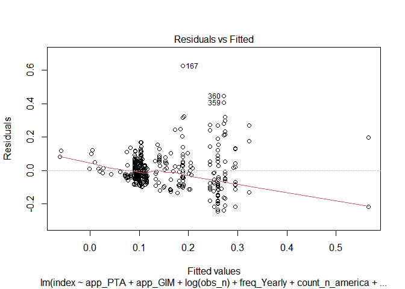
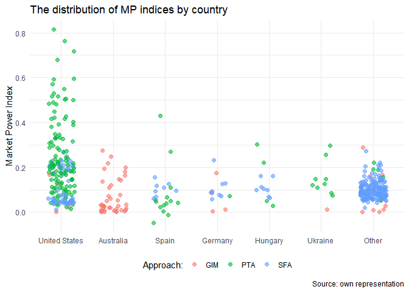

Modeling, Plotting and Regression Tables
================
Mykola Dereva
June 11, 2020

load our cleaned data

``` r
analysis_full <- readRDS(here("data", "clean data", "Analysis_data.Rds"))
```

## Remove Outliers

lets look on the possible outliers

There are few MP values which are considerable higher or lower then
other. This might influence the reliability of research. Thus, I will
drop them

``` r
analysis <- analysis_full %>%
  filter(between(index, 0.005, 1))
```

## Analysis

Select only columns we need for the analysis. Rename columns once again.
And create columns with dummy variables

``` r
glimpse(analysis)
```

    ## Rows: 459
    ## Columns: 31
    ## $ index              <dbl> 0.17600, 0.08900, 0.01100, 0.03684, 0.40190, 0.2...
    ## $ obs_n              <dbl> 60, 60, 60, 24, 24, 23, 23, 120, 108, 28, 48, 15...
    ## $ after_2005         <dbl> 1, 1, 1, 0, 0, 0, 0, 1, 1, 0, 0, 0, 0, 0, 0, 0, ...
    ## $ perish             <dbl> 1, 1, 1, 0, 0, 1, 1, 1, 1, 0, 0, 0, 0, 0, 1, 0, ...
    ## $ mean_pse           <dbl> 34.73444, 34.73444, 34.73444, NaN, NaN, NaN, NaN...
    ## $ mean_pp            <dbl> 1.352539, 1.352539, 1.352539, NaN, NaN, NaN, NaN...
    ## $ sfarm_share        <dbl> 19.69004, 19.69004, 19.69004, NaN, NaN, NaN, NaN...
    ## $ sfarm_share_by_cat <dbl> 8.917172, 8.917172, 8.917172, NaN, NaN, NaN, NaN...
    ## $ start_business     <dbl> 73.24874, 73.24874, 73.24874, NaN, NaN, NaN, NaN...
    ## $ edb_index          <dbl> NaN, NaN, NaN, NaN, NaN, NaN, NaN, NaN, NaN, NaN...
    ## $ weights            <dbl> 0.25000000, 0.25000000, 0.25000000, 0.50000000, ...
    ## $ freq_Monthly       <int> 1, 1, 1, 0, 0, 0, 0, 1, 1, 0, 1, 0, 0, 0, 1, 0, ...
    ## $ freq_Yearly        <int> 0, 0, 0, 1, 1, 1, 1, 0, 0, 1, 0, 1, 1, 1, 0, 1, ...
    ## $ freq_Quaterly      <int> 0, 0, 0, 0, 0, 0, 0, 0, 0, 0, 0, 0, 0, 0, 0, 0, ...
    ## $ freq_Weekly        <int> 0, 0, 0, 0, 0, 0, 0, 0, 0, 0, 0, 0, 0, 0, 0, 0, ...
    ## $ type_Oligopsony    <int> 1, 0, 1, 0, 0, 0, 1, 1, 1, 1, 0, 0, 0, 0, 0, 0, ...
    ## $ type_Oligopoly     <int> 0, 1, 0, 1, 1, 1, 0, 0, 0, 0, 1, 1, 1, 1, 1, 1, ...
    ## $ ind_meat           <int> 1, 1, 1, 0, 0, 1, 1, 1, 1, 0, 0, 0, 0, 0, 0, 0, ...
    ## $ ind_tobacco        <int> 0, 0, 0, 0, 1, 0, 0, 0, 0, 0, 0, 0, 1, 1, 0, 0, ...
    ## $ ind_beverages      <int> 0, 0, 0, 0, 0, 0, 0, 0, 0, 0, 1, 0, 0, 0, 0, 1, ...
    ## $ ind_dairy          <int> 0, 0, 0, 0, 0, 0, 0, 0, 0, 0, 0, 0, 0, 0, 1, 0, ...
    ## $ ind_oils           <int> 0, 0, 0, 0, 0, 0, 0, 0, 0, 0, 0, 0, 0, 0, 0, 0, ...
    ## $ ind_fruits         <int> 0, 0, 0, 0, 0, 0, 0, 0, 0, 0, 0, 0, 0, 0, 0, 0, ...
    ## $ ind_cereals        <int> 0, 0, 0, 0, 0, 0, 0, 0, 0, 0, 0, 0, 0, 0, 0, 0, ...
    ## $ ind_other          <int> 0, 0, 0, 1, 0, 0, 0, 0, 0, 1, 0, 1, 0, 0, 0, 0, ...
    ## $ count_europe       <int> 1, 1, 1, 0, 0, 0, 0, 1, 1, 1, 1, 0, 0, 0, 0, 0, ...
    ## $ count_n_america    <int> 0, 0, 0, 1, 1, 1, 1, 0, 0, 0, 0, 1, 1, 1, 1, 1, ...
    ## $ count_other        <int> 0, 0, 0, 0, 0, 0, 0, 0, 0, 0, 0, 0, 0, 0, 0, 0, ...
    ## $ app_GIM            <int> 1, 1, 1, 0, 0, 0, 0, 0, 0, 0, 1, 0, 0, 0, 1, 0, ...
    ## $ app_PTA            <int> 0, 0, 0, 1, 1, 1, 1, 1, 1, 1, 0, 1, 1, 1, 0, 1, ...
    ## $ app_SFA            <int> 0, 0, 0, 0, 0, 0, 0, 0, 0, 0, 0, 0, 0, 0, 0, 0, ...

``` r
analysis %>%
  summarise_all(~ sum(is.na(.x))) %>%
  gather(column, n_na)
```

    ## # A tibble: 31 x 2
    ##    column              n_na
    ##    <chr>              <int>
    ##  1 index                  0
    ##  2 obs_n                  0
    ##  3 after_2005             0
    ##  4 perish                 0
    ##  5 mean_pse               9
    ##  6 mean_pp                9
    ##  7 sfarm_share          256
    ##  8 sfarm_share_by_cat   258
    ##  9 start_business       140
    ## 10 edb_index            198
    ## # ... with 21 more rows

``` r
log_lm <- lm(log(index) ~ app_PTA + app_GIM 
               #+ obs_n + I(obs_n^2) 
               + log(obs_n) 
               + freq_Yearly 
               + count_n_america + count_europe 
               + after_2005 
               + type_Oligopsony 
               + ind_meat + ind_tobacco + ind_beverages + ind_dairy + ind_oils 
               + ind_fruits + ind_cereals
               #+ perish
               #+ perish*type_Oligopsony
               #+ log(mean_pse) + log(mean_pp)
                 , 
         data = analysis)

summary(log_lm)
```

    ## 
    ## Call:
    ## lm(formula = log(index) ~ app_PTA + app_GIM + log(obs_n) + freq_Yearly + 
    ##     count_n_america + count_europe + after_2005 + type_Oligopsony + 
    ##     ind_meat + ind_tobacco + ind_beverages + ind_dairy + ind_oils + 
    ##     ind_fruits + ind_cereals, data = analysis)
    ## 
    ## Residuals:
    ##      Min       1Q   Median       3Q      Max 
    ## -2.57220 -0.41691 -0.01052  0.44226  2.27365 
    ## 
    ## Coefficients:
    ##                  Estimate Std. Error t value Pr(>|t|)    
    ## (Intercept)     -0.546005   0.537346  -1.016 0.310129    
    ## app_PTA          0.462062   0.183239   2.522 0.012031 *  
    ## app_GIM         -0.363335   0.174093  -2.087 0.037457 *  
    ## log(obs_n)      -0.539077   0.090229  -5.975 4.74e-09 ***
    ## freq_Yearly     -0.759974   0.230329  -3.300 0.001047 ** 
    ## count_n_america  0.607270   0.170960   3.552 0.000423 ***
    ## count_europe     0.006831   0.146648   0.047 0.962868    
    ## after_2005      -0.066885   0.186631  -0.358 0.720231    
    ## type_Oligopsony -0.007631   0.079152  -0.096 0.923242    
    ## ind_meat         0.190574   0.121037   1.575 0.116084    
    ## ind_tobacco      0.442855   0.218972   2.022 0.043732 *  
    ## ind_beverages    0.222085   0.137797   1.612 0.107744    
    ## ind_dairy        0.145207   0.119967   1.210 0.226775    
    ## ind_oils        -0.099872   0.161000  -0.620 0.535366    
    ## ind_fruits       0.167359   0.133277   1.256 0.209879    
    ## ind_cereals      0.246797   0.118756   2.078 0.038268 *  
    ## ---
    ## Signif. codes:  0 '***' 0.001 '**' 0.01 '*' 0.05 '.' 0.1 ' ' 1
    ## 
    ## Residual standard error: 0.6709 on 443 degrees of freedom
    ## Multiple R-squared:  0.3112, Adjusted R-squared:  0.2879 
    ## F-statistic: 13.35 on 15 and 443 DF,  p-value: < 2.2e-16

``` r
analysis %>%
  select(starts_with("ind_"), perish) %>% 
  cor()
```

    ##                 ind_meat ind_tobacco ind_beverages   ind_dairy    ind_oils
    ## ind_meat       1.0000000 -0.06980150   -0.13190220 -0.22151554 -0.09994890
    ## ind_tobacco   -0.0698015  1.00000000   -0.04639829 -0.07792093 -0.03515831
    ## ind_beverages -0.1319022 -0.04639829    1.00000000 -0.14724529 -0.06643780
    ## ind_dairy     -0.2215155 -0.07792093   -0.14724529  1.00000000 -0.11157513
    ## ind_oils      -0.0999489 -0.03515831   -0.06643780 -0.11157513  1.00000000
    ## ind_fruits    -0.1660538 -0.05841156   -0.11037892 -0.18536950 -0.08363963
    ## ind_cereals   -0.2062073 -0.07253606   -0.13706963 -0.23019368 -0.10386452
    ## ind_other     -0.2123641 -0.07470179   -0.14116216 -0.23706664 -0.10696564
    ## perish         0.4602620 -0.15165602   -0.28658071  0.42632072 -0.21715655
    ##                ind_fruits ind_cereals   ind_other     perish
    ## ind_meat      -0.16605383 -0.20620729 -0.21236409  0.4602620
    ## ind_tobacco   -0.05841156 -0.07253606 -0.07470179 -0.1516560
    ## ind_beverages -0.11037892 -0.13706963 -0.14116216 -0.2865807
    ## ind_dairy     -0.18536950 -0.23019368 -0.23706664  0.4263207
    ## ind_oils      -0.08363963 -0.10386452 -0.10696564 -0.2171566
    ## ind_fruits     1.00000000 -0.17255919 -0.17771134  0.3718379
    ## ind_cereals   -0.17255919  1.00000000 -0.22068371 -0.4480216
    ## ind_other     -0.17771134 -0.22068371  1.00000000 -0.3716127
    ## perish         0.37183788 -0.44802157 -0.37161267  1.0000000

``` r
bptest(log_lm)
```

    ## 
    ##  studentized Breusch-Pagan test
    ## 
    ## data:  log_lm
    ## BP = 104.45, df = 15, p-value = 1.861e-15

``` r
plot(log_lm)
```

<!-- --><!-- --><!-- --><!-- -->

seems that we have hetoroscadasticity issue. Lets try to use
heteroscadasticity robust se and to compare it with the regular

``` r
log_lm_se <- vcovHC(log_lm, type = "HC")
log_lm_se <- sqrt(diag(log_lm_se))
log_lm_se
```

    ##     (Intercept)         app_PTA         app_GIM      log(obs_n)     freq_Yearly 
    ##      0.64345849      0.23458109      0.22160851      0.09937002      0.27928552 
    ## count_n_america    count_europe      after_2005 type_Oligopsony        ind_meat 
    ##      0.18676400      0.15500541      0.24478974      0.07391538      0.12713036 
    ##     ind_tobacco   ind_beverages       ind_dairy        ind_oils      ind_fruits 
    ##      0.20783884      0.16368684      0.13342459      0.17085001      0.14177620 
    ##     ind_cereals 
    ##      0.14819032

``` r
stargazer(log_lm, log_lm, se = list(NULL, log_lm_se),
          column.labels = c("default SE", "robust SE"), type = "text",
          omit.stat = c("f", "ser", "n"), align = TRUE)
```

    ## 
    ## ============================================
    ##                     Dependent variable:     
    ##                 ----------------------------
    ##                          log(index)         
    ##                   default SE     robust SE  
    ##                      (1)            (2)     
    ## --------------------------------------------
    ## app_PTA            0.462**        0.462**   
    ##                    (0.183)        (0.235)   
    ##                                             
    ## app_GIM            -0.363**       -0.363    
    ##                    (0.174)        (0.222)   
    ##                                             
    ## log(obs_n)        -0.539***      -0.539***  
    ##                    (0.090)        (0.099)   
    ##                                             
    ## freq_Yearly       -0.760***      -0.760***  
    ##                    (0.230)        (0.279)   
    ##                                             
    ## count_n_america    0.607***      0.607***   
    ##                    (0.171)        (0.187)   
    ##                                             
    ## count_europe        0.007          0.007    
    ##                    (0.147)        (0.155)   
    ##                                             
    ## after_2005          -0.067        -0.067    
    ##                    (0.187)        (0.245)   
    ##                                             
    ## type_Oligopsony     -0.008        -0.008    
    ##                    (0.079)        (0.074)   
    ##                                             
    ## ind_meat            0.191          0.191    
    ##                    (0.121)        (0.127)   
    ##                                             
    ## ind_tobacco        0.443**        0.443**   
    ##                    (0.219)        (0.208)   
    ##                                             
    ## ind_beverages       0.222          0.222    
    ##                    (0.138)        (0.164)   
    ##                                             
    ## ind_dairy           0.145          0.145    
    ##                    (0.120)        (0.133)   
    ##                                             
    ## ind_oils            -0.100        -0.100    
    ##                    (0.161)        (0.171)   
    ##                                             
    ## ind_fruits          0.167          0.167    
    ##                    (0.133)        (0.142)   
    ##                                             
    ## ind_cereals        0.247**        0.247*    
    ##                    (0.119)        (0.148)   
    ##                                             
    ## Constant            -0.546        -0.546    
    ##                    (0.537)        (0.643)   
    ##                                             
    ## --------------------------------------------
    ## R2                  0.311          0.311    
    ## Adjusted R2         0.288          0.288    
    ## ============================================
    ## Note:            *p<0.1; **p<0.05; ***p<0.01

#### Without Log transformation

``` r
lm <- lm(index ~ app_PTA + app_GIM +
               #obs_n + I(obs_n^2) + I(obs_n^3) +
               log(obs_n) +
               freq_Yearly +
               count_n_america + count_europe +
               after_2005 +
               type_Oligopsony +
               ind_meat + ind_tobacco + ind_beverages + ind_dairy + ind_oils +
               ind_fruits + ind_cereals +
               perish +
               log(mean_pse) + log(mean_pp)
                 ,
         data = analysis)
```

    ## Warning in log(mean_pse): NaNs produced

``` r
summary(lm)
```

    ## 
    ## Call:
    ## lm(formula = index ~ app_PTA + app_GIM + log(obs_n) + freq_Yearly + 
    ##     count_n_america + count_europe + after_2005 + type_Oligopsony + 
    ##     ind_meat + ind_tobacco + ind_beverages + ind_dairy + ind_oils + 
    ##     ind_fruits + ind_cereals + perish + log(mean_pse) + log(mean_pp), 
    ##     data = analysis)
    ## 
    ## Residuals:
    ##      Min       1Q   Median       3Q      Max 
    ## -0.24535 -0.04890 -0.01443  0.03547  0.62646 
    ## 
    ## Coefficients:
    ##                  Estimate Std. Error t value Pr(>|t|)    
    ## (Intercept)      0.273842   0.114721   2.387 0.017427 *  
    ## app_PTA          0.136852   0.029252   4.678 3.91e-06 ***
    ## app_GIM          0.063791   0.030939   2.062 0.039836 *  
    ## log(obs_n)      -0.110496   0.014765  -7.483 4.28e-13 ***
    ## freq_Yearly     -0.128743   0.035177  -3.660 0.000285 ***
    ## count_n_america  0.150149   0.033590   4.470 1.01e-05 ***
    ## count_europe    -0.002819   0.030764  -0.092 0.927023    
    ## after_2005       0.068953   0.032077   2.150 0.032155 *  
    ## type_Oligopsony  0.002741   0.011801   0.232 0.816432    
    ## ind_meat         0.073610   0.028164   2.614 0.009280 ** 
    ## ind_tobacco      0.035089   0.033663   1.042 0.297839    
    ## ind_beverages    0.015172   0.020881   0.727 0.467894    
    ## ind_dairy        0.063715   0.025887   2.461 0.014244 *  
    ## ind_oils        -0.015808   0.023936  -0.660 0.509351    
    ## ind_fruits       0.065067   0.028663   2.270 0.023711 *  
    ## ind_cereals      0.012062   0.018800   0.642 0.521477    
    ## perish          -0.072645   0.026174  -2.776 0.005758 ** 
    ## log(mean_pse)    0.038152   0.027846   1.370 0.171390    
    ## log(mean_pp)     0.053707   0.060359   0.890 0.374087    
    ## ---
    ## Signif. codes:  0 '***' 0.001 '**' 0.01 '*' 0.05 '.' 0.1 ' ' 1
    ## 
    ## Residual standard error: 0.09787 on 420 degrees of freedom
    ##   (20 observations deleted due to missingness)
    ## Multiple R-squared:  0.3785, Adjusted R-squared:  0.3519 
    ## F-statistic: 14.21 on 18 and 420 DF,  p-value: < 2.2e-16

``` r
bptest(lm)
```

    ## 
    ##  studentized Breusch-Pagan test
    ## 
    ## data:  lm
    ## BP = 74.546, df = 18, p-value = 7.576e-09

``` r
plot(lm)
```

<!-- --><!-- --><!-- --><!-- -->

``` r
get_robust_se <- function(lm_model)  {
  matrix <- vcovHC(lm_model, type = "HC0")
  robust_se <- sqrt(diag(matrix))
  return(robust_se)
}

get_robust_se(lm)
```

    ##     (Intercept)         app_PTA         app_GIM      log(obs_n)     freq_Yearly 
    ##     0.161267551     0.033365305     0.030026382     0.024609805     0.053141871 
    ## count_n_america    count_europe      after_2005 type_Oligopsony        ind_meat 
    ##     0.034419909     0.017994220     0.040476830     0.006994954     0.029072989 
    ##     ind_tobacco   ind_beverages       ind_dairy        ind_oils      ind_fruits 
    ##     0.046722396     0.027357218     0.029812654     0.030559125     0.028923829 
    ##     ind_cereals          perish   log(mean_pse)    log(mean_pp) 
    ##     0.025716008     0.029542425     0.028045072     0.056274353

## Weighted Least squares

``` r
wls <-  lm(log(index) ~ app_PTA + app_GIM 
               #+ poly(obs_n, 2)
               + log(obs_n) 
               + freq_Yearly 
               + count_n_america + count_europe 
               + after_2005 
               + type_Oligopsony 
               + ind_meat + ind_tobacco + ind_beverages + ind_dairy + ind_oils 
               + ind_fruits + ind_cereals
               + perish
               + log(mean_pse) + log(mean_pp)
                 , 
         data = analysis,
         weights = weights)
```

    ## Warning in log(mean_pse): NaNs produced

``` r
summary(wls)
```

    ## 
    ## Call:
    ## lm(formula = log(index) ~ app_PTA + app_GIM + log(obs_n) + freq_Yearly + 
    ##     count_n_america + count_europe + after_2005 + type_Oligopsony + 
    ##     ind_meat + ind_tobacco + ind_beverages + ind_dairy + ind_oils + 
    ##     ind_fruits + ind_cereals + perish + log(mean_pse) + log(mean_pp), 
    ##     data = analysis, weights = weights)
    ## 
    ## Weighted Residuals:
    ##      Min       1Q   Median       3Q      Max 
    ## -1.12607 -0.06683  0.00305  0.06788  1.05471 
    ## 
    ## Coefficients:
    ##                 Estimate Std. Error t value Pr(>|t|)    
    ## (Intercept)     -3.18169    0.32976  -9.648  < 2e-16 ***
    ## app_PTA          0.16260    0.11088   1.466 0.143268    
    ## app_GIM         -0.31389    0.12604  -2.490 0.013146 *  
    ## log(obs_n)      -0.56595    0.04833 -11.711  < 2e-16 ***
    ## freq_Yearly     -0.72927    0.10323  -7.065 6.73e-12 ***
    ## count_n_america -0.01510    0.15413  -0.098 0.921986    
    ## count_europe    -1.00953    0.16253  -6.211 1.27e-09 ***
    ## after_2005       0.15059    0.10226   1.473 0.141609    
    ## type_Oligopsony  0.33029    0.08635   3.825 0.000151 ***
    ## ind_meat         0.04356    0.27431   0.159 0.873906    
    ## ind_tobacco     -0.07701    0.21221  -0.363 0.716863    
    ## ind_beverages    0.03599    0.14652   0.246 0.806118    
    ## ind_dairy        0.32822    0.25520   1.286 0.199110    
    ## ind_oils        -0.38831    0.24275  -1.600 0.110426    
    ## ind_fruits       0.11822    0.33498   0.353 0.724332    
    ## ind_cereals     -0.02789    0.19390  -0.144 0.885716    
    ## perish          -0.77194    0.25510  -3.026 0.002631 ** 
    ## log(mean_pse)    1.28626    0.12070  10.657  < 2e-16 ***
    ## log(mean_pp)    -0.92497    0.24456  -3.782 0.000178 ***
    ## ---
    ## Signif. codes:  0 '***' 0.001 '**' 0.01 '*' 0.05 '.' 0.1 ' ' 1
    ## 
    ## Residual standard error: 0.1854 on 420 degrees of freedom
    ##   (20 observations deleted due to missingness)
    ## Multiple R-squared:  0.5762, Adjusted R-squared:  0.558 
    ## F-statistic: 31.72 on 18 and 420 DF,  p-value: < 2.2e-16

``` r
bptest(wls)
```

    ## 
    ##  studentized Breusch-Pagan test
    ## 
    ## data:  wls
    ## BP = 83.809, df = 18, p-value = 1.832e-10

``` r
plot(wls)
```

<!-- --><!-- --><!-- --><!-- -->

``` r
model_1 <- lm(log(index) ~ app_PTA + app_GIM 
               + log(obs_n) 
               + freq_Yearly 
               + count_n_america + count_europe 
               + after_2005 
               + type_Oligopsony 
               + ind_meat + ind_tobacco + ind_beverages + ind_dairy + ind_oils 
               + ind_fruits + ind_cereals, 
         data = analysis)
se_1 <- get_robust_se(model_1)

model_2 <- lm(log(index) ~ app_PTA + app_GIM 
               + log(obs_n) 
               + freq_Yearly 
               + count_n_america + count_europe 
               + after_2005 
               + type_Oligopsony 
               + ind_meat + ind_tobacco + ind_beverages + ind_dairy + ind_oils 
               + ind_fruits + ind_cereals, 
         data = analysis, weights = weights)
se_2 <- get_robust_se(model_2)

model_3 <- lm(log(index) ~ app_PTA + app_GIM 
               + log(obs_n) 
               + freq_Yearly 
               + count_n_america + count_europe 
               + after_2005 
               + type_Oligopsony 
               + ind_meat + ind_tobacco + ind_beverages + ind_dairy + ind_oils 
               + ind_fruits + ind_cereals
               + perish
               + log(mean_pse) + log(mean_pp), 
         data = analysis)
```

    ## Warning in log(mean_pse): NaNs produced

``` r
se_3 <- get_robust_se(model_3)


model_4 <- lm(log(index) ~ app_PTA + app_GIM 
               + log(obs_n) 
               + freq_Yearly 
               + count_n_america + count_europe 
               + after_2005 
               + type_Oligopsony 
               + ind_meat + ind_tobacco + ind_beverages + ind_dairy + ind_oils 
               + ind_fruits + ind_cereals
               + perish
               + log(mean_pse) + log(mean_pp), 
         data = analysis, weights = weights)
```

    ## Warning in log(mean_pse): NaNs produced

``` r
se_4 <- get_robust_se(model_4)

stargazer(model_1, model_2, model_3, model_4,
          type = "text",
          keep.stat = c("n", "rsq", "adj.rsq"),
          title = "Analysis Results",
          column.labels =  c("OLS 1", "WLS 1", "OLS 2", "WLS 2"),
          dep.var.labels = "Market Power Index (log transformed)",
          se = list(se_1, se_2, se_3, se_4),
          align = TRUE,
          intercept.bottom = FALSE,
          out = "Tables/WLS.doc"
          )
```

    ## 
    ## Analysis Results
    ## =======================================================
    ##                           Dependent variable:          
    ##                 ---------------------------------------
    ##                  Market Power Index (log transformed)  
    ##                   OLS 1     WLS 1     OLS 2     WLS 2  
    ##                    (1)       (2)       (3)       (4)   
    ## -------------------------------------------------------
    ## Constant         -0.546    -0.653   -2.104**  -3.182***
    ##                  (0.643)   (0.745)   (0.946)   (0.725) 
    ##                                                        
    ## app_PTA          0.462**   0.612*    0.554**    0.163  
    ##                  (0.235)   (0.326)   (0.230)   (0.236) 
    ##                                                        
    ## app_GIM          -0.363    -0.104     0.146    -0.314  
    ##                  (0.222)   (0.460)   (0.263)   (0.302) 
    ##                                                        
    ## log(obs_n)      -0.539*** -0.471*** -0.696*** -0.566***
    ##                  (0.099)   (0.127)   (0.104)   (0.100) 
    ##                                                        
    ## freq_Yearly     -0.760***  -0.460   -0.718*** -0.729***
    ##                  (0.279)   (0.358)   (0.264)   (0.236) 
    ##                                                        
    ## count_n_america 0.607***    0.253   0.916***   -0.015  
    ##                  (0.187)   (0.327)   (0.190)   (0.305) 
    ##                                                        
    ## count_europe      0.007     0.007    -0.082   -1.010***
    ##                  (0.155)   (0.292)   (0.128)   (0.320) 
    ##                                                        
    ## after_2005       -0.067     0.133     0.235     0.151  
    ##                  (0.245)   (0.385)   (0.266)   (0.273) 
    ##                                                        
    ## type_Oligopsony  -0.008    -0.121     0.021     0.330  
    ##                  (0.074)   (0.252)   (0.070)   (0.204) 
    ##                                                        
    ## ind_meat          0.191    -0.253   0.560***    0.044  
    ##                  (0.127)   (0.278)   (0.162)   (0.314) 
    ##                                                        
    ## ind_tobacco      0.443**    0.310     0.284    -0.077  
    ##                  (0.208)   (0.305)   (0.227)   (0.238) 
    ##                                                        
    ## ind_beverages     0.222     0.005     0.100     0.036  
    ##                  (0.164)   (0.290)   (0.164)   (0.255) 
    ##                                                        
    ## ind_dairy         0.145    -0.348   0.464***   0.328*  
    ##                  (0.133)   (0.343)   (0.156)   (0.190) 
    ##                                                        
    ## ind_oils         -0.100    -0.436    -0.137    -0.388  
    ##                  (0.171)   (0.269)   (0.175)   (0.245) 
    ##                                                        
    ## ind_fruits        0.167    -0.522*  0.533***    0.118  
    ##                  (0.142)   (0.268)   (0.168)   (0.234) 
    ##                                                        
    ## ind_cereals      0.247*    -0.114     0.206    -0.028  
    ##                  (0.148)   (0.310)   (0.161)   (0.228) 
    ##                                                        
    ## perish                              -0.436*** -0.772***
    ##                                      (0.162)   (0.205) 
    ##                                                        
    ## log(mean_pse)                        0.522**  1.286*** 
    ##                                      (0.204)   (0.229) 
    ##                                                        
    ## log(mean_pp)                          0.110   -0.925** 
    ##                                      (0.353)   (0.363) 
    ##                                                        
    ## -------------------------------------------------------
    ## Observations       459       459       439       439   
    ## R2                0.311     0.366     0.353     0.576  
    ## Adjusted R2       0.288     0.344     0.325     0.558  
    ## =======================================================
    ## Note:                       *p<0.1; **p<0.05; ***p<0.01

## Tobit model

``` r
library(censReg)
```

``` r
tobit <- censReg(index ~ app_PTA + app_GIM +
               #obs_n + I(obs_n^2) + I(obs_n^3) +
               log(obs_n) +
               freq_Yearly +
               count_n_america + count_europe +
               after_2005 +
               type_Oligopsony +
               ind_meat + ind_tobacco + ind_beverages + ind_dairy + ind_oils +
               ind_fruits + ind_cereals +
               perish +
               log(mean_pse) #+ log(mean_pp)
                 ,
                 data = analysis_full)
```

    ## Warning in log(mean_pse): NaNs produced

    ## Warning in censReg(index ~ app_PTA + app_GIM + log(obs_n) + freq_Yearly + : at
    ## least one value of the endogenous variable is smaller than the left limit

``` r
summary(tobit)
```

    ## 
    ## Call:
    ## censReg(formula = index ~ app_PTA + app_GIM + log(obs_n) + freq_Yearly + 
    ##     count_n_america + count_europe + after_2005 + type_Oligopsony + 
    ##     ind_meat + ind_tobacco + ind_beverages + ind_dairy + ind_oils + 
    ##     ind_fruits + ind_cereals + perish + log(mean_pse), data = analysis_full)
    ## 
    ## Observations:
    ##          Total  Left-censored     Uncensored Right-censored 
    ##            451              2            449              0 
    ## 
    ## Coefficients:
    ##                  Estimate Std. error t value  Pr(> t)    
    ## (Intercept)      0.226082   0.099942   2.262 0.023690 *  
    ## app_PTA          0.137970   0.028317   4.872 1.10e-06 ***
    ## app_GIM          0.054832   0.028590   1.918 0.055128 .  
    ## log(obs_n)      -0.111269   0.013770  -8.081 6.43e-16 ***
    ## freq_Yearly     -0.129507   0.033614  -3.853 0.000117 ***
    ## count_n_america  0.145127   0.029594   4.904 9.39e-07 ***
    ## count_europe    -0.018503   0.028778  -0.643 0.520263    
    ## after_2005       0.079073   0.030995   2.551 0.010736 *  
    ## type_Oligopsony  0.004152   0.011262   0.369 0.712366    
    ## ind_meat         0.068390   0.027518   2.485 0.012944 *  
    ## ind_tobacco      0.040311   0.032931   1.224 0.220917    
    ## ind_beverages    0.022733   0.020254   1.122 0.261692    
    ## ind_dairy        0.062389   0.025352   2.461 0.013859 *  
    ## ind_oils        -0.013025   0.022940  -0.568 0.570164    
    ## ind_fruits       0.062246   0.028064   2.218 0.026553 *  
    ## ind_cereals      0.010977   0.017382   0.632 0.527699    
    ## perish          -0.067896   0.025477  -2.665 0.007699 ** 
    ## log(mean_pse)    0.056728   0.020634   2.749 0.005973 ** 
    ## logSigma        -2.339524   0.033405 -70.034  < 2e-16 ***
    ## ---
    ## Signif. codes:  0 '***' 0.001 '**' 0.01 '*' 0.05 '.' 0.1 ' ' 1
    ## 
    ## Newton-Raphson maximisation, 9 iterations
    ## Return code 1: gradient close to zero
    ## Log-likelihood: 410.9705 on 19 Df

``` r
model_1 <- lm(log(index) ~ app_PTA + app_GIM + type_Oligopoly, 
                        data = analysis)
se_1 <- get_robust_se(model_1)

model_2 <- lm(log(index) ~ app_PTA + app_GIM +
                type_Oligopoly +
                after_2005 +
                freq_Yearly +
                count_n_america + count_europe, 
         data = analysis)
se_2 <- get_robust_se(model_2)

model_3 <- lm(log(index) ~ app_PTA + app_GIM +
                type_Oligopoly +
                obs_n + after_2005 +
                freq_Yearly +
                count_n_america + count_europe +
                ind_dairy + ind_meat + ind_beverages + ind_cereals + ind_oils,
         data = analysis)
se_3 <- get_robust_se(model_3)


model_4 <- lm(log(index) ~ app_PTA + app_GIM +
                type_Oligopoly +
                obs_n +
                count_n_america +
                ind_dairy + ind_meat + ind_beverages + ind_cereals + ind_oils +
                log(mean_pp) + log(mean_pse),
         data = analysis)
```

    ## Warning in log(mean_pse): NaNs produced

``` r
se_4 <- get_robust_se(model_4)
```

## Summary tables

``` r
stargazer(model_1, model_2, model_3, model_4, tobit,
          type = "text",
          keep.stat = c("n", "rsq", "adj.rsq"),
          title = "Analysis Results",
          #column.labels =  c("Model 1", "Model 2", "Model 3"),
          dep.var.labels = "Market Power Index (log transformed)",
          se = list(se_1, se_2, se_3, se_4),
          align = TRUE,
          intercept.bottom = FALSE
          )
```

    ## 
    ## Analysis Results
    ## ==================================================================
    ##                                Dependent variable:                
    ##                 --------------------------------------------------
    ##                  Market Power Index (log transformed)     index  
    ##                                   OLS                   censored 
    ##                                                         regression
    ##                    (1)       (2)       (3)       (4)       (5)    
    ## ------------------------------------------------------------------
    ## Constant        -2.444*** -2.533*** -2.006*** -4.104***  0.226**  
    ##                  (0.049)   (0.431)   (0.476)   (0.543)   (0.100)  
    ##                                                                   
    ## app_PTA         0.595***   0.469**   0.532**  0.493***   0.138*** 
    ##                  (0.076)   (0.220)   (0.216)   (0.102)   (0.028)  
    ##                                                                   
    ## app_GIM         -0.534*** -0.472**   -0.375*    0.066     0.055*  
    ##                  (0.154)   (0.214)   (0.218)   (0.201)   (0.029)  
    ##                                                                   
    ## type_Oligopoly    0.086    -0.013    -0.003    -0.044             
    ##                  (0.069)   (0.077)   (0.073)   (0.073)            
    ##                                                                   
    ## obs_n                               -0.009*** -0.007***           
    ##                                      (0.002)   (0.002)            
    ##                                                                   
    ## log(obs_n)                                              -0.111*** 
    ##                                                          (0.014)  
    ##                                                                   
    ## after_2005                 -0.136    -0.033              0.079**  
    ##                            (0.225)   (0.227)             (0.031)  
    ##                                                                   
    ## type_Oligopsony                                           0.004   
    ##                                                          (0.011)  
    ##                                                                   
    ## freq_Yearly                 0.178    -0.498*            -0.130*** 
    ##                            (0.224)   (0.266)             (0.034)  
    ##                                                                   
    ## count_n_america             0.186    0.431**  0.487***   0.145*** 
    ##                            (0.174)   (0.178)   (0.122)   (0.030)  
    ##                                                                   
    ## count_europe                0.086     0.141               -0.019  
    ##                            (0.153)   (0.152)             (0.029)  
    ##                                                                   
    ## ind_dairy                             0.022     0.027    0.062**  
    ##                                      (0.090)   (0.088)   (0.025)  
    ##                                                                   
    ## ind_meat                              0.089     0.069    0.068**  
    ##                                      (0.086)   (0.087)   (0.028)  
    ##                                                                   
    ## ind_tobacco                                               0.040   
    ##                                                          (0.033)  
    ##                                                                   
    ## ind_beverages                         0.068    -0.016     0.023   
    ##                                      (0.149)   (0.145)   (0.020)  
    ##                                                                   
    ## ind_cereals                          0.183*    0.181*     0.011   
    ##                                      (0.105)   (0.104)   (0.017)  
    ##                                                                   
    ## perish                                                  -0.068*** 
    ##                                                          (0.025)  
    ##                                                                   
    ## ind_oils                             -0.195    -0.210     -0.013  
    ##                                      (0.160)   (0.157)   (0.023)  
    ##                                                                   
    ## log(mean_pp)                                   -0.561             
    ##                                                (0.373)            
    ##                                                                   
    ## ind_fruits                                               0.062**  
    ##                                                          (0.028)  
    ##                                                                   
    ## log(mean_pse)                                 0.557***   0.057*** 
    ##                                                (0.174)   (0.021)  
    ##                                                                   
    ## logSigma                                                -2.340*** 
    ##                                                          (0.033)  
    ##                                                                   
    ## ------------------------------------------------------------------
    ## Observations       459       459       459       439       451    
    ## R2                0.224     0.236     0.283     0.295             
    ## Adjusted R2       0.219     0.224     0.262     0.275             
    ## ==================================================================
    ## Note:                                  *p<0.1; **p<0.05; ***p<0.01

``` r
model_1 <- lm(log(index) ~ app_PTA + app_GIM +
               log(obs_n) +
               freq_Yearly +
               count_n_america + count_europe +
               after_2005 +
               type_Oligopsony +
               ind_meat + ind_tobacco + ind_beverages + ind_dairy + ind_oils +
               ind_fruits + ind_cereals +
               perish +
               log(mean_pse)
                 ,
               data = analysis)
```

    ## Warning in log(mean_pse): NaNs produced

``` r
se_1 <- get_robust_se(model_1)

model_2 <- lm(log(index) ~ app_PTA + app_GIM +
               obs_n + I(obs_n^2) +
               freq_Yearly +
               count_n_america + count_europe +
               after_2005 +
               type_Oligopsony +
               ind_meat + ind_tobacco + ind_beverages + ind_dairy + ind_oils +
               ind_fruits + ind_cereals +
               perish +
               log(mean_pse)
                 ,
         data = analysis)
```

    ## Warning in log(mean_pse): NaNs produced

``` r
se_2 <- get_robust_se(model_2)


stargazer(model_1, model_2,
          type = "text",
          keep.stat = c("n", "rsq", "adj.rsq"),
          title = "Analysis Results",
          #column.labels =  c("Model 1", "Model 2", "Model 3"),
          dep.var.labels = "Market Power Index (log transformed)",
          se = list(se_1, se_2),
          align = TRUE,
          intercept.bottom = FALSE
          )
```

    ## 
    ## Analysis Results
    ## =====================================================
    ##                          Dependent variable:         
    ##                 -------------------------------------
    ##                 Market Power Index (log transformed) 
    ##                         (1)                (2)       
    ## -----------------------------------------------------
    ## Constant             -2.199**           -3.510***    
    ##                       (0.869)            (0.780)     
    ##                                                      
    ## app_PTA               0.559**           0.617***     
    ##                       (0.228)            (0.213)     
    ##                                                      
    ## app_GIM                0.158              0.226      
    ##                       (0.254)            (0.248)     
    ##                                                      
    ## log(obs_n)           -0.688***                       
    ##                       (0.100)                        
    ##                                                      
    ## obs_n                                   -0.031***    
    ##                                          (0.005)     
    ##                                                      
    ## I(obs_n2)                               0.0001***    
    ##                                         (0.00001)    
    ##                                                      
    ## freq_Yearly          -0.707***          -1.031***    
    ##                       (0.259)            (0.269)     
    ##                                                      
    ## count_n_america      0.892***           0.835***     
    ##                       (0.201)            (0.190)     
    ##                                                      
    ## count_europe          -0.098             -0.063      
    ##                       (0.141)            (0.130)     
    ##                                                      
    ## after_2005             0.238              0.346      
    ##                       (0.265)            (0.249)     
    ##                                                      
    ## type_Oligopsony        0.019              0.025      
    ##                       (0.069)            (0.068)     
    ##                                                      
    ## ind_meat             0.555***           0.568***     
    ##                       (0.160)            (0.166)     
    ##                                                      
    ## ind_tobacco            0.279              0.314      
    ##                       (0.224)            (0.218)     
    ##                                                      
    ## ind_beverages          0.096              0.086      
    ##                       (0.162)            (0.161)     
    ##                                                      
    ## ind_dairy            0.460***           0.469***     
    ##                       (0.154)            (0.157)     
    ##                                                      
    ## ind_oils              -0.142             -0.127      
    ##                       (0.173)            (0.173)     
    ##                                                      
    ## ind_fruits           0.528***           0.549***     
    ##                       (0.165)            (0.170)     
    ##                                                      
    ## ind_cereals            0.197              0.244      
    ##                       (0.153)            (0.152)     
    ##                                                      
    ## perish               -0.441***          -0.406**     
    ##                       (0.159)            (0.162)     
    ##                                                      
    ## log(mean_pse)        0.555***           0.613***     
    ##                       (0.172)            (0.161)     
    ##                                                      
    ## -----------------------------------------------------
    ## Observations            439                439       
    ## R2                     0.352              0.356      
    ## Adjusted R2            0.326              0.328      
    ## =====================================================
    ## Note:                     *p<0.1; **p<0.05; ***p<0.01

### Lets check if type there influence of industry on the MPI

``` r
industry <- matchCoefs(model_3, "ind") # extract all industry dummies
F_test_ind <-  linearHypothesis(model_3, industry, white.adjust = "hc1")
F_test_ind
```

    ## Linear hypothesis test
    ## 
    ## Hypothesis:
    ## ind_dairy = 0
    ## ind_meat = 0
    ## ind_beverages = 0
    ## ind_cereals = 0
    ## ind_oils = 0
    ## 
    ## Model 1: restricted model
    ## Model 2: log(index) ~ app_PTA + app_GIM + type_Oligopoly + obs_n + after_2005 + 
    ##     freq_Yearly + count_n_america + count_europe + ind_dairy + 
    ##     ind_meat + ind_beverages + ind_cereals + ind_oils
    ## 
    ## Note: Coefficient covariance matrix supplied.
    ## 
    ##   Res.Df Df      F Pr(>F)
    ## 1    450                 
    ## 2    445  5 1.2824 0.2703

Therefore we reject 0 hypothesis that all types of industry have zero
coefficient.

### Determinants of each approach

Finally lets make a linear model for each approach and check if there is
any significant differences in coefficients between them

``` r
GIM <- lm(log(index) ~ type_Oligopoly +
                obs_n + after_2005 +
                freq_Yearly + freq_Quaterly +
                count_n_america + count_europe +
                ind_dairy + ind_meat + ind_beverages + ind_cereals + ind_oils,
         data = subset(analysis, app_GIM == 1)) 

PTA <- lm(log(index) ~ type_Oligopoly +
                obs_n + after_2005 + 
                freq_Yearly + freq_Quaterly +
                count_n_america + count_europe +
                ind_dairy + ind_meat + ind_beverages + ind_cereals + ind_oils, 
         data = subset(analysis, app_PTA == 1))

SFA <- lm(log(index) ~ type_Oligopoly +
                obs_n + after_2005 + 
                freq_Yearly + freq_Quaterly +
                count_n_america + count_europe +
                ind_dairy + ind_meat + ind_beverages + ind_cereals + ind_oils, 
         data = subset(analysis, app_SFA == 1)) 
```

``` r
bptest(SFA)
```

    ## 
    ##  studentized Breusch-Pagan test
    ## 
    ## data:  SFA
    ## BP = 39.194, df = 10, p-value = 2.348e-05

``` r
bptest(PTA)
```

    ## 
    ##  studentized Breusch-Pagan test
    ## 
    ## data:  PTA
    ## BP = 17.178, df = 12, p-value = 0.143

``` r
bptest(GIM)
```

    ## 
    ##  studentized Breusch-Pagan test
    ## 
    ## data:  GIM
    ## BP = 6.8178, df = 11, p-value = 0.8136

According to bptest there is no evidence of heteroscadasticity, so we
can use default SE

``` r
stargazer(GIM, PTA, SFA,
          type = "text",
          omit.stat = c("f", "ser"), 
          title = "Analysis Results",
          column.labels =  c("GIM", "PTA", "SFA"),
          dep.var.labels = "Market Power Index (log transformed)",
          align = TRUE,
          intercept.bottom = FALSE
          )
```

    ## 
    ## Analysis Results
    ## ======================================================
    ##                          Dependent variable:          
    ##                 --------------------------------------
    ##                  Market Power Index (log transformed) 
    ##                     GIM          PTA          SFA     
    ##                     (1)          (2)          (3)     
    ## ------------------------------------------------------
    ## Constant           -1.797     -2.731***     2.328***  
    ##                   (1.189)      (0.596)      (0.545)   
    ##                                                       
    ## type_Oligopoly     -0.350       -0.149       0.101*   
    ##                   (0.298)      (0.354)      (0.052)   
    ##                                                       
    ## obs_n              0.002        -0.005     -0.093***  
    ##                   (0.006)      (0.003)      (0.008)   
    ##                                                       
    ## after_2005       -1.805***     0.943**                
    ##                   (0.643)      (0.463)                
    ##                                                       
    ## freq_Yearly        -0.052       0.970      -3.779***  
    ##                   (0.883)      (0.728)      (0.500)   
    ##                                                       
    ## freq_Quaterly                   0.835                 
    ##                                (0.719)                
    ##                                                       
    ## count_n_america    0.037        0.214       1.487***  
    ##                   (0.685)      (0.616)      (0.206)   
    ##                                                       
    ## count_europe       0.330        -0.828       -0.057   
    ##                   (0.623)      (0.561)      (0.135)   
    ##                                                       
    ## ind_dairy          -0.325       0.221       -0.156**  
    ##                   (0.722)      (0.221)      (0.068)   
    ##                                                       
    ## ind_meat           0.429        0.089        0.097    
    ##                   (0.902)      (0.238)      (0.068)   
    ##                                                       
    ## ind_beverages      -0.531       0.375*       -0.154   
    ##                   (0.625)      (0.197)      (0.138)   
    ##                                                       
    ## ind_cereals       1.247***      0.305       -0.155**  
    ##                   (0.403)      (0.279)      (0.069)   
    ##                                                       
    ## ind_oils           0.008        0.244        -0.280   
    ##                   (0.595)      (0.226)      (0.179)   
    ##                                                       
    ## ------------------------------------------------------
    ## Observations         54          147          258     
    ## R2                 0.384        0.250        0.441    
    ## Adjusted R2        0.223        0.183        0.418    
    ## ======================================================
    ## Note:                      *p<0.1; **p<0.05; ***p<0.01

I think I am done with the analysis

# Summary Tables

I will work with dataset “clean” again

``` r
clean <- readRDS(here("data", "clean data", "Full_data.Rds"))
```

First of all lets create column with first author and year to uniquely
identify an article

``` r
clean <- clean %>%
  mutate(article_ref = str_c(
           str_match(authors, pattern = "^\\w[’]*\\w+" ),
           " (", year, ")")
         ) 

head(clean$article_ref, 20)
```

    ##  [1] "Anders (2008)"     "Anders (2008)"     "Anders (2008)"    
    ##  [4] "Anders (2008)"     "Appelbaum (1982)"  "Appelbaum (1982)" 
    ##  [7] "Azzam (1990)"      "Azzam (1990)"      "Bakucs (2009)"    
    ## [10] "Bakucs (2009)"     "Bergman (1995)"    "Bettendorf (2000)"
    ## [13] "Bhuyan (1997)"     "Bhuyan (1997)"     "Bhuyan (1997)"    
    ## [16] "Chidmi (2005)"     "Chirinko (1994)"   "Chirinko (1994)"  
    ## [19] "Genesove (1998)"   "Hockmann (2009)"

summary table of all articles used in analysis

``` r
#replace misspeled value
clean <- clean %>%
  mutate(data_freq = str_replace(data_freq, "Quaterly", "Quarterly")) 
```

### Table 1. List of studies

``` r
table_1 <- clean %>%
  group_by(article_ref, approach, mp_type, data_freq, period) %>%
  summarise(N = n()) %>%
  adorn_totals("row")
```

    ## `summarise()` regrouping output by 'article_ref', 'approach', 'mp_type', 'data_freq' (override with `.groups` argument)

``` r
head(table_1)
```

    ##       article_ref approach    mp_type data_freq    period N
    ##        Ahn (2010)      GIM  Oligopoly    Yearly 1975-2002 1
    ##     Anders (2008)      GIM Oligopsony   Monthly 1995-2000 2
    ##     Anders (2008)      GIM  Oligopoly   Monthly 1995-2000 2
    ##  Appelbaum (1982)      PTA  Oligopoly    Yearly 1947–1971 2
    ##      Azzam (1990)      PTA Oligopsony    Yearly 1959-1982 1
    ##      Azzam (1990)      PTA  Oligopoly    Yearly 1959-1982 1

``` r
table_1 %>%
  stargazer(type = output,
            style = "aer",
            title = "List of studies used",
            summary = FALSE, rownames = FALSE,
            out = "Tables/1.List of studies.doc"
            )
```

    ## 
    ## List of studies used
    ## ===============================================================
    ## article_ref         approach  mp_type   data_freq  period    N 
    ## ---------------------------------------------------------------
    ## Ahn (2010)            GIM    Oligopoly   Yearly   1975-2002  1 
    ## Anders (2008)         GIM    Oligopsony  Monthly  1995-2000  2 
    ## Anders (2008)         GIM    Oligopoly   Monthly  1995-2000  2 
    ## Appelbaum (1982)      PTA    Oligopoly   Yearly   1947–1971  2 
    ## Azzam (1990)          PTA    Oligopsony  Yearly   1959-1982  1 
    ## Azzam (1990)          PTA    Oligopoly   Yearly   1959-1982  1 
    ## Bakucs (2009)         PTA    Oligopsony  Monthly  1993-2003  1 
    ## Bakucs (2009)         PTA    Oligopsony  Monthly  1995-2004  1 
    ## Bergman (1995)        PTA    Oligopsony  Yearly   1960-1988  1 
    ## Bettendorf (2000)     GIM    Oligopoly   Monthly  1992-1996  1 
    ## Bhuyan (1997)         PTA    Oligopoly   Yearly   1972-1987  3 
    ## Bhuyan (1998)         PTA    Oligopoly   Yearly   1972-1987 38 
    ## Cechura (2015)        SFA    Oligopoly   Yearly   2003-2012 25 
    ## Chen (2018)           GIM    Oligopsony  Monthly  2008-2016  1 
    ## Chidmi (2005)         GIM    Oligopoly   Monthly  1996-2000  1 
    ## Chirinko (1994)       PTA    Oligopoly   Yearly   1973-1986  1 
    ## Chirinko (1994)       PTA    Oligopoly   Yearly   1973-1987  1 
    ## De (1999)             PTA    Oligopoly   Yearly   1962-1991  1 
    ## Genesove (1998)       GIM    Oligopoly   Yearly   1890-1914  1 
    ## Hockmann (2009)       PTA    Oligopsony  Monthly  1998-2006  1 
    ## Hovhannisyan (2012)   GIM    Oligopoly   Weekly   2001-2006  1 
    ## Ji (2016)             PTA    Oligopsony  Monthly  1980-2009  1 
    ## Kumbhakar (2012)      SFA    Oligopoly   Yearly   1974-1991  2 
    ## Lopez (1984)          PTA    Oligopoly   Yearly   1965-1979  1 
    ## Lopez (1993)          GIM    Oligopsony  Yearly   1954-1984  1 
    ## Lopez (2002)          PTA    Oligopoly   Yearly   1972-1997 25 
    ## Lopez (2017)          SFA    Oligopoly   Yearly   1990-2010 23 
    ## Lukas (2014)          SFA    Oligopsony  Yearly   2003-2012 94 
    ## Lukas (2014)          SFA    Oligopoly   Yearly   2003-2012 70 
    ## Mei (2008)            PTA    Oligopsony  Yearly   1955-2003  1 
    ## Mei (2008)            PTA    Oligopoly   Yearly   1955-2003  1 
    ## Merel (2009)          GIM    Oligopoly  Quarterly 1985-2005  1 
    ## Millan (1999)         PTA    Oligopoly   Yearly   1978-1992 14 
    ## Murray (1995)         PTA    Oligopsony  Yearly   1958-1988  1 
    ## Murray (1995)         PTA    Oligopsony  Yearly   1958-1989  1 
    ## Muth (1999)           GIM    Oligopsony  Yearly   1967-1993  1 
    ## O’Donnell (2007)      GIM    Oligopsony  Yearly   1989-2000 28 
    ## O’Donnell (2007)      GIM    Oligopoly   Yearly   1989-2000 12 
    ## Panagiotou (2015)     SFA    Oligopsony  Yearly   1970-2009  1 
    ## Panagiotou (2016)     SFA    Oligopsony  Yearly   1970-2009  2 
    ## Panagiotou (2018)     SFA    Oligopsony  Yearly   1970-2010  3 
    ## Perekhozhuk (2013)    PTA    Oligopsony  Yearly   1993-2006  1 
    ## Perekhozhuk (2013)    PTA    Oligopsony  Yearly   1993-2007  1 
    ## Perekhozhuk (2014)    PTA    Oligopsony  Monthly  1996-2003  1 
    ## Perekhozhuk (2016)    GIM    Oligopsony  Monthly  1996-2003  1 
    ## Perekhozhuk (2016)    PTA    Oligopsony  Monthly  1996-2003  8 
    ## Rigoberto (2015)      SFA    Oligopoly   Yearly   1979-2009 36 
    ## Salhofer (2011)       GIM    Oligopsony  Monthly  1997-2008  1 
    ## Salhofer (2011)       GIM    Oligopoly   Monthly  1997-2008  1 
    ## Sanjib (1997)         PTA    Oligopoly   Yearly   1972-1987 37 
    ## Scalco (2014)         GIM    Oligopsony  Yearly   1997-2011  1 
    ## Scalco (2016)         SFA    Oligopsony  Monthly  2010-2015  1 
    ## Scalco (2016)         SFA    Oligopoly   Monthly  2010-2015  1 
    ## Silva (2019)          PTA    Oligopsony Quarterly 2016-2017  2 
    ## Stalgiene (2017)      PTA    Oligopsony Quarterly 2004-2014  3 
    ## Suzuki (1993)         GIM    Oligopoly   Yearly   1979-1989  1 
    ## Weerahewa (2003)      GIM    Oligopsony  Yearly   1970-2000  3 
    ## Weerahewa (2003)      GIM    Oligopoly   Yearly   1970-2000  3 
    ## Total                  -         -          -         -     472
    ## ---------------------------------------------------------------

### Table 2. Number of observations by country

``` r
table_2 <-  clean %>%
  mutate(country = as_factor(country) %>%
           fct_infreq() %>%
           fct_lump_min(min = 3) 
         ) %>%
  group_by(country) %>%
  summarise(n = n(), 
            mean_mp = round(mean(mp_index), 4)
            ) %>%
  ungroup() %>%
  mutate(prop = round(n / sum(n) * 100, 2) ) %>%
  select(country, n, prop, mean_mp) %>%
  adorn_totals("row")
```

    ## `summarise()` ungrouping output (override with `.groups` argument)

``` r
table_2 %>%
  stargazer(type = output,
            style = "aer",
            title = "Summary of MP observations by country",
            summary = FALSE, rownames = FALSE,
            out = "Tables/2.List of countries.doc")
```

    ## 
    ## Summary of MP observations by country
    ## ================================
    ## country         n  prop  mean_mp
    ## --------------------------------
    ## United States  186 39.41 0.1968 
    ## Australia      40  8.47  0.0703 
    ## Spain          22  4.66  0.0879 
    ## Germany        13  2.75  0.0942 
    ## Hungary        12  2.54  0.1224 
    ## Ukraine        10  2.12  0.1378 
    ## Sweden          9  1.91   0.11  
    ## Netherlands     9  1.91  0.1204 
    ## France          9  1.91  0.1027 
    ## United Kingdom  9  1.91  0.0846 
    ## Portugal        9  1.91  0.0993 
    ## Lithuania       9  1.91  0.0847 
    ## Latvia          9  1.91  0.0883 
    ## Estonia         9  1.91  0.0955 
    ## Austria         8  1.69  0.1057 
    ## Belgium         8  1.69  0.1114 
    ## Bulgaria        8  1.69  0.1204 
    ## Czechia         8  1.69  0.1024 
    ## Denmark         8  1.69  0.0966 
    ## Finland         8  1.69  0.1172 
    ## Greece          8  1.69  0.0857 
    ## Italy           8  1.69   0.105 
    ## Poland          8  1.69   0.085 
    ## Romania         8  1.69  0.1334 
    ## Slovenia        8  1.69  0.1043 
    ## Slovakia        8  1.69  0.0869 
    ## Ireland         6  1.27  0.0761 
    ## Brazil          3  0.64   0.03  
    ## Other          12  2.54   0.116 
    ## Total          472 99.96  2.971 
    ## --------------------------------

Visualize the distribution

``` r
clean %>%
    mutate(country = as_factor(country) %>%
           fct_infreq() %>%
           fct_lump_min(min = 10) 
         ) %>%
  ggplot(aes(x = country,
             y = mp_index,
             color = approach)) + 
  geom_jitter(width = 0.25, height = 0, alpha = 0.6, size = 2) +
  theme_minimal() +
  easy_legend_at("bottom") +
  easy_remove_x_axis("title") +
  labs(y = "Market Power Index",
       title = "The distribution of MP indices by country",
       caption = "Source: own representation",
       color = "Approach:") 
```

<!-- -->

### Table 3 Number of observations by sector

``` r
table_3 <- clean %>%
  mutate(industry_fct = fct_infreq(industry_fct) %>%
           fct_relevel("other", after = Inf)
         ) %>%
  group_by(industry_fct) %>%
  summarise(n = n(), 
            mean_mp = round(mean(mp_index), 4)
            ) %>%
  ungroup() %>%
  mutate(prop = round(n / sum(n) * 100, 2),
         industry_fct = str_to_title(industry_fct)) %>%
  select(industry_fct, n, prop, mean_mp) %>%
  adorn_totals("row")
```

    ## `summarise()` ungrouping output (override with `.groups` argument)

Save table

``` r
table_3 %>%
  stargazer(type = output,
            style = "aer",
            title = "Summary of MP observations by sector",
            summary = FALSE, rownames = FALSE,
            out = "Tables/3. List of industries.doc")
```

    ## 
    ## Summary of MP observations by sector
    ## ==============================
    ## industry_fct  n  prop  mean_mp
    ## ------------------------------
    ## Dairy        92  19.49 0.1177 
    ## Cereals      86  18.22 0.1185 
    ## Meat         78  16.53 0.1129 
    ## Fruits       56  11.86 0.1089 
    ## Beverages    38  8.05  0.1736 
    ## Oils         23  4.87  0.1583 
    ## Tobacco      11  2.33  0.2942 
    ## Other        88  18.64 0.1712 
    ## Total        472 99.99 1.2553 
    ## ------------------------------

Visualize the distribution

``` r
clean %>%
  ggplot(aes(x = fct_reorder(industry_fct, mp_index, median) %>%
               str_to_sentence(),
             y = mp_index,
             color = approach)) + 
  geom_jitter(width = 0.25, height = 0, alpha = 0.6, size = 2) +
  theme_minimal() +
  easy_legend_at("bottom") +
  easy_remove_x_axis("title") +
  labs(y = "Market Power Index",
       title = "The distribution of MP indices by sector",
       caption = "Source: own representation",
       color = "Approach:") 
```

<!-- --> Save
plot

### Table 4: Number of observations by methodology

``` r
table_4 <- clean %>%
  group_by(approach) %>%
  summarise(n = n(), 
            mean_mp = round(mean(mp_index), 4)
            ) %>%
  ungroup() %>%
  mutate(prop = round(n / sum(n) * 100, 2)) %>%
  select(approach, n, prop, mean_mp) %>%
  adorn_totals("row")
```

    ## `summarise()` ungrouping output (override with `.groups` argument)

``` r
table_4 %>%
  stargazer(type = output,
            style = "aer",
            title = "Summary of MP observations by approach used",
            summary = FALSE, rownames = FALSE,
            out = "Tables/4. List of Methods.doc")
```

    ## 
    ## Summary of MP observations by approach used
    ## ==========================
    ## approach  n  prop  mean_mp
    ## --------------------------
    ## GIM      64  13.56 0.0736 
    ## PTA      150 31.78 0.2213 
    ## SFA      258 54.66 0.1029 
    ## Total    472  100  0.3978 
    ## --------------------------

### Table 5: List of observarion frequency

``` r
table_5 <- clean %>%
  group_by(data_freq) %>%
  summarise(n = n(), 
            mean_mp = round(mean(mp_index), 4)
            ) %>%
  ungroup() %>%
  mutate(prop = round(n / sum(n) * 100, 2)) %>%
  select(data_freq, n, prop, mean_mp) %>%
  arrange(-n) %>%
  adorn_totals("row")
```

    ## `summarise()` ungrouping output (override with `.groups` argument)

``` r
table_5 %>%
  stargazer(type = output,
            style = "aer",
            title = "Summary of MP observations by frequency",
            summary = FALSE, rownames = FALSE,
            out = "Tables/5. List of observarion frequency.doc")
```

    ## 
    ## Summary of MP observations by frequency
    ## ===========================
    ## data_freq  n  prop  mean_mp
    ## ---------------------------
    ## Yearly    440 93.22 0.1374 
    ## Monthly   25   5.3  0.0952 
    ## Quarterly  6  1.27  0.2667 
    ## Weekly     1  0.21   0.022 
    ## Total     472  100  0.5213 
    ## ---------------------------

### Table 6: Discriptive statistics of variables

``` r
analysis %>%
  as.data.frame() %>%
  stargazer(type = output,
            style = "aer",
            align = TRUE, nobs = FALSE,
            out = "Tables/6. Descriprive stat.doc")
```

    ## 
    ## ==================================================================
    ## Statistic           Mean  St. Dev.  Min   Pctl(25) Pctl(75)  Max  
    ## ------------------------------------------------------------------
    ## index              0.140   0.121   0.007   0.064    0.179   0.815 
    ## obs_n              19.874  25.987    4       9        20     348  
    ## after_2005         0.706   0.456     0       0        1       1   
    ## perish             0.484   0.500     0       0        1       1   
    ## mean_pse           21.639  8.604   -1.024  16.293   25.496  70.144
    ## mean_pp            1.152   0.239   0.920   1.088    1.136   3.917 
    ## sfarm_share        37.558  20.126  11.955  18.401   51.061  79.828
    ## sfarm_share_by_cat 33.838  26.533  0.734   7.286    55.176  94.212
    ## start_business     83.516  11.034  24.091  77.502   91.209  96.235
    ## edb_index          76.389  8.262   55.010  69.439   86.280  91.015
    ## weights            0.094   0.213   0.006   0.006    0.040   1.000 
    ## freq_Monthly       0.052   0.223     0       0        0       1   
    ## freq_Yearly        0.935   0.247     0       1        1       1   
    ## freq_Quaterly      0.011   0.104     0       0        0       1   
    ## freq_Weekly        0.002   0.047     0       0        0       1   
    ## type_Oligopsony    0.349   0.477     0       0        1       1   
    ## type_Oligopoly     0.651   0.477     0       0        1       1   
    ## ind_meat           0.166   0.372     0       0        0       1   
    ## ind_tobacco        0.024   0.153     0       0        0       1   
    ## ind_beverages      0.081   0.273     0       0        0       1   
    ## ind_dairy          0.198   0.399     0       0        0       1   
    ## ind_oils           0.048   0.214     0       0        0       1   
    ## ind_fruits         0.122   0.328     0       0        0       1   
    ## ind_cereals        0.176   0.382     0       0        0       1   
    ## ind_other          0.185   0.389     0       0        0       1   
    ## count_europe       0.460   0.499     0       0        1       1   
    ## count_n_america    0.407   0.492     0       0        1       1   
    ## count_other        0.133   0.340     0       0        0       1   
    ## app_GIM            0.118   0.323     0       0        0       1   
    ## app_PTA            0.320   0.467     0       0        1       1   
    ## app_SFA            0.562   0.497     0       0        1       1   
    ## ------------------------------------------------------------------

### Table 7: Regression table

``` r
model_1 <- lm(log(index) ~ app_PTA + app_GIM +
               after_2005 + type_Oligopsony, 
         data = analysis)
se_1 <- get_robust_se(model_1)

model_2 <- lm(log(index) ~ app_PTA + app_GIM +
               after_2005 + type_Oligopsony +
               log(obs_n) +
               freq_Yearly +
               count_n_america + count_europe, 
         data = analysis)
se_2 <- get_robust_se(model_2)


model_3 <- lm(log(index) ~ app_PTA + app_GIM +
               after_2005 + type_Oligopsony +
               log(obs_n) +
               freq_Yearly +
               count_n_america + count_europe +
               ind_meat + ind_tobacco + ind_beverages + ind_dairy + ind_oils +
               ind_fruits + ind_cereals, 
         data = analysis)

se_3 <- get_robust_se(model_3)

ind.var.names <- c("Intercept", "PTA", "GIM", "After 2005", "Oligopsony",
                   "Obs. Num. (log)", "Yearly", "USA", "Europe",
                   "Meat", "Tobacco", "Beverages", "Dairy", "Oils", "Fruits",
                   "Cereals")

stargazer(model_1, model_2, model_3,
          type = output,
          style = "io",
          omit.stat = c("rsq"), 
          title = "Regression Results",
          dep.var.labels = "Market Power Index (log)",
          covariate.labels = ind.var.names,
          se = list(se_1, se_2, se_3),      #  Robust se
          align = TRUE,
          df = FALSE,
          intercept.bottom = FALSE,
          out = "Tables/7. Regression Table.doc"
          )
```

    ## 
    ## Regression Results
    ## --------------------------------------------------------
    ##                             Market Power Index (log)    
    ##                            (1)        (2)        (3)    
    ## --------------------------------------------------------
    ## Intercept               -2.078***    -0.272     -0.546  
    ##                          (0.159)    (0.642)    (0.643)  
    ## PTA                      0.350**     0.404*    0.462**  
    ##                          (0.152)    (0.232)    (0.235)  
    ## GIM                     -0.606***   -0.391*     -0.363  
    ##                          (0.163)    (0.221)    (0.222)  
    ## After 2005               -0.305*     -0.130     -0.067  
    ##                          (0.163)    (0.237)    (0.245)  
    ## Oligopsony                -0.023     0.008      -0.008  
    ##                          (0.072)    (0.075)    (0.074)  
    ## Obs. Num. (log)                    -0.546***  -0.539*** 
    ##                                     (0.100)    (0.099)  
    ## Yearly                             -0.788***  -0.760*** 
    ##                                     (0.282)    (0.279)  
    ## USA                                 0.548***   0.607*** 
    ##                                     (0.182)    (0.187)  
    ## Europe                               0.014      0.007   
    ##                                     (0.157)    (0.155)  
    ## Meat                                            0.191   
    ##                                                (0.127)  
    ## Tobacco                                        0.443**  
    ##                                                (0.208)  
    ## Beverages                                       0.222   
    ##                                                (0.164)  
    ## Dairy                                           0.145   
    ##                                                (0.133)  
    ## Oils                                            -0.100  
    ##                                                (0.171)  
    ## Fruits                                          0.167   
    ##                                                (0.142)  
    ## Cereals                                         0.247*  
    ##                                                (0.148)  
    ## Observations               459        459        459    
    ## Adjusted R-squared        0.224      0.282      0.288   
    ## Residual standard error   0.700      0.673      0.671   
    ## F statistic             34.134***  23.535***  13.346*** 
    ## --------------------------------------------------------
    ## Notes:                  ***p < .01; **p < .05; *p < .1

### Table 8: Methods comparison

``` r
stargazer(PTA, GIM, SFA,
          type = output,
          style = "aer",
          #omit.stat=c("f", "ser", "n"), 
          title = "Methods Comparison",
          dep.var.labels = "Market Power Index",
          column.labels =  c("PTA", "GIM", "SFA"),
          covariate.labels = ind.var.names,
          align = TRUE,
          df = FALSE,
          intercept.bottom = FALSE,
          out = "Tables/8. Method Comparison.doc"
          )
```

    ## 
    ## Methods Comparison
    ## ============================================================
    ##                                Market Power Index           
    ##                          PTA           GIM          SFA     
    ##                          (1)           (2)          (3)     
    ## ------------------------------------------------------------
    ## Intercept             -2.731***      -1.797       2.328***  
    ##                        (0.596)       (1.189)      (0.545)   
    ##                                                             
    ## PTA                    -0.149        -0.350        0.101*   
    ##                        (0.354)       (0.298)      (0.052)   
    ##                                                             
    ## GIM                    -0.005         0.002      -0.093***  
    ##                        (0.003)       (0.006)      (0.008)   
    ##                                                             
    ## After 2005             0.943**      -1.805***               
    ##                        (0.463)       (0.643)                
    ##                                                             
    ## Oligopsony              0.970        -0.052      -3.779***  
    ##                        (0.728)       (0.883)      (0.500)   
    ##                                                             
    ## Obs. Num. (log)         0.835                               
    ##                        (0.719)                              
    ##                                                             
    ## Yearly                  0.214         0.037       1.487***  
    ##                        (0.616)       (0.685)      (0.206)   
    ##                                                             
    ## USA                    -0.828         0.330        -0.057   
    ##                        (0.561)       (0.623)      (0.135)   
    ##                                                             
    ## Europe                  0.221        -0.325       -0.156**  
    ##                        (0.221)       (0.722)      (0.068)   
    ##                                                             
    ## Meat                    0.089         0.429        0.097    
    ##                        (0.238)       (0.902)      (0.068)   
    ##                                                             
    ## Tobacco                0.375*        -0.531        -0.154   
    ##                        (0.197)       (0.625)      (0.138)   
    ##                                                             
    ## Beverages               0.305       1.247***      -0.155**  
    ##                        (0.279)       (0.403)      (0.069)   
    ##                                                             
    ## Dairy                   0.244         0.008        -0.280   
    ##                        (0.226)       (0.595)      (0.179)   
    ##                                                             
    ## Observations             147           54           258     
    ## R2                      0.250         0.384        0.441    
    ## Adjusted R2             0.183         0.223        0.418    
    ## Residual Std. Error     0.743         0.974        0.374    
    ## F Statistic           3.726***       2.384**     19.493***  
    ## ------------------------------------------------------------
    ## Notes:              ***Significant at the 1 percent level.  
    ##                     **Significant at the 5 percent level.   
    ##                     *Significant at the 10 percent level.

``` r
clean %>%
  ggplot(aes(x = n_of_obs, y = mp_index, color = approach)) +
  geom_point(size = 4, alpha = 0.8, shape = 1) +
  scale_x_continuous(trans = "log10") +
  theme_minimal() +
  easy_move_legend(to = "bottom") +
    labs(x = "Number of observations (log10)",
         y = "Market Power Index",
         title = "Relationship between MP index and number of observations \nused in a study",
         caption = "Source: own representation") +
  easy_add_legend_title("Approach used:")
```

<!-- -->

### Tables PP and PSE

``` r
stargazer(model_1, model_2, model_3, model_4, model_5, model_6,
          type = output,
          style = "aer",
          #title = "Regressions Results",
          keep.stat = c("n", "rsq", "adj.rsq"), 
          title = "Analysis Results",
          #column.labels =  c("Model 1", "Model 2", "Model 3"),
          dep.var.labels = "Market Power Index (log transformed)",
          se = list(se_1, se_2, se_3, se_4, se_5, se_6),
          align = TRUE,
          intercept.bottom = FALSE,
          out = "Tables/9. PP vs PSE.doc"
          )
```

    ## 
    ## Analysis Results
    ## ===========================================================================
    ##                            Market Power Index (log transformed)            
    ##                    (1)       (2)       (3)       (4)       (5)       (6)   
    ## ---------------------------------------------------------------------------
    ## Constant        -3.749*** -2.448*** -4.104*** -2.625*** -2.601*** -2.555***
    ##                  (0.450)   (0.092)   (0.543)   (0.162)   (0.203)   (0.183) 
    ##                                                                            
    ## app_PTA         0.478***  0.598***  0.493***  0.591***  0.599***  0.592*** 
    ##                  (0.103)   (0.094)   (0.102)   (0.095)   (0.095)   (0.095) 
    ##                                                                            
    ## app_GIM          -0.044   -0.434***   0.066   -0.356**  -0.437***  -0.328* 
    ##                  (0.177)   (0.160)   (0.201)   (0.162)   (0.160)   (0.169) 
    ##                                                                            
    ## type_Oligopoly   -0.059    -0.042    -0.044    -0.060    -0.045    -0.058  
    ##                  (0.073)   (0.074)   (0.073)   (0.074)   (0.074)   (0.074) 
    ##                                                                            
    ## obs_n           -0.007*** -0.006*** -0.007*** -0.006*** -0.006*** -0.006***
    ##                  (0.002)   (0.001)   (0.002)   (0.001)   (0.001)   (0.001) 
    ##                                                                            
    ## count_n_america 0.501***  0.286***  0.487***  0.337***  0.290***  0.341*** 
    ##                  (0.124)   (0.106)   (0.122)   (0.112)   (0.105)   (0.113) 
    ##                                                                            
    ## ind_dairy         0.043     0.060     0.027     0.071     0.063     0.068  
    ##                  (0.089)   (0.093)   (0.088)   (0.092)   (0.093)   (0.091) 
    ##                                                                            
    ## ind_meat          0.089     0.102     0.069     0.092     0.107     0.083  
    ##                  (0.088)   (0.091)   (0.087)   (0.090)   (0.092)   (0.089) 
    ##                                                                            
    ## ind_beverages    -0.013     0.046    -0.016     0.038     0.049     0.034  
    ##                  (0.146)   (0.150)   (0.145)   (0.147)   (0.150)   (0.147) 
    ##                                                                            
    ## ind_cereals      0.199*    0.174*    0.181*    0.186*    0.178*    0.182*  
    ##                  (0.104)   (0.105)   (0.104)   (0.105)   (0.105)   (0.104) 
    ##                                                                            
    ## ind_oils         -0.206    -0.217    -0.210    -0.210    -0.214    -0.211  
    ##                  (0.159)   (0.162)   (0.157)   (0.160)   (0.162)   (0.160) 
    ##                                                                            
    ## log(mean_pse)   0.419***            0.557***                               
    ##                  (0.137)             (0.174)                               
    ##                                                                            
    ## log(mean_pp)                0.204    -0.561                                
    ##                            (0.338)   (0.373)                               
    ##                                                                            
    ## mean_pse                                        0.008               0.011  
    ##                                                (0.006)             (0.008) 
    ##                                                                            
    ## mean_pp                                                   0.155    -0.119  
    ##                                                          (0.157)   (0.196) 
    ##                                                                            
    ## Observations       439       450       439       450       450       450   
    ## R2                0.291     0.274     0.295     0.279     0.275     0.280  
    ## Adjusted R2       0.273     0.256     0.275     0.261     0.257     0.260  
    ## ---------------------------------------------------------------------------
    ## Notes:          ***Significant at the 1 percent level.                     
    ##                 **Significant at the 5 percent level.                      
    ##                 *Significant at the 10 percent level.

### tables small farm and perish

``` r
stargazer(model_1, model_2, model_3, model_4,
          type = output,
          style = "aer",
          #title = "Regressions Results",
          keep.stat = c("n", "rsq", "adj.rsq"), 
          title = "Analysis Results",
          #column.labels =  c("Model 1", "Model 2", "Model 3"),
          dep.var.labels = "Market Power Index (log transformed)",
          se = list(se_1, se_2, se_3),
          align = TRUE,
          intercept.bottom = FALSE,
          out = "Tables/10. Small farm and perish.doc"
          )
```

    ## 
    ## Analysis Results
    ## =================================================================
    ##                           Market Power Index (log transformed)   
    ##                            (1)        (2)        (3)       (4)   
    ## -----------------------------------------------------------------
    ## Constant                -3.698***  -3.559***  -2.431*** -2.288***
    ##                          (0.470)    (0.430)    (0.157)   (0.126) 
    ##                                                                  
    ## app_PTA                  0.473***   0.444***  1.020***  1.013*** 
    ##                          (0.103)    (0.104)    (0.290)   (0.199) 
    ##                                                                  
    ## app_GIM                   -0.059     -0.097     0.420     0.401  
    ##                          (0.178)    (0.173)    (0.688)   (0.280) 
    ##                                                                  
    ## type_Oligopoly            -0.061     -0.077   0.163***  0.165*** 
    ##                          (0.074)    (0.075)    (0.050)   (0.055) 
    ##                                                                  
    ## obs_n                   -0.007***  -0.007***  -0.015**  -0.014***
    ##                          (0.002)    (0.002)    (0.006)   (0.003) 
    ##                                                                  
    ## count_n_america          0.474***   0.412***                     
    ##                          (0.135)    (0.118)                      
    ##                                                                  
    ## ind_dairy                 0.067               -0.168**   -0.141  
    ##                          (0.091)               (0.068)   (0.087) 
    ##                                                                  
    ## ind_meat                  0.121                 0.002     0.019  
    ##                          (0.092)               (0.079)   (0.082) 
    ##                                                                  
    ## ind_beverages             -0.038                0.125            
    ##                          (0.156)               (0.601)           
    ##                                                                  
    ## ind_cereals               0.158               -0.210***  -0.178* 
    ##                          (0.147)               (0.054)   (0.093) 
    ##                                                                  
    ## ind_oils                  -0.230                                 
    ##                          (0.171)                                 
    ##                                                                  
    ## log(mean_pse)            0.419***   0.403***                     
    ##                          (0.136)    (0.132)                      
    ##                                                                  
    ## perish                    -0.074     -0.075                      
    ##                          (0.132)    (0.067)                      
    ##                                                                  
    ## log(sfarm_share)                               0.063*            
    ##                                                (0.037)           
    ##                                                                  
    ## log(sfarm_share_by_cat)                                   0.018  
    ##                                                          (0.026) 
    ##                                                                  
    ## Observations               439        439        203       201   
    ## R2                        0.292      0.281      0.271     0.263  
    ## Adjusted R2               0.272      0.269      0.237     0.233  
    ## -----------------------------------------------------------------
    ## Notes:                  ***Significant at the 1 percent level.   
    ##                         **Significant at the 5 percent level.    
    ##                         *Significant at the 10 percent level.

### tables doing business

``` r
stargazer(model_1, model_2, model_3,
          type = output,
          style = "aer",
          #title = "Regressions Results",
          keep.stat = c("n", "rsq", "adj.rsq"), 
          title = "Analysis Results",
          #column.labels =  c("Model 1", "Model 2", "Model 3"),
          dep.var.labels = "Market Power Index (log transformed)",
          se = list(se_1, se_2, se_3),
          align = TRUE,
          intercept.bottom = FALSE,
          out = "Tables/11. DB.doc"
          )
```

    ## 
    ## Analysis Results
    ## ============================================================
    ##                       Market Power Index (log transformed)  
    ##                          (1)           (2)          (3)     
    ## ------------------------------------------------------------
    ## Constant              -3.749***     -4.050***     -2.153*   
    ##                        (0.450)       (0.652)      (1.260)   
    ##                                                             
    ## app_PTA               0.478***      1.047***      1.035***  
    ##                        (0.103)       (0.200)      (0.173)   
    ##                                                             
    ## app_GIM                -0.044         0.097       -0.361**  
    ##                        (0.177)       (0.218)      (0.180)   
    ##                                                             
    ## type_Oligopoly         -0.059         0.020        0.051    
    ##                        (0.073)       (0.071)      (0.076)   
    ##                                                             
    ## obs_n                 -0.007***     -0.009***    -0.007***  
    ##                        (0.002)       (0.002)      (0.002)   
    ##                                                             
    ## count_n_america       0.501***      0.467***       0.203    
    ##                        (0.124)       (0.151)      (0.133)   
    ##                                                             
    ## ind_dairy               0.043        -0.080        -0.096   
    ##                        (0.089)       (0.094)      (0.101)   
    ##                                                             
    ## ind_meat                0.089         0.012        0.044    
    ##                        (0.088)       (0.097)      (0.102)   
    ##                                                             
    ## ind_beverages          -0.013        -0.272        -0.074   
    ##                        (0.146)       (0.228)      (0.251)   
    ##                                                             
    ## ind_cereals            0.199*         0.102        0.061    
    ##                        (0.104)       (0.105)      (0.110)   
    ##                                                             
    ## ind_oils               -0.206       -0.674***    -0.735***  
    ##                        (0.159)       (0.138)      (0.146)   
    ##                                                             
    ## log(mean_pse)         0.419***      0.508***                
    ##                        (0.137)       (0.167)                
    ##                                                             
    ## start_business                        0.001                 
    ##                                      (0.004)                
    ##                                                             
    ## log(start_business)                                -0.049   
    ##                                                   (0.286)   
    ##                                                             
    ## Observations             439           307          319     
    ## R2                      0.291         0.264        0.233    
    ## Adjusted R2             0.273         0.234        0.206    
    ## ------------------------------------------------------------
    ## Notes:              ***Significant at the 1 percent level.  
    ##                     **Significant at the 5 percent level.   
    ##                     *Significant at the 10 percent level.
