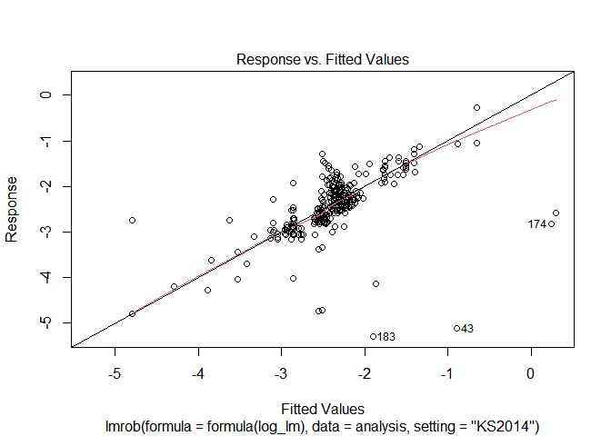

Modeling, Plotting and Regression Tables
================
Mykola Dereva
June 11, 2020

load our cleaned data

``` r
analysis_full <- readRDS(here("data", "clean data", "Analysis_data.Rds"))
```

## Remove Outliers

lets look on the possible outliers

There are few MP values which are considerable higher or lower then
other. This might influence the reliability of research. Thus, I will
drop them

``` r
analysis <- analysis_full %>%
  filter(between(index, 0.005, 1),
         mean_pp < 2)
```

## Analysis

Select only columns we need for the analysis. Rename columns once again.
And create columns with dummy variables

``` r
glimpse(analysis)
```

    ## Rows: 443
    ## Columns: 30
    ## $ index              <dbl> 0.1760, 0.0890, 0.0110, 0.0724, 0.0284, 0.2200, ...
    ## $ obs_n              <dbl> 60, 60, 60, 120, 108, 28, 48, 15, 15, 15, 48, 13...
    ## $ after_2005         <dbl> 1, 1, 1, 1, 1, 0, 0, 0, 0, 0, 0, 0, 0, 1, 1, 1, ...
    ## $ perish             <dbl> 1, 1, 1, 1, 1, 0, 0, 0, 0, 0, 1, 0, 0, 1, 0, 0, ...
    ## $ mean_pse           <dbl> 34.73444, 34.73444, 34.73444, 34.51253, 34.04736...
    ## $ mean_pp            <dbl> 1.352539, 1.352539, 1.352539, 1.343632, 1.319859...
    ## $ sfarm_share        <dbl> 19.69004, 19.69004, 19.69004, 19.69004, 42.99499...
    ## $ sfarm_share_by_cat <dbl> 8.917172, 8.917172, 8.917172, 8.917172, 28.81839...
    ## $ start_business     <dbl> 73.24874, 73.24874, 73.24874, 73.24874, 66.65921...
    ## $ edb_index          <dbl> NaN, NaN, NaN, NaN, NaN, NaN, NaN, NaN, NaN, NaN...
    ## $ freq_Monthly       <int> 1, 1, 1, 1, 1, 0, 1, 0, 0, 0, 1, 0, 0, 1, 0, 0, ...
    ## $ freq_Yearly        <int> 0, 0, 0, 0, 0, 1, 0, 1, 1, 1, 0, 1, 1, 0, 1, 1, ...
    ## $ freq_Quaterly      <int> 0, 0, 0, 0, 0, 0, 0, 0, 0, 0, 0, 0, 0, 0, 0, 0, ...
    ## $ freq_Weekly        <int> 0, 0, 0, 0, 0, 0, 0, 0, 0, 0, 0, 0, 0, 0, 0, 0, ...
    ## $ type_Oligopsony    <int> 1, 0, 1, 1, 1, 1, 0, 0, 0, 0, 0, 0, 0, 1, 0, 1, ...
    ## $ type_Oligopoly     <int> 0, 1, 0, 0, 0, 0, 1, 1, 1, 1, 1, 1, 1, 0, 1, 0, ...
    ## $ ind_meat           <int> 1, 1, 1, 1, 1, 0, 0, 0, 0, 0, 0, 0, 0, 0, 0, 0, ...
    ## $ ind_tobacco        <int> 0, 0, 0, 0, 0, 0, 0, 0, 1, 1, 0, 0, 0, 0, 0, 0, ...
    ## $ ind_beverages      <int> 0, 0, 0, 0, 0, 0, 1, 0, 0, 0, 0, 1, 0, 0, 0, 0, ...
    ## $ ind_dairy          <int> 0, 0, 0, 0, 0, 0, 0, 0, 0, 0, 1, 0, 0, 1, 0, 0, ...
    ## $ ind_oils           <int> 0, 0, 0, 0, 0, 0, 0, 0, 0, 0, 0, 0, 0, 0, 0, 0, ...
    ## $ ind_fruits         <int> 0, 0, 0, 0, 0, 0, 0, 0, 0, 0, 0, 0, 0, 0, 0, 0, ...
    ## $ ind_cereals        <int> 0, 0, 0, 0, 0, 0, 0, 0, 0, 0, 0, 0, 0, 0, 0, 0, ...
    ## $ ind_other          <int> 0, 0, 0, 0, 0, 1, 0, 1, 0, 0, 0, 0, 1, 0, 1, 1, ...
    ## $ count_europe       <int> 1, 1, 1, 1, 1, 1, 1, 0, 0, 0, 0, 0, 0, 1, 0, 0, ...
    ## $ count_n_america    <int> 0, 0, 0, 0, 0, 0, 0, 1, 1, 1, 1, 1, 1, 0, 1, 1, ...
    ## $ count_other        <int> 0, 0, 0, 0, 0, 0, 0, 0, 0, 0, 0, 0, 0, 0, 0, 0, ...
    ## $ app_GIM            <int> 1, 1, 1, 0, 0, 0, 1, 0, 0, 0, 1, 0, 0, 0, 0, 0, ...
    ## $ app_PTA            <int> 0, 0, 0, 1, 1, 1, 0, 1, 1, 1, 0, 1, 1, 1, 1, 1, ...
    ## $ app_SFA            <int> 0, 0, 0, 0, 0, 0, 0, 0, 0, 0, 0, 0, 0, 0, 0, 0, ...

``` r
analysis %>%
  summarise_all(funs(sum(is.na(.)))) %>%
  gather(column, n_na)
```

    ## # A tibble: 30 x 2
    ##    column              n_na
    ##    <chr>              <int>
    ##  1 index                  0
    ##  2 obs_n                  0
    ##  3 after_2005             0
    ##  4 perish                 0
    ##  5 mean_pse               0
    ##  6 mean_pp                0
    ##  7 sfarm_share          240
    ##  8 sfarm_share_by_cat   242
    ##  9 start_business       126
    ## 10 edb_index            182
    ## # ... with 20 more rows

``` r
log_lm <- lm(log(index) ~ app_PTA + app_GIM +
               obs_n + I(obs_n^2) +
               freq_Yearly + freq_Monthly +
               count_n_america + count_europe +
               after_2005 +
               type_Oligopsony +
               ind_meat + ind_tobacco + ind_beverages + ind_dairy + ind_oils +
               ind_fruits + ind_cereals +
               perish +
               log(mean_pse) + log(mean_pp)
                 , 
         data = analysis)
```

    ## Warning in log(mean_pse): NaNs produced

``` r
summary(log_lm)
```

    ## 
    ## Call:
    ## lm(formula = log(index) ~ app_PTA + app_GIM + obs_n + I(obs_n^2) + 
    ##     freq_Yearly + freq_Monthly + count_n_america + count_europe + 
    ##     after_2005 + type_Oligopsony + ind_meat + ind_tobacco + ind_beverages + 
    ##     ind_dairy + ind_oils + ind_fruits + ind_cereals + perish + 
    ##     log(mean_pse) + log(mean_pp), data = analysis)
    ## 
    ## Residuals:
    ##      Min       1Q   Median       3Q      Max 
    ## -2.70443 -0.35869 -0.03858  0.41522  1.75978 
    ## 
    ## Coefficients:
    ##                   Estimate Std. Error t value Pr(>|t|)    
    ## (Intercept)     -3.822e+00  7.676e-01  -4.979 9.44e-07 ***
    ## app_PTA          7.561e-01  2.115e-01   3.575 0.000392 ***
    ## app_GIM          2.559e-01  2.115e-01   1.210 0.226852    
    ## obs_n           -2.776e-02  5.441e-03  -5.102 5.16e-07 ***
    ## I(obs_n^2)       5.530e-05  1.496e-05   3.697 0.000248 ***
    ## freq_Yearly     -7.558e-01  3.326e-01  -2.272 0.023588 *  
    ## freq_Monthly     3.447e-01  3.855e-01   0.894 0.371712    
    ## count_n_america  8.776e-01  2.252e-01   3.897 0.000113 ***
    ## count_europe     8.084e-02  2.173e-01   0.372 0.710031    
    ## after_2005       3.046e-01  2.383e-01   1.278 0.201847    
    ## type_Oligopsony  2.342e-02  7.761e-02   0.302 0.762963    
    ## ind_meat         2.807e-01  1.258e-01   2.232 0.026141 *  
    ## ind_tobacco      3.194e-01  2.313e-01   1.381 0.168165    
    ## ind_beverages    1.176e-01  1.390e-01   0.846 0.398221    
    ## ind_dairy        3.868e-01  1.475e-01   2.622 0.009073 ** 
    ## ind_oils        -1.406e-01  1.572e-01  -0.894 0.371928    
    ## ind_fruits       2.281e-01  1.356e-01   1.682 0.093270 .  
    ## ind_cereals      2.731e-01  1.203e-01   2.270 0.023748 *  
    ## perish          -2.943e-01  1.075e-01  -2.739 0.006433 ** 
    ## log(mean_pse)    6.332e-01  1.957e-01   3.236 0.001312 ** 
    ## log(mean_pp)    -1.559e+00  7.822e-01  -1.993 0.046937 *  
    ## ---
    ## Signif. codes:  0 '***' 0.001 '**' 0.01 '*' 0.05 '.' 0.1 ' ' 1
    ## 
    ## Residual standard error: 0.6409 on 411 degrees of freedom
    ##   (11 observations deleted due to missingness)
    ## Multiple R-squared:  0.3789, Adjusted R-squared:  0.3487 
    ## F-statistic: 12.54 on 20 and 411 DF,  p-value: < 2.2e-16

``` r
bptest(log_lm)
```

    ## 
    ##  studentized Breusch-Pagan test
    ## 
    ## data:  log_lm
    ## BP = 88.381, df = 20, p-value = 1.421e-10

``` r
plot(log_lm)
```

<!-- --><!-- --><!-- --><!-- -->

seems that we have hetoroscadasticity issue. Lets try to use
heteroscadasticity robust se and to compare it with the regular

``` r
log_lm_se <- vcovHC(log_lm, type = "HC")
log_lm_se <- sqrt(diag(log_lm_se))
log_lm_se
```

    ##     (Intercept)         app_PTA         app_GIM           obs_n      I(obs_n^2) 
    ##    8.902542e-01    2.369943e-01    2.610161e-01    5.770010e-03    1.406968e-05 
    ##     freq_Yearly    freq_Monthly count_n_america    count_europe      after_2005 
    ##    2.642441e-01    3.143609e-01    2.018399e-01    1.168565e-01    2.759539e-01 
    ## type_Oligopsony        ind_meat     ind_tobacco   ind_beverages       ind_dairy 
    ##    6.886155e-02    1.302004e-01    2.630364e-01    1.655034e-01    1.526802e-01 
    ##        ind_oils      ind_fruits     ind_cereals          perish   log(mean_pse) 
    ##    1.679505e-01    1.425894e-01    1.520842e-01    1.072315e-01    2.059867e-01 
    ##    log(mean_pp) 
    ##    9.952056e-01

``` r
stargazer(log_lm, log_lm, se=list(NULL, log_lm_se),
          column.labels=c("default SE","robust SE"), type = "text",
          omit.stat=c("f", "ser", "n"), align = TRUE)
```

    ## 
    ## ============================================
    ##                     Dependent variable:     
    ##                 ----------------------------
    ##                          log(index)         
    ##                   default SE     robust SE  
    ##                      (1)            (2)     
    ## --------------------------------------------
    ## app_PTA            0.756***      0.756***   
    ##                    (0.212)        (0.237)   
    ##                                             
    ## app_GIM             0.256          0.256    
    ##                    (0.211)        (0.261)   
    ##                                             
    ## obs_n             -0.028***      -0.028***  
    ##                    (0.005)        (0.006)   
    ##                                             
    ## I(obs_n2)         0.0001***      0.0001***  
    ##                   (0.00001)      (0.00001)  
    ##                                             
    ## freq_Yearly        -0.756**      -0.756***  
    ##                    (0.333)        (0.264)   
    ##                                             
    ## freq_Monthly        0.345          0.345    
    ##                    (0.386)        (0.314)   
    ##                                             
    ## count_n_america    0.878***      0.878***   
    ##                    (0.225)        (0.202)   
    ##                                             
    ## count_europe        0.081          0.081    
    ##                    (0.217)        (0.117)   
    ##                                             
    ## after_2005          0.305          0.305    
    ##                    (0.238)        (0.276)   
    ##                                             
    ## type_Oligopsony     0.023          0.023    
    ##                    (0.078)        (0.069)   
    ##                                             
    ## ind_meat           0.281**        0.281**   
    ##                    (0.126)        (0.130)   
    ##                                             
    ## ind_tobacco         0.319          0.319    
    ##                    (0.231)        (0.263)   
    ##                                             
    ## ind_beverages       0.118          0.118    
    ##                    (0.139)        (0.166)   
    ##                                             
    ## ind_dairy          0.387***       0.387**   
    ##                    (0.148)        (0.153)   
    ##                                             
    ## ind_oils            -0.141        -0.141    
    ##                    (0.157)        (0.168)   
    ##                                             
    ## ind_fruits          0.228*         0.228    
    ##                    (0.136)        (0.143)   
    ##                                             
    ## ind_cereals        0.273**        0.273*    
    ##                    (0.120)        (0.152)   
    ##                                             
    ## perish            -0.294***      -0.294***  
    ##                    (0.107)        (0.107)   
    ##                                             
    ## log(mean_pse)      0.633***      0.633***   
    ##                    (0.196)        (0.206)   
    ##                                             
    ## log(mean_pp)       -1.559**       -1.559    
    ##                    (0.782)        (0.995)   
    ##                                             
    ## Constant          -3.822***      -3.822***  
    ##                    (0.768)        (0.890)   
    ##                                             
    ## --------------------------------------------
    ## R2                  0.379          0.379    
    ## Adjusted R2         0.349          0.349    
    ## ============================================
    ## Note:            *p<0.1; **p<0.05; ***p<0.01

#### Without Log transformation

``` r
lm <- lm(index ~ app_PTA + app_GIM +
                 obs_n + 
                 freq_Yearly +
                 count_n_america +
                 after_2005 +
                 type_Oligopsony +
                 ind_dairy + ind_meat + ind_cereals + ind_beverages + ind_oils +
                 #perish +
                 #start_business +
                 log(mean_pp) + log(mean_pse), 
         data=analysis)
```

    ## Warning in log(mean_pse): NaNs produced

``` r
summary(lm)
```

    ## 
    ## Call:
    ## lm(formula = index ~ app_PTA + app_GIM + obs_n + freq_Yearly + 
    ##     count_n_america + after_2005 + type_Oligopsony + ind_dairy + 
    ##     ind_meat + ind_cereals + ind_beverages + ind_oils + log(mean_pp) + 
    ##     log(mean_pse), data = analysis)
    ## 
    ## Residuals:
    ##      Min       1Q   Median       3Q      Max 
    ## -0.24155 -0.05392 -0.01417  0.03998  0.58428 
    ## 
    ## Coefficients:
    ##                   Estimate Std. Error t value Pr(>|t|)    
    ## (Intercept)     -0.0509842  0.1093227  -0.466 0.641198    
    ## app_PTA          0.1604920  0.0305599   5.252 2.41e-07 ***
    ## app_GIM          0.0484910  0.0312155   1.553 0.121080    
    ## obs_n           -0.0013692  0.0002898  -4.724 3.16e-06 ***
    ## freq_Yearly     -0.0730824  0.0345214  -2.117 0.034850 *  
    ## count_n_america  0.0680523  0.0201285   3.381 0.000791 ***
    ## after_2005       0.0511650  0.0347758   1.471 0.141969    
    ## type_Oligopsony  0.0007891  0.0121772   0.065 0.948365    
    ## ind_dairy       -0.0018546  0.0152461  -0.122 0.903239    
    ## ind_meat         0.0025973  0.0154609   0.168 0.866673    
    ## ind_cereals      0.0196412  0.0151984   1.292 0.196960    
    ## ind_beverages    0.0185928  0.0202283   0.919 0.358549    
    ## ind_oils        -0.0163765  0.0234368  -0.699 0.485096    
    ## log(mean_pp)    -0.3198191  0.1121100  -2.853 0.004550 ** 
    ## log(mean_pse)    0.0673813  0.0254390   2.649 0.008386 ** 
    ## ---
    ## Signif. codes:  0 '***' 0.001 '**' 0.01 '*' 0.05 '.' 0.1 ' ' 1
    ## 
    ## Residual standard error: 0.1009 on 417 degrees of freedom
    ##   (11 observations deleted due to missingness)
    ## Multiple R-squared:  0.3396, Adjusted R-squared:  0.3174 
    ## F-statistic: 15.32 on 14 and 417 DF,  p-value: < 2.2e-16

``` r
bptest(lm)
```

    ## 
    ##  studentized Breusch-Pagan test
    ## 
    ## data:  lm
    ## BP = 82.404, df = 14, p-value = 1.011e-11

``` r
plot(lm)
```

<!-- --><!-- --><!-- --><!-- -->

``` r
get_robust_se <- function(lm_model)  {
  matrix <- vcovHC(lm_model, type = "HC0")
  robust_se <- sqrt(diag(matrix))
  return(robust_se)
}

get_robust_se(lm)
```

    ##     (Intercept)         app_PTA         app_GIM           obs_n     freq_Yearly 
    ##    0.1023520135    0.0325630738    0.0251583962    0.0004349801    0.0477885679 
    ## count_n_america      after_2005 type_Oligopsony       ind_dairy        ind_meat 
    ##    0.0192115212    0.0388288157    0.0074546911    0.0135813958    0.0118071339 
    ##     ind_cereals   ind_beverages        ind_oils    log(mean_pp)   log(mean_pse) 
    ##    0.0169310659    0.0252008438    0.0270468429    0.1271480566    0.0227185072

### Tobit model

``` r
library(censReg)
```

``` r
tobit <- censReg(index ~ app_PTA + app_GIM +
                 obs_n + 
                 freq_Yearly +
                 type_Oligopoly +
                 count_n_america +
                 after_2005 +
                 ind_dairy + ind_meat + ind_cereals + ind_beverages + ind_oils +
                 #perish +
                 #start_business +
                 log(mean_pp) + log(mean_pse),
                 data = analysis_full)
```

    ## Warning in log(mean_pse): NaNs produced

    ## Warning in censReg(index ~ app_PTA + app_GIM + obs_n + freq_Yearly +
    ## type_Oligopoly + : at least one value of the endogenous variable is smaller than
    ## the left limit

``` r
summary(tobit)
```

    ## 
    ## Call:
    ## censReg(formula = index ~ app_PTA + app_GIM + obs_n + freq_Yearly + 
    ##     type_Oligopoly + count_n_america + after_2005 + ind_dairy + 
    ##     ind_meat + ind_cereals + ind_beverages + ind_oils + log(mean_pp) + 
    ##     log(mean_pse), data = analysis_full)
    ## 
    ## Observations:
    ##          Total  Left-censored     Uncensored Right-censored 
    ##            448              2            446              0 
    ## 
    ## Coefficients:
    ##                   Estimate Std. error t value  Pr(> t)    
    ## (Intercept)     -0.0995562  0.1059058  -0.940   0.3472    
    ## app_PTA          0.1585681  0.0294153   5.391 7.02e-08 ***
    ## app_GIM          0.0495592  0.0284267   1.743   0.0813 .  
    ## obs_n           -0.0015050  0.0002834  -5.311 1.09e-07 ***
    ## freq_Yearly     -0.0597092  0.0335016  -1.782   0.0747 .  
    ## type_Oligopoly  -0.0048937  0.0118441  -0.413   0.6795    
    ## count_n_america  0.1008405  0.0175803   5.736 9.69e-09 ***
    ## after_2005       0.0829530  0.0326752   2.539   0.0111 *  
    ## ind_dairy        0.0028129  0.0150105   0.187   0.8514    
    ## ind_meat         0.0011764  0.0152763   0.077   0.9386    
    ## ind_cereals      0.0194236  0.0148662   1.307   0.1914    
    ## ind_beverages    0.0136423  0.0197410   0.691   0.4895    
    ## ind_oils        -0.0166864  0.0229290  -0.728   0.4668    
    ## log(mean_pp)    -0.0657582  0.0542007  -1.213   0.2250    
    ## log(mean_pse)    0.0580298  0.0231137   2.511   0.0121 *  
    ## logSigma        -2.2950959  0.0335210 -68.467  < 2e-16 ***
    ## ---
    ## Signif. codes:  0 '***' 0.001 '**' 0.01 '*' 0.05 '.' 0.1 ' ' 1
    ## 
    ## Newton-Raphson maximisation, 9 iterations
    ## Return code 1: gradient close to zero
    ## Log-likelihood: 388.2616 on 16 Df

``` r
model_1 <- lm(log(index) ~ app_PTA + app_GIM + type_Oligopoly, 
                        data=analysis)
se_1 <- get_robust_se(model_1)

model_2 <- lm(log(index) ~ app_PTA + app_GIM +
                type_Oligopoly +
                after_2005 + 
                freq_Yearly +
                count_n_america + count_europe, 
         data=analysis)
se_2 <- get_robust_se(model_2)

model_3 <- lm(log(index) ~ app_PTA + app_GIM +
                type_Oligopoly +
                obs_n + after_2005 + 
                freq_Yearly + 
                count_n_america + count_europe +
                ind_dairy + ind_meat + ind_beverages + ind_cereals + ind_oils, 
         data=analysis)
se_3 <- get_robust_se(model_3)


model_4 <- lm(log(index) ~ app_PTA + app_GIM +
                type_Oligopoly +
                obs_n + 
                count_n_america +
                ind_dairy + ind_meat + ind_beverages + ind_cereals + ind_oils +
                log(mean_pp) + log(mean_pse), 
         data=analysis)
```

    ## Warning in log(mean_pse): NaNs produced

``` r
se_4 <- get_robust_se(model_4)
```

## Summary tables

``` r
stargazer(model_1, model_2, model_3, model_4, tobit,
          type = "text",
          keep.stat=c("n", "rsq", "adj.rsq"), 
          title = "Analysis Results",
          #column.labels =  c("Model 1", "Model 2", "Model 3"),
          dep.var.labels = "Market Power Index (log transformed)",
          se = list(se_1, se_2, se_3, se_4),
          align = TRUE,
          intercept.bottom = FALSE
          )
```

    ## 
    ## Analysis Results
    ## ==================================================================
    ##                                Dependent variable:                
    ##                 --------------------------------------------------
    ##                  Market Power Index (log transformed)     index  
    ##                                   OLS                   censored 
    ##                                                         regression
    ##                    (1)       (2)       (3)       (4)       (5)    
    ## ------------------------------------------------------------------
    ## Constant        -2.429*** -2.599*** -2.094*** -4.357***   -0.100  
    ##                  (0.049)   (0.427)   (0.459)   (0.578)   (0.106)  
    ##                                                                   
    ## app_PTA         0.612***   0.503**  0.600***  0.700***   0.159*** 
    ##                  (0.078)   (0.220)   (0.208)   (0.109)   (0.029)  
    ##                                                                   
    ## app_GIM         -0.603*** -0.488**   -0.388*    0.077     0.050*  
    ##                  (0.162)   (0.210)   (0.212)   (0.216)   (0.028)  
    ##                                                                   
    ## type_Oligopoly    0.059    -0.050    -0.043    -0.022     -0.005  
    ##                  (0.069)   (0.077)   (0.073)   (0.074)   (0.012)  
    ##                                                                   
    ## obs_n                               -0.009*** -0.007*** -0.002*** 
    ##                                      (0.002)   (0.001)   (0.0003) 
    ##                                                                   
    ## after_2005                 -0.109     0.033              0.083**  
    ##                            (0.229)   (0.219)             (0.033)  
    ##                                                                   
    ## freq_Yearly                 0.182   -0.535**             -0.060*  
    ##                            (0.223)   (0.260)             (0.034)  
    ##                                                                   
    ## count_n_america             0.265   0.550***   0.291**   0.101*** 
    ##                            (0.177)   (0.178)   (0.125)   (0.018)  
    ##                                                                   
    ## count_europe                0.137     0.217                       
    ##                            (0.153)   (0.151)                      
    ##                                                                   
    ## ind_dairy                             0.011     0.005     0.003   
    ##                                      (0.091)   (0.086)   (0.015)  
    ##                                                                   
    ## ind_meat                              0.090     0.066     0.001   
    ##                                      (0.089)   (0.084)   (0.015)  
    ##                                                                   
    ## ind_beverages                         0.061     0.092     0.014   
    ##                                      (0.148)   (0.150)   (0.020)  
    ##                                                                   
    ## ind_cereals                          0.210**    0.157     0.019   
    ##                                      (0.104)   (0.104)   (0.015)  
    ##                                                                   
    ## ind_oils                             -0.186    -0.194     -0.017  
    ##                                      (0.157)   (0.146)   (0.023)  
    ##                                                                   
    ## log(mean_pp)                                  -3.160***   -0.066  
    ##                                                (0.908)   (0.054)  
    ##                                                                   
    ## log(mean_pse)                                 0.745***   0.058**  
    ##                                                (0.193)   (0.023)  
    ##                                                                   
    ## logSigma                                                -2.295*** 
    ##                                                          (0.034)  
    ##                                                                   
    ## ------------------------------------------------------------------
    ## Observations       443       443       443       432       448    
    ## R2                0.237     0.252     0.306     0.329             
    ## Adjusted R2       0.232     0.240     0.285     0.310             
    ## ==================================================================
    ## Note:                                  *p<0.1; **p<0.05; ***p<0.01

### Lets check if type there influence of industry on the MPI

``` r
industry <- matchCoefs(model_3, "ind") # extract all industry dummies
F.test.ind <-  linearHypothesis(model_3, industry, white.adjust = "hc1")
F.test.ind
```

    ## Linear hypothesis test
    ## 
    ## Hypothesis:
    ## ind_dairy = 0
    ## ind_meat = 0
    ## ind_beverages = 0
    ## ind_cereals = 0
    ## ind_oils = 0
    ## 
    ## Model 1: restricted model
    ## Model 2: log(index) ~ app_PTA + app_GIM + type_Oligopoly + obs_n + after_2005 + 
    ##     freq_Yearly + count_n_america + count_europe + ind_dairy + 
    ##     ind_meat + ind_beverages + ind_cereals + ind_oils
    ## 
    ## Note: Coefficient covariance matrix supplied.
    ## 
    ##   Res.Df Df      F Pr(>F)
    ## 1    434                 
    ## 2    429  5 1.5427 0.1753

Therefore we reject 0 hypothesis that all types of industry have zero
coefficient.

### Determinants of each approach

Finally lets make a linear model for each approach and check if there is
any significant differences in coefficients between them

``` r
GIM <- lm(log(index) ~ type_Oligopoly +
                obs_n + after_2005 + 
                freq_Yearly + freq_Quaterly +
                count_n_america + count_europe +
                ind_dairy + ind_meat + ind_beverages + ind_cereals + ind_oils, 
         data= subset(analysis, app_GIM == 1)) 

PTA <- lm(log(index) ~ type_Oligopoly +
                obs_n + after_2005 + 
                freq_Yearly + freq_Quaterly +
                count_n_america + count_europe +
                ind_dairy + ind_meat + ind_beverages + ind_cereals + ind_oils, 
         data= subset(analysis, app_PTA == 1))

SFA <- lm(log(index) ~ type_Oligopoly +
                obs_n + after_2005 + 
                freq_Yearly + freq_Quaterly +
                count_n_america + count_europe +
                ind_dairy + ind_meat + ind_beverages + ind_cereals + ind_oils, 
         data= subset(analysis, app_SFA == 1)) 
```

``` r
bptest(SFA)
```

    ## 
    ##  studentized Breusch-Pagan test
    ## 
    ## data:  SFA
    ## BP = 38.879, df = 10, p-value = 2.666e-05

``` r
bptest(PTA)
```

    ## 
    ##  studentized Breusch-Pagan test
    ## 
    ## data:  PTA
    ## BP = 15.51, df = 12, p-value = 0.2147

``` r
bptest(GIM)
```

    ## 
    ##  studentized Breusch-Pagan test
    ## 
    ## data:  GIM
    ## BP = 11.823, df = 11, p-value = 0.3771

According to bptest there is no evidence of heteroscadasticity, so we
can use default SE

``` r
stargazer(GIM, PTA, SFA,
          type = "text",
          omit.stat=c("f", "ser"), 
          title = "Analysis Results",
          column.labels =  c("GIM", "PTA", "SFA"),
          dep.var.labels = "Market Power Index (log transformed)",
          align = TRUE,
          intercept.bottom = FALSE
          )
```

    ## 
    ## Analysis Results
    ## ======================================================
    ##                          Dependent variable:          
    ##                 --------------------------------------
    ##                  Market Power Index (log transformed) 
    ##                     GIM          PTA          SFA     
    ##                     (1)          (2)          (3)     
    ## ------------------------------------------------------
    ## Constant           -1.587     -2.682***     2.674***  
    ##                   (1.077)      (0.605)      (0.554)   
    ##                                                       
    ## type_Oligopoly    -0.635**      -0.174       0.079    
    ##                   (0.277)      (0.394)      (0.052)   
    ##                                                       
    ## obs_n              0.0005       -0.005     -0.099***  
    ##                   (0.006)      (0.003)      (0.008)   
    ##                                                       
    ## after_2005        -1.594*       0.907*                
    ##                   (0.812)      (0.475)                
    ##                                                       
    ## freq_Yearly        -0.596       0.944      -4.080***  
    ##                   (0.888)      (0.726)      (0.507)   
    ##                                                       
    ## freq_Quaterly                   0.805                 
    ##                                (0.715)                
    ##                                                       
    ## count_n_america    0.602        0.247       1.609***  
    ##                   (0.807)      (0.615)      (0.209)   
    ##                                                       
    ## count_europe       0.459        -0.809       -0.066   
    ##                   (0.597)      (0.561)      (0.134)   
    ##                                                       
    ## ind_dairy          -0.650       0.211       -0.138**  
    ##                   (0.773)      (0.228)      (0.068)   
    ##                                                       
    ## ind_meat           0.088        0.056        0.127*   
    ##                   (0.913)      (0.257)      (0.068)   
    ##                                                       
    ## ind_beverages      -0.310       0.349*       -0.143   
    ##                   (0.644)      (0.198)      (0.136)   
    ##                                                       
    ## ind_cereals       1.454***      0.275       -0.131*   
    ##                   (0.376)      (0.278)      (0.069)   
    ##                                                       
    ## ind_oils           0.218        0.215        -0.250   
    ##                   (0.537)      (0.226)      (0.177)   
    ##                                                       
    ## ------------------------------------------------------
    ## Observations         49          139          255     
    ## R2                 0.541        0.266        0.458    
    ## Adjusted R2        0.405        0.196        0.436    
    ## ======================================================
    ## Note:                      *p<0.1; **p<0.05; ***p<0.01

I think I am done with the analysis

# Summary Tables

I will work with dataset “clean” again

``` r
clean <- readRDS(here("data", "clean data", "Full_data.Rds"))
```

First of all lets create column with first author and year to uniquely
identify an article

``` r
clean <- clean %>%
  mutate(article_ref = str_c(
           str_match(authors, pattern = "^\\w[’]*\\w+" ),
           " (", year, ")")
         ) 

head(clean$article_ref, 20)
```

    ##  [1] "Anders (2008)"     "Anders (2008)"     "Anders (2008)"    
    ##  [4] "Anders (2008)"     "Appelbaum (1982)"  "Appelbaum (1982)" 
    ##  [7] "Azzam (1990)"      "Azzam (1990)"      "Bakucs (2009)"    
    ## [10] "Bakucs (2009)"     "Bergman (1995)"    "Bettendorf (2000)"
    ## [13] "Bhuyan (1997)"     "Bhuyan (1997)"     "Bhuyan (1997)"    
    ## [16] "Chidmi (2005)"     "Chirinko (1994)"   "Chirinko (1994)"  
    ## [19] "Genesove (1998)"   "Hockmann (2009)"

summary table of all articles used in analysis

``` r
#replace misspeled value
clean <- clean %>%
  mutate(data_freq = str_replace(data_freq, "Quaterly", "Quarterly")) 
```

### Table 1. List of studies

``` r
table_1 <- clean %>%
  group_by(article_ref, approach, mp_type, data_freq, period) %>%
  summarise(N = n()) %>%
  adorn_totals("row")
```

    ## `summarise()` regrouping output by 'article_ref', 'approach', 'mp_type', 'data_freq' (override with `.groups` argument)

``` r
head(table_1)
```

    ##       article_ref approach    mp_type data_freq    period N
    ##        Ahn (2010)      GIM  Oligopoly    Yearly 1975-2002 1
    ##     Anders (2008)      GIM Oligopsony   Monthly 1995-2000 2
    ##     Anders (2008)      GIM  Oligopoly   Monthly 1995-2000 2
    ##  Appelbaum (1982)      PTA  Oligopoly    Yearly 1947–1971 2
    ##      Azzam (1990)      PTA Oligopsony    Yearly 1959-1982 1
    ##      Azzam (1990)      PTA  Oligopoly    Yearly 1959-1982 1

``` r
table_1 %>%
  stargazer(type = output,
            style = "aer",
            title = "List of studies used",
            summary = FALSE, rownames = FALSE,
            out = "Tables/1.List of studies.doc"
            )
```

    ## 
    ## List of studies used
    ## ===============================================================
    ## article_ref         approach  mp_type   data_freq  period    N 
    ## ---------------------------------------------------------------
    ## Ahn (2010)            GIM    Oligopoly   Yearly   1975-2002  1 
    ## Anders (2008)         GIM    Oligopsony  Monthly  1995-2000  2 
    ## Anders (2008)         GIM    Oligopoly   Monthly  1995-2000  2 
    ## Appelbaum (1982)      PTA    Oligopoly   Yearly   1947–1971  2 
    ## Azzam (1990)          PTA    Oligopsony  Yearly   1959-1982  1 
    ## Azzam (1990)          PTA    Oligopoly   Yearly   1959-1982  1 
    ## Bakucs (2009)         PTA    Oligopsony  Monthly  1993-2003  1 
    ## Bakucs (2009)         PTA    Oligopsony  Monthly  1995-2004  1 
    ## Bergman (1995)        PTA    Oligopsony  Yearly   1960-1988  1 
    ## Bettendorf (2000)     GIM    Oligopoly   Monthly  1992-1996  1 
    ## Bhuyan (1997)         PTA    Oligopoly   Yearly   1972-1987  3 
    ## Bhuyan (1998)         PTA    Oligopoly   Yearly   1972-1987 38 
    ## Cechura (2015)        SFA    Oligopoly   Yearly   2003-2012 25 
    ## Chen (2018)           GIM    Oligopsony  Monthly  2008-2016  1 
    ## Chidmi (2005)         GIM    Oligopoly   Monthly  1996-2000  1 
    ## Chirinko (1994)       PTA    Oligopoly   Yearly   1973-1986  1 
    ## Chirinko (1994)       PTA    Oligopoly   Yearly   1973-1987  1 
    ## De (1999)             PTA    Oligopoly   Yearly   1962-1991  1 
    ## Genesove (1998)       GIM    Oligopoly   Yearly   1890-1914  1 
    ## Hockmann (2009)       PTA    Oligopsony  Monthly  1998-2006  1 
    ## Hovhannisyan (2012)   GIM    Oligopoly   Weekly   2001-2006  1 
    ## Ji (2016)             PTA    Oligopsony  Monthly  1980-2009  1 
    ## Kumbhakar (2012)      SFA    Oligopoly   Yearly   1974-1991  2 
    ## Lopez (1984)          PTA    Oligopoly   Yearly   1965-1979  1 
    ## Lopez (1993)          GIM    Oligopsony  Yearly   1954-1984  1 
    ## Lopez (2002)          PTA    Oligopoly   Yearly   1972-1997 25 
    ## Lopez (2017)          SFA    Oligopoly   Yearly   1990-2010 23 
    ## Lukas (2014)          SFA    Oligopsony  Yearly   2003-2012 94 
    ## Lukas (2014)          SFA    Oligopoly   Yearly   2003-2012 70 
    ## Mei (2008)            PTA    Oligopsony  Yearly   1955-2003  1 
    ## Mei (2008)            PTA    Oligopoly   Yearly   1955-2003  1 
    ## Merel (2009)          GIM    Oligopoly  Quarterly 1985-2005  1 
    ## Millan (1999)         PTA    Oligopoly   Yearly   1978-1992 14 
    ## Murray (1995)         PTA    Oligopsony  Yearly   1958-1988  1 
    ## Murray (1995)         PTA    Oligopsony  Yearly   1958-1989  1 
    ## Muth (1999)           GIM    Oligopsony  Yearly   1967-1993  1 
    ## O’Donnell (2007)      GIM    Oligopsony  Yearly   1989-2000 28 
    ## O’Donnell (2007)      GIM    Oligopoly   Yearly   1989-2000 12 
    ## Panagiotou (2015)     SFA    Oligopsony  Yearly   1970-2009  1 
    ## Panagiotou (2016)     SFA    Oligopsony  Yearly   1970-2009  2 
    ## Panagiotou (2018)     SFA    Oligopsony  Yearly   1970-2010  3 
    ## Perekhozhuk (2013)    PTA    Oligopsony  Yearly   1993-2006  1 
    ## Perekhozhuk (2013)    PTA    Oligopsony  Yearly   1993-2007  1 
    ## Perekhozhuk (2014)    PTA    Oligopsony  Monthly  1996-2003  1 
    ## Perekhozhuk (2016)    GIM    Oligopsony  Monthly  1996-2003  1 
    ## Perekhozhuk (2016)    PTA    Oligopsony  Monthly  1996-2003  8 
    ## Rigoberto (2015)      SFA    Oligopoly   Yearly   1979-2009 36 
    ## Salhofer (2011)       GIM    Oligopsony  Monthly  1997-2008  1 
    ## Salhofer (2011)       GIM    Oligopoly   Monthly  1997-2008  1 
    ## Sanjib (1997)         PTA    Oligopoly   Yearly   1972-1987 37 
    ## Scalco (2014)         GIM    Oligopsony  Yearly   1997-2011  1 
    ## Scalco (2016)         SFA    Oligopsony  Monthly  2010-2015  1 
    ## Scalco (2016)         SFA    Oligopoly   Monthly  2010-2015  1 
    ## Silva (2019)          PTA    Oligopsony Quarterly 2016-2017  2 
    ## Stalgiene (2017)      PTA    Oligopsony Quarterly 2004-2014  3 
    ## Suzuki (1993)         GIM    Oligopoly   Yearly   1979-1989  1 
    ## Weerahewa (2003)      GIM    Oligopsony  Yearly   1970-2000  3 
    ## Weerahewa (2003)      GIM    Oligopoly   Yearly   1970-2000  3 
    ## Total                  -         -          -         -     472
    ## ---------------------------------------------------------------

### Table 2. Number of observations by country

``` r
table_2 <-  clean %>%
  mutate(country = as_factor(country) %>%
           fct_infreq() %>%
           fct_lump_min(min = 3) 
         ) %>%
  group_by(country) %>%
  summarise(n = n(), 
            mean_mp = round(mean(mp_index), 4)
            ) %>%
  ungroup() %>%
  mutate(prop = round(n / sum(n) * 100, 2) ) %>%
  select(country, n, prop, mean_mp) %>%
  adorn_totals("row")
```

    ## `summarise()` ungrouping output (override with `.groups` argument)

``` r
table_2 %>%
  stargazer(type = output,
            style = "aer",
            title = "Summary of MP observations by country",
            summary = FALSE, rownames = FALSE,
            out = "Tables/2.List of countries.doc")
```

    ## 
    ## Summary of MP observations by country
    ## ================================
    ## country         n  prop  mean_mp
    ## --------------------------------
    ## United States  186 39.41   NA   
    ## Australia      40  8.47  0.0703 
    ## Spain          22  4.66  0.0879 
    ## Germany        13  2.75  0.0942 
    ## Hungary        12  2.54  0.1224 
    ## Ukraine        10  2.12  0.1378 
    ## Sweden          9  1.91   0.11  
    ## Netherlands     9  1.91  0.1204 
    ## France          9  1.91  0.1027 
    ## United Kingdom  9  1.91  0.0846 
    ## Portugal        9  1.91  0.0993 
    ## Lithuania       9  1.91  0.0847 
    ## Latvia          9  1.91  0.0883 
    ## Estonia         9  1.91  0.0955 
    ## Austria         8  1.69  0.1057 
    ## Belgium         8  1.69  0.1114 
    ## Bulgaria        8  1.69  0.1204 
    ## Czechia         8  1.69  0.1024 
    ## Denmark         8  1.69  0.0966 
    ## Finland         8  1.69  0.1172 
    ## Greece          8  1.69  0.0857 
    ## Italy           8  1.69   0.105 
    ## Poland          8  1.69   0.085 
    ## Romania         8  1.69  0.1334 
    ## Slovenia        8  1.69  0.1043 
    ## Slovakia        8  1.69  0.0869 
    ## Ireland         6  1.27  0.0761 
    ## Brazil          3  0.64   0.03  
    ## Other          12  2.54   0.116 
    ## Total          472 99.96 2.7742 
    ## --------------------------------

Visualize the distribution

``` r
clean %>%
    mutate(country = as_factor(country) %>%
           fct_infreq() %>%
           fct_lump_min(min = 10) 
         ) %>%
  ggplot(aes(x = country,
             y = mp_index,
             color = approach)) + 
  geom_jitter(width = 0.25, height = 0, alpha = 0.6, size = 2) +
  theme_minimal() +
  easy_legend_at("bottom") +
  easy_remove_x_axis("title") +
  labs(y = "Market Power Index",
       title = "The distribution of MP indices by country",
       caption = "Source: own representation",
       color = "Approach:") 
```

    ## Warning: Removed 3 rows containing missing values (geom_point).

<!-- -->

### Table 3 Number of observations by sector

``` r
table_3 <- clean %>%
  mutate(industry_fct = fct_infreq(industry_fct) %>%
           fct_relevel("other", after = Inf)
         ) %>%
  group_by(industry_fct) %>%
  summarise(n = n(), 
            mean_mp = round(mean(mp_index), 4)
            ) %>%
  ungroup() %>%
  mutate(prop = round(n / sum(n) * 100, 2),
         industry_fct = str_to_title(industry_fct)) %>%
  select(industry_fct, n, prop, mean_mp) %>%
  adorn_totals("row")
```

    ## `summarise()` ungrouping output (override with `.groups` argument)

Save table

``` r
table_3 %>%
  stargazer(type = output,
            style = "aer",
            title = "Summary of MP observations by sector",
            summary = FALSE, rownames = FALSE,
            out = "Tables/3. List of industries.doc")
```

    ## 
    ## Summary of MP observations by sector
    ## ==============================
    ## industry_fct  n  prop  mean_mp
    ## ------------------------------
    ## Dairy        92  19.49   NA   
    ## Cereals      86  18.22 0.1185 
    ## Meat         78  16.53 0.1129 
    ## Fruits       56  11.86   NA   
    ## Beverages    38  8.05  0.1736 
    ## Oils         23  4.87  0.1583 
    ## Tobacco      11  2.33    NA   
    ## Other        88  18.64 0.1712 
    ## Total        472 99.99 0.7345 
    ## ------------------------------

Visualize the distribution

``` r
clean %>%
  ggplot(aes(x = fct_reorder(industry_fct, mp_index, median) %>%
               str_to_sentence(),
             y = mp_index,
             color = approach)) + 
  geom_jitter(width = 0.25, height = 0, alpha = 0.6, size = 2) +
  theme_minimal() +
  easy_legend_at("bottom") +
  easy_remove_x_axis("title") +
  labs(y = "Market Power Index",
       title = "The distribution of MP indices by sector",
       caption = "Source: own representation",
       color = "Approach:") 
```

    ## Warning: Removed 3 rows containing missing values (geom_point).

<!-- --> Save
plot

### Table 4: Number of observations by methodology

``` r
table_4 <- clean %>%
  group_by(approach) %>%
  summarise(n = n(), 
            mean_mp = round(mean(mp_index), 4)
            ) %>%
  ungroup() %>%
  mutate(prop = round(n / sum(n) * 100, 2)) %>%
  select(approach, n, prop, mean_mp) %>%
  adorn_totals("row")
```

    ## `summarise()` ungrouping output (override with `.groups` argument)

``` r
table_4 %>%
  stargazer(type = output,
            style = "aer",
            title = "Summary of MP observations by approach used",
            summary = FALSE, rownames = FALSE,
            out = "Tables/4. List of Methods.doc")
```

    ## 
    ## Summary of MP observations by approach used
    ## ==========================
    ## approach  n  prop  mean_mp
    ## --------------------------
    ## GIM      64  13.56 0.0736 
    ## PTA      150 31.78   NA   
    ## SFA      258 54.66 0.1029 
    ## Total    472  100  0.1765 
    ## --------------------------

### Table 5: List of observarion frequency

``` r
table_5 <- clean %>%
  group_by(data_freq) %>%
  summarise(n = n(), 
            mean_mp = round(mean(mp_index), 4)
            ) %>%
  ungroup() %>%
  mutate(prop = round(n / sum(n) * 100, 2)) %>%
  select(data_freq, n, prop, mean_mp) %>%
  arrange(-n) %>%
  adorn_totals("row")
```

    ## `summarise()` ungrouping output (override with `.groups` argument)

``` r
table_5 %>%
  stargazer(type = output,
            style = "aer",
            title = "Summary of MP observations by frequency",
            summary = FALSE, rownames = FALSE,
            out = "Tables/5. List of observarion frequency.doc")
```

    ## 
    ## Summary of MP observations by frequency
    ## ===========================
    ## data_freq  n  prop  mean_mp
    ## ---------------------------
    ## Yearly    440 93.22   NA   
    ## Monthly   25   5.3  0.0952 
    ## Quarterly  6  1.27  0.2667 
    ## Weekly     1  0.21   0.022 
    ## Total     472  100  0.3839 
    ## ---------------------------

### Table 6: Discriptive statistics of variables

``` r
analysis %>%
  as.data.frame() %>%
  stargazer(type = output,
            style = "aer",
            align = TRUE, nobs = FALSE,
            out = "Tables/6. Descriprive stat.doc")
```

    ## 
    ## ==================================================================
    ## Statistic           Mean  St. Dev.  Min   Pctl(25) Pctl(75)  Max  
    ## ------------------------------------------------------------------
    ## index              0.140   0.121   0.007   0.064    0.176   0.815 
    ## obs_n              19.876  26.424    4       9        20     348  
    ## after_2005         0.722   0.448     0       0        1       1   
    ## perish             0.284   0.452     0       0        1       1   
    ## mean_pse           21.216  7.473   -1.024  16.293   25.496  39.205
    ## mean_pp            1.132   0.098   0.920   1.088    1.136   1.698 
    ## sfarm_share        37.558  20.126  11.955  18.401   51.061  79.828
    ## sfarm_share_by_cat 33.838  26.533  0.734   7.286    55.176  94.212
    ## start_business     83.647  10.939  24.091  78.901   91.209  96.235
    ## edb_index          76.389  8.262   55.010  69.439   86.280  91.015
    ## freq_Monthly       0.054   0.227     0       0        0       1   
    ## freq_Yearly        0.932   0.252     0       1        1       1   
    ## freq_Quaterly      0.011   0.106     0       0        0       1   
    ## freq_Weekly        0.002   0.048     0       0        0       1   
    ## type_Oligopsony    0.357   0.480     0       0        1       1   
    ## type_Oligopoly     0.643   0.480     0       0        1       1   
    ## ind_meat           0.167   0.373     0       0        0       1   
    ## ind_tobacco        0.020   0.141     0       0        0       1   
    ## ind_beverages      0.079   0.270     0       0        0       1   
    ## ind_dairy          0.199   0.399     0       0        0       1   
    ## ind_oils           0.050   0.217     0       0        0       1   
    ## ind_fruits         0.124   0.330     0       0        0       1   
    ## ind_cereals        0.183   0.387     0       0        0       1   
    ## ind_other          0.178   0.383     0       0        0       1   
    ## count_europe       0.470   0.500     0       0        1       1   
    ## count_n_america    0.402   0.491     0       0        1       1   
    ## count_other        0.129   0.335     0       0        0       1   
    ## app_GIM            0.111   0.314     0       0        0       1   
    ## app_PTA            0.314   0.465     0       0        1       1   
    ## app_SFA            0.576   0.495     0       0        1       1   
    ## ------------------------------------------------------------------

### Table 7: Regression table

``` r
ind.var.names <- c("Intercept", "PTA", "GIM", "Oligopoly",
                   "Observations Num.", "After 2005", "Yearly",
                   "Quarterly", "USA", "Europe", "Dairy", "Meat",
                   "Beverages", "Cereals", "Oils")
```

``` r
stargazer(model_1, model_2, model_3,
          type = output,
          style = "aer",
          #omit.stat=c("f", "ser", "n"), 
          title = "Regression Results",
          dep.var.labels = "Market Power Index (log transformed)",
          covariate.labels = ind.var.names,
          se = list(se_1, se_2, se_3),      #  Robust se
          align = TRUE,
          df = FALSE,
          intercept.bottom = FALSE,
          out = "Tables/7. Regression Table.doc"
          )
```

    ## 
    ## Regression Results
    ## ============================================================
    ##                       Market Power Index (log transformed)  
    ##                          (1)           (2)          (3)     
    ## ------------------------------------------------------------
    ## Intercept             -2.429***     -2.599***    -2.094***  
    ##                        (0.049)       (0.427)      (0.459)   
    ##                                                             
    ## PTA                   0.612***       0.503**      0.600***  
    ##                        (0.078)       (0.220)      (0.208)   
    ##                                                             
    ## GIM                   -0.603***     -0.488**      -0.388*   
    ##                        (0.162)       (0.210)      (0.212)   
    ##                                                             
    ## Oligopoly               0.059        -0.050        -0.043   
    ##                        (0.069)       (0.077)      (0.073)   
    ##                                                             
    ## Observations Num.                                -0.009***  
    ##                                                   (0.002)   
    ##                                                             
    ## After 2005                           -0.109        0.033    
    ##                                      (0.229)      (0.219)   
    ##                                                             
    ## Yearly                                0.182       -0.535**  
    ##                                      (0.223)      (0.260)   
    ##                                                             
    ## Quarterly                             0.265       0.550***  
    ##                                      (0.177)      (0.178)   
    ##                                                             
    ## USA                                   0.137        0.217    
    ##                                      (0.153)      (0.151)   
    ##                                                             
    ## Europe                                             0.011    
    ##                                                   (0.091)   
    ##                                                             
    ## Dairy                                              0.090    
    ##                                                   (0.089)   
    ##                                                             
    ## Meat                                               0.061    
    ##                                                   (0.148)   
    ##                                                             
    ## Beverages                                         0.210**   
    ##                                                   (0.104)   
    ##                                                             
    ## Cereals                                            -0.186   
    ##                                                   (0.157)   
    ##                                                             
    ## Observations             443           443          443     
    ## R2                      0.237         0.252        0.306    
    ## Adjusted R2             0.232         0.240        0.285    
    ## Residual Std. Error     0.697         0.693        0.672    
    ## F Statistic           45.557***     20.988***    14.568***  
    ## ------------------------------------------------------------
    ## Notes:              ***Significant at the 1 percent level.  
    ##                     **Significant at the 5 percent level.   
    ##                     *Significant at the 10 percent level.

### Table 8: Methods comparison

``` r
stargazer(PTA, GIM, SFA,
          type = output,
          style = "aer",
          #omit.stat=c("f", "ser", "n"), 
          title = "Methods Comparison",
          dep.var.labels = "Market Power Index",
          column.labels =  c("PTA", "GIM", "SFA"),
          covariate.labels = ind.var.names,
          align = TRUE,
          df = FALSE,
          intercept.bottom = FALSE,
          out = "Tables/8. Method Comparison.doc"
          )
```

    ## 
    ## Methods Comparison
    ## ============================================================
    ##                                Market Power Index           
    ##                          PTA           GIM          SFA     
    ##                          (1)           (2)          (3)     
    ## ------------------------------------------------------------
    ## Intercept             -2.682***       -1.587      2.674***  
    ##                        (0.605)       (1.077)      (0.554)   
    ##                                                             
    ## PTA                     -0.174       -0.635**      0.079    
    ##                        (0.394)       (0.277)      (0.052)   
    ##                                                             
    ## GIM                     -0.005        0.000      -0.099***  
    ##                        (0.003)       (0.006)      (0.008)   
    ##                                                             
    ## Oligopoly               0.907*       -1.594*                
    ##                        (0.475)       (0.812)                
    ##                                                             
    ## Observations Num.       0.944         -0.596     -4.080***  
    ##                        (0.726)       (0.888)      (0.507)   
    ##                                                             
    ## After 2005              0.805                               
    ##                        (0.715)                              
    ##                                                             
    ## Yearly                  0.247         0.602       1.609***  
    ##                        (0.615)       (0.807)      (0.209)   
    ##                                                             
    ## Quarterly               -0.809        0.459        -0.066   
    ##                        (0.561)       (0.597)      (0.134)   
    ##                                                             
    ## USA                     0.211         -0.650      -0.138**  
    ##                        (0.228)       (0.773)      (0.068)   
    ##                                                             
    ## Europe                  0.056         0.088        0.127*   
    ##                        (0.257)       (0.913)      (0.068)   
    ##                                                             
    ## Dairy                   0.349*        -0.310       -0.143   
    ##                        (0.198)       (0.644)      (0.136)   
    ##                                                             
    ## Meat                    0.275        1.454***     -0.131*   
    ##                        (0.278)       (0.376)      (0.069)   
    ##                                                             
    ## Beverages               0.215         0.218        -0.250   
    ##                        (0.226)       (0.537)      (0.177)   
    ##                                                             
    ## Observations             139            49          255     
    ## R2                      0.266         0.541        0.458    
    ## Adjusted R2             0.196         0.405        0.436    
    ## Residual Std. Error     0.736         0.852        0.370    
    ## F Statistic            3.805***      3.968***    20.617***  
    ## ------------------------------------------------------------
    ## Notes:              ***Significant at the 1 percent level.  
    ##                     **Significant at the 5 percent level.   
    ##                     *Significant at the 10 percent level.

``` r
clean %>%
  ggplot(aes(x=n_of_obs, y=mp_index, color = approach)) +
  geom_point(size = 4, alpha = 0.8, shape = 1) +
  scale_x_continuous(trans = "log10") +
  theme_minimal() +
  easy_move_legend(to = "bottom") +
    labs(x = "Number of observations (log10)",
         y = "Market Power Index",
         title = "Relationship between MP index and number of observations \nused in a study",
         caption = "Source: own representation") +
  easy_add_legend_title("Approach used:")
```

    ## Warning: Removed 3 rows containing missing values (geom_point).

<!-- -->

### Tables PP and PSE

``` r
stargazer(model_1, model_2, model_3, model_4, model_5, model_6,
          type = output,
          style = "aer",
          #title = "Regressions Results",
          keep.stat=c("n", "rsq", "adj.rsq"), 
          title = "Analysis Results",
          #column.labels =  c("Model 1", "Model 2", "Model 3"),
          dep.var.labels = "Market Power Index (log transformed)",
          se = list(se_1, se_2, se_3, se_4, se_5, se_6),
          align = TRUE,
          intercept.bottom = FALSE,
          out = "Tables/9. PP vs PSE.doc"
          )
```

    ## 
    ## Analysis Results
    ## ===========================================================================
    ##                            Market Power Index (log transformed)            
    ##                    (1)       (2)       (3)       (4)       (5)       (6)   
    ## ---------------------------------------------------------------------------
    ## Constant        -3.525*** -2.285*** -4.357*** -2.468*** -1.367**   -0.189  
    ##                  (0.519)   (0.111)   (0.578)   (0.189)   (0.584)   (0.674) 
    ##                                                                            
    ## app_PTA         0.504***  0.685***  0.700***  0.615***  0.699***  0.766*** 
    ##                  (0.104)   (0.092)   (0.109)   (0.094)   (0.093)   (0.096) 
    ##                                                                            
    ## app_GIM          -0.141   -0.541***   0.077   -0.477*** -0.540***  -0.249  
    ##                  (0.204)   (0.169)   (0.216)   (0.177)   (0.169)   (0.188) 
    ##                                                                            
    ## type_Oligopoly   -0.065    -0.027    -0.022    -0.062    -0.023    -0.027  
    ##                  (0.074)   (0.075)   (0.074)   (0.075)   (0.075)   (0.074) 
    ##                                                                            
    ## obs_n           -0.007*** -0.006*** -0.007*** -0.006*** -0.006*** -0.005***
    ##                  (0.002)   (0.001)   (0.001)   (0.001)   (0.001)   (0.001) 
    ##                                                                            
    ## count_n_america 0.477***   0.190*    0.291**  0.300***    0.174    0.218** 
    ##                  (0.128)   (0.105)   (0.125)   (0.113)   (0.106)   (0.105) 
    ##                                                                            
    ## ind_dairy         0.039     0.020     0.005     0.053     0.016     0.017  
    ##                  (0.091)   (0.093)   (0.086)   (0.094)   (0.092)   (0.088) 
    ##                                                                            
    ## ind_meat          0.091     0.116     0.066     0.103     0.114     0.069  
    ##                  (0.089)   (0.091)   (0.084)   (0.091)   (0.091)   (0.085) 
    ##                                                                            
    ## ind_beverages    -0.005     0.108     0.092     0.058     0.117     0.132  
    ##                  (0.148)   (0.153)   (0.150)   (0.149)   (0.153)   (0.147) 
    ##                                                                            
    ## ind_cereals      0.200*     0.166     0.157    0.190*     0.162     0.155  
    ##                  (0.105)   (0.105)   (0.104)   (0.105)   (0.105)   (0.104) 
    ##                                                                            
    ## ind_oils         -0.211    -0.208    -0.194    -0.210    -0.207    -0.193  
    ##                  (0.158)   (0.156)   (0.146)   (0.159)   (0.155)   (0.146) 
    ##                                                                            
    ## log(mean_pse)    0.350**            0.745***                               
    ##                  (0.159)             (0.193)                               
    ##                                                                            
    ## log(mean_pp)               -1.022   -3.160***                              
    ##                            (0.637)   (0.908)                               
    ##                                                                            
    ## mean_pse                                        0.002             0.031*** 
    ##                                                (0.007)             (0.010) 
    ##                                                                            
    ## mean_pp                                                  -0.920*  -2.617***
    ##                                                          (0.512)   (0.752) 
    ##                                                                            
    ## Observations       432       443       432       443       443       443   
    ## R2                0.299     0.299     0.329     0.292     0.301     0.322  
    ## Adjusted R2       0.281     0.282     0.310     0.274     0.284     0.303  
    ## ---------------------------------------------------------------------------
    ## Notes:          ***Significant at the 1 percent level.                     
    ##                 **Significant at the 5 percent level.                      
    ##                 *Significant at the 10 percent level.

### tables small farm and perish

``` r
stargazer(model_1, model_2, model_3, model_4,
          type = output,
          style = "aer",
          #title = "Regressions Results",
          keep.stat=c("n", "rsq", "adj.rsq"), 
          title = "Analysis Results",
          #column.labels =  c("Model 1", "Model 2", "Model 3"),
          dep.var.labels = "Market Power Index (log transformed)",
          se = list(se_1, se_2, se_3),
          align = TRUE,
          intercept.bottom = FALSE,
          out = "Tables/10. Small farm and perish.doc"
          )
```

    ## 
    ## Analysis Results
    ## =================================================================
    ##                           Market Power Index (log transformed)   
    ##                            (1)        (2)        (3)       (4)   
    ## -----------------------------------------------------------------
    ## Constant                -3.555***  -3.350***  -2.431*** -2.288***
    ##                          (0.510)    (0.492)    (0.157)   (0.126) 
    ##                                                                  
    ## app_PTA                  0.521***   0.479***  1.020***  1.013*** 
    ##                          (0.102)    (0.106)    (0.290)   (0.199) 
    ##                                                                  
    ## app_GIM                   -0.085     -0.177     0.420     0.401  
    ##                          (0.201)    (0.193)    (0.688)   (0.280) 
    ##                                                                  
    ## type_Oligopoly            -0.074     -0.085   0.163***  0.165*** 
    ##                          (0.072)    (0.074)    (0.050)   (0.055) 
    ##                                                                  
    ## obs_n                   -0.007***  -0.006***  -0.015**  -0.014***
    ##                          (0.002)    (0.002)    (0.006)   (0.003) 
    ##                                                                  
    ## count_n_america          0.522***   0.406***                     
    ##                          (0.124)    (0.114)                      
    ##                                                                  
    ## ind_dairy                0.336***             -0.168**   -0.141  
    ##                          (0.130)               (0.068)   (0.087) 
    ##                                                                  
    ## ind_meat                 0.180**                0.002     0.019  
    ##                          (0.084)               (0.079)   (0.082) 
    ##                                                                  
    ## ind_beverages             -0.077                0.125            
    ##                          (0.150)               (0.601)           
    ##                                                                  
    ## ind_cereals               0.165               -0.210***  -0.178* 
    ##                          (0.104)               (0.054)   (0.093) 
    ##                                                                  
    ## ind_oils                 -0.280*                                 
    ##                          (0.159)                                 
    ##                                                                  
    ## log(mean_pse)            0.363**    0.337**                      
    ##                          (0.156)    (0.152)                      
    ##                                                                  
    ## perish                  -0.376***  -0.191***                     
    ##                          (0.112)    (0.068)                      
    ##                                                                  
    ## log(sfarm_share)                               0.063*            
    ##                                                (0.037)           
    ##                                                                  
    ## log(sfarm_share_by_cat)                                   0.018  
    ##                                                          (0.026) 
    ##                                                                  
    ## Observations               432        432        203       201   
    ## R2                        0.318      0.297      0.271     0.263  
    ## Adjusted R2               0.299      0.286      0.237     0.233  
    ## -----------------------------------------------------------------
    ## Notes:                  ***Significant at the 1 percent level.   
    ##                         **Significant at the 5 percent level.    
    ##                         *Significant at the 10 percent level.

### tables doing business

``` r
stargazer(model_1, model_2, model_3,
          type = output,
          style = "aer",
          #title = "Regressions Results",
          keep.stat=c("n", "rsq", "adj.rsq"), 
          title = "Analysis Results",
          #column.labels =  c("Model 1", "Model 2", "Model 3"),
          dep.var.labels = "Market Power Index (log transformed)",
          se = list(se_1, se_2, se_3),
          align = TRUE,
          intercept.bottom = FALSE,
          out = "Tables/11. DB.doc"
          )
```

    ## 
    ## Analysis Results
    ## ============================================================
    ##                       Market Power Index (log transformed)  
    ##                          (1)           (2)          (3)     
    ## ------------------------------------------------------------
    ## Constant              -3.525***     -3.967***     -2.896**  
    ##                        (0.519)       (0.652)      (1.139)   
    ##                                                             
    ## app_PTA               0.504***      1.034***      1.034***  
    ##                        (0.104)       (0.198)      (0.172)   
    ##                                                             
    ## app_GIM                -0.141         0.004       -0.439**  
    ##                        (0.204)       (0.241)      (0.176)   
    ##                                                             
    ## type_Oligopoly         -0.065         0.012        0.022    
    ##                        (0.074)       (0.071)      (0.074)   
    ##                                                             
    ## obs_n                 -0.007***     -0.008***    -0.007***  
    ##                        (0.002)       (0.002)      (0.002)   
    ##                                                             
    ## count_n_america       0.477***      0.429***       0.208    
    ##                        (0.128)       (0.156)      (0.132)   
    ##                                                             
    ## ind_dairy               0.039        -0.067        -0.064   
    ##                        (0.091)       (0.095)      (0.099)   
    ##                                                             
    ## ind_meat                0.091         0.027        0.064    
    ##                        (0.089)       (0.097)      (0.101)   
    ##                                                             
    ## ind_beverages          -0.005        -0.244        -0.105   
    ##                        (0.148)       (0.233)      (0.247)   
    ##                                                             
    ## ind_cereals            0.200*         0.110        0.093    
    ##                        (0.105)       (0.106)      (0.107)   
    ##                                                             
    ## ind_oils               -0.211       -0.668***    -0.703***  
    ##                        (0.158)       (0.138)      (0.142)   
    ##                                                             
    ## log(mean_pse)          0.350**       0.447**                
    ##                        (0.159)       (0.179)                
    ##                                                             
    ## start_business                        0.002                 
    ##                                      (0.004)                
    ##                                                             
    ## log(start_business)                                0.119    
    ##                                                   (0.259)   
    ##                                                             
    ## Observations             432           306          317     
    ## R2                      0.299         0.261        0.253    
    ## Adjusted R2             0.281         0.231        0.226    
    ## ------------------------------------------------------------
    ## Notes:              ***Significant at the 1 percent level.  
    ##                     **Significant at the 5 percent level.   
    ##                     *Significant at the 10 percent level.
